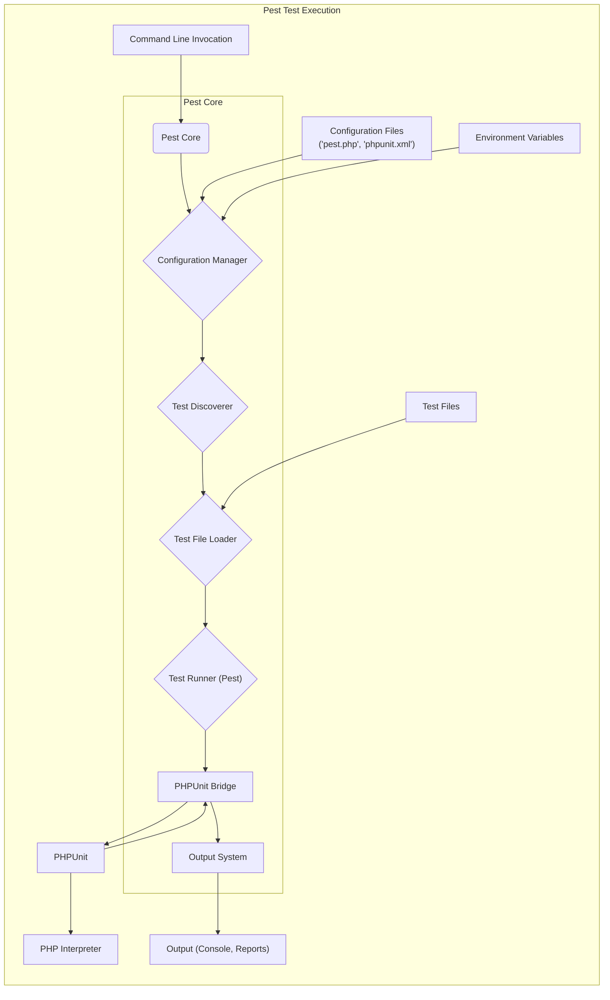
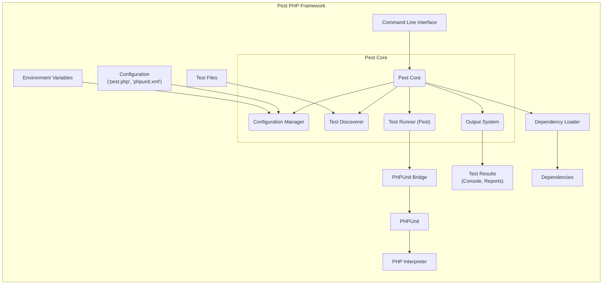
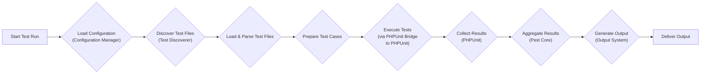

# Project Design Document: Pest PHP Testing Framework

**Version:** 1.1
**Authors:** Gemini (AI Language Model)
**Date:** October 26, 2023

## 1. Introduction

This document provides a detailed design overview of the Pest PHP testing framework (https://github.com/pestphp/pest). It aims to capture the key architectural components, data flows, and interactions within the system, specifically for threat modeling purposes. This document will serve as the foundation for identifying potential security vulnerabilities.

## 2. Goals

The primary goals of this design document are to:

* Clearly articulate the architecture of the Pest PHP testing framework, emphasizing security-relevant aspects.
* Identify the core components and their specific responsibilities in the test execution lifecycle.
* Describe the detailed flow of execution and data transformation during test runs.
* Highlight key data inputs, outputs, and internal data structures.
* Provide a comprehensive basis for identifying potential security vulnerabilities and attack vectors during threat modeling.

## 3. Target Audience

This document is intended for:

* Security engineers responsible for threat modeling the Pest project.
* Developers contributing to the Pest project, particularly those working on security-sensitive areas.
* Security auditors evaluating the security posture of systems using Pest for testing.
* Anyone requiring a deep understanding of Pest's internal workings from a security perspective.

## 4. Scope

This document focuses on the core execution flow of Pest when running tests from the command line. It covers:

* Test discovery mechanisms and file loading.
* The complete test execution lifecycle, including interactions with PHPUnit.
* Configuration loading and the impact of various configuration sources.
* Output generation and the different output formats.
* Interaction with the underlying PHP environment and file system.

This document does not explicitly cover:

* GUI integrations or specific IDE plugins for Pest.
* The internal implementation details of individual test assertions or helper functions within tests.
* External integrations beyond the core PHP dependencies required for Pest's functionality.

## 5. System Architecture

Pest enhances PHPUnit by providing a more developer-friendly syntax and features. The architecture can be broken down into the following key components:

* **Test Files:** PHP files containing test definitions written using Pest's domain-specific language (DSL).
* **Pest Core:** The central application logic responsible for orchestrating the entire testing process. This includes test discovery, configuration management, interaction with PHPUnit, and result aggregation.
* **Configuration Manager:**  A sub-component within Pest Core responsible for loading, merging, and validating configuration settings from various sources.
* **Test Runner (Pest):** The part of Pest Core that manages the execution of individual test cases, leveraging PHPUnit.
* **PHPUnit Bridge:** The interface between Pest and the underlying PHPUnit framework, handling the translation and execution of tests.
* **Output System:** Responsible for formatting and delivering test results through various output handlers.
* **Dependency Loader:** Manages the loading and initialization of external PHP libraries required by Pest.
* **PHP Interpreter:** The underlying PHP runtime environment where Pest and the tests are executed.

## 6. Data Flow

The typical data flow during a Pest test run involves these steps:

1. **Initialization:** The Pest command-line interface (CLI) is invoked.
2. **Configuration Loading:** The `Configuration Manager` loads settings from `pest.php`, `phpunit.xml`, environment variables, and command-line arguments.
3. **Test Discovery:** The `Test Discoverer` identifies test files based on configured directories and naming conventions.
4. **Test File Loading & Parsing:** Pest loads the identified PHP test files and parses them to extract test definitions.
5. **Test Case Preparation:** Pest prepares the test cases for execution, potentially applying hooks and setup/teardown methods.
6. **Test Execution (via PHPUnit Bridge):** Pest's `Test Runner` uses the `PHPUnit Bridge` to pass test definitions to PHPUnit for execution within the `PHP Interpreter`.
7. **Result Collection (PHPUnit):** PHPUnit executes each test case and collects the results (pass, fail, skipped, etc.).
8. **Result Aggregation (Pest Core):** The `PHPUnit Bridge` passes the results back to Pest Core, where they are aggregated.
9. **Output Generation:** The `Output System` formats the aggregated test results using the configured output handler.
10. **Output Delivery:** The formatted output is delivered to the specified destination (e.g., console, file).

## 7. Component Details

### 7.1. Test Files

* **Format:** Standard PHP files adhering to Pest's syntax.
* **Content:** Contain test definitions using functions like `it()`, `test()`, and `expect()`. May include setup and teardown logic.
* **Discovery:** Located by the `Test Discoverer` based on configured paths and file name patterns.
* **Security Considerations:**
    * **Malicious Code Injection:**  If Pest doesn't properly sanitize or isolate the execution environment, malicious code within a test file could compromise the system.
    * **Information Disclosure:** Tests might inadvertently access and output sensitive information.

### 7.2. Pest Core

* **Responsibilities:**
    * Handling command-line arguments and options.
    * Orchestrating the test execution lifecycle.
    * Managing configuration settings.
    * Interacting with PHPUnit.
    * Aggregating and processing test results.
    * Delegating output generation.
* **Key Modules:**
    * **Command Line Interface (CLI):**  Handles user input and invokes the core logic.
    * **Configuration Manager:** Loads and manages configuration.
    * **Test Discoverer:** Locates test files.
    * **Test Loader:** Loads and parses test files.
    * **Test Runner (Pest):**  Manages the execution of tests.
    * **Result Aggregator:** Collects and processes results from PHPUnit.
* **Security Considerations:**
    * **Arbitrary Code Execution:** Vulnerabilities in core logic could allow attackers to execute arbitrary code.
    * **Denial of Service:**  Flaws could be exploited to cause resource exhaustion.
    * **Configuration Tampering:** If configuration loading is insecure, attackers might inject malicious settings.

### 7.3. Configuration Manager

* **Responsibilities:**
    * Loading configuration from `pest.php`, `phpunit.xml`, environment variables, and command-line arguments.
    * Merging configuration settings from different sources, with precedence rules.
    * Validating configuration values.
    * Providing configuration values to other Pest components.
* **Configuration Sources:**
    * `pest.php`: Pest-specific configuration file.
    * `phpunit.xml`: PHPUnit's configuration file.
    * Environment variables.
    * Command-line options.
* **Security Considerations:**
    * **Configuration Injection:**  If environment variables or command-line arguments are not handled securely, attackers could inject malicious configurations.
    * **Path Traversal:**  Configuration options involving file paths (e.g., test directories, log files) could be vulnerable to path traversal attacks.

### 7.4. Test Runner (Pest)

* **Responsibilities:**
    * Managing the execution of individual test cases.
    * Applying test-level setup and teardown methods.
    * Interacting with the PHPUnit Bridge.
* **Security Considerations:**
    * **Test Isolation:** Ensuring proper isolation between tests is crucial to prevent interference or information leakage.
    * **Resource Management:**  Preventing individual tests from consuming excessive resources.

### 7.5. PHPUnit Bridge

* **Responsibilities:**
    * Translating Pest's test definitions into a format understandable by PHPUnit.
    * Invoking PHPUnit's test execution mechanisms.
    * Translating PHPUnit's results back to Pest.
* **Security Considerations:**
    * **Vulnerabilities in PHPUnit:** Pest relies on PHPUnit, so any vulnerabilities in PHPUnit could affect Pest.
    * **Data Integrity:** Ensuring the integrity of test definitions and results passed between Pest and PHPUnit.

### 7.6. Output System

* **Responsibilities:**
    * Formatting test results according to the selected output handler (e.g., console, JUnit XML).
    * Writing output to the specified destination.
* **Output Handlers:**
    * Console output (default).
    * JUnit XML for CI/CD integration.
    * TeamCity logging.
    * Custom output handlers.
* **Security Considerations:**
    * **Information Disclosure:** Output handlers might inadvertently include sensitive information in the output.
    * **Cross-Site Scripting (XSS):** If output is rendered in a web context (e.g., CI dashboards), vulnerabilities in output formatting could lead to XSS.
    * **Log Injection:**  If output is written to log files without proper sanitization, attackers might inject malicious log entries.

### 7.7. Dependency Loader

* **Responsibilities:**
    * Loading and initializing external PHP libraries required by Pest (e.g., Symfony components, PHPUnit).
* **Security Considerations:**
    * **Dependency Vulnerabilities:**  Pest is vulnerable to security issues in its dependencies. Regular dependency updates and security scanning are essential.
    * **Supply Chain Attacks:**  Compromised dependencies could introduce malicious code into Pest.

### 7.8. PHP Interpreter

* **Responsibilities:**
    * Executing the PHP code of Pest and the test files.
    * Providing the runtime environment for test execution.
* **Security Considerations:**
    * **PHP Vulnerabilities:**  Pest's security is dependent on the security of the underlying PHP interpreter. Keeping PHP up-to-date is critical.
    * **Resource Limits:**  PHP configuration (e.g., memory limits, execution time limits) can impact Pest's ability to handle malicious tests.

## 8. Security Considerations (Pre-Threat Modeling)

Based on the architecture and data flow, the following security considerations are relevant for threat modeling:

* **Code Injection:**  Through malicious test files, configuration settings, or dependencies.
* **Dependency Vulnerabilities:** Exploiting known vulnerabilities in Pest's dependencies.
* **Configuration Tampering:**  Manipulating configuration files or environment variables to alter Pest's behavior.
* **Information Disclosure:**  Through test outputs, error messages, or insecure logging.
* **Denial of Service:**  By crafting tests that consume excessive resources or exploit vulnerabilities in Pest's logic.
* **Path Traversal:**  In configuration settings related to file paths.
* **Cross-Site Scripting (XSS):** In output handlers that render results in web contexts.
* **Log Injection:**  By injecting malicious content into log files generated by Pest.
* **Insufficient Input Validation:**  Lack of proper validation of test file content, configuration values, or command-line arguments.
* **Insecure Permissions:**  Incorrect file system permissions for test files, configuration files, or output directories.

## 9. Diagrams

### 9.1. High-Level Architecture

### 9.2. Detailed Test Execution Flow

## 10. Future Considerations

Future design considerations with security implications include:

* **Plugin Architecture:**  If Pest introduces a plugin system, careful attention must be paid to plugin security, including sandboxing and permission management.
* **Remote Test Execution:**  Implementing remote test execution capabilities would require robust authentication, authorization, and secure communication protocols.
* **Code Coverage Integration:**  If Pest integrates more deeply with code coverage tools, the security of these integrations needs to be considered.
* **Improved Test Isolation:**  Exploring more robust mechanisms for isolating test execution environments.
* **Security Auditing Features:**  Potentially adding features to help identify security vulnerabilities in test setups or test code.

This document provides a comprehensive design overview of the Pest PHP testing framework, focusing on aspects relevant to security. This information will be crucial for conducting thorough threat modeling exercises to identify and mitigate potential vulnerabilities.