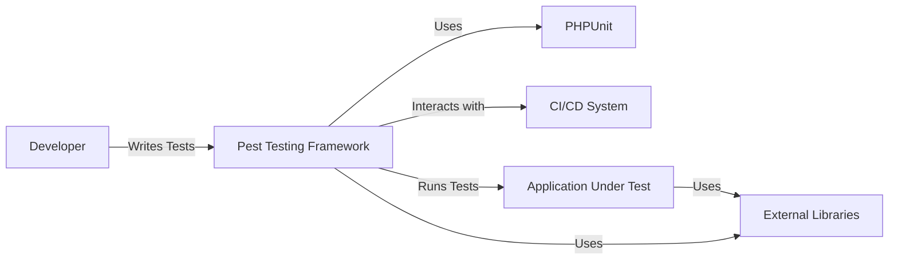
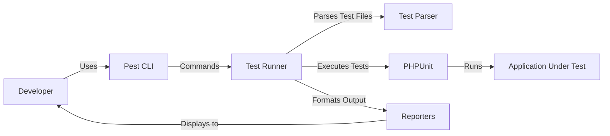
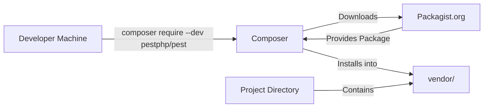
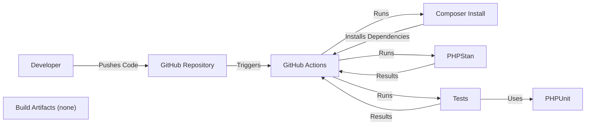

# BUSINESS POSTURE

Pest is a testing framework for PHP. It aims to provide a more modern, expressive, and enjoyable testing experience than traditional PHPUnit. Business priorities likely revolve around:

*   Developer productivity: Reducing the time and effort required to write and maintain tests.
*   Code quality: Improving the overall quality and reliability of PHP applications through better testing practices.
*   Community adoption: Growing the Pest user base and establishing it as a viable alternative to PHPUnit.
*   Maintainability: Ensuring the Pest codebase itself is well-tested, maintainable, and easy to contribute to.
*   Integration: Seamlessly integrating with existing PHP development workflows and tools.

Business risks that need to be addressed:

*   Low adoption rate: If developers don't see the value in switching from PHPUnit, Pest may not gain traction.
*   Compatibility issues: If Pest doesn't work well with popular PHP frameworks or libraries, it will limit its usefulness.
*   Maintenance burden: If the project is not well-maintained, bugs and security vulnerabilities could arise, damaging its reputation.
*   Lack of features: If Pest doesn't offer comparable features to PHPUnit, developers may be hesitant to switch.
*   Security vulnerabilities in Pest itself could be exploited to compromise the applications that use it for testing.

# SECURITY POSTURE

Existing security controls:

*   security control: Code reviews: Pull requests are reviewed before merging, helping to catch potential security issues. (Described in contributing guidelines and visible in the GitHub repository's pull request history).
*   security control: Static analysis: The project uses static analysis tools (likely PHPStan or similar, based on common PHP practices) to identify potential code quality and security issues. (Inferred from the project's nature and common practices in the PHP ecosystem, but not explicitly stated in the repository).
*   security control: Automated testing: Pest itself is heavily tested, which helps to ensure its own reliability and security. (Evident from the extensive test suite in the repository).
*   security control: Dependency management: The project uses Composer for dependency management, allowing for tracking and updating of dependencies. (Visible in the `composer.json` file).
*   security control: Security Policy: The project has a security policy that describes how to report security vulnerabilities. (Visible in the `SECURITY.md` file).

Accepted risks:

*   accepted risk: Reliance on third-party dependencies: Like any PHP project, Pest relies on external libraries, which could introduce vulnerabilities. This is a common and generally accepted risk, mitigated by careful dependency management and updates.
*   accepted risk: Limited scope of testing framework security: As a testing framework, Pest's primary focus is not on directly securing applications. It's a tool to *help* developers write secure code, but it doesn't provide runtime security features.

Recommended security controls:

*   security control: SAST (Static Application Security Testing): Integrate a dedicated SAST tool into the CI/CD pipeline to automatically scan for security vulnerabilities in the Pest codebase.
*   security control: SCA (Software Composition Analysis): Implement SCA tooling to automatically identify known vulnerabilities in third-party dependencies.
*   security control: Fuzz testing: Introduce fuzz testing to proactively discover unexpected behavior and potential vulnerabilities in Pest's input handling.

Security requirements:

*   Authentication: Not directly applicable, as Pest is a testing framework, not an application with user accounts.
*   Authorization: Not directly applicable, for the same reason as above.
*   Input validation: Pest itself needs to handle input (test code, configuration files, etc.) safely. It should be resilient to malicious or malformed input that could cause crashes, unexpected behavior, or code execution vulnerabilities.
*   Cryptography: Not directly applicable in most cases. However, if Pest were to handle sensitive data (e.g., API keys in tests), it should use appropriate cryptographic practices to protect that data. This is generally discouraged; sensitive data should be handled via environment variables or other secure mechanisms, not directly within test code.

# DESIGN

## C4 CONTEXT

Elements description:

*   Element:
    *   Name: Developer
    *   Type: Person
    *   Description: A software developer who writes and runs tests using Pest.
    *   Responsibilities: Writing test cases, configuring Pest, running tests, and analyzing test results.
    *   Security controls: None (the developer is external to the system).

*   Element:
    *   Name: Pest Testing Framework
    *   Type: Software System
    *   Description: The Pest testing framework itself.
    *   Responsibilities: Providing an API for writing tests, executing tests, reporting results, and integrating with other tools.
    *   Security controls: Input validation, static analysis, automated testing, dependency management, security policy.

*   Element:
    *   Name: PHPUnit
    *   Type: Software System
    *   Description: The underlying testing framework that Pest builds upon.
    *   Responsibilities: Providing core testing functionality.
    *   Security controls: Relies on PHPUnit's own security posture.

*   Element:
    *   Name: CI/CD System
    *   Type: Software System
    *   Description: A continuous integration and continuous delivery system (e.g., GitHub Actions, Jenkins).
    *   Responsibilities: Automating the build, test, and deployment process.
    *   Security controls: Access controls, secure configuration, audit logging (managed by the CI/CD provider).

*   Element:
    *   Name: Application Under Test
    *   Type: Software System
    *   Description: The PHP application being tested.
    *   Responsibilities: The application's specific business logic.
    *   Security controls: Dependent on the application's own implementation.

*   Element:
    *   Name: External Libraries
    *   Type: Software System
    *   Description: Third-party PHP libraries used by Pest and the application under test.
    *   Responsibilities: Providing various functionalities.
    *   Security controls: Relies on the security of the individual libraries. Pest uses dependency management to mitigate risks.

## C4 CONTAINER

Elements description:

*   Element:
    *   Name: Developer
    *   Type: Person
    *   Description: A software developer who writes and runs tests using Pest.
    *   Responsibilities: Writing test cases, configuring Pest, running tests, and analyzing test results.
    *   Security controls: None (the developer is external to the system).

*   Element:
    *   Name: Pest CLI
    *   Type: Application
    *   Description: The command-line interface for interacting with Pest.
    *   Responsibilities: Parsing command-line arguments, initiating test runs, and displaying results.
    *   Security controls: Input validation.

*   Element:
    *   Name: Test Runner
    *   Type: Application
    *   Description: The core component that manages the test execution process.
    *   Responsibilities: Loading test files, coordinating test execution with PHPUnit, and collecting results.
    *   Security controls: Input validation, process isolation (if running tests in separate processes).

*   Element:
    *   Name: Test Parser
    *   Type: Library
    *   Description: Component responsible for parsing test files and extracting test cases.
    *   Responsibilities: Interpreting Pest's syntax and converting it into a format understandable by the Test Runner.
    *   Security controls: Input validation, robust parsing logic to prevent vulnerabilities related to malformed test files.

*   Element:
    *   Name: Reporters
    *   Type: Library
    *   Description: Components that format and display test results to the user.
    *   Responsibilities: Presenting test results in various formats (e.g., console output, JUnit XML).
    *   Security controls: Output encoding (to prevent potential injection vulnerabilities if test output is displayed in a web interface).

*   Element:
    *   Name: PHPUnit
    *   Type: Library
    *   Description: The underlying testing framework that Pest uses.
    *   Responsibilities: Providing core testing functionality.
    *   Security controls: Relies on PHPUnit's own security posture.

*   Element:
    *   Name: Application Under Test
    *   Type: Software System
    *   Description: The PHP application being tested.
    *   Responsibilities: The application's specific business logic.
    *   Security controls: Dependent on the application's own implementation.

## DEPLOYMENT

Possible deployment solutions:

1.  **Global Composer Installation:**  Installing Pest globally via Composer, making it available system-wide.
2.  **Project-Specific Composer Installation:** Installing Pest as a development dependency within a specific project using Composer.
3.  **Phar Distribution:** Distributing Pest as a standalone Phar archive.
4.  **Docker Image:** Providing a Docker image containing Pest and its dependencies.

Chosen solution (most common and recommended): **Project-Specific Composer Installation**.

Elements description:

*   Element:
    *   Name: Developer Machine
    *   Type: Infrastructure
    *   Description: The developer's local machine where they write and run tests.
    *   Responsibilities: Hosting the development environment.
    *   Security controls: Operating system security, local user account security.

*   Element:
    *   Name: Project Directory
    *   Type: Infrastructure
    *   Description: The directory containing the PHP project being tested.
    *   Responsibilities: Storing the project's source code, tests, and dependencies.
    *   Security controls: File system permissions.

*   Element:
    *   Name: Composer
    *   Type: Application
    *   Description: The PHP dependency manager.
    *   Responsibilities: Downloading and installing project dependencies, including Pest.
    *   Security controls: Composer uses HTTPS to communicate with Packagist, verifying the integrity of downloaded packages.

*   Element:
    *   Name: Packagist.org
    *   Type: Infrastructure
    *   Description: The main Composer package repository.
    *   Responsibilities: Hosting PHP packages, including Pest.
    *   Security controls: Packagist.org's own security measures (HTTPS, etc.).

*   Element:
    *   Name: vendor/
    *   Type: Infrastructure
    *   Description: The directory where Composer installs project dependencies.
    *   Responsibilities: Containing the executable files and libraries of Pest and other dependencies.
    *   Security controls: File system permissions (should generally not be web-accessible).

## BUILD

Pest's build process involves several steps, primarily managed through Composer and GitHub Actions:

Description:

1.  **Developer Action:** A developer pushes code changes to the Pest repository on GitHub.
2.  **Trigger:** This push triggers a GitHub Actions workflow.
3.  **Dependency Installation:** The workflow uses Composer to install Pest's dependencies, including PHPUnit and any development tools.
4.  **Static Analysis:** PHPStan (or a similar static analysis tool) is run to check for code quality and potential errors.
5.  **Testing:** Pest's own test suite is executed using PHPUnit.
6.  **Artifacts:** Pest doesn't produce traditional build artifacts like compiled binaries. The "artifact" is the validated, tested code in the repository itself, and the packages published to Packagist.org.

Security Controls:

*   security control: **Dependency Management:** Composer ensures that dependencies are tracked and can be updated to address vulnerabilities.
*   security control: **Static Analysis:** PHPStan helps identify potential code quality and security issues before they become problems.
*   security control: **Automated Testing:** The extensive test suite ensures that changes don't introduce regressions or security vulnerabilities.
*   security control: **CI/CD (GitHub Actions):** Automating the build and test process ensures consistency and reduces the risk of manual errors.
*   security control: **Code Review:** All code changes are reviewed before being merged, providing another layer of security scrutiny.

# RISK ASSESSMENT

*   **Critical Business Processes:** The critical business process is providing a reliable and secure testing framework for PHP developers. This supports the broader goal of enabling developers to build high-quality, secure PHP applications.
*   **Data Sensitivity:** Pest itself doesn't directly handle sensitive data in normal operation. However, it's crucial to recognize that *test code* written by developers *might* interact with sensitive data (e.g., database credentials, API keys). This is a risk associated with how developers use Pest, not with Pest itself. Pest should *not* be used to store or manage sensitive data directly. Developers should use environment variables or other secure configuration mechanisms for handling sensitive information in tests. The sensitivity of the data depends on the application being tested.

# QUESTIONS & ASSUMPTIONS

*   **Questions:**
    *   Are there any specific compliance requirements (e.g., PCI DSS, HIPAA) that Pest needs to be aware of, even indirectly, due to its use in testing applications that *do* handle sensitive data?
    *   Are there plans to expand Pest's functionality in ways that might introduce new security considerations (e.g., handling user input, interacting with external services)?
    *   What is the process for handling security vulnerabilities discovered in Pest's dependencies?
    *   Is there a specific threat model already in place for Pest, or is this design document intended to be the first step in creating one?

*   **Assumptions:**
    *   **BUSINESS POSTURE:** The primary users of Pest are PHP developers. The project prioritizes developer experience, code quality, and community adoption.
    *   **SECURITY POSTURE:** Pest relies on Composer for dependency management and follows common PHP security best practices. The project has a security policy in place. Developers using Pest are responsible for securely handling sensitive data within their own test code.
    *   **DESIGN:** Pest is primarily a command-line tool that builds upon PHPUnit. The build process is automated using GitHub Actions. The most common deployment method is via Composer as a project-specific development dependency.