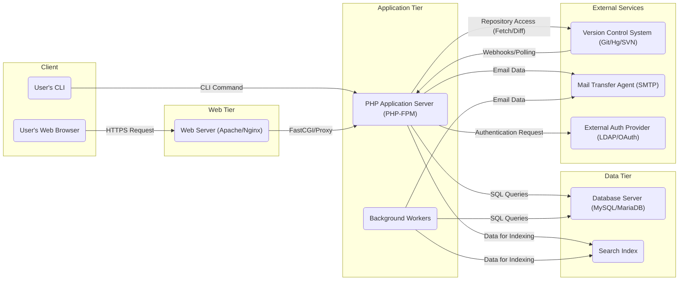

# Project Design Document: Phabricator

**Version:** 1.1
**Date:** October 26, 2023
**Author:** AI Software Architect

## 1. Introduction

This document provides an enhanced architectural overview of Phabricator, an open-source suite of web-based software development collaboration tools. This detailed description is designed to serve as a robust foundation for subsequent threat modeling activities. It clearly outlines the key components, their interactions, and the overall system architecture with improved clarity and detail.

## 2. Goals and Objectives

The primary goal of this document remains to provide a comprehensive and easily understandable view of Phabricator's architecture, specifically tailored to facilitate effective threat modeling. Specific objectives include:

*   Clearly identifying and describing the major components of the Phabricator system with more detail.
*   Illustrating the interactions and data flow between these components with concrete examples.
*   Specifying the technologies and protocols used by each component.
*   Presenting a clear, concise, and visually informative representation of the system's structure using diagrams.

## 3. System Architecture Overview

Phabricator employs a well-defined three-tier web application architecture, promoting modularity and separation of concerns:

*   **Presentation Tier:**  Responsible for the user interface, primarily accessed through standard web browsers. This tier focuses on rendering information and capturing user input.
*   **Application Tier:**  The core of Phabricator's logic, handling user requests, enforcing business rules, and orchestrating interactions between other components.
*   **Data Tier:**  Provides persistent storage for all application data, ensuring data integrity and availability.

## 4. Detailed Component Description

This section provides a more in-depth description of the key components within the Phabricator system.

*   **Web Server (e.g., Apache, Nginx):**
    *   Acts as the entry point for all incoming HTTP/HTTPS requests from clients.
    *   Efficiently serves static content such as HTML files, CSS stylesheets, JavaScript code, and images.
    *   Acts as a reverse proxy, forwarding dynamic requests to the PHP application server.
    *   Manages SSL/TLS certificate handling, ensuring secure communication.
    *   May implement load balancing and request routing strategies.

*   **PHP Application Server (e.g., PHP-FPM):**
    *   Executes the core Phabricator PHP codebase, interpreting and running the application logic.
    *   Handles request routing within the application, directing requests to the appropriate controllers and modules.
    *   Processes data, performs business logic operations, and interacts with the database to retrieve or store information.
    *   Manages user sessions, including authentication and authorization checks.
    *   Generates dynamic web content (HTML) to be sent back to the client.

*   **Database Server (e.g., MySQL, MariaDB):**
    *   Provides persistent storage for all of Phabricator's critical data. This includes:
        *   Detailed user account information, including credentials and permissions.
        *   Code repository metadata, commit history, and branch information.
        *   Differential revision data, including code changes, comments, and review status.
        *   Bug reports, tasks, and project management information.
        *   Project structures, relationships between projects and users.
        *   Comprehensive audit logs tracking user actions and system events.
    *   Ensures data integrity, consistency, and availability.

*   **Background Workers (Daemons):**
    *   Execute asynchronous and deferred tasks that do not need immediate processing within the web request lifecycle. Examples include:
        *   Sending out email notifications for various events (e.g., code review updates, task assignments).
        *   Indexing data for the search functionality, ensuring efficient and fast searches.
        *   Processing updates from integrated version control systems, such as fetching new commits or handling webhook events.
        *   Running scheduled maintenance tasks, such as cleaning up temporary data or performing database optimizations.

*   **Version Control System (VCS) Integration (e.g., Git, Mercurial, Subversion):**
    *   Enables Phabricator to interact with external version control systems, providing features like code browsing, commit viewing, and code review.
    *   Interactions involve:
        *   Fetching repository data (commits, branches, tags) for display within Phabricator.
        *   Facilitating the code review process by allowing users to create and manage Differential revisions based on VCS changes.
        *   Potentially pushing changes back to the VCS based on configured workflows (though direct pushing is less common and often managed through the VCS itself).
        *   Receiving webhook notifications from the VCS about events like new commits or pull requests.

*   **Search Index (e.g., built-in or external like Elasticsearch):**
    *   Provides powerful full-text search capabilities across various types of data within Phabricator, such as code, commit messages, task descriptions, and comments.
    *   Background workers are typically responsible for populating and continuously updating the search index with the latest data.

*   **Mail Transfer Agent (MTA) Integration (e.g., Sendmail, Postfix):**
    *   Allows Phabricator to send email notifications to users regarding various activities and updates.
    *   Phabricator is configured with the details of an SMTP server to relay outgoing emails.

*   **External Authentication Providers (Optional):**
    *   Provides the ability to integrate with external authentication systems, streamlining user login and management. Supported providers include:
        *   LDAP/Active Directory for centralized user management in corporate environments.
        *   OAuth 2.0 providers (e.g., Google, GitHub, GitLab) for social login and delegated authorization.
        *   SAML for enterprise single sign-on (SSO) solutions.

*   **Command-Line Interface (CLI) Tools (`bin/` scripts):**
    *   Offers a set of command-line tools for administrative and utility tasks. These are used for:
        *   Performing database schema migrations and updates.
        *   Clearing various caches within the application.
        *   Managing and monitoring the background worker daemons.
        *   Importing and exporting data.
        *   Performing various system maintenance tasks.

## 5. Data Flow

The following diagram illustrates a more detailed view of typical user interactions and data flow within Phabricator:

**Detailed Data Flow Examples:**

*   **User Browsing a Code Repository:**
    1. The user navigates to a repository view in their web browser ("User's Web Browser").
    2. The web browser sends an HTTPS request to the web server ("Web Server (Apache/Nginx)").
    3. The web server proxies the request to the PHP application server ("PHP Application Server (PHP-FPM)").
    4. The application server queries the database ("Database Server (MySQL/MariaDB)") to retrieve repository metadata, branch information, and recent commits.
    5. The application server may also interact with the version control system ("Version Control System (Git/Hg/SVN)") to fetch the latest commit information or file contents if not already cached.
    6. The application server renders the HTML page and sends it back through the web server to the user's browser.

*   **Submitting a Bug Report:**
    1. The user fills out and submits a bug report form in their web browser ("User's Web Browser").
    2. The web server receives the HTTPS request and forwards it to the application server.
    3. The application server validates the input data.
    4. The application server stores the new bug report details in the database.
    5. Background workers ("Background Workers") may be triggered to send email notifications to project members or administrators.
    6. The application server updates the search index with the new bug report information, making it searchable.

*   **Processing a Git Push:**
    1. A developer pushes new commits to the integrated Git repository.
    2. The version control system ("Version Control System (Git/Hg/SVN)") sends a webhook notification to the Phabricator application server.
    3. The application server receives the webhook and triggers background workers.
    4. The background workers fetch the new commits and related data from the Git repository.
    5. The background workers store the commit information in the database.
    6. The background workers update the search index with the new commit messages and code changes.
    7. The background workers may also trigger notifications related to code review workflows or commit analysis.

## 6. Security Considerations (High-Level)

This section highlights key security areas that are crucial for the secure operation of Phabricator and will be the focus of detailed analysis during the threat modeling process:

*   **Authentication and Authorization:** Robust mechanisms for verifying user identities and controlling access to resources and functionalities based on roles and permissions. This includes secure password storage, multi-factor authentication options, and granular permission management.
*   **Session Management:** Secure handling of user sessions to prevent unauthorized access after successful login. This involves using secure session identifiers, appropriate timeouts, and protection against session fixation and hijacking attacks.
*   **Input Validation and Output Encoding:** Rigorous validation of all user-provided data to prevent injection attacks (e.g., SQL injection, cross-site scripting). Proper encoding of output data to prevent the execution of malicious scripts in user browsers.
*   **Database Security:** Measures to protect the database from unauthorized access, including strong database credentials, network segmentation, and protection against SQL injection vulnerabilities. Regular database backups and security audits are also essential.
*   **Communication Security:** Ensuring confidentiality and integrity of data transmitted between components, primarily through the use of HTTPS (TLS/SSL) for all web traffic. Secure communication channels should also be considered for interactions with external services.
*   **Dependency Management:** Regularly auditing and updating third-party libraries and components to address known vulnerabilities. Employing tools and processes to manage and secure dependencies.
*   **Access Control:** Implementing the principle of least privilege, granting users only the necessary permissions to perform their tasks. This applies to both application-level access and access to the underlying infrastructure.
*   **Logging and Auditing:** Comprehensive logging of security-relevant events, such as login attempts, permission changes, and data modifications. Regular review of audit logs to detect and respond to suspicious activity.
*   **Protection against Common Web Application Vulnerabilities:** Addressing OWASP Top Ten vulnerabilities such as cross-site scripting (XSS), SQL injection, cross-site request forgery (CSRF), and security misconfigurations.

## 7. Deployment

Phabricator offers flexibility in deployment options, catering to various needs and scales:

*   **Single Server Deployment:** All core components (web server, application server, database) are installed and run on a single physical or virtual server. This is suitable for small teams, development environments, or initial evaluations.
*   **Separated Tier Deployment:** Each tier (web, application, data) is deployed on separate servers. This improves scalability, security, and resilience by isolating components and allowing for independent scaling.
*   **Containerized Deployment (e.g., Docker, Kubernetes):** Components are packaged into containers, enabling easier deployment, management, and scaling. Orchestration platforms like Kubernetes can manage containerized Phabricator deployments.
*   **Cloud-Based Deployment:** Leveraging cloud infrastructure services (e.g., AWS, Azure, GCP) for hosting Phabricator. This offers scalability, reliability, and managed services for components like databases and load balancers.

## 8. Technologies Used

*   **Primary Programming Language:** PHP
*   **Relational Database Management System:** MySQL or MariaDB
*   **Web Server Software:** Apache HTTP Server or Nginx
*   **Version Control System Integrations:** Git, Mercurial, Subversion
*   **Common Operating Systems:** Linux distributions (e.g., Ubuntu, CentOS), macOS
*   **Frontend Web Technologies:** HTML, CSS, JavaScript
*   **Search Indexing Technology:** Built-in Phabricator search or external solutions like Elasticsearch
*   **Optional Caching Mechanisms:** APCu, Memcached for improving performance
*   **Potential External Authentication Protocols:** LDAP, OAuth 2.0, SAML

## 9. Conclusion

This improved design document provides a more detailed and comprehensive architectural understanding of Phabricator. By clearly outlining the components, their interactions, and the underlying technologies, this document serves as a solid foundation for conducting a thorough and effective threat model. The insights gained from this threat modeling process will be crucial for identifying potential security vulnerabilities and implementing appropriate mitigation strategies to ensure the security and integrity of the Phabricator platform.