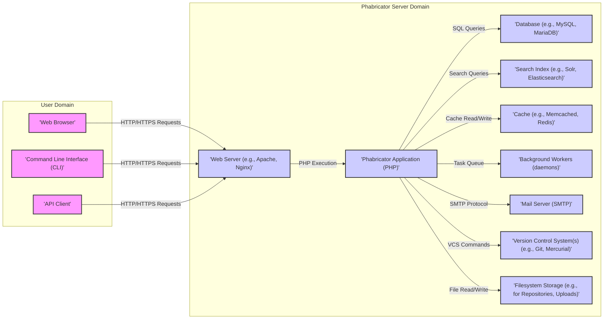

## Project Design Document: Phabricator (Improved)

**1. Introduction**

This document provides an enhanced architectural overview of Phabricator, a comprehensive suite of open-source web applications designed to facilitate software development collaboration. This detailed design serves as a crucial foundation for subsequent threat modeling exercises, offering a clear understanding of Phabricator's core components, data movement, and underlying technologies.

**2. Project Overview**

Phabricator is a self-hosted platform offering a wide range of tools for software development teams. Key functionalities include:

*   **Code Hosting (Diffusion):**  Managing and browsing Git, Mercurial, and Subversion repositories.
*   **Code Review (Differential):**  Facilitating pre-commit code reviews with detailed diffs and discussions.
*   **Bug Tracking (Maniphest):**  Tracking and managing bugs, features, and other work items.
*   **Project Management (Phriction, Projects):**  Creating and managing project documentation, and organizing work into projects.
*   **Task Management (Maniphest):**  Assigning, tracking, and managing individual tasks.
*   **Communication (Ponder, Chat Log):**  Providing question-and-answer forums and persistent chat channels.
*   **Audit Tracking (Audit):**  Tracking and reviewing changes to code and configurations.
*   **Event Tracking (Feed):**  Providing a unified feed of events across different Phabricator applications.

**3. Architectural Diagram**

**4. Component Breakdown**

*   **User Interfaces:**
    *   **Web Browser:** The primary graphical interface for users, rendering HTML, CSS, and executing JavaScript to interact with Phabricator's features.
    *   **Command Line Interface (CLI):** Provides text-based access for developers to interact with Phabricator, often used for scripting and automation. Examples include `arc diff` for code review submissions.
    *   **API Client:** Enables programmatic access to Phabricator's functionalities through a well-defined API. This allows integration with other systems and custom tooling.

*   **Phabricator Server Components:**
    *   **Web Server:**  Acts as the entry point for all web requests, handling routing, SSL termination, and serving static assets. It forwards dynamic requests to the Phabricator application.
    *   **Phabricator Application (PHP):** The core of the application, responsible for:
        *   **Request Handling:** Processing incoming web requests from the web server.
        *   **Business Logic:** Implementing the core functionalities of Phabricator's various applications (Differential, Maniphest, etc.).
        *   **Data Access Layer:** Interacting with the database to retrieve and persist data.
        *   **Authentication and Authorization:** Verifying user identities and enforcing access controls.
        *   **Event Dispatching:**  Generating and handling events within the system.
        *   **API Endpoint Handling:**  Serving requests from API clients.
    *   **Database:** Stores all persistent data for Phabricator, including:
        *   User accounts and profiles.
        *   Code repository metadata and configuration.
        *   Code review requests and comments.
        *   Bug reports and task details.
        *   Project information and relationships.
        *   Audit logs and event history.
    *   **Search Index:** Provides full-text search capabilities across Phabricator's data. This allows users to quickly find relevant information within code, tasks, and other content.
    *   **Cache:** Stores frequently accessed data in memory to improve performance and reduce database load. This can include user session data, configuration settings, and results of common queries.
    *   **Background Workers (daemons):** Execute asynchronous tasks that are not time-critical for the main request flow. Examples include:
        *   Sending email notifications.
        *   Updating the search index after data changes.
        *   Mirroring and fetching from remote repositories.
        *   Processing webhook events from VCS providers.
    *   **Mail Server (SMTP):**  Used to send out email notifications to users regarding events within Phabricator, such as code review updates, task assignments, and mentions.
    *   **Version Control System(s):**  Phabricator integrates with VCS to manage code repositories. It interacts with Git and Mercurial through system calls or libraries to perform operations like cloning, fetching, and pushing.
    *   **Filesystem Storage:** Used to store various files, including:
        *   Repository data (e.g., `.git` directories).
        *   Uploaded files attached to tasks or code reviews.
        *   Potentially cached data or temporary files.

**5. Data Flow**

Here are examples of data flow for common user interactions:

*   **User Login:**
    *   The user enters credentials in the "Web Browser".
    *   The "Web Browser" sends an HTTPS POST request to the "Web Server".
    *   The "Web Server" passes the request to the "Phabricator Application".
    *   The "Phabricator Application" retrieves user credentials from the "Database".
    *   The "Phabricator Application" authenticates the user.
    *   A session ID is created and stored in the "Cache" and a cookie is sent back to the "Web Browser".

*   **Submitting a Code Review (Differential):**
    *   The user uses the "CLI" (e.g., `arc diff`) or the "Web Browser" to initiate a code review.
    *   The "CLI" or "Web Browser" sends an HTTP request to the "Web Server".
    *   The "Web Server" forwards the request to the "Phabricator Application".
    *   The "Phabricator Application" interacts with the "Version Control System(s)" to retrieve the changes.
    *   The changes and metadata are stored in the "Database".
    *   The "Phabricator Application" might update the "Search Index" to include the new code.
    *   "Background Workers" might send email notifications about the new review request via the "Mail Server".

*   **Creating a Bug Report (Maniphest):**
    *   The user fills out the bug report form in the "Web Browser".
    *   The "Web Browser" sends an HTTPS POST request to the "Web Server".
    *   The "Web Server" forwards the request to the "Phabricator Application".
    *   The "Phabricator Application" validates the input and stores the bug report details in the "Database".
    *   The "Phabricator Application" might update the "Search Index".
    *   "Background Workers" might send notifications to relevant users.

**6. Key Technologies**

*   **Primary Programming Language:** PHP
*   **Database System:** Typically MySQL or MariaDB
*   **Web Server Software:** Commonly Apache or Nginx
*   **Search Engine Options:** Typically Solr or Elasticsearch
*   **Caching Mechanisms:** Commonly Memcached or Redis
*   **Version Control System Integrations:** Primarily Git and Mercurial, with some support for Subversion.
*   **Operating System Environment:** Typically deployed on Linux-based systems.

**7. Deployment Model**

Phabricator is generally deployed in a self-hosted model, offering flexibility but requiring infrastructure management. Common deployment considerations include:

*   **Single Server Deployment:** All components (web server, application, database, etc.) reside on a single server, suitable for small teams or development environments.
*   **Multi-Server Deployment:** Components are distributed across multiple servers for scalability and resilience. This might involve separate servers for the web application, database, search index, and caching.
*   **Load Balancing:** Distributing traffic across multiple web server instances to handle high user loads.
*   **Database Clustering/Replication:** Ensuring high availability and data redundancy for the database.
*   **Caching Layers:** Implementing multiple layers of caching (e.g., application-level and CDN) for optimal performance.
*   **Secure Network Configuration:** Proper firewall rules and network segmentation to protect the Phabricator infrastructure.

**8. Authentication and Authorization**

*   **Authentication Mechanisms:**
    *   **Username and Password:**  Credentials stored in the "Database" (hashed and salted).
    *   **LDAP/Active Directory:** Integration with existing directory services for centralized user management.
    *   **OAuth 2.0:** Allowing users to authenticate via third-party providers.
    *   **HTTP Authentication:** Basic or Digest authentication.
    *   **Trusted Proxies:**  Trusting authentication decisions made by upstream proxies.
    *   **SSH Public Keys:** For authentication over SSH, particularly for repository access.
*   **Authorization Model:**
    *   **User Roles and Permissions:**  Assigning users to roles with specific privileges.
    *   **Project-Based Access Control:**  Controlling access to resources based on project membership.
    *   **Object-Level Permissions:**  Fine-grained control over individual objects (e.g., who can view or edit a specific task or code review).
    *   **Policy Framework:**  A flexible system for defining custom access control rules based on various criteria.
    *   **Auditing:** Tracking user actions and permission changes.

**9. Key Security Considerations (for Threat Modeling)**

*   **Web Application Vulnerabilities:**
    *   **Cross-Site Scripting (XSS):**  Potential for injecting malicious scripts into web pages.
    *   **SQL Injection:**  Risks associated with unsanitized database queries.
    *   **Cross-Site Request Forgery (CSRF):**  Possibility of unauthorized actions performed on behalf of a logged-in user.
    *   **Insecure Direct Object References (IDOR):**  Risk of unauthorized access to objects by manipulating IDs.
    *   **Authentication and Authorization Flaws:** Weak password policies, insecure session management, or bypassable access controls.
*   **API Security:**
    *   **Lack of proper authentication and authorization for API endpoints.**
    *   **Exposure of sensitive data through API responses.**
    *   **Vulnerabilities in API request handling.**
*   **Data Security:**
    *   **Insecure storage of sensitive data in the "Database" (e.g., lack of encryption at rest).**
    *   **Exposure of sensitive data in transit (lack of HTTPS).**
    *   **Insufficient protection of backups.**
*   **Dependency Vulnerabilities:**
    *   **Outdated or vulnerable third-party libraries used by the "Phabricator Application".**
*   **Code Repository Security:**
    *   **Unauthorized access to repositories via the "Web Browser", "CLI", or API.**
    *   **Accidental exposure of sensitive information in code.**
    *   **Malicious code injection.**
*   **Email Security:**
    *   **Email spoofing and phishing attacks leveraging the "Mail Server".**
    *   **Exposure of sensitive information in email notifications.**
*   **Background Worker Security:**
    *   **Potential for vulnerabilities in the code executed by "Background Workers".**
    *   **Risk of unauthorized actions performed by background tasks.**
*   **Search Index Security:**
    *   **Unauthorized access to or manipulation of the "Search Index".**
    *   **Exposure of sensitive information through search results.**
*   **Cache Security:**
    *   **Exposure of sensitive data stored in the "Cache" if not properly secured.**
*   **Filesystem Security:**
    *   **Unauthorized access to files stored in the "Filesystem Storage".**
    *   **Risk of data breaches through compromised file permissions.**
*   **Deployment Security:**
    *   **Misconfigured "Web Server" or other infrastructure components.**
    *   **Lack of proper security hardening.**
*   **Input Validation:**
    *   **Insufficient validation of user inputs leading to injection vulnerabilities.**
*   **Error Handling:**
    *   **Disclosure of sensitive information in error messages.**
*   **Rate Limiting:**
    *   **Lack of rate limiting making the system susceptible to brute-force and denial-of-service attacks.**

This improved design document provides a more detailed and comprehensive overview of Phabricator's architecture, laying a stronger foundation for thorough threat modeling activities. Each component and data flow should be carefully considered for potential security vulnerabilities.
