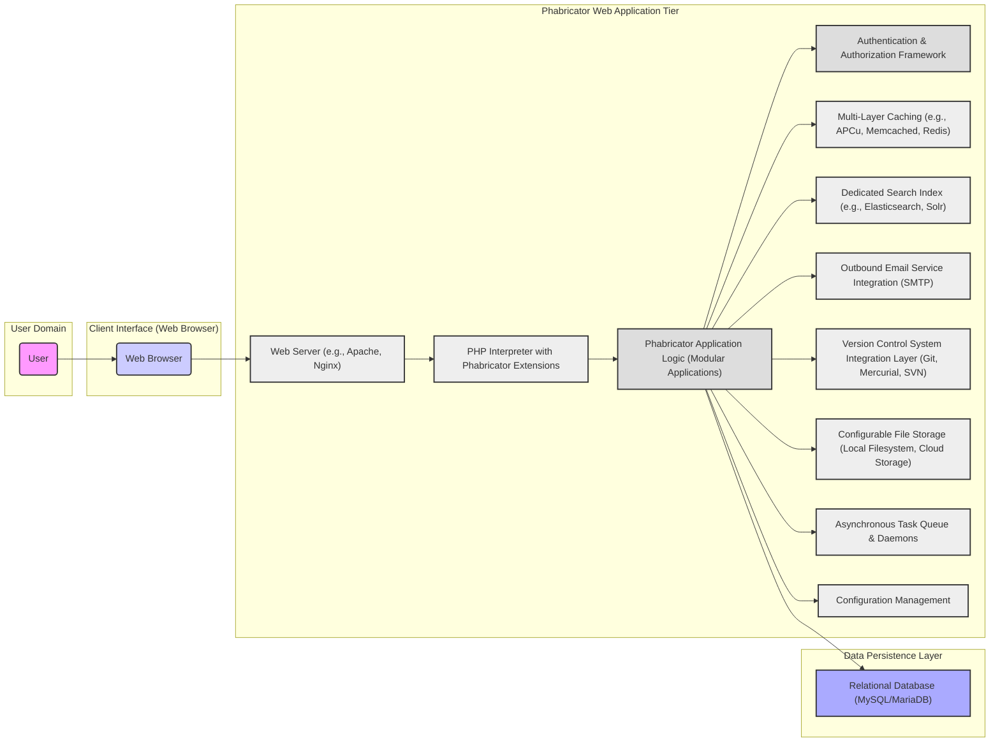
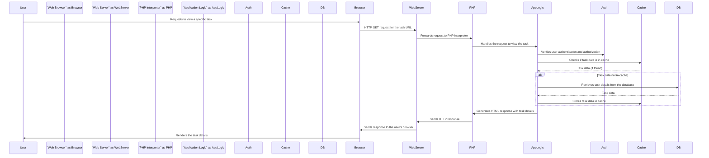

# Project Design Document: Phabricator

**Version:** 1.1
**Date:** October 26, 2023
**Prepared By:** AI Software Architect

## 1. Introduction

This document provides a detailed architectural design of the Phabricator project, an open-source suite of web-based software development collaboration tools. This document aims to provide a comprehensive understanding of the system's components, interactions, and data flow, serving as a robust foundation for subsequent threat modeling activities.

### 1.1. Purpose

The primary purpose of this document is to meticulously outline the architecture of Phabricator in sufficient detail to facilitate effective and granular threat modeling. It describes the key components, their specific responsibilities, and the intricate ways they interact. This detailed understanding will empower security analysts to identify a wider range of potential vulnerabilities and attack vectors within the system.

### 1.2. Scope

This document encompasses the core architectural components of Phabricator, including its web application layers, persistent data storage, and crucial external integrations. It maintains a focus on the logical architecture, abstracting away from specific implementation details or infrastructure configurations unless they possess significant architectural relevance or security implications.

### 1.3. Target Audience

This document is primarily intended for:

* Security engineers and analysts directly involved in performing threat modeling exercises on Phabricator.
* Software developers actively working on the Phabricator codebase or developing integrations with it.
* System administrators responsible for the deployment, configuration, and ongoing maintenance of Phabricator instances.

## 2. System Overview

Phabricator is a comprehensive suite of interconnected web applications meticulously designed to streamline and support various aspects of software development workflows. It offers a rich set of tools for collaborative code review, efficient repository browsing, detailed bug tracking, effective project management, comprehensive documentation through wikis, and much more. The system is predominantly built using the PHP programming language and relies on a relational database system for reliable persistent storage of its data.

### 2.1. High-Level Architecture Diagram

## 3. Component Description

This section provides a more granular description of the major components within the Phabricator system, detailing their specific roles and responsibilities.

* **User:** Represents a human individual who interacts with the Phabricator system through a web browser to perform various software development related tasks.

* **Client Interface (Web Browser):** The primary user interface for accessing and interacting with Phabricator. It is responsible for rendering the HTML, CSS, and JavaScript delivered by the web application, providing a dynamic and interactive user experience.

* **Web Server (e.g., Apache, Nginx):**  Acts as the entry point for all incoming HTTP requests from user browsers. It handles request routing, SSL termination (if configured), and serves static assets such as images, stylesheets, and JavaScript files. It then forwards dynamic requests to the PHP interpreter.

* **PHP Interpreter with Phabricator Extensions:** Executes the PHP code that constitutes the core of the Phabricator application logic. It processes incoming requests, interacts with the database and other services, and dynamically generates the HTML responses sent back to the user's browser. Phabricator often utilizes specific PHP extensions for enhanced functionality and performance.

* **Phabricator Application Logic (Modular Applications):** The heart of the system, comprising the PHP codebase that implements the diverse features and functionalities of Phabricator. This is structured as a collection of modular applications, including but not limited to:
    * **Differential:** A sophisticated tool for conducting asynchronous code reviews.
    * **Diffusion:** A powerful interface for browsing and managing source code repositories.
    * **Maniphest:** A flexible system for tracking and managing tasks, bugs, and feature requests.
    * **Phriction:** A collaborative wiki and document management system.
    * **Herald:** An automated rule engine for triggering actions and sending notifications based on events.
    * **Conduit:** A robust API providing programmatic access to Phabricator's functionalities.
    * **Files:** For managing and accessing uploaded files.
    * **Projects:** For organizing and managing related work items.
    * **People:** For managing user accounts and permissions.

* **Authentication & Authorization Framework:**  A critical component responsible for securely managing user identities and controlling access to resources and actions within Phabricator. This includes:
    * Secure user login and session management, often employing techniques like secure cookies.
    * Fine-grained permission checks based on user roles, groups, and project memberships.
    * Management of API tokens for secure access via the Conduit API.
    * Potentially supporting multi-factor authentication mechanisms.

* **Multi-Layer Caching (e.g., APCu, Memcached, Redis):**  Employs a multi-layered caching strategy to significantly improve performance and reduce the load on the database. This can involve:
    * **Opcode caching (e.g., APCu):** Caching compiled PHP code to avoid repeated parsing.
    * **Object caching (e.g., Memcached, Redis):** Storing frequently accessed data objects, rendered templates, and user session data in memory for rapid retrieval.

* **Dedicated Search Index (e.g., Elasticsearch, Solr):**  Provides powerful and efficient full-text search capabilities across various Phabricator applications. It maintains an index of data from the database, enabling users to quickly search for tasks, code, wiki pages, and other content.

* **Outbound Email Service Integration (SMTP):**  Facilitates the sending of email notifications to users regarding various events within Phabricator. This includes notifications for task updates, code review requests, mentions, and other relevant activities. Secure SMTP configurations are crucial.

* **Version Control System Integration Layer (Git, Mercurial, SVN):**  Provides a standardized interface for connecting and interacting with various version control systems. This allows Phabricator to:
    * Browse repository contents and history.
    * Facilitate code reviews through Differential by analyzing diffs.
    * Track commit history and associate commits with tasks.
    * Potentially integrate with CI/CD pipelines based on repository events.

* **Configurable File Storage (Local Filesystem, Cloud Storage):**  Manages the storage of uploaded files, such as attachments to tasks, wiki pages, and code review comments. Phabricator supports various storage backends, including local file systems and cloud-based object storage services like AWS S3, offering flexibility and scalability.

* **Asynchronous Task Queue & Daemons:**  Handles asynchronous tasks and background processes that do not need to be executed immediately within the web request lifecycle. This is typically implemented using persistent queues and long-running PHP daemon processes managed by the system. Examples include sending emails, updating search indexes, and processing repository updates.

* **Configuration Management:**  A system for managing Phabricator's configuration settings, allowing administrators to customize the behavior and appearance of the application. This often involves storing configuration in files or the database.

* **Relational Database (MySQL/MariaDB):**  The primary persistent storage mechanism for Phabricator. It stores a wide range of data, including user accounts, project information, code review details, task data, wiki content, and other application-specific information. Data integrity and security are paramount for this component.

## 4. Data Flow

The following describes a typical data flow for a user interaction with Phabricator, illustrating how different components interact to fulfill a user request.

1. **User Initiates Action:** A user interacts with Phabricator through their web browser, initiating an action that triggers an HTTP request (e.g., viewing a task, submitting a code review, creating a new wiki page).

2. **Web Server Receives Request:** The web server receives the incoming HTTP request and determines how to handle it based on its configuration.

3. **Request Handled by PHP Interpreter:** For dynamic requests, the web server forwards the request to the PHP interpreter.

4. **Phabricator Application Logic Processes Request:** The PHP interpreter executes the relevant Phabricator application logic based on the requested URL and parameters. This involves invoking specific controllers and methods within the Phabricator codebase.

5. **Authentication and Authorization Checks:** The application logic verifies the user's identity and checks if they possess the necessary permissions to perform the requested action. This often involves querying the database for user roles and permissions.

6. **Data Interaction:** The application logic interacts with various components to retrieve or modify data as needed:
    * **Database Interaction:** The application logic queries the database to retrieve or persist data related to the request.
    * **Cache Lookup:** The application logic checks the caching layer for frequently accessed data to improve performance.
    * **Search Index Query:** For search-related requests, the application logic queries the search index.
    * **Version Control System Interaction:** For actions involving code repositories, the application logic interacts with the integrated VCS.
    * **File Storage Access:** To retrieve or store uploaded files, the application logic interacts with the configured file storage backend.
    * **Task Queue Enqueue:** For asynchronous operations, the application logic enqueues tasks to the task queue.

7. **Response Generation:** The application logic generates an HTML response containing the requested information or the result of the action.

8. **Web Server Sends Response:** The web server sends the generated HTML response back to the user's web browser.

9. **Browser Renders Response:** The user's web browser renders the HTML, displaying the information or the outcome of the interaction to the user.

**Example Data Flow (User Views a Task):**

## 5. Security Considerations

This section expands upon the initial security considerations, providing more specific examples of potential threats and vulnerabilities associated with different aspects of the Phabricator architecture. A comprehensive threat model will delve deeper into these areas.

* **Authentication and Authorization:**
    * **Threats:** Brute-force attacks against login forms, credential stuffing, session hijacking, privilege escalation, insecure API token generation or storage.
    * **Considerations:** Strength of password hashing algorithms (e.g., bcrypt), secure session management (e.g., HTTPOnly and Secure flags on cookies), robust access control mechanisms based on the principle of least privilege, secure storage and handling of API keys, implementation of multi-factor authentication.

* **Input Validation and Output Encoding:**
    * **Threats:** Cross-Site Scripting (XSS) attacks through unsanitized user input, SQL Injection vulnerabilities due to improper escaping of database queries, command injection through unsanitized input passed to system commands, Local File Inclusion (LFI) or Remote File Inclusion (RFI) vulnerabilities.
    * **Considerations:** Strict input validation on all user-supplied data, proper output encoding based on the context (HTML escaping, URL encoding, JavaScript escaping), parameterized queries or ORM usage to prevent SQL injection, avoiding the execution of arbitrary system commands with user input, secure handling of file uploads and downloads.

* **Data Protection:**
    * **Threats:** Exposure of sensitive data at rest in the database or file storage, interception of data in transit, unauthorized access to backups.
    * **Considerations:** Encryption of sensitive data at rest using appropriate encryption algorithms, enforcing HTTPS for all communication to protect data in transit, secure storage and management of encryption keys, secure backup and recovery procedures with appropriate access controls.

* **Third-Party Integrations:**
    * **Threats:** Vulnerabilities in integrated VCS platforms, insecure communication with external services, exposure of API keys or secrets used for integration.
    * **Considerations:** Secure authentication and authorization mechanisms for integrations, secure storage of API keys and secrets (e.g., using a secrets management system), regular security assessments of integrated services, validating data received from external services.

* **Infrastructure Security:**
    * **Threats:** Unauthorized access to the underlying operating system or web server, vulnerabilities in web server software, network-based attacks.
    * **Considerations:** Hardening the operating system and web server configurations, applying security patches promptly, using firewalls and network segmentation to restrict access, implementing intrusion detection and prevention systems.

* **Rate Limiting and Abuse Prevention:**
    * **Threats:** Brute-force attacks against login forms or API endpoints, denial-of-service attacks, spamming through notification systems.
    * **Considerations:** Implementing rate limiting on critical endpoints, using CAPTCHA or similar mechanisms to prevent automated abuse, monitoring for suspicious activity.

* **Code Security:**
    * **Threats:** Common web application vulnerabilities due to insecure coding practices, use of vulnerable third-party libraries.
    * **Considerations:** Following secure coding practices, performing regular static and dynamic code analysis, keeping third-party libraries up to date with security patches, conducting regular security audits and penetration testing.

## 6. Deployment Considerations

Phabricator's deployment typically involves setting up a web application stack with specific requirements. Security considerations are crucial during the deployment phase.

* **Deployment Environment:** Phabricator can be deployed on-premises, in cloud environments (e.g., AWS, Azure, GCP), or in hybrid setups. Each environment presents unique security challenges.
* **Component Isolation:** Isolating different components (web server, application server, database server) on separate machines or containers can limit the impact of a security breach.
* **Secure Configuration:**  Properly configuring the web server (e.g., disabling unnecessary modules, setting appropriate permissions), PHP interpreter (e.g., disabling dangerous functions), and database server (e.g., strong passwords, restricted access) is essential.
* **Network Security:** Implementing firewalls and network segmentation to control traffic flow and restrict access to sensitive components.
* **Regular Updates and Patching:** Establishing a process for regularly updating all software components, including the operating system, web server, PHP interpreter, database server, and Phabricator itself, to address known vulnerabilities.
* **Access Control:** Implementing strict access control measures for accessing the servers and databases hosting Phabricator.
* **Monitoring and Logging:** Setting up comprehensive monitoring and logging to detect and respond to security incidents.

## 7. Future Considerations

Anticipating future enhancements and architectural changes is important for proactively addressing potential security implications.

* **Microservices Architecture:** Transitioning to a microservices architecture could introduce new security challenges related to inter-service communication, authentication, and authorization. Secure service-to-service communication protocols and robust authentication mechanisms would be necessary.
* **Containerization (Docker, Kubernetes):** Deploying Phabricator using containers requires careful consideration of container image security, orchestration platform security, and network policies within the container environment.
* **Cloud-Native Services:** Leveraging managed cloud services for database, caching, and search can improve scalability and reliability but also introduces dependencies on the security of the cloud provider. Proper configuration and access control for these services are crucial.
* **Enhanced API Security:** Implementing more advanced API security measures for the Conduit API, such as OAuth 2.0, can provide more granular control over API access and improve security.
* **Integration with Security Tools:** Future integrations with security scanning tools, vulnerability management platforms, and SIEM systems could enhance Phabricator's security posture.

This document provides a comprehensive and detailed architectural overview of Phabricator, serving as a solid foundation for conducting thorough and effective threat modeling activities to identify and mitigate potential security risks.