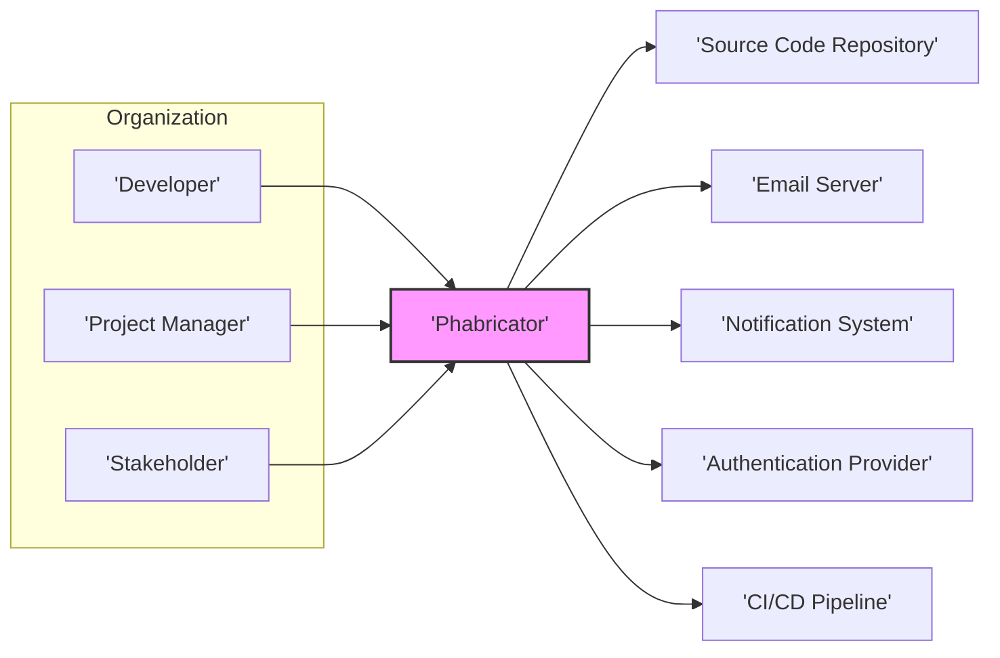
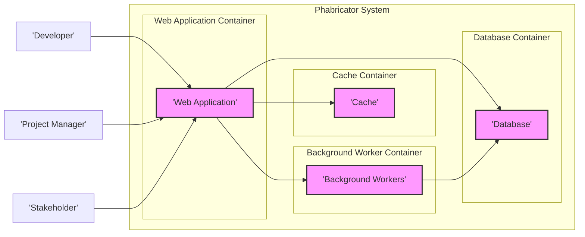
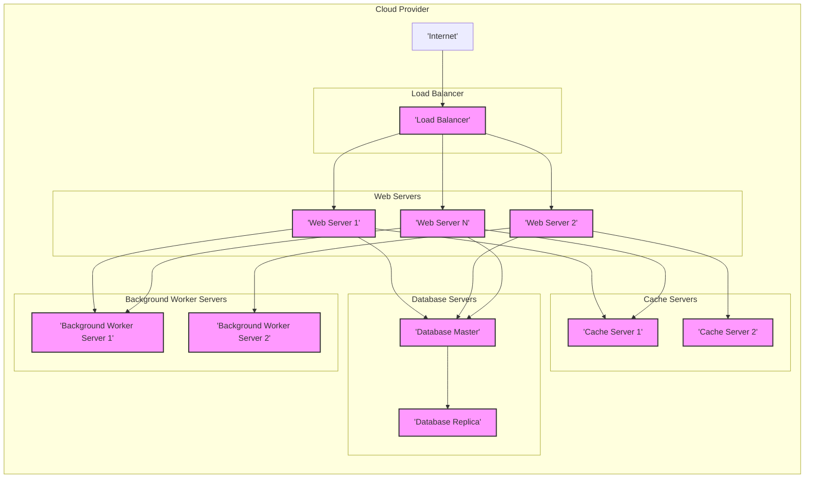
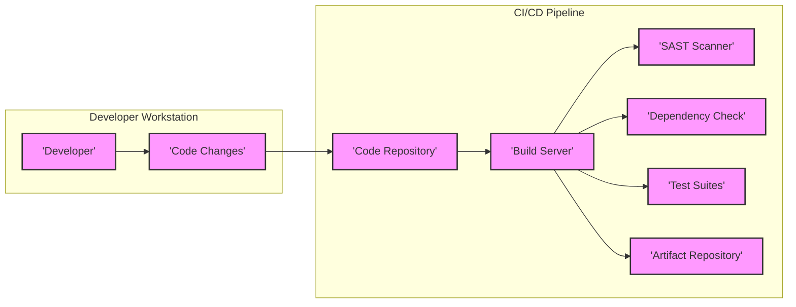

# BUSINESS POSTURE

This project, Phabricator, aims to provide a comprehensive suite of web-based software development collaboration tools. It seeks to improve team productivity, streamline project management, and enhance code quality throughout the software development lifecycle.

Business Priorities and Goals:
- Enhance developer productivity by providing integrated tools for code review, repository management, bug tracking, project management, and communication.
- Improve software quality through rigorous code review processes and bug tracking.
- Streamline project management and task coordination within development teams.
- Facilitate collaboration and communication among team members.
- Offer a self-hosted solution to organizations that require greater control over their development infrastructure and data.

Most Important Business Risks:
- Data breaches and leaks of sensitive source code, project information, and user data.
- Service disruption and unavailability impacting development workflows and project timelines.
- Compliance violations if handling regulated data without adequate security controls.
- Loss of intellectual property due to unauthorized access or exfiltration.
- Reputational damage and loss of customer trust in case of security incidents.

# SECURITY POSTURE

Existing Security Controls:
- security control: Web application framework with built-in security features (framework details need to be investigated in the repository).
- security control: Database access controls to manage user permissions and data access.
- security control: Potentially uses HTTPS for communication encryption (needs verification).
- security control: Likely has authentication mechanisms for user login (needs investigation of supported methods).
- security control: Authorization mechanisms to control access to different features and projects (needs investigation of granularity and implementation).

Accepted Risks:
- accepted risk: Potential vulnerabilities in third-party libraries and components used by Phabricator.
- accepted risk: Risks associated with self-hosting, requiring organizations to manage their own infrastructure security.
- accepted risk: Configuration errors during deployment and operation that could lead to security weaknesses.

Recommended Security Controls:
- security control: Implement a robust Secure Software Development Lifecycle (SSDLC) incorporating security reviews, static and dynamic code analysis, and penetration testing.
- security control: Regularly perform vulnerability scanning and penetration testing of the Phabricator application and infrastructure.
- security control: Implement a Web Application Firewall (WAF) to protect against common web attacks.
- security control: Employ intrusion detection and prevention systems (IDS/IPS) to monitor and protect the infrastructure.
- security control: Implement security information and event management (SIEM) for logging and security monitoring.
- security control: Enforce multi-factor authentication (MFA) for user accounts, especially for administrators.
- security control: Regularly update and patch Phabricator and underlying infrastructure components.
- security control: Implement data loss prevention (DLP) measures to prevent sensitive data exfiltration.

Security Requirements:
- Authentication:
    - security requirement: Secure authentication mechanism to verify user identity.
    - security requirement: Support for strong password policies and password management.
    - security requirement: Consider integration with existing organizational identity providers (e.g., LDAP, Active Directory, SAML, OAuth).
    - security requirement: Implement session management to securely handle user sessions.
- Authorization:
    - security requirement: Role-based access control (RBAC) to manage user permissions based on roles (e.g., administrator, developer, project manager).
    - security requirement: Fine-grained authorization to control access to specific projects, repositories, and features.
    - security requirement: Principle of least privilege should be enforced throughout the application.
- Input Validation:
    - security requirement: Comprehensive input validation on all user inputs to prevent injection attacks (e.g., SQL injection, cross-site scripting).
    - security requirement: Input sanitization and encoding to mitigate risks from malicious input.
    - security requirement: Implement output encoding to prevent cross-site scripting vulnerabilities.
- Cryptography:
    - security requirement: Use strong encryption algorithms for sensitive data at rest and in transit.
    - security requirement: Securely store and manage cryptographic keys.
    - security requirement: Protect sensitive data in transit using HTTPS/TLS for all communication.
    - security requirement: Consider encryption of sensitive data at rest in the database and file storage.

# DESIGN

## C4 CONTEXT

Context Diagram Elements:

- Element:
    - Name: Developer
    - Type: User
    - Description: Software developers who use Phabricator for code review, task management, and collaboration.
    - Responsibilities: Write code, review code, manage tasks, track bugs, collaborate with team members.
    - Security controls: Authentication to access Phabricator, authorization based on project roles, secure communication via HTTPS.

- Element:
    - Name: Project Manager
    - Type: User
    - Description: Project managers who use Phabricator for project planning, task assignment, progress tracking, and reporting.
    - Responsibilities: Plan projects, assign tasks, monitor progress, generate reports, manage team resources.
    - Security controls: Authentication to access Phabricator, authorization to manage projects and tasks, secure communication via HTTPS.

- Element:
    - Name: Stakeholder
    - Type: User
    - Description: Individuals who need to view project progress, review reports, or provide feedback on development activities.
    - Responsibilities: Monitor project status, review reports, provide feedback, track milestones.
    - Security controls: Authentication to access Phabricator (potentially read-only access), authorization to view specific project information, secure communication via HTTPS.

- Element:
    - Name: Phabricator
    - Type: System
    - Description: Web-based suite of software development collaboration tools.
    - Responsibilities: Code review, repository hosting, bug tracking, project management, task management, communication, notifications.
    - Security controls: Authentication, authorization, input validation, secure session management, data encryption (in transit and at rest), logging and monitoring, vulnerability management.

- Element:
    - Name: Source Code Repository
    - Type: External System
    - Description: External system hosting source code repositories (e.g., Git, Mercurial). Phabricator integrates with these repositories.
    - Responsibilities: Store and manage source code, version control, provide access to code repositories.
    - Security controls: Repository access controls, authentication, authorization, secure communication protocols (e.g., SSH, HTTPS).

- Element:
    - Name: Email Server
    - Type: External System
    - Description: External email server used by Phabricator for sending email notifications.
    - Responsibilities: Send and receive emails, deliver notifications to users.
    - Security controls: SMTP authentication, TLS encryption for email transmission, spam filtering.

- Element:
    - Name: Notification System
    - Type: External System
    - Description: System for sending various notifications (e.g., push notifications, in-app notifications). Could be part of Phabricator or an external service.
    - Responsibilities: Deliver notifications to users through different channels.
    - Security controls: Secure API access, authentication, authorization, secure communication protocols.

- Element:
    - Name: Authentication Provider
    - Type: External System
    - Description: External system for user authentication (e.g., LDAP, Active Directory, SAML, OAuth).
    - Responsibilities: Authenticate users, manage user identities, provide authentication services to Phabricator.
    - Security controls: Secure authentication protocols, access controls, secure storage of credentials.

- Element:
    - Name: CI/CD Pipeline
    - Type: External System
    - Description: Continuous Integration and Continuous Delivery pipeline for building, testing, and deploying software. Phabricator might integrate with CI/CD systems.
    - Responsibilities: Automate build, test, and deployment processes, integrate with code repositories and other tools.
    - Security controls: Secure pipeline configuration, access controls, secure artifact storage, vulnerability scanning in the pipeline.

## C4 CONTAINER

Container Diagram Elements:

- Element:
    - Name: Web Application
    - Type: Container
    - Description: PHP-based web application that handles user requests, business logic, and presentation.
    - Responsibilities:  Handle user authentication and authorization, process user requests, manage application logic, render user interface, interact with database, cache, and background workers.
    - Security controls: Web application framework security features, input validation, output encoding, session management, authentication and authorization mechanisms, secure coding practices, vulnerability scanning.

- Element:
    - Name: Database
    - Type: Container
    - Description: Relational database (e.g., MySQL, MariaDB) storing application data, including user accounts, project information, code review data, and task details.
    - Responsibilities: Persist application data, provide data access to the web application and background workers, ensure data integrity and availability.
    - Security controls: Database access controls, encryption at rest, regular backups, database hardening, monitoring and auditing of database access.

- Element:
    - Name: Cache
    - Type: Container
    - Description: In-memory cache (e.g., Memcached, Redis) to improve application performance by caching frequently accessed data.
    - Responsibilities: Cache frequently accessed data, reduce database load, improve response times.
    - Security controls: Access controls to the cache, secure configuration, potentially encryption in transit if cache is accessed over a network.

- Element:
    - Name: Background Workers
    - Type: Container
    - Description: Processes that handle asynchronous tasks, such as sending email notifications, processing code review diffs, and running scheduled jobs.
    - Responsibilities: Execute background tasks, offload long-running operations from the web application, improve application responsiveness.
    - Security controls: Secure task queuing mechanism, input validation for task processing, logging and monitoring of background worker activity, access controls to task queues.

## DEPLOYMENT

Deployment Architecture: Cloud-Based Deployment (Example)

Deployment Diagram Elements:

- Element:
    - Name: Load Balancer
    - Type: Infrastructure
    - Description: Distributes incoming traffic across multiple web servers for high availability and scalability.
    - Responsibilities: Load balancing, traffic routing, SSL termination, health checks for web servers.
    - Security controls: DDoS protection, rate limiting, SSL/TLS encryption, access control lists.

- Element:
    - Name: Web Server 1, Web Server 2, ..., Web Server N
    - Type: Infrastructure (Compute Instance)
    - Description: Instances running the Web Application container, serving user requests.
    - Responsibilities: Run the web application, process user requests, interact with database, cache, and background workers.
    - Security controls: Operating system hardening, web server configuration security, intrusion detection, security monitoring, regular patching.

- Element:
    - Name: Database Master
    - Type: Infrastructure (Database Instance)
    - Description: Primary database server instance responsible for write operations and data consistency.
    - Responsibilities: Store and manage application data, handle write operations, ensure data integrity, replication to replica.
    - Security controls: Database access controls, encryption at rest, database hardening, regular backups, monitoring and auditing, failover mechanisms.

- Element:
    - Name: Database Replica
    - Type: Infrastructure (Database Instance)
    - Description: Read-only replica of the master database, used for read operations to improve performance and availability.
    - Responsibilities: Serve read requests, provide data redundancy, improve read performance.
    - Security controls: Read-only access controls, data replication from master, database hardening, monitoring.

- Element:
    - Name: Cache Server 1, Cache Server 2
    - Type: Infrastructure (Cache Instance)
    - Description: Instances running the Cache container, providing in-memory caching.
    - Responsibilities: Provide caching services, improve application performance, reduce database load.
    - Security controls: Access controls to cache instances, secure configuration, potentially encryption in transit within the internal network.

- Element:
    - Name: Background Worker Server 1, Background Worker Server 2
    - Type: Infrastructure (Compute Instance)
    - Description: Instances running the Background Worker container, processing asynchronous tasks.
    - Responsibilities: Execute background tasks, process task queues, handle asynchronous operations.
    - Security controls: Operating system hardening, secure task processing, logging and monitoring, access controls.

## BUILD

Build Process Description:

1. Developer develops code changes on their local workstation.
2. Code changes are committed and pushed to the Code Repository (e.g., GitHub, GitLab).
3. CI/CD Pipeline is triggered by code changes in the repository (e.g., using webhooks).
4. Build Server in the CI/CD pipeline checks out the code.
5. SAST Scanner (Static Application Security Testing) performs static code analysis to identify potential security vulnerabilities in the code.
6. Dependency Check tool analyzes project dependencies to identify known vulnerabilities in third-party libraries.
7. Test Suites are executed to ensure code quality and functionality.
8. If all checks pass, the Build Server builds the application artifacts (e.g., deployable packages, container images).
9. Artifact Repository securely stores the build artifacts.

Build Process Security Controls:

- security control: Secure access control to the Code Repository, limiting who can commit and modify code.
- security control: Use of a dedicated Build Server in a controlled environment, minimizing exposure to developer workstations.
- security control: Integration of SAST Scanner into the build pipeline to automatically detect code vulnerabilities early in the development cycle.
- security control: Dependency Check to identify and manage vulnerabilities in third-party dependencies, ensuring supply chain security.
- security control: Automated Test Suites to verify code functionality and prevent regressions, including security-related tests.
- security control: Secure Artifact Repository with access controls to protect build artifacts from unauthorized access and modification.
- security control: Code signing of build artifacts to ensure integrity and authenticity.
- security control: Audit logging of build process activities for monitoring and security analysis.

# RISK ASSESSMENT

Critical Business Processes:
- Secure code management and version control.
- Efficient code review process to maintain code quality and security.
- Effective bug tracking and resolution to minimize vulnerabilities and issues.
- Project and task management to ensure timely and secure software delivery.
- Reliable notification system for timely communication and alerts.

Data Sensitivity:
- Source Code: Highly sensitive, intellectual property, potential vulnerabilities if exposed.
- User Credentials: Highly sensitive, used for authentication and access control.
- Project Plans and Roadmaps: Sensitive, business strategy and future plans.
- Bug Reports and Issue Tracking Data: Sensitive, potential vulnerabilities and system weaknesses.
- Code Review Comments and Discussions: Confidential, intellectual property and development insights.
- Configuration Data: Sensitive, system settings and access information.
- Logs and Audit Trails: Sensitive, security-related information and user activity.

Data Sensitivity Classification:
- Source Code: Confidential, High Sensitivity
- User Credentials: Confidential, Critical Sensitivity
- Project Plans and Roadmaps: Confidential, Medium Sensitivity
- Bug Reports and Issue Tracking Data: Confidential, Medium Sensitivity
- Code Review Comments and Discussions: Confidential, Medium Sensitivity
- Configuration Data: Confidential, High Sensitivity
- Logs and Audit Trails: Confidential, Medium Sensitivity

# QUESTIONS & ASSUMPTIONS

Questions:
- What are the specific authentication methods required for Phabricator (e.g., local accounts, LDAP, SAML, OAuth)?
- What level of integration with external Authentication Providers is needed?
- What are the specific authorization requirements and roles within Phabricator?
- What are the data retention policies for different types of data within Phabricator?
- What compliance standards (e.g., GDPR, HIPAA, PCI DSS) are relevant to Phabricator's usage?
- What are the performance and scalability requirements for Phabricator?
- What are the disaster recovery and business continuity requirements?
- What specific external systems will Phabricator integrate with (beyond those mentioned in the context diagram)?
- What are the logging and monitoring requirements for security and operational purposes?

Assumptions:
- Phabricator is intended to be deployed in a secure environment, either on-premises or in a cloud environment with appropriate security controls.
- Security is a high priority for the organization using Phabricator.
- The organization has some existing security infrastructure and expertise to manage and secure Phabricator.
- Standard web application security best practices are applicable to Phabricator.
- The deployment environment will have network security controls in place (e.g., firewalls, network segmentation).
- HTTPS/TLS will be used for all communication between users and Phabricator.
- A relational database (e.g., MySQL, MariaDB) will be used as the primary data store.
- A caching mechanism (e.g., Memcached, Redis) will be used to improve performance.
- A CI/CD pipeline will be used for building and deploying Phabricator updates.