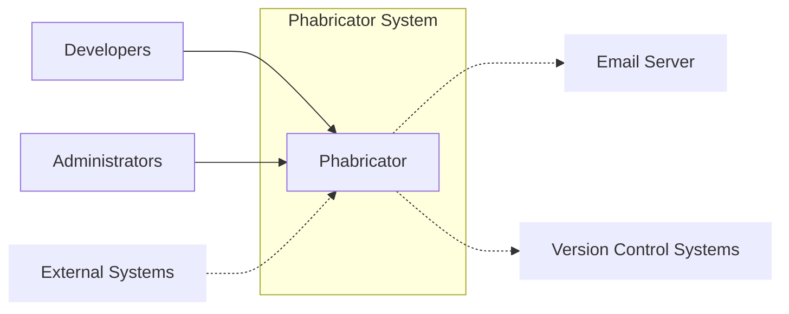
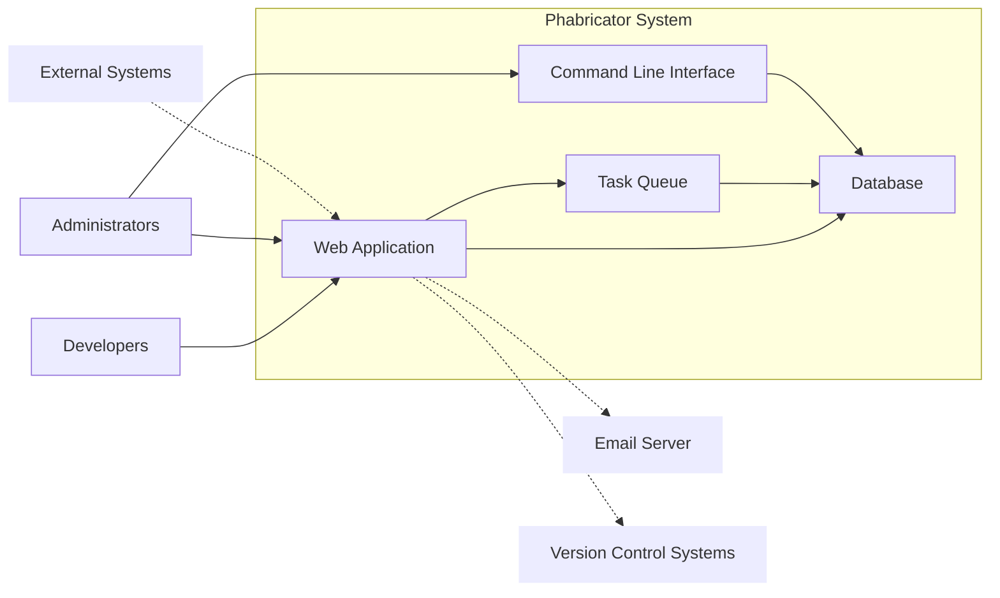
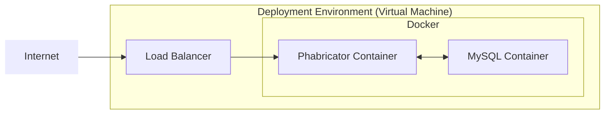

Okay, let's create a design document for Phabricator, based on the provided GitHub repository.

# BUSINESS POSTURE

Phabricator is a suite of web applications for software development collaboration. It includes tools for code review, repository hosting, bug tracking, project management, and more.  It's designed to be a comprehensive, integrated platform for software teams.  Given its nature, the business priorities and goals are centered around:

*   Reliability and Availability:  Phabricator is often a critical tool for development teams. Downtime or data loss can significantly impact productivity.
*   Data Integrity:  The integrity of code, reviews, bug reports, and other data stored within Phabricator is paramount.  Corruption or unauthorized modification can have severe consequences.
*   Confidentiality:  Source code, internal discussions, and potentially sensitive project information are stored within Phabricator.  Protecting this information from unauthorized access is crucial.
*   Scalability:  Phabricator needs to scale to accommodate growing teams and codebases.
*   Extensibility: The ability to integrate with other tools and customize workflows is important for many organizations.
*   Compliance: Depending on the organization using it, Phabricator may need to comply with various regulatory requirements (e.g., data privacy regulations).

Most important business risks that need to be addressed:

*   Data Breach: Unauthorized access to source code or other sensitive data.
*   Data Loss: Loss of critical data due to hardware failure, software bugs, or malicious attacks.
*   Service Disruption:  Downtime or performance degradation that impacts developer productivity.
*   Compromised Credentials:  Unauthorized access to user accounts, potentially leading to further compromise.
*   Supply Chain Attacks: Vulnerabilities introduced through third-party libraries or dependencies.
*   Insider Threats: Malicious or negligent actions by authorized users.

# SECURITY POSTURE

Based on the repository and general knowledge of secure development practices, here's an assessment of Phabricator's security posture:

Existing Security Controls:

*   security control: Authentication: Phabricator supports multiple authentication methods, including username/password, LDAP, and OAuth. (Described in documentation and configuration options).
*   security control: Authorization:  Phabricator has a granular permission system that controls access to various features and data. (Described in documentation and implemented in code).
*   security control: Input Validation:  Phabricator employs input validation techniques to mitigate risks like cross-site scripting (XSS) and SQL injection. (Implemented in code, particularly in form handling and data processing).
*   security control: CSRF Protection: Phabricator includes mechanisms to prevent Cross-Site Request Forgery attacks. (Implemented in code, likely using tokens).
*   security control: Audit Logging:  Phabricator likely logs various actions and events, although the extent and detail may vary. (Mentioned in documentation and partially visible in code).
*   security control: Code Review:  Phabricator itself is subject to code review, which helps identify and address potential security vulnerabilities. (Intrinsic to the platform's purpose).
*   security control: Security Advisories: Phabricator publishes security advisories and updates to address known vulnerabilities. (Visible on their website and release notes).

Accepted Risks:

*   accepted risk: Complexity: Phabricator is a large and complex codebase, making it challenging to ensure complete security coverage.
*   accepted risk: Configuration Dependent:  The security of a Phabricator installation heavily depends on proper configuration by the administrator.
*   accepted risk: Third-Party Dependencies:  Phabricator relies on various third-party libraries and components, which may introduce vulnerabilities.
*   accepted risk: Self-Hosting Risks: As a primarily self-hosted application, the security of the underlying infrastructure is the responsibility of the deploying organization.

Recommended Security Controls:

*   Implement a robust Web Application Firewall (WAF) to protect against common web attacks.
*   Enable and regularly review comprehensive audit logs.
*   Implement a strong Content Security Policy (CSP) to mitigate XSS risks.
*   Regularly conduct penetration testing and vulnerability scanning.
*   Implement a Software Composition Analysis (SCA) tool to identify and manage vulnerabilities in third-party dependencies.
*   Enforce multi-factor authentication (MFA) for all users, especially administrators.

Security Requirements:

*   Authentication:
    *   Support for strong password policies.
    *   Option for multi-factor authentication (MFA).
    *   Integration with existing identity providers (e.g., LDAP, SAML).
    *   Secure session management.
*   Authorization:
    *   Granular role-based access control (RBAC).
    *   Ability to define custom permissions and roles.
    *   Principle of least privilege enforced throughout the application.
*   Input Validation:
    *   Strict validation of all user inputs.
    *   Output encoding to prevent XSS.
    *   Parameterized queries or ORM to prevent SQL injection.
    *   File upload validation (type, size, content).
*   Cryptography:
    *   Use of strong, industry-standard cryptographic algorithms.
    *   Secure storage of sensitive data (e.g., passwords, API keys).
    *   HTTPS enforced for all communication.
    *   Proper key management practices.

# DESIGN

## C4 CONTEXT



Element Descriptions:

*   Element:
    *   Name: Developers
    *   Type: User
    *   Description: Software developers who use Phabricator for code review, bug tracking, and other development tasks.
    *   Responsibilities: Submit code, review code, report bugs, manage tasks.
    *   Security controls: Authentication, Authorization, Audit Logging.

*   Element:
    *   Name: Administrators
    *   Type: User
    *   Description: System administrators who manage the Phabricator installation.
    *   Responsibilities: Configure Phabricator, manage users, maintain the system.
    *   Security controls: Authentication (often with MFA), Authorization, Audit Logging.

*   Element:
    *   Name: Phabricator
    *   Type: System
    *   Description: The core Phabricator application suite.
    *   Responsibilities: Provide a platform for software development collaboration.
    *   Security controls: Authentication, Authorization, Input Validation, CSRF Protection, Audit Logging, Code Review.

*   Element:
    *   Name: External Systems
    *   Type: External System
    *   Description: Other systems that may integrate with Phabricator (e.g., CI/CD tools, monitoring systems).
    *   Responsibilities: Varies depending on the specific system.
    *   Security controls: API Authentication, Secure Communication (HTTPS).

*   Element:
    *   Name: Email Server
    *   Type: External System
    *   Description: An email server used by Phabricator to send notifications.
    *   Responsibilities: Deliver email notifications.
    *   Security controls: Secure Communication (TLS), Sender Authentication (SPF, DKIM, DMARC).

*   Element:
    *   Name: VCS
    *   Type: External System
    *   Description: Version Control System.
    *   Responsibilities: Manage code repositories.
    *   Security controls: Authentication, Authorization.

## C4 CONTAINER



Element Descriptions:

*   Element:
    *   Name: Web Application
    *   Type: Container (Web Application)
    *   Description: The main web interface for Phabricator, built using PHP.
    *   Responsibilities: Handle user requests, render web pages, interact with the database and other components.
    *   Security controls: Authentication, Authorization, Input Validation, CSRF Protection, Session Management.

*   Element:
    *   Name: Database
    *   Type: Container (Database)
    *   Description: Stores Phabricator data, typically MySQL.
    *   Responsibilities: Store and retrieve data.
    *   Security controls: Database Authentication, Access Control, Encryption at Rest (if configured), Audit Logging.

*   Element:
    *   Name: Task Queue
    *   Type: Container (Background Process)
    *   Description: Handles asynchronous tasks, such as sending emails and updating search indexes.
    *   Responsibilities: Execute background tasks.
    *   Security controls: Input Validation, Secure Communication with Database.

*   Element:
    *   Name: Command Line Interface (CLI)
    *   Type: Container (Command Line Tool)
    *   Description: Provides command-line tools for administration and maintenance.
    *   Responsibilities: Perform administrative tasks.
    *   Security controls: Authentication (often via SSH), Authorization.

*   Element:
    *   Name: Developers
    *   Type: User
    *   Description: Software developers who use Phabricator for code review, bug tracking, and other development tasks.
    *   Responsibilities: Submit code, review code, report bugs, manage tasks.
    *   Security controls: Authentication, Authorization, Audit Logging.

*   Element:
    *   Name: Administrators
    *   Type: User
    *   Description: System administrators who manage the Phabricator installation.
    *   Responsibilities: Configure Phabricator, manage users, maintain the system.
    *   Security controls: Authentication (often with MFA), Authorization, Audit Logging.

*   Element:
    *   Name: External Systems
    *   Type: External System
    *   Description: Other systems that may integrate with Phabricator (e.g., CI/CD tools, monitoring systems).
    *   Responsibilities: Varies depending on the specific system.
    *   Security controls: API Authentication, Secure Communication (HTTPS).

*   Element:
    *   Name: Email Server
    *   Type: External System
    *   Description: An email server used by Phabricator to send notifications.
    *   Responsibilities: Deliver email notifications.
    *   Security controls: Secure Communication (TLS), Sender Authentication (SPF, DKIM, DMARC).

*   Element:
    *   Name: VCS
    *   Type: External System
    *   Description: Version Control System.
    *   Responsibilities: Manage code repositories.
    *   Security controls: Authentication, Authorization.

## DEPLOYMENT

Phabricator is typically self-hosted, meaning organizations deploy it on their own infrastructure.  Several deployment options are possible:

1.  **Bare Metal/Virtual Machine:**  Deploying directly onto a physical or virtual server.
2.  **Containers (Docker):**  Packaging Phabricator and its dependencies into Docker containers.
3.  **Cloud-Based VMs:**  Deploying on virtual machines provided by cloud providers (AWS EC2, Google Compute Engine, Azure VMs).
4.  **Kubernetes:** Orchestrating Phabricator deployments using Kubernetes.

We'll describe a deployment using **Docker Compose** on a single virtual machine, as it's a common and relatively straightforward approach.



Element Descriptions:

*   Element:
    *   Name: Internet
    *   Type: Network
    *   Description: The public internet.
    *   Responsibilities: Provide network connectivity.
    *   Security controls: Firewall, Intrusion Detection/Prevention Systems.

*   Element:
    *   Name: Load Balancer
    *   Type: Infrastructure Node
    *   Description: Distributes incoming traffic across multiple Phabricator instances (if scaled out).  In this single-VM scenario, it might still be used for SSL termination.
    *   Responsibilities: Load balancing, SSL termination.
    *   Security controls: SSL/TLS Configuration, Web Application Firewall (WAF).

*   Element:
    *   Name: Deployment Environment (Virtual Machine)
    *   Type: Infrastructure Node
    *   Description: A virtual machine hosting the Docker containers.
    *   Responsibilities: Provide compute resources.
    *   Security controls: Operating System Hardening, Firewall, SSH Access Control.

*   Element:
    *   Name: Docker
    *   Type: Container Runtime
    *   Description: Docker engine running on the virtual machine.
    *   Responsibilities: Run and manage containers.
    *   Security controls: Docker Security Best Practices, Container Isolation.

*   Element:
    *   Name: Phabricator Container
    *   Type: Container
    *   Description: A Docker container running the Phabricator web application and related processes.
    *   Responsibilities: Run the Phabricator application.
    *   Security controls: Application-Level Security Controls (see C4 Container diagram).

*   Element:
    *   Name: MySQL Container
    *   Type: Container
    *   Description: A Docker container running the MySQL database.
    *   Responsibilities: Store Phabricator data.
    *   Security controls: Database-Level Security Controls (see C4 Container diagram).

## BUILD

Phabricator's build process, based on the repository, appears to involve a combination of manual steps and some automation. There isn't a clearly defined CI/CD pipeline in the traditional sense (like Jenkins or GitHub Actions). The `scripts/` directory contains various shell scripts for tasks like building documentation and running tests.

Here's a simplified representation of the build process:

```mermaid
graph LR
    Developer[Developer] --> CodeRepository[Code Repository (Git)]
    CodeRepository --> BuildServer[Build Server]
    BuildServer --> PhabricatorArtifacts[Phabricator Artifacts]
    BuildServer -.-> Linters[Linters]
    BuildServer -.-> TestSuite[Test Suite]

    classDef borderless stroke-width:0px
    class Linters,TestSuite borderless
```

Build Process Description:

1.  **Developer:** Developers write code and commit changes to the Git repository.
2.  **Code Repository:** The Git repository (hosted on GitHub in this case) stores the source code.
3.  **Build Server:** A server (potentially a developer's machine or a dedicated build machine) is used to execute build scripts.
4.  **Linters:** Code linters (like `arc lint`) are used to check for code style and potential errors.
5.  **Test Suite:** Unit tests and other tests are executed to verify code functionality.
6.  **Phabricator Artifacts:** The build process results in a deployable version of Phabricator (essentially the codebase itself, as it's a PHP application).

Security Controls in the Build Process:

*   Code Review:  Phabricator's own code review process is a crucial security control.
*   Linters:  Help enforce coding standards and identify potential issues.
*   Unit Tests:  Help ensure code quality and prevent regressions.
*   Manual Steps: Many build and deployment steps are likely manual, which introduces a risk of human error.

Recommendations:

*   Implement a more robust CI/CD pipeline using tools like Jenkins, GitLab CI, or GitHub Actions.
*   Integrate Static Application Security Testing (SAST) tools into the build process.
*   Automate dependency vulnerability scanning using SCA tools.
*   Implement code signing to ensure the integrity of the released artifacts.

# RISK ASSESSMENT

*   What are critical business processes we are trying to protect?
    *   Software development lifecycle (coding, review, testing, deployment).
    *   Project management and collaboration.
    *   Bug tracking and resolution.
    *   Internal communication and knowledge sharing.

*   What data we are trying to protect and what is their sensitivity?
    *   Source Code: Highly sensitive, intellectual property.
    *   Bug Reports: Potentially sensitive, may contain vulnerability details.
    *   Project Plans and Documentation: Sensitive, may contain confidential business information.
    *   User Data (usernames, emails, etc.): Sensitive, subject to privacy regulations.
    *   Internal Discussions: Potentially sensitive, may contain confidential business information.
    *   Configuration Data: Highly sensitive, may contain credentials and other secrets.

# QUESTIONS & ASSUMPTIONS

*   Questions:
    *   What is the specific threat model used by the Phabricator development team?
    *   What are the detailed procedures for handling security incidents?
    *   What are the specific configuration recommendations for hardening a Phabricator installation?
    *   Are there any plans to implement a more formalized CI/CD pipeline?
    *   What is the frequency and scope of penetration testing and vulnerability scanning?

*   Assumptions:
    *   BUSINESS POSTURE: Organizations using Phabricator prioritize the confidentiality, integrity, and availability of their software development processes and data.
    *   SECURITY POSTURE: Phabricator's security relies on a combination of built-in features, secure coding practices, and proper configuration by administrators.
    *   DESIGN: The deployment model described (Docker Compose on a single VM) is a common and representative setup, but other deployment options are possible. The build process is partially automated, but relies heavily on manual steps.