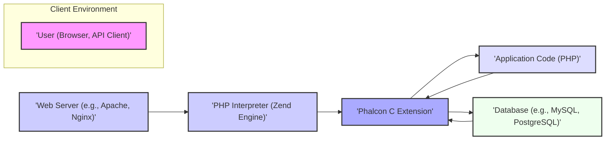

# Project Design Document: Phalcon C Extension (cphalcon)

**Version:** 1.1
**Date:** October 26, 2023
**Author:** AI Software Architect

## 1. Introduction

This document provides an enhanced and more detailed design overview of the Phalcon C extension (cphalcon), a high-performance PHP framework implemented as a C extension. This document is intended to serve as a robust foundation for subsequent threat modeling activities by clearly outlining the system's architecture, components, and data flow with greater precision. The target repository for this project is: [https://github.com/phalcon/cphalcon](https://github.com/phalcon/cphalcon).

## 2. Goals and Objectives

*   Provide a comprehensive and refined architectural overview of the cphalcon extension, elaborating on key interactions.
*   Identify and describe key components and their interactions in greater detail.
*   Describe the flow of data within the system, including specific data transformations and validation points.
*   Highlight specific areas of potential security concern with concrete examples for future threat modeling.
*   Serve as a detailed and reliable reference point for developers, security analysts, and stakeholders.

## 3. System Architecture

The Phalcon framework, being a C extension, operates within the PHP runtime environment (Zend Engine) at a lower level than typical PHP code. It intercepts and handles critical stages of request processing before they reach standard PHP application code, providing significant performance benefits for core framework functionalities.

**Key Architectural Layers with Expanded Descriptions:**

*   **Client Environment:** Represents the external entity initiating a request. This could be a web browser used by an end-user or an automated system making API calls. The client initiates the interaction with the application.
*   **Web Server Layer:**  Acts as the entry point for all external requests. It receives HTTP requests and, based on its configuration (often involving PHP-FPM or mod_php), directs them to the PHP interpreter. The web server also handles static content and SSL/TLS termination.
*   **PHP Interpreter (Zend Engine):** The core execution environment for PHP code. It compiles PHP scripts into bytecode and executes them. When Phalcon is enabled, the Zend Engine interacts directly with the compiled C code of the extension.
*   **Phalcon C Extension:** This is the heart of the Phalcon framework. Being implemented in C, it provides high performance and low overhead. It intercepts requests early in the PHP lifecycle and handles core functionalities like routing, dependency injection, and ORM.
*   **Application Code Layer:** This layer contains the PHP code written by the developers to implement the specific logic and features of the application. It leverages the functionalities provided by the Phalcon C extension.
*   **Data Storage Layer:**  Typically a relational database management system (RDBMS) like MySQL or PostgreSQL, but could also include NoSQL databases or other data storage mechanisms. This layer persists the application's data.

## 4. Data Flow

A typical HTTP request flow within a Phalcon application involves the following detailed steps:

1. **Client Request Initiation:** A user interacts with the application through a web browser or an API client, initiating an HTTP request (e.g., GET, POST).
2. **Web Server Reception and Processing:** The web server receives the request, examines the headers and URI, and determines that it needs to be handled by the PHP interpreter (based on file extension or server configuration).
3. **PHP Interpreter Initialization and Extension Loading:** The PHP interpreter is invoked. It initializes its environment and loads configured extensions, including the Phalcon C extension.
4. **Phalcon Request Interception:** Phalcon intercepts the request very early in the PHP lifecycle. The `Phalcon\Mvc\Application` (for web applications) or `Phalcon\Cli\Console` (for command-line applications) takes control.
5. **Routing Process:** Phalcon's router component analyzes the request URI against defined routes to determine the appropriate controller and action to handle the request. This involves pattern matching and parameter extraction.
6. **Dependency Injection and Service Resolution:** Phalcon's dependency injection container (`Phalcon\Di`) resolves and provides instances of required services and components (e.g., database connections, session handlers) to the controller and other parts of the application.
7. **Controller Action Execution:** The determined controller's action method is executed. This is where the core application logic resides.
8. **Model Interaction and Data Access:** Within the controller action, models (`Phalcon\Mvc\Model`) interact with the data storage layer (database) using Phalcon's ORM to retrieve, create, update, or delete data. This involves constructing and executing database queries.
9. **View Preparation and Data Passing:** The controller prepares data to be displayed to the user and passes it to the view component (`Phalcon\Mvc\View`).
10. **View Rendering with Template Engine:** The view component uses a template engine (often Volt in Phalcon) to render the final output. The template engine merges the provided data with the template markup to generate HTML or other response formats.
11. **Response Object Construction:** Phalcon constructs the HTTP response object, including setting headers (e.g., content type, caching directives) and the rendered content.
12. **Response Delivery to Web Server:** The PHP interpreter sends the generated HTTP response back to the web server.
13. **Web Server Response to Client:** The web server forwards the response back to the client (browser or API client).
14. **Client Rendering/Processing:** The client receives the response and renders the HTML in the browser or processes the API response data.

## 5. Key Components

The Phalcon C extension is composed of several tightly integrated components, each providing a specific set of functionalities:

*   **`Phalcon\Acl` (Access Control List):**
    *   Provides a flexible system for defining and managing access permissions to application resources. It allows for defining roles, resources, and access rules (allow/deny) based on these roles.
*   **`Phalcon\Annotations`:**
    *   Enables the reading and parsing of annotations (metadata) embedded within PHP code. This facilitates metadata-driven programming, often used for configuration or ORM mapping.
*   **`Phalcon\Assets`:**
    *   Manages and optimizes application assets like CSS, JavaScript, and images. It provides features for minification, concatenation, and versioning of assets.
*   **`Phalcon\Cache`:**
    *   Offers various caching mechanisms (e.g., file-based, Memcached, Redis) to store frequently accessed data, improving application performance by reducing database load.
*   **`Phalcon\Config`:**
    *   Handles application configuration, supporting multiple formats (e.g., INI, JSON, YAML, PHP arrays). It provides a structured way to manage application settings.
*   **`Phalcon\Crypt`:**
    *   Provides cryptographic functionalities for encrypting and decrypting data. It supports various encryption algorithms and modes.
*   **`Phalcon\Db`:**
    *   Offers an abstraction layer for interacting with different database systems. It provides a consistent API for database operations, regardless of the underlying database engine.
*   **`Phalcon\Di` (Dependency Injection):**
    *   A powerful dependency injection container that manages the dependencies between different parts of the application. It promotes loose coupling and testability.
*   **`Phalcon\Events\Manager`:**
    *   Implements an event management system, allowing developers to hook into various stages of the application lifecycle and execute custom logic.
*   **`Phalcon\Filter`:**
    *   Provides data filtering and sanitization capabilities to clean user input and prevent security vulnerabilities like XSS.
*   **`Phalcon\Flash`:**
    *   Facilitates displaying one-time informational messages (e.g., success or error messages) to users after a redirect.
*   **`Phalcon\Forms`:**
    *   Simplifies the creation, rendering, and validation of HTML forms. It helps in structuring form elements and applying validation rules.
*   **`Phalcon\Http`:**
    *   Provides objects representing HTTP requests and responses, allowing for easy access to headers, body, and other request/response attributes.
*   **`Phalcon\Loader`:**
    *   Responsible for autoloading classes within the application, ensuring that classes are loaded only when they are needed.
*   **`Phalcon\Mvc` (Model-View-Controller):**
    *   Provides the core MVC architectural pattern for structuring web applications.
        *   **`Phalcon\Mvc\Application`:** The central class for handling web requests and managing the application lifecycle.
        *   **`Phalcon\Mvc\Controller`:** Base class for application controllers, responsible for handling user requests and interacting with models and views.
        *   **`Phalcon\Mvc\Model`:** Base class for data models, providing ORM functionality for interacting with databases.
        *   **`Phalcon\Mvc\View`:** Handles the rendering of views and manages template files.
        *   **`Phalcon\Mvc\Router`:**  Routes incoming HTTP requests to the appropriate controllers and actions based on defined routes.
*   **`Phalcon\Paginator`:**
    *   Assists in implementing pagination for displaying large datasets in a user-friendly manner.
*   **`Phalcon\Security`:**
    *   Offers security-related functionalities, including CSRF protection, password hashing (using secure algorithms), and random token generation.
*   **`Phalcon\Session`:**
    *   Manages user sessions, providing mechanisms for storing and retrieving user-specific data across multiple requests.
*   **`Phalcon\Text`:**
    *   Provides utility functions for working with text strings, such as formatting, encoding, and manipulation.
*   **`Phalcon\Validation`:**
    *   Offers a robust system for validating data against predefined rules, ensuring data integrity and preventing invalid data from being processed.
*   **`Phalcon\Volt`:**
    *   A high-performance template engine specifically designed for Phalcon, offering features like template inheritance, caching, and security enhancements.

## 6. Security Considerations (For Threat Modeling)

Several areas within the Phalcon architecture present potential security considerations that require thorough examination during threat modeling:

*   **Input Validation Vulnerabilities:** Inadequate validation of user inputs can lead to various injection attacks. For example:
    *   **SQL Injection:** If user input is directly incorporated into database queries without proper sanitization or parameterized queries, attackers can inject malicious SQL code.
    *   **Cross-Site Scripting (XSS):** If user-provided data is not properly escaped before being displayed in the browser, attackers can inject malicious scripts that execute in other users' browsers.
    *   **Command Injection:** If user input is used to construct system commands without proper sanitization, attackers can execute arbitrary commands on the server.
    *   **LDAP Injection:** Similar to SQL injection, but targeting LDAP directories.
    *   The `Phalcon\Filter` and `Phalcon\Validation` components are crucial for mitigating these risks.
*   **Output Encoding Issues:** Failure to properly encode output data before rendering it in views can lead to XSS vulnerabilities. The view rendering process and the Volt template engine's escaping mechanisms are critical here.
*   **Authentication and Authorization Weaknesses:**
    *   **Broken Authentication:** Weak password policies, insecure session management, or lack of multi-factor authentication can compromise user accounts.
    *   **Broken Authorization:** Improperly implemented access controls can allow users to access resources they are not authorized to view or modify. The `Phalcon\Acl` and `Phalcon\Security` components are relevant.
*   **Session Management Security:**
    *   **Session Fixation:** Attackers can trick users into using a session ID they control.
    *   **Session Hijacking:** Attackers can steal session IDs to impersonate legitimate users. Secure session configuration (e.g., HTTPOnly and Secure flags) and regeneration are important. The `Phalcon\Session` component plays a key role.
*   **Cryptographic Flaws:**
    *   **Use of Weak Algorithms:** Employing outdated or insecure cryptographic algorithms.
    *   **Improper Key Management:** Storing encryption keys insecurely.
    *   **Insufficient Entropy:** Using weak random number generators for cryptographic operations. The `Phalcon\Crypt` component needs to be used correctly.
*   **Database Security:**
    *   **SQL Injection (as mentioned above).**
    *   **Exposure of Sensitive Data:**  Storing sensitive data in plain text in the database. The `Phalcon\Db` and `Phalcon\Mvc\Model` components should be used with security best practices.
*   **Error Handling and Logging Practices:**
    *   **Information Disclosure:** Exposing sensitive information (e.g., database credentials, internal paths) in error messages.
    *   **Insufficient Logging:**  Not logging security-related events, making it difficult to detect and respond to attacks.
*   **Dependency Vulnerabilities:** Using outdated or vulnerable versions of third-party libraries that Phalcon or the application depends on. Regular dependency updates are crucial.
*   **Memory Management Issues (C Extension Specific):** As a C extension, vulnerabilities like buffer overflows, use-after-free, and other memory corruption issues in Phalcon's C code can lead to critical security flaws. This requires careful scrutiny of the C codebase.
*   **Insecure Deserialization:** If object serialization is used (e.g., for caching or session storage), vulnerabilities can arise if untrusted data is deserialized, potentially leading to remote code execution.
*   **File Handling Vulnerabilities:**
    *   **Path Traversal:** Allowing users to access files or directories outside of the intended scope.
    *   **Unrestricted File Uploads:** Allowing users to upload malicious files that can be executed on the server.

## 7. Deployment

Phalcon applications are typically deployed on web servers with the PHP interpreter and the Phalcon C extension installed and enabled. Specific deployment configurations can significantly impact security:

*   **Traditional Server Deployment (e.g., LAMP/LEMP stack):** Deploying on physical or virtual servers requires careful configuration of the web server (Apache or Nginx), PHP-FPM, and the operating system to ensure security. Firewall rules, access controls, and regular security updates are essential.
*   **Containerized Deployment (e.g., Docker):** Containerization provides isolation and simplifies deployment. However, security considerations include securing the container images, managing container orchestration platforms (like Kubernetes), and ensuring proper resource limits.
*   **Cloud Platforms (e.g., AWS, Azure, GCP):** Cloud platforms offer various deployment options (e.g., PaaS, IaaS). Security in the cloud involves leveraging the platform's security features, configuring network security groups, managing IAM roles, and ensuring data encryption at rest and in transit. Specific services like AWS Elastic Beanstalk, Azure App Service, or Google App Engine handle some infrastructure aspects but still require careful configuration.

The choice of deployment environment and its configuration directly affects the application's attack surface and the necessary security measures.

## 8. Future Considerations

*   **Evolution of PHP and Zend Engine:**  Staying up-to-date with changes in the underlying PHP runtime environment and the Zend Engine is crucial for maintaining compatibility and addressing potential security vulnerabilities. This may necessitate updates and adjustments to the Phalcon C extension.
*   **Introduction of New Features and Components:**  As Phalcon evolves, new components and functionalities may be added. Each new addition needs to be carefully analyzed for potential security implications and designed with security in mind.
*   **Security Audits and Community Contributions:** Regular security audits of the Phalcon C extension codebase are essential to identify and address potential vulnerabilities. The security of community-contributed code and extensions should also be continuously assessed and vetted.
*   **Adoption of New Security Best Practices:**  Keeping abreast of emerging security threats and adopting new security best practices in the framework's development is vital for maintaining a secure framework.

This enhanced design document provides a more detailed and comprehensive understanding of the Phalcon C extension's architecture, components, and data flow. It aims to serve as a more robust and informative foundation for subsequent threat modeling activities, enabling a deeper and more effective analysis of potential security vulnerabilities.
