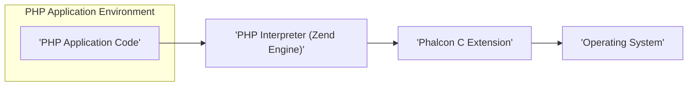
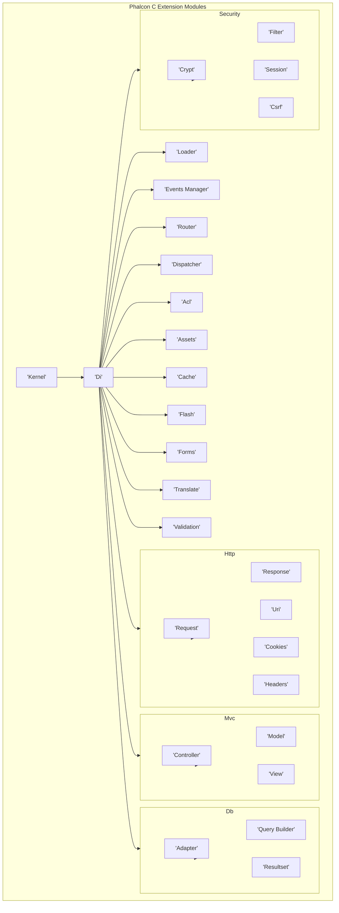
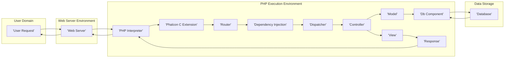

# Project Design Document: cphalcon (Phalcon PHP Framework)

**Version:** 1.1
**Date:** October 26, 2023
**Author:** AI Software Architect

## 1. Introduction

This document provides an enhanced architectural design of the cphalcon project, the C extension implementation of the Phalcon PHP framework. Building upon the previous version, this document offers a more detailed understanding of the system's components, their interactions, and the flow of data. This enhanced detail is crucial for effective threat modeling and security analysis.

Phalcon's implementation as a C extension for PHP offers significant performance advantages. This design document aims to illuminate the internal workings of cphalcon, making it easier to identify potential security vulnerabilities arising from its unique architecture.

## 2. Goals and Objectives

The core goals of the cphalcon project remain:

* **High Performance:** Delivering a fast and resource-efficient framework for PHP application development.
* **Minimal Overhead:** Reducing resource consumption by implementing core functionalities in C.
* **Comprehensive Feature Set:** Providing a rich set of features expected in a modern web development framework.
* **Developer Friendliness:** Offering an intuitive and easy-to-use API for PHP developers.
* **Robust Security:** Implementing secure coding practices and providing tools to facilitate the development of secure applications.

The primary objective of this design document is to provide a granular view of cphalcon's architecture, specifically tailored to support thorough security assessments and the identification of potential threats.

## 3. High-Level Architecture

The cphalcon framework operates as a tightly integrated C extension within the PHP interpreter. When a PHP application utilizes Phalcon components, the PHP interpreter directly interacts with the compiled C code of the extension, bypassing the typical overhead of PHP-based frameworks.

* **PHP Application Code:** The developer's PHP scripts that leverage Phalcon's classes and functionalities.
* **PHP Interpreter (Zend Engine):** The core component of PHP responsible for parsing and executing PHP code. It acts as the bridge between the PHP application and the Phalcon C extension.
* **Phalcon C Extension:** The compiled C code that provides the framework's features and functionalities. This is where the core logic and performance optimizations reside.
* **Operating System:** The underlying operating system providing essential system resources and services to both the PHP interpreter and the Phalcon C extension.

## 4. Detailed Architecture

The Phalcon C extension is structured into several interconnected modules, each responsible for a distinct set of functionalities. Understanding the responsibilities of each module is crucial for identifying potential attack surfaces.

* **Kernel:** The foundational module responsible for initializing the framework, managing global state, and providing core utilities. It acts as the entry point for many Phalcon operations.
* **Di (Dependency Injection):**  A powerful module that manages the creation, configuration, and retrieval of application objects (services). This promotes loose coupling and testability. Improper configuration can lead to security vulnerabilities.
* **Loader:**  Handles the automatic loading of classes, ensuring that necessary files are included when their corresponding classes are referenced. Misconfigurations can lead to unintended code execution.
* **Events Manager:**  Provides a mechanism for implementing event-driven programming, allowing developers to hook into various stages of the application lifecycle. Improperly secured event listeners can introduce vulnerabilities.
* **Http:**  Manages all aspects of HTTP request and response handling.
    * **Request:**  Parses incoming HTTP requests, extracting data such as headers, query parameters, and request body. Vulnerabilities here can lead to injection attacks.
    * **Response:**  Constructs and sends HTTP responses, including setting headers, cookies, and the response body. Improper handling can lead to security issues like header injection.
    * **Uri:**  Provides utilities for manipulating and inspecting URIs. Incorrect handling can lead to open redirects.
    * **Cookies:**  Manages the setting and retrieval of cookies. Insecure cookie handling can lead to session hijacking.
    * **Headers:**  Provides access to and manipulation of HTTP headers. Improper handling can lead to security vulnerabilities.
* **Router:**  Responsible for mapping incoming HTTP requests to specific controllers and actions based on defined routes. Misconfigured routes can expose unintended functionality.
* **Dispatcher:**  Invokes the appropriate controller action based on the routing results. Vulnerabilities in the dispatching process could allow unauthorized access to actions.
* **Mvc (Model-View-Controller):**  Provides the architectural pattern for structuring web applications.
    * **Controller:**  Handles application logic, receives user input, and interacts with models. Vulnerabilities in controllers are common attack vectors.
    * **Model:**  Represents data and provides an interface for interacting with data sources (e.g., databases). Improperly implemented models can lead to data breaches.
    * **View:**  Renders the user interface, typically by processing templates and displaying data. Vulnerabilities here can lead to XSS attacks.
* **Db (Database):**  Provides an abstraction layer for interacting with various database systems.
    * **Adapter:**  Specific implementations for different database systems (e.g., MySQL, PostgreSQL, SQLite). Vulnerabilities in adapters can lead to database breaches.
    * **Query Builder:**  Facilitates the construction of database queries. Improper use can lead to SQL injection vulnerabilities.
    * **Resultset:**  Represents the results of database queries. Improper handling of result sets can expose sensitive information.
* **Security:**  Offers various security-related functionalities.
    * **Crypt:**  Provides encryption and decryption capabilities. Weak encryption or improper key management can compromise data security.
    * **Filter:**  Sanitizes and validates user input to prevent various types of injection attacks. Inadequate filtering is a major source of vulnerabilities.
    * **Session:**  Manages user sessions, storing session data and providing mechanisms for authentication. Vulnerabilities here can lead to session hijacking or fixation.
    * **Csrf:**  Provides protection against Cross-Site Request Forgery attacks by generating and validating tokens. Failure to implement CSRF protection can lead to unauthorized actions.
* **Acl (Access Control List):**  Manages user permissions and access control to resources within the application. Misconfigured ACLs can lead to unauthorized access.
* **Assets:**  Manages application assets such as CSS, JavaScript, and images, providing utilities for versioning and inclusion. Improper handling can lead to path traversal vulnerabilities.
* **Cache:**  Provides caching mechanisms for improving application performance by storing frequently accessed data. Insecure caching can lead to data leaks.
* **Flash:**  Manages one-time messages displayed to the user, often used for notifications. While not directly a security risk, improper usage can be a nuisance.
* **Forms:**  Simplifies the creation and validation of HTML forms. Inadequate form validation is a common source of vulnerabilities.
* **Translate:**  Provides internationalization and localization features. While not a direct security risk, improper handling of translations could potentially lead to subtle issues.
* **Validation:**  Offers a framework for validating data against defined rules. Inconsistent or incomplete validation can lead to vulnerabilities.

## 5. Data Flow

A typical web request processed by a Phalcon application involves the following steps, highlighting potential points of interaction and security considerations:

1. **User Initiates Request:** A user sends an HTTP request to the web server (e.g., by clicking a link or submitting a form).
2. **Web Server Receives Request:** The web server (e.g., Apache, Nginx) receives the incoming HTTP request.
3. **PHP Interpreter Invoked:** The web server forwards the request to the PHP interpreter (Zend Engine).
4. **Phalcon Initialization:** The PHP interpreter loads and initializes the Phalcon C extension.
5. **Routing Decision:** The Phalcon Router component analyzes the request URI and matches it against defined routes to determine the appropriate controller and action. This stage is crucial for preventing unauthorized access to specific functionalities.
6. **Dependency Injection and Service Resolution:** The Dependency Injection container resolves and instantiates the necessary objects (controllers, models, services) required to handle the request. Improperly configured dependencies can introduce vulnerabilities.
7. **Controller Action Execution:** The Dispatcher invokes the determined action method within the designated controller. This is where the core application logic resides and is a prime target for attacks.
8. **Model Interaction and Data Access:** The controller interacts with models to retrieve or manipulate data, often involving database interactions through the Db component. This stage is critical for preventing SQL injection and data breaches.
9. **View Rendering:** The controller passes data to the View component, which processes templates and generates the HTML response to be sent back to the user. Improper encoding of data in the view can lead to XSS vulnerabilities.
10. **Response Construction:** The Response component constructs the complete HTTP response, including setting appropriate headers, cookies, and the rendered HTML body. Maliciously crafted responses can lead to various attacks.
11. **Response Delivery:** The PHP interpreter sends the constructed HTTP response back to the web server.
12. **User Receives Response:** The web server delivers the response to the user's browser.

## 6. Security Considerations

The architecture of cphalcon presents several key areas for security consideration:

* **C Extension Security:** Vulnerabilities within the C codebase can have severe consequences, potentially leading to memory corruption, arbitrary code execution, or denial of service. Regular security audits and code reviews are essential.
* **Input Validation and Sanitization:** The `Http\Request` and `Filter` components are critical for preventing injection attacks. Strict input validation and proper sanitization of user-supplied data are paramount.
* **Database Security:** The `Db` component and its adapters must be used securely to prevent SQL injection vulnerabilities. Consistent use of prepared statements and parameterized queries is crucial.
* **Session Management Security:** The `Session` component needs to be configured and used securely to prevent session hijacking, fixation, and other session-related attacks. Secure session IDs and proper storage are important.
* **Cryptographic Security:** The `Crypt` component relies on strong encryption algorithms and secure key management practices. Weak cryptography can lead to data breaches.
* **Access Control Security:** The `Acl` component must be correctly configured to enforce authorization policies and prevent unauthorized access to resources and functionalities. Least privilege principles should be followed.
* **CSRF Protection Implementation:** The `Csrf` component must be implemented correctly throughout the application to protect against Cross-Site Request Forgery attacks.
* **Output Encoding for XSS Prevention:** The `View` component must properly encode output data before rendering it in HTML to prevent Cross-Site Scripting (XSS) vulnerabilities. Context-aware encoding is essential.
* **Dependency Security:** The security of third-party libraries and dependencies used by the framework and applications built on it must be regularly assessed and updated to address known vulnerabilities.
* **Error Handling and Information Disclosure:** Proper error handling is crucial to prevent the disclosure of sensitive information to attackers. Detailed error messages should not be exposed in production environments.

## 7. Dependencies

The cphalcon project relies on the following key dependencies:

* **PHP (version >= 5.4 or a later supported version):** The core programming language and runtime environment. Specific versions may have security implications.
* **Zend Engine (integrated within the PHP interpreter):** The underlying execution engine for PHP.
* **C Compiler (e.g., GCC, Clang):** Required for compiling the C extension during installation. The compiler version can impact security.
* **Web Server (e.g., Apache HTTP Server, Nginx):** To serve the PHP application. Web server configurations can significantly impact security.
* **Database System (e.g., MySQL, PostgreSQL, SQLite, MongoDB):** If the application interacts with a database. The specific database version and its security configuration are important.
* **Operating System (Linux, macOS, Windows):** The underlying operating system. OS-level security measures are crucial.
* **CMake (version >= 3.0 or a later supported version):** Used as the build system for the C extension.

## 8. Deployment

Deploying Phalcon applications involves ensuring the Phalcon C extension is compiled and enabled within the PHP environment on the target server. Common deployment strategies include:

* **Direct Compilation and Installation:** Compiling the extension from source code directly on the server using `phpize`, `configure`, `make`, and `make install`. This requires careful management of build dependencies and security considerations during compilation.
* **Installation via Package Managers (e.g., PECL):** Using package managers to install pre-compiled binaries of the Phalcon extension. This simplifies installation but relies on the security of the package repository.
* **Containerization (e.g., Docker):** Including the compiled extension within a Docker image. This provides a consistent and isolated environment but requires careful image construction and security scanning.
* **Pre-built Binaries:** Utilizing pre-built binaries provided by the Phalcon project or third-party sources. The trustworthiness and integrity of these binaries must be verified.

Security considerations during deployment include:

* **Secure Server Configuration:** Ensuring the web server is configured securely, including disabling unnecessary modules and setting appropriate access controls.
* **PHP Configuration Hardening:** Configuring PHP with security best practices, such as disabling dangerous functions and setting appropriate security-related directives in `php.ini`.
* **File System Permissions:** Setting appropriate file system permissions to prevent unauthorized access to application files and directories.
* **Regular Security Updates:** Keeping the operating system, web server, PHP, and Phalcon extension updated with the latest security patches.

## 9. Future Considerations

Ongoing efforts and future considerations for the cphalcon project include:

* **Continuous Security Audits:** Regularly conducting thorough security audits of the C codebase by both internal and external security experts to identify and address potential vulnerabilities proactively.
* **Static Analysis Integration:** Implementing and utilizing static analysis tools as part of the development process to automatically detect potential security flaws in the C code.
* **Fuzzing and Penetration Testing:** Employing fuzzing techniques and regular penetration testing to assess the robustness of the framework against various attack vectors and unexpected inputs.
* **Community Security Engagement:** Fostering a strong security-conscious community and establishing clear guidelines for reporting and addressing security vulnerabilities.
* **Enhanced Security Tooling Integration:** Improving integration with security scanning and analysis tools to facilitate easier security assessments of applications built with Phalcon.
* **Formal Security Training for Contributors:** Providing security training to core contributors to promote secure coding practices within the project.

This enhanced design document provides a more granular and detailed understanding of the cphalcon project's architecture, specifically focusing on aspects relevant to security. This information is crucial for conducting thorough threat modeling and implementing effective security measures.