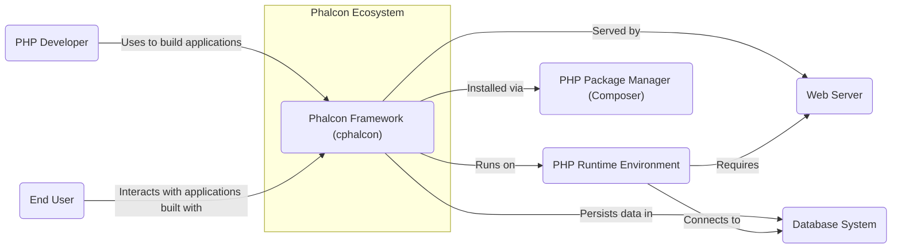
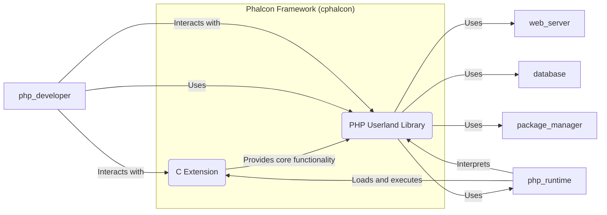

# BUSINESS POSTURE

This project, cphalcon, represents the core C extension for the Phalcon PHP framework. Phalcon is designed to be a high-performance web framework for PHP, offering features like routing, templating, ORM, and security components. The primary business goal of Phalcon is to provide PHP developers with a fast, secure, and feature-rich framework to build web applications efficiently.

Business Priorities and Goals:
- High Performance: Deliver exceptional speed and low resource consumption for PHP applications.
- Feature Richness: Offer a comprehensive set of components and tools for web development.
- Security: Ensure the framework is secure and provides tools for developers to build secure applications.
- Developer Experience: Provide a user-friendly and efficient development experience.
- Community Growth: Foster a strong and active community of users and contributors.

Most Important Business Risks:
- Security Vulnerabilities: Critical vulnerabilities in the framework could lead to widespread security breaches in applications built with Phalcon, damaging reputation and user trust.
- Performance Degradation: If performance is not maintained or degrades, developers may choose alternative frameworks.
- Lack of Adoption: If the framework fails to attract a sufficient user base, it may become unsustainable.
- Compatibility Issues: Incompatibilities with new PHP versions or other technologies could limit adoption and require significant rework.

# SECURITY POSTURE

Existing Security Controls:
- security control: Open Source Code - The source code is publicly available on GitHub, allowing for community review and identification of potential vulnerabilities. Implemented in: GitHub repository.
- security control: Community Security Reporting -  Users and developers can report security issues through GitHub issues or dedicated channels. Implemented in: GitHub repository, community forums.
- security control: Standard Development Practices -  Likely using standard software development practices, although specifics are not detailed in the input. Implemented in: Development process (assumed).

Accepted Risks:
- accepted risk: Reliance on Community for Security Audits - Security audits are largely dependent on community contributions and may not be as frequent or comprehensive as dedicated professional audits.
- accepted risk: Open Source Vulnerability Disclosure - Public disclosure of vulnerabilities before patches are widely adopted could be exploited.

Recommended Security Controls:
- recommended security control: Automated Static Application Security Testing (SAST) - Integrate SAST tools into the CI/CD pipeline to automatically detect potential security vulnerabilities in the code during development.
- recommended security control: Automated Dependency Scanning - Implement dependency scanning to identify and manage vulnerabilities in third-party libraries used by the framework.
- recommended security control: Regular Security Audits - Conduct periodic security audits by external security experts to identify and address potential weaknesses.
- recommended security control: Security Champions - Designate security champions within the development team to promote security awareness and best practices.
- recommended security control: Bug Bounty Program - Establish a bug bounty program to incentivize external security researchers to find and report vulnerabilities.

Security Requirements:
- Authentication:
    - security requirement: The framework should provide secure and flexible authentication components for applications built with Phalcon.
    - security requirement: Support for various authentication methods (e.g., session-based, token-based, OAuth).
    - security requirement: Protection against common authentication attacks (e.g., brute-force, credential stuffing).
- Authorization:
    - security requirement: The framework should provide robust authorization mechanisms to control access to resources and functionalities within applications.
    - security requirement: Role-Based Access Control (RBAC) and Attribute-Based Access Control (ABAC) support.
    - security requirement: Fine-grained permission management capabilities.
- Input Validation:
    - security requirement: The framework must encourage and facilitate secure input validation to prevent injection attacks (e.g., SQL injection, XSS).
    - security requirement: Provide built-in input validation components and guidelines for developers.
    - security requirement: Default-safe input handling practices.
- Cryptography:
    - security requirement: The framework should provide secure cryptographic functions and libraries for developers to use when implementing security features.
    - security requirement: Support for secure hashing algorithms, encryption methods, and random number generation.
    - security requirement: Guidance on proper cryptographic key management and secure storage.

# DESIGN

## C4 CONTEXT



Context Diagram Elements:

- Element:
    - Name: PHP Developer
    - Type: User
    - Description: Software developers who use the Phalcon framework to build web applications.
    - Responsibilities: Develop, test, and deploy web applications using Phalcon.
    - Security controls: Secure development practices, code review, vulnerability testing of applications they build.

- Element:
    - Name: End User
    - Type: User
    - Description: Individuals who interact with web applications built using the Phalcon framework.
    - Responsibilities: Use web applications to access information or services.
    - Security controls: Strong passwords, awareness of phishing and social engineering attacks, secure browsing habits.

- Element:
    - Name: Phalcon Framework (cphalcon)
    - Type: Software System
    - Description: A high-performance PHP web framework implemented as a C extension. It provides core functionalities for building web applications.
    - Responsibilities: Provide a robust, fast, and secure foundation for PHP web applications, handle routing, request processing, security features, database interaction, and more.
    - Security controls: Input validation, output encoding, secure session management, cryptographic utilities, protection against common web vulnerabilities (e.g., XSS, CSRF, SQL Injection - through ORM and security components).

- Element:
    - Name: PHP Runtime Environment
    - Type: Software System
    - Description: The PHP interpreter and associated libraries required to execute PHP code, including Phalcon C extension.
    - Responsibilities: Execute PHP code, manage resources, provide core functionalities for PHP applications.
    - Security controls: Security updates and patching of PHP runtime, secure configuration, resource limits.

- Element:
    - Name: Web Server
    - Type: Software System
    - Description: Web servers like Nginx or Apache that handle HTTP requests and serve web applications.
    - Responsibilities: Serve web content, handle HTTP requests and responses, manage connections, provide security features like TLS/SSL.
    - Security controls: Web server hardening, TLS/SSL configuration, access controls, web application firewall (WAF).

- Element:
    - Name: Database System
    - Type: Software System
    - Description: Database systems like MySQL, PostgreSQL, or others used to store and retrieve application data.
    - Responsibilities: Persist application data, provide data access and management, ensure data integrity and availability.
    - Security controls: Database access controls, encryption at rest and in transit, regular backups, vulnerability patching, secure database configuration.

- Element:
    - Name: PHP Package Manager (Composer)
    - Type: Software System
    - Description: A dependency management tool for PHP, used to install and manage Phalcon framework and other PHP libraries.
    - Responsibilities: Manage project dependencies, install and update packages, facilitate code reuse.
    - Security controls: Secure package sources, dependency vulnerability scanning, integrity checks of downloaded packages.

## C4 CONTAINER



Container Diagram Elements:

- Element:
    - Name: C Extension
    - Type: Container
    - Description: The core of Phalcon, implemented in C for performance. It provides the fundamental functionalities of the framework, such as request handling, routing, and core components.
    - Responsibilities: High-performance request processing, core framework functionalities, interaction with PHP runtime at a low level.
    - Security controls: Memory safety in C code, input validation at the extension level, protection against buffer overflows and other C-specific vulnerabilities, secure compilation flags.

- Element:
    - Name: PHP Userland Library
    - Type: Container
    - Description: PHP code that provides a higher-level API and utilities for developers to interact with the C extension. This includes components like ORM, templating engine, security components, and more developer-friendly interfaces.
    - Responsibilities: Provide a user-friendly API for developers, implement higher-level framework features, integrate with the C extension, offer developer tools and utilities.
    - Security controls: Input validation in PHP code, output encoding, secure coding practices, leveraging security features provided by the C extension, secure session management, protection against PHP-specific vulnerabilities.

## DEPLOYMENT

Deployment Architecture: Cloud Environment (Example: AWS)

```mermaid
flowchart LR
    subgraph "AWS Cloud"
        subgraph "Availability Zone 1"
            web_server_instance_az1("Web Server Instance")
            app_server_instance_az1("Application Server Instance")
        end
        subgraph "Availability Zone 2"
            web_server_instance_az2("Web Server Instance")
            app_server_instance_az2("Application Server Instance")
        end
        database_cluster("Database Cluster (RDS)")
        load_balancer("Load Balancer (ELB)")
    end

    user_end_user -- "HTTPS Requests" --> load_balancer
    load_balancer -- "Forwards Requests" --> web_server_instance_az1 & web_server_instance_az2
    web_server_instance_az1 & web_server_instance_az2 -- "Forwards PHP Requests" --> app_server_instance_az1 & app_server_instance_az2
    app_server_instance_az1 & app_server_instance_az2 -- "Database Queries" --> database_cluster

    app_server_instance_az1 & app_server_instance_az2 -- "Runs Phalcon Application"
    web_server_instance_az1 & web_server_instance_az2 -- "Runs Web Server (Nginx/Apache)"
    database_cluster -- "Stores Application Data"
```

Deployment Diagram Elements:

- Element:
    - Name: Load Balancer (ELB)
    - Type: Infrastructure
    - Description: AWS Elastic Load Balancer distributes incoming HTTPS traffic across multiple web server instances for high availability and scalability.
    - Responsibilities: Load balancing, SSL termination, traffic distribution, health checks.
    - Security controls: SSL/TLS encryption, DDoS protection, access control lists, security groups.

- Element:
    - Name: Web Server Instance (EC2)
    - Type: Infrastructure
    - Description: EC2 instances running a web server (e.g., Nginx or Apache) to handle static content and forward PHP requests to application servers. Deployed in multiple Availability Zones for redundancy.
    - Responsibilities: Serving static content, handling HTTP requests, forwarding PHP requests, web server security.
    - Security controls: Instance hardening, security groups, intrusion detection systems (IDS), web application firewall (WAF), regular security patching.

- Element:
    - Name: Application Server Instance (EC2)
    - Type: Infrastructure
    - Description: EC2 instances running the PHP runtime environment and the Phalcon application. These instances process PHP code and interact with the database. Deployed in multiple Availability Zones for redundancy.
    - Responsibilities: Running Phalcon applications, processing PHP code, interacting with the database, application logic execution.
    - Security controls: Instance hardening, security groups, intrusion detection systems (IDS), regular security patching, application-level security controls (input validation, authorization).

- Element:
    - Name: Database Cluster (RDS)
    - Type: Infrastructure
    - Description: AWS Relational Database Service (RDS) cluster providing a managed database service (e.g., MySQL, PostgreSQL) for persistent data storage.
    - Responsibilities: Data persistence, data management, database security, high availability, backups.
    - Security controls: Database access controls, encryption at rest and in transit, regular backups, database security hardening, monitoring, vulnerability patching.

## BUILD

```mermaid
flowchart LR
    subgraph "Developer Workstation"
        developer("Developer")
        source_code("Source Code")
    end
    subgraph "CI/CD Pipeline (GitHub Actions)"
        code_commit("Code Commit")
        version_control("Version Control (Git)")
        build_automation("Build Automation")
        security_scanning("Security Scanning (SAST, Dependency Check)")
        unit_testing("Unit Testing")
        package_building("Package Building")
        artifact_repository("Artifact Repository")
    end

    developer -- "Writes Code" --> source_code
    source_code -- "Commits Code" --> code_commit
    code_commit -- "Pushes to" --> version_control
    version_control -- "Triggers" --> build_automation
    build_automation -- "Compiles & Builds" --> security_scanning
    security_scanning -- "Analyzes Code" --> unit_testing
    unit_testing -- "Executes Tests" --> package_building
    package_building -- "Creates Packages" --> artifact_repository
    artifact_repository -- "Releases Packages (Packagist, GitHub)" --> php_package_manager

    style artifact_repository fill:#f9f,stroke:#333,stroke-width:2px
```



Build Process Description:

1. Developer writes code on their workstation and commits changes to the source code repository (GitHub).
2. Code commit to the version control system (Git on GitHub) triggers the CI/CD pipeline (e.g., GitHub Actions).
3. Build automation system (e.g., GitHub Actions workflows) starts the build process.
4. Build automation compiles the C extension and builds the PHP userland library.
5. Security scanning tools (SAST, dependency checkers) are executed to identify potential vulnerabilities in the code and dependencies.
6. Unit tests are executed to ensure code quality and functionality.
7. Package building process creates distributable packages (e.g., for Packagist, GitHub Releases).
8. Build artifacts (packages) are stored in an artifact repository.
9. Packages are released to package managers like Packagist and GitHub Releases for consumption by PHP developers.

Build Security Controls:
- security control: Version Control (Git) -  Track code changes, enabling auditability and rollback capabilities. Implemented in: GitHub.
- security control: Build Automation - Automate the build process to ensure consistency and repeatability, reducing manual errors. Implemented in: GitHub Actions.
- security control: Static Application Security Testing (SAST) - Automatically scan source code for potential security vulnerabilities during the build process. Implemented in: CI/CD pipeline (e.g., using tools like SonarQube, CodeQL).
- security control: Dependency Scanning - Automatically check dependencies for known vulnerabilities. Implemented in: CI/CD pipeline (e.g., using tools like OWASP Dependency-Check).
- security control: Unit Testing - Ensure code quality and functionality, indirectly contributing to security by reducing bugs. Implemented in: CI/CD pipeline (e.g., PHPUnit).
- security control: Secure Compilation Flags - Use secure compiler flags during the C extension compilation to mitigate certain types of vulnerabilities (e.g., buffer overflows). Implemented in: Build automation scripts.
- security control: Code Signing (for releases) - Sign release packages to ensure integrity and authenticity. Implemented in: Release process (potentially).
- security control: Access Control to CI/CD Pipeline - Restrict access to the CI/CD pipeline to authorized personnel to prevent unauthorized modifications to the build process. Implemented in: GitHub Actions permissions.

# RISK ASSESSMENT

Critical Business Processes to Protect:
- Secure execution of PHP applications built with Phalcon.
- Availability and performance of PHP applications built with Phalcon.
- Integrity of the Phalcon framework code and releases.
- Reputation and trust in the Phalcon project.

Data to Protect and Sensitivity:
- Source Code (cphalcon repository): Publicly available, but integrity is important to prevent malicious modifications. Sensitivity: Low to Medium (integrity is key).
- Compiled Binaries (C extension releases): More sensitive as these are directly executed. Integrity and availability are crucial. Sensitivity: Medium to High.
- Framework Configuration: Default configurations should be secure. Sensitivity: Medium.
- User Data in Applications Built with Phalcon: Highly sensitive, but responsibility primarily lies with application developers. Phalcon should provide tools to help secure this data. Sensitivity: High (application developer responsibility).

# QUESTIONS & ASSUMPTIONS

Questions:
- What is the intended audience for this design document? (e.g., core team, security auditors, community contributors)
- What are the specific security compliance requirements, if any, for the Phalcon project?
- Are there any existing security incident response plans in place for the Phalcon project?
- What is the process for handling and disclosing security vulnerabilities in Phalcon?

Assumptions:
- BUSINESS POSTURE: The primary goal is to provide a secure and high-performance PHP framework. Security is a significant priority for the Phalcon project.
- SECURITY POSTURE: Standard open-source development security practices are followed to some extent. The project is open to implementing more robust security controls. The community plays a role in identifying and reporting security issues.
- DESIGN: The architecture is designed for performance and scalability. Deployment is typically in standard web server environments or cloud platforms. The build process aims for efficiency and reliability.