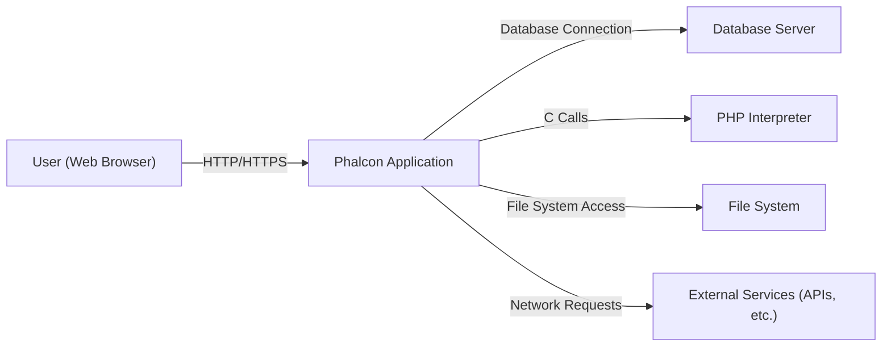
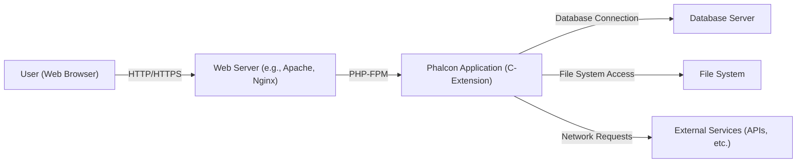
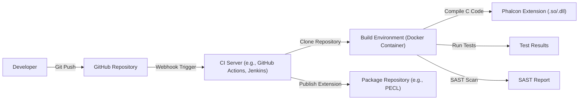

Okay, let's create a design document for the cphalcon project.

# BUSINESS POSTURE

Phalcon is a web framework delivered as a C-extension for PHP. The primary business goal is to provide a high-performance, feature-rich framework for developing web applications. The project aims to minimize resource consumption and offer superior speed compared to traditional PHP frameworks. This is crucial for businesses that prioritize website speed and efficiency, potentially leading to improved user experience, better search engine rankings, and reduced hosting costs.

Business Priorities:

*   Performance: Maximize execution speed and minimize resource utilization.
*   Functionality: Provide a comprehensive set of features for web application development.
*   Usability: Offer a developer-friendly API and clear documentation.
*   Maintainability: Ensure the codebase is well-structured and easy to maintain.
*   Community: Foster a strong and active community around the framework.
*   Security: Protect applications built with Phalcon from common web vulnerabilities.

Business Risks:

*   Vulnerabilities in the C-extension could expose applications to severe security threats, potentially leading to data breaches, system compromise, or denial-of-service.
*   Performance regressions could negate the primary advantage of using Phalcon.
*   Lack of adoption due to complexity or insufficient features could hinder the project's long-term viability.
*   Inability to keep up with PHP updates and new features could lead to compatibility issues and obsolescence.
*   Supply chain attacks targeting the build process or dependencies could introduce malicious code.

# SECURITY POSTURE

Existing Security Controls:

*   security control: Input Validation: Phalcon provides mechanisms for validating user input, such as filters and validators, to mitigate injection attacks (e.g., SQL injection, XSS). Implemented in Phalcon's request and validation components.
*   security control: Output Encoding: Phalcon's Volt template engine offers automatic output encoding to prevent Cross-Site Scripting (XSS) vulnerabilities. Implemented in the Volt template engine.
*   security control: Security Component: Phalcon has security component that provides protection against typical web attacks, such as CSRF. Implemented in Phalcon's security component.
*   security control: Secure by Design Principles: The framework's architecture, being a C-extension, inherently offers some protection against certain PHP-specific vulnerabilities. This is a fundamental aspect of the project's design.
*   security control: Regular Updates: The Phalcon team releases updates and patches to address security vulnerabilities and bug fixes. This is evident in the project's release history on GitHub.
*   security control: Community Reporting: The project encourages security researchers and users to report vulnerabilities. This is implied by the project's presence on GitHub and its community interaction.

Accepted Risks:

*   accepted risk: Complexity of C: Developing and maintaining a C-extension introduces inherent complexity and potential security risks associated with memory management and low-level operations.
*   accepted risk: Dependence on PHP: Phalcon's reliance on the PHP ecosystem means it's indirectly affected by vulnerabilities in PHP itself.
*   accepted risk: Third-Party Libraries: While Phalcon minimizes external dependencies, any used libraries could introduce vulnerabilities.

Recommended Security Controls:

*   Static Analysis: Integrate static analysis tools (SAST) into the build process to identify potential security vulnerabilities in the C code.
*   Dynamic Analysis: Employ dynamic analysis tools (DAST) to test the running application for vulnerabilities.
*   Fuzzing: Implement fuzzing techniques to test the framework's components with unexpected inputs and identify potential crashes or vulnerabilities.
*   Dependency Management: Establish a robust process for managing and vetting third-party dependencies.
*   Security Audits: Conduct regular, independent security audits of the codebase.
*   Supply Chain Security: Implement measures to secure the build and distribution process, such as code signing and integrity checks.

Security Requirements:

*   Authentication:
    *   The framework should provide mechanisms or guidance for implementing secure user authentication, including password hashing and session management.
*   Authorization:
    *   The framework should support role-based access control (RBAC) or other authorization mechanisms to restrict access to resources based on user roles and permissions.
*   Input Validation:
    *   All user-supplied input must be validated to prevent injection attacks (SQL injection, XSS, command injection, etc.).
    *   Validation rules should be configurable and extensible.
*   Cryptography:
    *   The framework should provide secure cryptographic functions for tasks such as password hashing, data encryption, and key management.
    *   Use of strong, industry-standard cryptographic algorithms is required.
*   Output Encoding:
    *   Context-sensitive output encoding must be used to prevent XSS vulnerabilities.
*   Session Management:
    *   Secure session management practices must be implemented, including the use of strong session IDs, secure cookies, and protection against session hijacking.
*   Error Handling:
    *   Error messages should not reveal sensitive information about the system or its configuration.
*   CSRF Protection:
    *   The framework should provide built-in protection against Cross-Site Request Forgery (CSRF) attacks.

# DESIGN

## C4 CONTEXT



Context Diagram Element List:

*   Element:
    *   Name: User (Web Browser)
    *   Type: Person
    *   Description: A user interacting with the Phalcon application through a web browser.
    *   Responsibilities: Initiates requests, views responses, provides input.
    *   Security controls: Browser-based security mechanisms (e.g., same-origin policy, content security policy).

*   Element:
    *   Name: Phalcon Application
    *   Type: Software System
    *   Description: The web application built using the Phalcon framework.
    *   Responsibilities: Handles user requests, processes data, interacts with other systems, renders responses.
    *   Security controls: Input validation, output encoding, authentication, authorization, CSRF protection, session management, error handling.

*   Element:
    *   Name: Database Server
    *   Type: Software System
    *   Description: The database system used by the Phalcon application to store and retrieve data.
    *   Responsibilities: Stores data, executes queries, manages data integrity.
    *   Security controls: Database access controls, encryption at rest, encryption in transit, auditing.

*   Element:
    *   Name: PHP Interpreter
    *   Type: Software System
    *   Description: The PHP interpreter that executes the PHP code and interacts with the Phalcon C-extension.
    *   Responsibilities: Executes PHP code, manages memory, interacts with extensions.
    *   Security controls: PHP security settings (e.g., disable_functions, open_basedir), regular PHP updates.

*   Element:
    *   Name: File System
    *   Type: Software System
    *   Description: The file system used by the Phalcon application to store files (e.g., configuration files, uploaded files).
    *   Responsibilities: Stores files, provides file access.
    *   Security controls: File system permissions, access control lists.

*   Element:
    *   Name: External Services (APIs, etc.)
    *   Type: Software System
    *   Description: External services that the Phalcon application interacts with.
    *   Responsibilities: Varies depending on the specific service.
    *   Security controls: API keys, authentication tokens, secure communication protocols (HTTPS).

## C4 CONTAINER



Container Diagram Element List:

*   Element:
    *   Name: User (Web Browser)
    *   Type: Person
    *   Description: A user interacting with the Phalcon application through a web browser.
    *   Responsibilities: Initiates requests, views responses, provides input.
    *   Security controls: Browser-based security mechanisms (e.g., same-origin policy, content security policy).

*   Element:
    *   Name: Web Server (e.g., Apache, Nginx)
    *   Type: Container
    *   Description: The web server that receives requests from the user and forwards them to the Phalcon application.
    *   Responsibilities: Handles HTTP requests, serves static content, manages connections.
    *   Security controls: Web server configuration hardening, TLS/SSL encryption, access logging.

*   Element:
    *   Name: Phalcon Application (C-Extension)
    *   Type: Container
    *   Description: The Phalcon framework running as a C-extension within the PHP interpreter.
    *   Responsibilities: Handles application logic, interacts with the database and other services.
    *   Security controls: Input validation, output encoding, authentication, authorization, CSRF protection, session management, error handling.

*   Element:
    *   Name: Database Server
    *   Type: Container
    *   Description: The database system used by the Phalcon application.
    *   Responsibilities: Stores data, executes queries, manages data integrity.
    *   Security controls: Database access controls, encryption at rest, encryption in transit, auditing.

*   Element:
    *   Name: File System
    *   Type: Container
    *   Description: The file system used by the Phalcon application to store files.
    *   Responsibilities: Stores files, provides file access.
    *   Security controls: File system permissions, access control lists.

*   Element:
    *   Name: External Services (APIs, etc.)
    *   Type: Container
    *   Description: External services that the Phalcon application interacts with.
    *   Responsibilities: Varies depending on the specific service.
    *   Security controls: API keys, authentication tokens, secure communication protocols (HTTPS).

## DEPLOYMENT

Possible Deployment Solutions:

1.  Traditional LAMP/LEMP Stack: Deploying Phalcon on a server running Apache or Nginx, with PHP-FPM, and a database server (e.g., MySQL, PostgreSQL).
2.  Containerized Deployment (Docker): Packaging the Phalcon application and its dependencies (PHP, web server) into Docker containers, orchestrated with Docker Compose or Kubernetes.
3.  Cloud-Based Deployment (AWS, GCP, Azure): Utilizing cloud platforms to deploy Phalcon applications, leveraging services like AWS Elastic Beanstalk, Google App Engine, or Azure App Service.
4.  Serverless Deployment: While Phalcon itself isn't directly deployable as a serverless function, parts of the application logic could be offloaded to serverless functions (e.g., AWS Lambda, Google Cloud Functions) that interact with the main Phalcon application.

Chosen Solution: Containerized Deployment (Docker with Kubernetes)

```mermaid
graph LR
    Internet["Internet"] -- "HTTPS" --> LoadBalancer["Load Balancer (Kubernetes Ingress)"]
    LoadBalancer -- "HTTPS" --> PhalconService["Phalcon Service (Kubernetes Service)"]
    PhalconService -- " " --> PhalconPod1["Phalcon Pod 1 (ReplicaSet)"]
    PhalconService -- " " --> PhalconPod2["Phalcon Pod 2 (ReplicaSet)"]
    PhalconService -- " " --> PhalconPodN["Phalcon Pod N (ReplicaSet)"]
    PhalconPod1 -- "Database Connection" --> DatabaseService["Database Service (Kubernetes Service)"]
    DatabaseService -- "" --> DatabasePod["Database Pod (StatefulSet)"]
    PhalconPod1 -- "Network" --> ExternalAPIService["External API Service"]

```

Deployment Diagram Element List:

*   Element:
    *   Name: Internet
    *   Type: External
    *   Description: The public internet.
    *   Responsibilities: Source of user requests.
    *   Security controls: Network firewalls, intrusion detection/prevention systems.

*   Element:
    *   Name: Load Balancer (Kubernetes Ingress)
    *   Type: Infrastructure Node
    *   Description: A load balancer that distributes incoming traffic across multiple instances of the Phalcon application.
    *   Responsibilities: Distributes traffic, handles TLS termination.
    *   Security controls: TLS/SSL configuration, access control lists.

*   Element:
    *   Name: Phalcon Service (Kubernetes Service)
    *   Type: Infrastructure Node
    *   Description: A Kubernetes Service that provides a stable endpoint for accessing the Phalcon application pods.
    *   Responsibilities: Provides service discovery, load balancing within the cluster.
    *   Security controls: Kubernetes network policies.

*   Element:
    *   Name: Phalcon Pod 1/2/N (ReplicaSet)
    *   Type: Infrastructure Node
    *   Description: Instances of the Phalcon application running in Docker containers, managed by a Kubernetes ReplicaSet.
    *   Responsibilities: Handles user requests, processes data.
    *   Security controls: Container security hardening, resource limits, network policies.

*   Element:
    *   Name: Database Service (Kubernetes Service)
    *   Type: Infrastructure Node
    *   Description: A Kubernetes Service that provides a stable endpoint for accessing the database pod.
    *   Responsibilities: Provides service discovery for the database.
    *   Security controls: Kubernetes network policies.

*   Element:
    *   Name: Database Pod (StatefulSet)
    *   Type: Infrastructure Node
    *   Description: The database server running in a Docker container, managed by a Kubernetes StatefulSet.
    *   Responsibilities: Stores data, executes queries.
    *   Security controls: Database access controls, encryption at rest, encryption in transit, auditing.

*   Element:
    *   Name: External API Service
    *   Type: External
    *   Description: External services that the Phalcon application interacts with.
    *   Responsibilities: Varies depending on the specific service.
    *   Security controls: API keys, authentication tokens, secure communication protocols (HTTPS).

## BUILD

The Phalcon build process involves compiling the C source code into a PHP extension. This process is crucial for security, as vulnerabilities in the C code can have significant consequences.



Build Process Description:

1.  Developer pushes code changes to the GitHub repository.
2.  A webhook triggers the CI server (e.g., GitHub Actions).
3.  The CI server clones the repository into a clean build environment (e.g., a Docker container).
4.  The build environment compiles the Phalcon C code into a PHP extension (.so or .dll file).
5.  Unit tests and integration tests are executed.
6.  A SAST scanner (e.g., SonarQube, RIPS) analyzes the C code for potential vulnerabilities.
7.  If all tests pass and the SAST scan doesn't report critical issues, the CI server publishes the compiled extension to a package repository (e.g., PECL).

Security Controls in Build Process:

*   Clean Build Environment: Using a clean and isolated build environment (e.g., Docker container) prevents contamination from previous builds and ensures consistency.
*   Automated Build: Automating the build process reduces the risk of manual errors and ensures that security checks are consistently applied.
*   SAST Scanning: Integrating static analysis tools helps identify potential vulnerabilities early in the development lifecycle.
*   Unit and Integration Tests: Automated tests help ensure the code's functionality and prevent regressions.
*   Dependency Management: Carefully managing and vetting third-party dependencies reduces the risk of supply chain attacks.
*   Code Signing: Signing the compiled extension provides assurance of its authenticity and integrity.
*   Artifact Repository: Using a secure artifact repository (e.g., JFrog Artifactory) helps protect the built extension from tampering.

# RISK ASSESSMENT

Critical Business Processes:

*   Web Application Delivery: Phalcon is designed to serve web applications. Any disruption to its functionality or performance directly impacts the availability and responsiveness of those applications.
*   Data Processing: Phalcon applications often handle sensitive data. Security vulnerabilities could lead to data breaches or corruption.

Data Sensitivity:

*   User Data: Personal information, login credentials, financial data (if applicable). Sensitivity: High.
*   Application Data: Business logic, proprietary information, configuration data. Sensitivity: Medium to High.
*   System Data: Server logs, error logs, performance metrics. Sensitivity: Low to Medium.

# QUESTIONS & ASSUMPTIONS

Questions:

*   What specific security standards or compliance requirements (e.g., PCI DSS, GDPR) must Phalcon applications adhere to?
*   What is the expected threat model for typical Phalcon applications? (e.g., targeted attacks, opportunistic attacks)
*   What is the process for handling security vulnerability reports?
*   Are there any specific security features or configurations that are commonly used or recommended for Phalcon applications?
*   What level of security expertise is expected from developers using Phalcon?

Assumptions:

*   BUSINESS POSTURE: The Phalcon project prioritizes security and actively addresses reported vulnerabilities.
*   BUSINESS POSTURE: The Phalcon community is engaged and contributes to security discussions and improvements.
*   SECURITY POSTURE: Developers using Phalcon have a basic understanding of web security principles.
*   SECURITY POSTURE: Phalcon applications will be deployed in reasonably secure environments (e.g., with firewalls, intrusion detection systems).
*   DESIGN: The database server is properly secured and configured.
*   DESIGN: External services used by Phalcon applications are also secure.
*   DESIGN: The web server is configured securely and uses HTTPS.
*   DESIGN: The build process is automated and includes security checks.