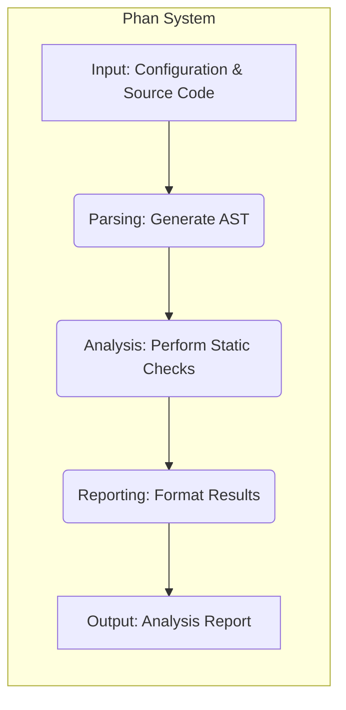
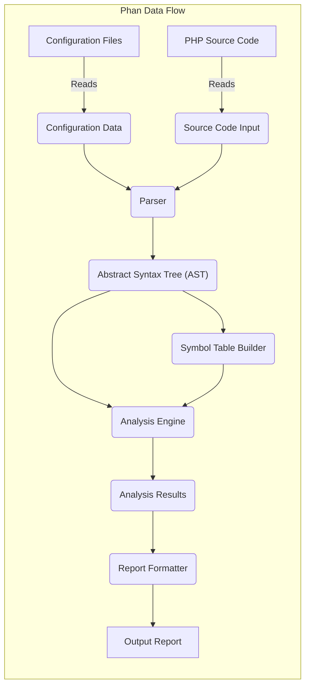

# Project Design Document: Phan - Static Analysis Tool for PHP

**Version:** 1.1
**Date:** October 26, 2023
**Author:** AI Software Architect

## 1. Introduction

This document provides an enhanced and detailed design overview of Phan, a static analysis tool for PHP. The primary goal is to clearly articulate the system's architecture, components, and data flow, serving as a robust foundation for subsequent threat modeling activities. A thorough understanding of the system's internal mechanisms is paramount for identifying potential vulnerabilities and designing effective security mitigations. This revised document aims to provide greater clarity and depth compared to the initial version.

## 2. Goals

*   Provide a comprehensive and refined architectural overview of Phan.
*   Describe the key components and their interactions with greater detail.
*   Illustrate the data flow within the system with improved clarity.
*   Serve as a more detailed and accurate basis for future threat modeling exercises.
*   Document the system in a clear, understandable, and more technically specific manner.

## 3. Overview

Phan is a sophisticated static analysis tool for PHP designed to detect a wide range of potential issues without executing the code. It achieves this by parsing PHP source code, constructing an Abstract Syntax Tree (AST), and then performing various static analyses on this structured representation. Phan operates primarily as a command-line tool, accepting PHP source code as input and generating reports detailing identified issues. It is highly configurable, allowing users to tailor the analysis to their specific needs and coding standards.

## 4. System Architecture

Phan's architecture is structured into distinct stages, each with specific responsibilities:

*   **Input Stage:**  Handles the intake of configuration parameters and the PHP source code intended for analysis.
*   **Parsing Stage:**  Transforms the raw PHP source code into a structured Abstract Syntax Tree (AST), representing the code's grammatical structure.
*   **Analysis Stage:**  Executes a suite of static analysis checks on the AST, leveraging symbol table information to identify potential errors and inconsistencies.
*   **Reporting Stage:**  Formats the findings generated during the analysis stage into user-friendly reports.
*   **Output Stage:**  Delivers the formatted analysis reports to the designated output destination.

## 5. Data Flow

The movement and transformation of data within the Phan system can be described as follows:

*   **Configuration Data Ingestion:** Phan begins by reading configuration files (e.g., `.phan/config.php`), which dictate analysis parameters, specify files and directories to include or exclude, and define other operational settings.
*   **Source Code Acquisition:** Phan retrieves PHP source code, which can be provided as individual files, directories containing PHP code, or via standard input.
*   **Abstract Syntax Tree (AST) Generation:** The parser component processes the ingested source code, converting it into an Abstract Syntax Tree (AST), a hierarchical representation of the code's syntactic structure.
*   **Symbol Table Construction:** Concurrently or subsequently, Phan builds a symbol table. This table stores detailed information about declared entities within the code, such as classes, functions, variables, and their associated types and scopes.
*   **Analysis Execution and Result Generation:** The analysis engine utilizes the AST and the symbol table to perform a variety of static checks. These checks identify potential errors, warnings, and areas for improvement within the code.
*   **Report Data Formatting:** The reporting module takes the raw analysis results (findings) and structures them into a presentable format, suitable for human or machine consumption.
*   **Report Output:** The final formatted report is then outputted to a specified destination, which could be the console, a designated file, or another configured output mechanism.

## 6. Key Components

*   **Configuration Loader:**
    *   Responsible for the initial loading and interpretation of Phan's configuration settings.
    *   Parses configuration files (typically PHP files) to determine analysis scope, enabled checks, reporting levels, and other operational parameters.
    *   Handles the merging and overriding of configuration settings from multiple sources.
    *   Security Note: Improperly secured configuration loading could allow for the execution of arbitrary code if a malicious configuration file is provided.
*   **Parser:**
    *   Employs PHP's internal tokenizer and parser (or potentially a custom implementation) to transform raw PHP source code into a structured Abstract Syntax Tree (AST).
    *   The AST represents the code's grammatical structure, making it easier for subsequent analysis.
    *   Handles syntax errors in the input code, attempting to recover and continue parsing where possible.
    *   Security Note: Vulnerabilities in the parser could be exploited with specially crafted malicious code to cause crashes or unexpected behavior.
*   **Abstract Syntax Tree (AST):**
    *   A hierarchical tree structure representing the syntactic elements of the PHP code.
    *   Nodes in the tree correspond to language constructs such as classes, functions, variables, expressions, control flow statements, etc.
    *   Serves as the primary data structure for the analysis engine.
*   **Symbol Table Builder:**
    *   Traverses the Abstract Syntax Tree (AST) to identify and record declared entities within the code.
    *   Constructs a symbol table that stores information about classes, functions, constants, variables, their types, scopes, and other relevant attributes.
    *   Plays a crucial role in type analysis and resolving references.
*   **Analysis Engine:**
    *   The core component of Phan, responsible for performing a wide array of static analysis checks on the AST, leveraging information from the symbol table.
    *   Implements various analyses, including:
        *   **Type Checking and Inference:**  Verifies type consistency and attempts to infer types where they are not explicitly declared.
        *   **Undefined Method/Property Detection:** Identifies calls to methods or access to properties that are not defined for the given object or class.
        *   **Dead Code Analysis:** Detects code that is unreachable or has no effect.
        *   **Unused Variable Detection:** Identifies variables that are declared but never used.
        *   **Security-Related Checks:**  Includes checks for potential security vulnerabilities such as:
            *   **SQL Injection:**  Detecting potentially unsafe use of user input in database queries.
            *   **Cross-Site Scripting (XSS):** Identifying potential injection points for malicious scripts.
            *   **Path Traversal:**  Detecting attempts to access files outside of the intended directory.
    *   The analysis engine is highly configurable, allowing users to enable or disable specific checks.
    *   Security Note: The effectiveness of security checks depends on the accuracy and completeness of the analysis rules.
*   **Report Formatter:**
    *   Takes the raw analysis results (findings) generated by the analysis engine and formats them into a user-friendly output.
    *   Supports multiple output formats, including plain text, JSON, and Checkstyle XML, allowing for integration with various tools and workflows.
    *   Allows customization of the report's content, verbosity, and presentation.
    *   Security Note: Improperly sanitized output could introduce vulnerabilities if the report is consumed by other systems.
*   **File System Access:**
    *   Phan requires access to the file system to read configuration files, PHP source code to be analyzed, and potentially to write output reports.
    *   The level of access required depends on the scope of the analysis.
    *   Security Note:  Insufficiently restricted file system access could allow Phan to read sensitive information or overwrite critical files.
*   **Command-Line Interface (CLI):**
    *   Provides the primary interface for users to interact with Phan.
    *   Handles command-line arguments for specifying input files or directories, configuration file paths, output options, and other settings.
    *   Parses user input and invokes the appropriate Phan components.

## 7. Security Considerations (Detailed)

This section expands on the initial security considerations, providing more specific examples and potential impacts.

*   **Configuration Injection Vulnerabilities:**
    *   **Threat:** Malicious users could craft configuration files that, when processed by Phan, lead to unintended consequences. If Phan interprets PHP code within the configuration, a malicious actor could inject arbitrary code for execution within the Phan process.
    *   **Mitigation:**  Strictly sanitize and validate configuration inputs. Avoid directly executing code from configuration files if possible. Use a secure configuration format (e.g., YAML, JSON) and a dedicated parser. Implement robust permission checks on configuration files.
*   **Source Code Injection (Indirect) Exploits:**
    *   **Threat:** While Phan doesn't execute the analyzed code, carefully crafted malicious PHP code could exploit vulnerabilities within Phan's parser or analysis engine. This could lead to denial of service (e.g., causing infinite loops or excessive memory consumption within Phan), or potentially even remote code execution if vulnerabilities exist in Phan's dependencies or if Phan performs actions based on the parsed code in an unsafe manner.
    *   **Mitigation:** Implement robust input validation and sanitization for the source code being parsed. Regularly update Phan's dependencies to patch known vulnerabilities. Employ fuzzing techniques to identify potential parsing vulnerabilities. Implement resource limits to prevent denial-of-service attacks.
*   **Output Injection Risks:**
    *   **Threat:** If Phan's output reports include unsanitized data derived from the analyzed source code (e.g., file paths, variable names), and this output is used in other systems (e.g., displayed in a web interface), it could create opportunities for cross-site scripting (XSS) attacks.
    *   **Mitigation:**  Sanitize all output data, especially when including data derived from the analyzed code. Use context-aware escaping techniques when generating reports for different output formats (e.g., HTML escaping for web reports).
*   **File System Access Control Issues:**
    *   **Threat:** If Phan runs with overly broad file system permissions, a malicious actor could potentially trick Phan into reading sensitive files or overwriting critical system files by manipulating the input paths or configuration.
    *   **Mitigation:**  Run Phan with the least necessary privileges. Implement strict input validation for file paths. Consider using chroot or containerization to limit Phan's file system access.
*   **Dependency Management Weaknesses:**
    *   **Threat:** Although Phan might have few direct external dependencies, vulnerabilities in those dependencies could be exploited to compromise Phan's security.
    *   **Mitigation:**  Regularly audit and update Phan's dependencies. Use dependency management tools to track and manage dependencies. Employ static analysis tools on Phan's own codebase and its dependencies.
*   **Denial of Service Attacks:**
    *   **Threat:**  Providing Phan with extremely large, deeply nested, or syntactically complex codebases could consume excessive resources (CPU, memory), leading to a denial of service.
    *   **Mitigation:** Implement resource limits (e.g., memory limits, execution time limits) within Phan. Consider techniques to detect and handle excessively complex code structures.

## 8. Future Considerations

*   **Plugin System for Extensibility:**
    *   **Functionality:** Allowing users to develop and integrate custom analysis rules or modify existing behavior.
    *   **Security Implications:** Introduces significant security risks if plugins are not properly sandboxed or if the plugin API allows for arbitrary code execution within Phan's context. Requires careful design of the plugin API and robust security measures for plugin loading and execution.
*   **Integration with Integrated Development Environments (IDEs):**
    *   **Functionality:** Providing real-time or on-demand analysis feedback directly within the developer's IDE.
    *   **Security Implications:** Requires secure communication and data handling between Phan and the IDE. Potential vulnerabilities could arise from insecure communication channels or if the IDE integration exposes Phan's internal workings. Authentication and authorization mechanisms would be necessary.
*   **Enhanced Security-Focused Analysis:**
    *   **Functionality:** Incorporating more advanced static analysis techniques specifically aimed at detecting security vulnerabilities (e.g., taint analysis, control flow analysis for security flaws).
    *   **Security Implications:**  The effectiveness of these enhanced checks depends on the accuracy and sophistication of the analysis algorithms. False positives and false negatives need to be carefully managed. The performance impact of more complex analyses needs to be considered.

This improved document provides a more detailed and comprehensive understanding of Phan's architecture, data flow, and security considerations, serving as a more robust foundation for future threat modeling activities.
