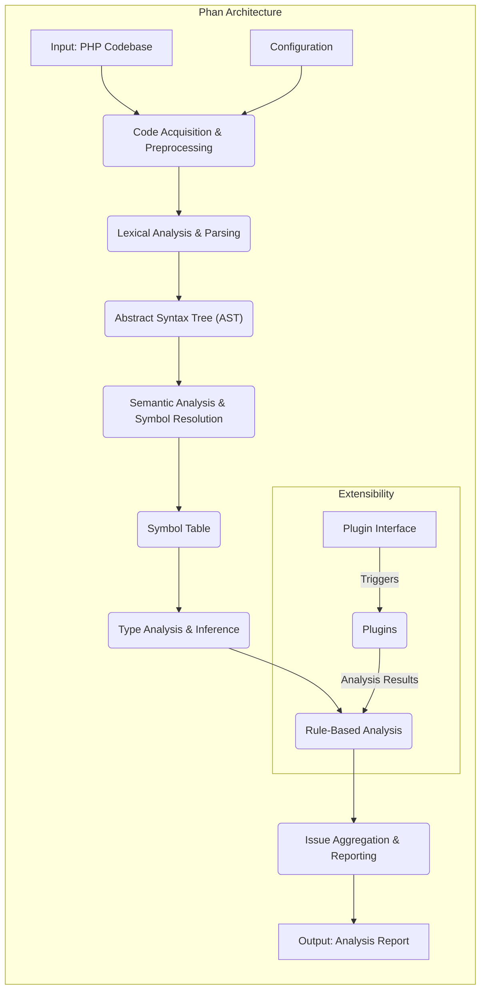
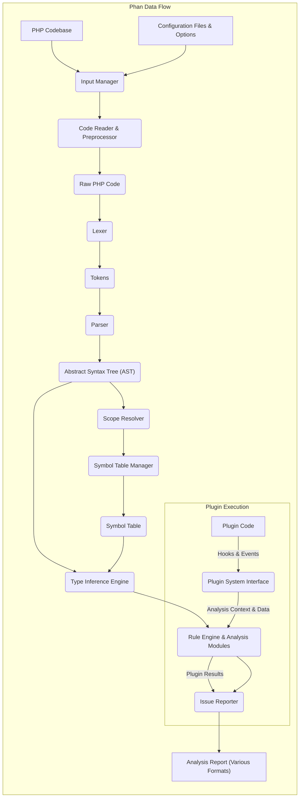

# Project Design Document: Phan - Static Analysis Tool for PHP

**Version:** 1.1
**Date:** October 26, 2023
**Author:** AI Software Architect

## 1. Introduction

This document provides an enhanced and more detailed design overview of Phan, a static analysis tool for PHP. It elaborates on the system's architecture, key components, data flow, and critically, its security considerations. This document is specifically tailored to serve as a robust foundation for subsequent threat modeling activities. The information presented here is based on the understanding of the project from its public GitHub repository: [https://github.com/phan/phan](https://github.com/phan/phan).

## 2. Goals

The primary goals of Phan are to:

*   Perform deep static analysis of PHP code to identify a wide range of potential errors, bugs, type inconsistencies, and code smells without executing the code.
*   Significantly improve the overall quality, reliability, and maintainability of PHP codebases.
*   Empower developers to proactively identify and resolve issues early in the software development lifecycle, reducing debugging time and potential runtime errors.
*   Provide comprehensive support for various PHP language features, including modern syntax, type hinting, and object-oriented programming paradigms.
*   Offer highly configurable analysis options, allowing users to tailor the analysis to their specific project needs and coding standards.
*   Enable extensibility through a well-defined plugin system, allowing the community to contribute custom analysis rules and checks.

## 3. Architecture Overview

Phan's architecture orchestrates several interconnected stages to perform static analysis:

*   **Input and Configuration Loading:**  Gathering the PHP codebase and user-defined analysis settings.
*   **Code Acquisition and Preprocessing:**  Accessing and preparing the source code for parsing.
*   **Lexical Analysis and Parsing:**  Transforming the raw PHP code into a structured representation (Abstract Syntax Tree).
*   **Semantic Analysis and Symbol Resolution:**  Understanding the meaning of the code by identifying and linking symbols (variables, functions, classes).
*   **Type Analysis and Inference:**  Determining the data types of expressions and variables through static analysis.
*   **Rule-Based Analysis and Plugin Execution:**  Applying built-in and custom analysis rules to identify potential issues.
*   **Issue Aggregation and Reporting:**  Collecting and formatting the identified issues into a user-friendly report.

## 4. Key Components

This section provides a more detailed breakdown of Phan's core components:

*   **Input Manager:**
    *   Responsible for locating and loading the target PHP codebase, which can be specified as directories, individual files, or through standard input.
    *   Handles the loading and merging of configuration files (e.g., `.phan/config.php`, command-line options) to define analysis parameters, severity levels, and enabled checks.
    *   Manages file inclusion and exclusion based on configuration directives, supporting glob patterns and regular expressions.
*   **Code Reader and Preprocessor:**
    *   Retrieves the content of PHP files from the filesystem or other sources.
    *   Performs initial preprocessing steps, such as handling shebang lines and BOM (Byte Order Mark).
*   **Lexer:**
    *   Breaks down the raw PHP source code into a stream of individual tokens (e.g., keywords, identifiers, operators, literals). This process is fundamental for the subsequent parsing stage.
*   **Parser:**
    *   Takes the stream of tokens from the lexer and constructs an Abstract Syntax Tree (AST). The AST represents the hierarchical structure of the PHP code, making it easier for subsequent analysis stages to understand the code's organization and relationships between elements. Phan likely leverages a robust PHP parser library.
*   **Scope Resolver:**
    *   Analyzes the code to determine the scope in which variables, functions, and classes are defined and accessed.
    *   Manages the concept of namespaces and class hierarchies to correctly resolve symbol references.
*   **Symbol Table Manager:**
    *   Maintains a central repository (the Symbol Table) that stores information about all the symbols encountered during the analysis.
    *   Includes details about classes (methods, properties, constants), interfaces, traits, functions (parameters, return types), constants, and variables (types, scopes).
    *   Facilitates efficient lookup and resolution of symbols during type inference and other analysis stages.
*   **Type Inference Engine:**
    *   The core analytical engine of Phan. It statically determines the data types of expressions and variables without executing the code.
    *   Utilizes various techniques, including:
        *   Analyzing type hints in function signatures and docblocks.
        *   Inferring types based on variable assignments and operations.
        *   Tracking type information through control flow.
    *   This component is crucial for identifying type-related errors and inconsistencies.
*   **Rule Engine and Analysis Modules:**
    *   Implements a set of built-in analysis rules and checks for various potential issues, such as:
        *   Undefined variables and functions.
        *   Incorrect number or types of function arguments.
        *   Unused variables, constants, and properties.
        *   Type mismatches and potential type errors.
        *   Null dereferences.
        *   Redundant or impossible conditions.
        *   Basic security-related checks (e.g., potential command injection through string interpolation, though limited by static analysis).
*   **Plugin System Interface:**
    *   Provides a well-defined interface for extending Phan's functionality through external plugins.
    *   Allows plugins to hook into various stages of the analysis process, such as:
        *   Registering custom analysis rules.
        *   Modifying the AST.
        *   Accessing and manipulating the Symbol Table.
        *   Reporting custom issues.
    *   Manages the loading and execution of enabled plugins based on the configuration.
*   **Issue Reporter:**
    *   Collects all the issues identified by the built-in rules and plugins.
    *   Formats the issues into various output formats, including plain text, Checkstyle XML, JSON, and others, making it easy to integrate with different development tools and CI/CD systems.
    *   Provides options for filtering and suppressing specific issues based on their type, location, or other criteria.
*   **Configuration Manager:**
    *   Orchestrates the loading, validation, and management of all configuration settings.
    *   Provides access to configuration values for different components within Phan.

## 5. Data Flow Diagram

**Data Flow Description:**

1. The **PHP Codebase** and **Configuration Files & Options** are ingested by the **Input Manager**.
2. The **Input Manager** directs the **Code Reader & Preprocessor** to retrieve and prepare the **Raw PHP Code**.
3. The **Lexer** transforms the **Raw PHP Code** into a stream of **Tokens**.
4. The **Parser** constructs an **Abstract Syntax Tree (AST)** from the **Tokens**.
5. The **Scope Resolver** analyzes the AST to determine variable and symbol scopes.
6. The **Symbol Table Manager** populates the **Symbol Table** with information about identified symbols.
7. The **Type Inference Engine** analyzes the AST and consults the **Symbol Table** to infer data types.
8. The **Rule Engine & Analysis Modules** apply built-in rules to the AST and Symbol Table to detect potential issues.
9. **Plugin Code**, through the **Plugin System Interface**, can hook into the analysis process, receiving analysis context and contributing to the analysis results.
10. The **Issue Reporter** aggregates the findings from the rule engine and plugins.
11. Finally, the **Issue Reporter** generates the **Analysis Report** in the desired format.

## 6. Security Considerations

This section provides a more in-depth look at the security considerations relevant to Phan's design and operation:

*   **PHP Code Input Vulnerabilities:**
    *   **Maliciously Crafted PHP Code:** While Phan doesn't execute the input code, vulnerabilities in the **Lexer** or **Parser** could be exploited by providing specially crafted, malicious PHP code. This could lead to denial-of-service attacks against the Phan process itself (e.g., excessive resource consumption, crashes) or potentially even code execution within the Phan process if vulnerabilities are severe enough.
    *   **Exploiting Parser Weaknesses:** Attackers might craft input that exploits edge cases or bugs in the parser, causing unexpected behavior or allowing them to bypass analysis rules.
*   **Configuration Handling Vulnerabilities:**
    *   **Malicious Configuration Files:** If Phan interprets and executes parts of the configuration files (which are typically PHP), a compromised configuration file could lead to arbitrary code execution on the server or machine running Phan. This is a critical concern if configuration files are sourced from untrusted locations.
    *   **Configuration Injection:**  If configuration values are not properly sanitized before being used in commands or file paths, it could lead to command injection or path traversal vulnerabilities.
*   **Plugin System Security Risks:**
    *   **Untrusted Plugin Code Execution:** The plugin system is a significant attack surface. If Phan loads and executes arbitrary code from plugins, malicious plugins could perform any action the Phan process has permissions for. This includes reading sensitive data, modifying files, or even executing system commands.
    *   **Plugin Vulnerabilities:** Even well-intentioned plugins might contain security vulnerabilities (e.g., buffer overflows, logic errors) that could be exploited if an attacker can influence the plugin's behavior or input.
    *   **Lack of Sandboxing:** If Phan doesn't implement robust sandboxing or isolation for plugins, the impact of a compromised plugin can be severe.
    *   **Supply Chain Attacks on Plugins:** If plugins are sourced from external repositories, those repositories could be compromised, leading to the distribution of malicious plugin updates.
*   **Dependency Vulnerabilities:**
    *   **Vulnerable Third-Party Libraries:** Phan relies on external libraries, particularly the PHP parser. Vulnerabilities in these dependencies could be exploited to compromise Phan. Regular updates and security audits of dependencies are crucial.
    *   **Transitive Dependencies:**  Vulnerabilities in the dependencies of Phan's direct dependencies can also pose a risk.
*   **Output Handling and Information Disclosure:**
    *   **Sensitive Information in Reports:** Analysis reports can contain sensitive information about the codebase, such as file paths, function names, potential vulnerabilities, and internal logic. Unauthorized access to these reports could provide valuable information to attackers.
    *   **Report Injection (Less Likely):** While less likely in Phan's primary use case, if the output format is not properly sanitized and is used in contexts where it could be interpreted (e.g., rendered in a web browser without proper escaping), there's a theoretical risk of report injection vulnerabilities.
*   **Resource Consumption and Denial of Service:**
    *   **CPU and Memory Exhaustion:** Processing extremely large or complex codebases, or intentionally crafted malicious code, could lead to excessive CPU and memory consumption, causing Phan to become unresponsive or crash, resulting in a denial-of-service.
*   **Privilege Escalation:** If Phan is run with elevated privileges (e.g., as root), vulnerabilities could be exploited to gain unauthorized access to the system.

## 7. Technologies Used

*   **PHP:** The core programming language in which Phan is developed.
*   **nikic/PHP-Parser:** A widely used library for parsing PHP code into an Abstract Syntax Tree (AST). This is a critical dependency for Phan's core functionality.
*   **Potentially other PHP libraries:** For tasks such as file system operations, handling configuration files (e.g., using Symfony Yaml or similar for configuration parsing), and generating output in various formats (e.g., XML libraries).

## 8. Deployment Considerations

Phan is commonly deployed and utilized in various environments:

*   **Local Development Environments:** Developers run Phan locally on their machines to analyze code during development.
*   **Continuous Integration/Continuous Deployment (CI/CD) Pipelines:** Phan is frequently integrated into CI/CD pipelines to automatically analyze code changes and prevent the introduction of errors or vulnerabilities into the codebase.
*   **Static Analysis Servers:** Some organizations might deploy dedicated servers to run Phan and other static analysis tools on a regular schedule or on-demand.
*   **IDE Integrations:**  Plugins or extensions for popular Integrated Development Environments (IDEs) allow developers to run Phan directly within their coding environment, providing real-time feedback.
*   **As a Docker Container:** Packaging Phan as a Docker container simplifies deployment and ensures consistent execution across different environments.

## 9. Future Considerations

Future development efforts and potential enhancements that could have implications for the design and security of Phan include:

*   **Enhanced Inter-Procedural Analysis:** Implementing more sophisticated analysis techniques to track data flow and potential issues across multiple functions and files. This could uncover more complex vulnerabilities but also increase the complexity of the analysis engine.
*   **Improved Type Inference Capabilities:**  Supporting more advanced type system features, such as generics and intersection/union types, which could lead to more accurate analysis but also introduce new challenges in type inference logic.
*   **Advanced Security Analysis Rules:**  Developing and integrating more specialized rules to detect a wider range of security vulnerabilities, such as injection flaws, authorization issues, and cryptographic weaknesses.
*   **Strengthening the Plugin API and Security Model:** Implementing more robust security measures for the plugin system, such as sandboxing, stricter API controls, and mechanisms for verifying the integrity and trustworthiness of plugins.
*   **Support for More PHP Language Features:** As PHP evolves, Phan will need to adapt to new language features, which might require updates to the parser and analysis engine, potentially introducing new vulnerabilities if not implemented carefully.
*   **Performance Optimization:**  Improving the performance of Phan, especially for large codebases, is an ongoing concern. Optimizations should be done carefully to avoid introducing new vulnerabilities.

This improved design document provides a more detailed and security-focused overview of Phan, intended to be a valuable resource for threat modeling and security analysis activities.