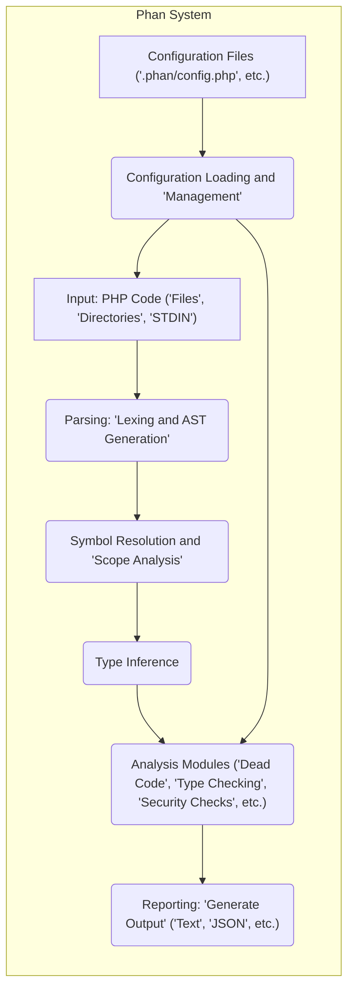
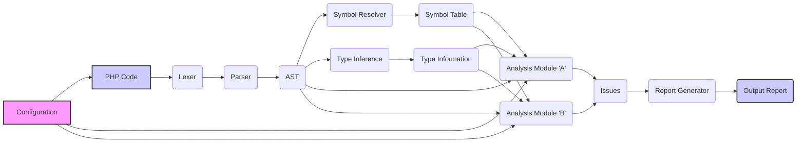

## Project Design Document: Phan - Static Analysis Tool for PHP

**Version:** 1.1
**Date:** October 26, 2023
**Author:** AI Software Architect

### 1. Introduction

This document provides a detailed design overview of Phan, a static analysis tool for PHP. This document aims to clearly articulate the architecture, components, and data flow within Phan to facilitate future threat modeling activities and provide a comprehensive understanding of the system's inner workings. It outlines the key elements of the system, their interactions, the data they process, and potential areas of interest for security analysis.

### 2. Goals and Objectives

The primary goals of Phan are:

*   To perform deep static analysis of PHP code to identify a wide range of potential errors, bugs, type inconsistencies, and code smells.
*   To significantly improve code quality, reliability, and maintainability by providing developers with actionable insights into their codebase before runtime.
*   To detect potential security vulnerabilities through static analysis techniques, focusing on common weaknesses and coding patterns that might lead to exploits.
*   To offer a high degree of customization and extensibility through configuration options, allowing users to tailor Phan's behavior to their specific project needs and coding standards.
*   To be readily usable as a command-line tool, facilitating integration into various development workflows, including local development environments and automated CI/CD pipelines.

### 3. High-Level Architecture

Phan operates as a command-line application that processes PHP code as input and generates analysis results as output. The core of Phan can be conceptually divided into several interconnected stages, each with specific responsibilities:

*   **Input Stage:** Responsible for receiving and preparing PHP code for analysis from various sources.
*   **Parsing Stage:** Converts the raw PHP code into a structured, machine-readable representation (Abstract Syntax Tree).
*   **Symbol Resolution and Scope Analysis Stage:** Identifies and links symbols (variables, functions, classes) to their declarations and determines their scope within the codebase.
*   **Type Inference Stage:**  Deduced the data types of variables and expressions, even when not explicitly declared, to enable more accurate analysis.
*   **Analysis Stage:** Executes a suite of static analysis checks on the structured code representation, leveraging symbol and type information.
*   **Reporting Stage:** Formats and presents the identified issues and analysis results in a user-friendly manner.
*   **Configuration Stage:** Manages the loading and application of user-defined settings that control Phan's behavior.

### 4. Detailed Design

This section provides a more granular view of the individual components and their functionalities within Phan.

#### 4.1. Input Stage

*   **Description:** This stage is responsible for acquiring the PHP code that will be subjected to static analysis.
*   **Components:**
    *   **File System Reader:** Reads PHP source code from specified files and directories. This component respects configured inclusion and exclusion rules.
    *   **Standard Input Reader:** Allows users to pipe PHP code directly to the Phan command for immediate analysis.
    *   **Configuration-Based Inclusion/Exclusion Manager:**  Utilizes settings defined in configuration files or command-line arguments to determine precisely which files and directories should be included in or excluded from the analysis. This allows for focused analysis on specific parts of a project.

#### 4.2. Parsing Stage

*   **Description:** This stage transforms the raw, textual PHP code into a structured, hierarchical representation that is easier for the analysis engine to process.
*   **Components:**
    *   **Lexer (Tokenizer):** Scans the input PHP code character by character and breaks it down into a stream of meaningful units called tokens (e.g., keywords, identifiers, operators, literals).
    *   **Parser:** Takes the stream of tokens produced by the lexer and constructs an Abstract Syntax Tree (AST). The AST represents the grammatical structure of the PHP code, capturing the relationships between different code elements.

#### 4.3. Symbol Resolution and Scope Analysis

*   **Description:** This stage is crucial for understanding the meaning of identifiers within the code. It identifies where variables, functions, classes, and other symbols are defined and determines their visibility and lifetime within different parts of the code.
*   **Components:**
    *   **Symbol Table:** A data structure that stores information about all declared symbols encountered during parsing. This includes the symbol's name, type (if known), scope, and location in the source code.
    *   **Scope Analyzer:** Analyzes the structure of the code (e.g., functions, classes, namespaces) to determine the scope in which each symbol is valid and accessible.
    *   **Namespace Resolver:** Handles the resolution of class and function names within PHP's namespace system, ensuring that references to symbols are correctly linked to their definitions, even across different namespaces.

#### 4.4. Type Inference

*   **Description:** This stage attempts to determine the data types of variables, function return values, and expressions, even when these types are not explicitly declared in the PHP code. This is essential for performing accurate type checking and identifying potential type-related errors.
*   **Components:**
    *   **Type Analyzer:**  Analyzes various code constructs (e.g., assignments, function calls, conditional statements, operators) to infer the types of expressions and variables based on their usage.
    *   **Type Propagation Engine:**  Propagates the inferred type information throughout the codebase. For example, if the return type of a function is inferred, this information is used when analyzing calls to that function.
    *   **Docblock Parser:** Extracts type hints and other relevant information from PHPdoc comments (specially formatted comments in the code). These docblock annotations provide valuable hints to the type inference engine, improving its accuracy.

#### 4.5. Analysis Modules

*   **Description:** This stage comprises a collection of independent modules, each responsible for performing specific static analysis checks on the AST, symbol table, and type information. These modules implement the core logic for detecting various code quality issues and potential vulnerabilities.
*   **Examples of Modules:**
    *   **Dead Code Analyzer:** Identifies code segments that are unreachable or never executed during program flow.
    *   **Type Checker:** Verifies type consistency throughout the codebase, identifying potential type errors, mismatches, and violations of type hints.
    *   **Undefined Variable Checker:** Detects instances where variables are used before they have been assigned a value.
    *   **Unused Variable Checker:** Identifies variables that are declared but never subsequently used in the code.
    *   **Security Analysis Modules:** Checks for common security vulnerabilities and coding patterns that could lead to exploits. Examples include:
        *   **SQL Injection Detection:** Identifying potentially unsafe construction of SQL queries.
        *   **Cross-Site Scripting (XSS) Detection:**  Looking for potential injection points for malicious scripts.
        *   **Path Traversal Detection:** Identifying code that might allow access to unauthorized files or directories.
        *   **Command Injection Detection:**  Detecting potentially unsafe execution of external commands.
    *   **Coding Style Enforcers:** (Potentially) Checks for adherence to predefined coding style guidelines and best practices.
    *   **Magic Method Usage Analyzer:**  Analyzes the use of PHP's magic methods for potential performance or correctness issues.

#### 4.6. Reporting Stage

*   **Description:** This stage is responsible for presenting the findings of the analysis to the user in a clear and informative way.
*   **Components:**
    *   **Report Generator:** Orchestrates the process of formatting the detected issues and analysis results.
    *   **Output Formatters:** Implement different output formats to cater to various user needs and integration scenarios. Supported formats might include plain text, JSON, XML, and checkstyle (for integration with CI tools).
    *   **Severity Level Filter:** Allows users to filter the reported issues based on their severity level (e.g., error, warning, notice), enabling them to focus on the most critical problems first.
    *   **Issue Context Provider:**  Gathers relevant context information for each reported issue, such as the file name, line number, and a descriptive message explaining the problem.

#### 4.7. Configuration Stage

*   **Description:** This stage handles the loading, parsing, and management of Phan's configuration settings, allowing users to customize its behavior.
*   **Components:**
    *   **Configuration File Parser:** Reads configuration settings from files, typically named `.phan/config.php` or similar. These files are usually written in PHP syntax.
    *   **Command-Line Argument Parser:** Processes configuration options provided directly via the command line when invoking Phan.
    *   **Configuration Manager:**  Stores and manages the loaded configuration settings, making them accessible to other components within Phan. This component handles merging configurations from different sources (e.g., command line overrides file settings).
*   **Configuration Options (Examples):**
    *   `file_list`: An array of specific files to analyze.
    *   `directory_list`: An array of directories to recursively analyze.
    *   `exclude_file_list`: An array of files to exclude from analysis.
    *   `exclude_directory_list`: An array of directories to exclude from analysis.
    *   `minimum_severity`: The minimum severity level of issues to report (e.g., `Issue::SEVERITY_NORMAL`, `Issue::SEVERITY_CRITICAL`).
    *   `disable_plugins`: An array of plugin names to disable.
    *   `enable_extensions`: An array of PHP extensions that Phan should be aware of.
    *   `target_php_version`: The target PHP version for analysis, affecting which language features are considered valid.
    *   `stubs_dirs`: Directories containing stub files for external libraries, providing type information for those libraries.

### 5. Data Flow

The following describes the flow of data through the Phan system, illustrating how the different components interact:

1. **PHP Code Input:** The process begins with PHP source code being provided to Phan. This can originate from files specified in the configuration or command line, or via standard input.
2. **Configuration Loading:**  Phan loads configuration settings from files and command-line arguments, which influence subsequent stages.
3. **Lexing and Tokenization:** The input code is processed by the lexer, which breaks it down into a stream of tokens.
4. **AST Generation:** The parser consumes the token stream and constructs an Abstract Syntax Tree (AST), representing the code's structure.
5. **Symbol Resolution and Scope Analysis:** The AST is traversed, and the symbol resolver builds a symbol table, determining the scope of each identifier.
6. **Type Inference:** Based on the AST, symbol table, and potentially docblock information, Phan's type inference engine attempts to deduce the data types of variables and expressions.
7. **Analysis by Modules:** The AST, symbol table, and type information are passed to the various enabled analysis modules. Each module performs its specific checks based on its rules and the analyzed code.
8. **Issue Detection:** Analysis modules identify potential issues (errors, warnings, etc.) based on their defined rules and the characteristics of the analyzed code.
9. **Report Generation:** The detected issues, along with relevant context (file, line number, message, severity), are collected and formatted by the report generator, respecting the configured output format.
10. **Output:** The final report is outputted in the specified format (text, JSON, etc.) to the user's console or a designated log file.

### 6. Deployment Model

Phan is primarily designed to be deployed and used as a command-line tool. Common deployment scenarios include:

*   **Local Development Environments:** Developers install Phan locally on their machines (typically via Composer) to analyze code during development, often integrating it with their IDE or editor.
*   **Continuous Integration/Continuous Deployment (CI/CD) Pipelines:** Phan is frequently integrated into CI/CD pipelines to automatically analyze code changes whenever new code is committed or a pull request is created. This ensures that code quality and potential issues are caught early in the development lifecycle.
*   **Static Analysis Servers:** In some organizations, dedicated servers or services might be set up to run static analysis tools like Phan on a regular schedule, providing centralized code quality monitoring.
*   **Docker Containers:** Phan can be easily containerized using Docker, providing a consistent and isolated environment for running the analysis, regardless of the host system.

The execution environment typically requires a compatible version of PHP and the Phan package, which is most commonly installed and managed using Composer, PHP's dependency manager.

### 7. Security Considerations

Understanding Phan's architecture is crucial for identifying potential security implications, both in terms of how Phan itself might be vulnerable and how it can be used to identify vulnerabilities in other code:

*   **Input Handling Vulnerabilities:** Phan processes arbitrary PHP code provided as input. Maliciously crafted PHP code could potentially exploit vulnerabilities in Phan's parser, lexer, or analysis engines, leading to:
    *   **Denial of Service (DoS):**  Crafted input could cause excessive resource consumption (CPU, memory), crashing Phan or making it unresponsive.
    *   **Code Execution:** In extreme cases, vulnerabilities in the parser or other components could potentially be exploited to execute arbitrary code on the system running Phan.
*   **Dependency Vulnerabilities:** Phan relies on external libraries and dependencies. Vulnerabilities in these dependencies could indirectly affect Phan's security. It's important to keep Phan's dependencies up-to-date.
*   **Configuration Security Risks:** If Phan's configuration files (e.g., `.phan/config.php`) are not properly secured and are writable by unauthorized users, malicious actors could modify them to:
    *   **Disable Security Checks:**  Prevent Phan from detecting vulnerabilities.
    *   **Exfiltrate Information:**  Configure Phan to output reports containing sensitive information to an attacker-controlled location.
    *   **Execute Arbitrary Code:**  In some cases, configuration files might allow the execution of arbitrary PHP code.
*   **Output Handling and Information Disclosure:** Reports generated by Phan might contain sensitive information about the codebase, such as file paths, potential vulnerabilities, and internal code structure. Secure handling and storage of these reports are essential to prevent information disclosure.
*   **Plugin Security (If Applicable):** If Phan supports plugins or extensions, the security of these extensions needs to be carefully considered. Malicious plugins could introduce vulnerabilities into Phan itself or provide misleading analysis results.
*   **Resource Exhaustion:** Analyzing very large or complex codebases could potentially lead to resource exhaustion on the system running Phan.

A dedicated threat modeling exercise, using this design document as a foundation, will further explore these and other potential security risks in detail, allowing for the development of appropriate mitigation strategies.

### 8. Assumptions and Constraints

*   Phan assumes that the input provided is intended to be valid PHP code, although its purpose is to detect errors and potential issues within that code.
*   Phan's analysis is inherently limited by the nature of static analysis. It cannot detect runtime issues, concurrency problems, or vulnerabilities that depend on specific execution contexts or user interactions.
*   The accuracy and effectiveness of Phan's analysis depend on the completeness and correctness of its internal rules, type inference mechanisms, and the quality of its configuration.
*   Performance can be a constraint when analyzing very large and complex codebases. The analysis process can be time-consuming and resource-intensive in such cases.

### 9. Future Considerations

*   **Enhanced Security Analysis Capabilities:** Continuously improving the accuracy and coverage of security-focused analysis modules to detect a wider range of vulnerabilities.
*   **Improved Accuracy and Performance of Type Inference:** Refining the type inference engine to handle more complex code patterns and improve analysis speed.
*   **More Sophisticated Analysis Modules:** Developing new analysis modules to detect more subtle and complex code issues, such as performance bottlenecks or maintainability problems.
*   **Better Integration with IDEs and Development Tools:** Providing seamless integration with popular IDEs and development tools to offer real-time feedback and improve the developer experience.
*   **Support for More PHP Language Features:** Keeping pace with the evolution of the PHP language by adding support for new language features and syntax.
*   **Extensibility and Plugin Development:**  Providing a robust and well-documented API for developing custom analysis modules and plugins to extend Phan's functionality.

This document provides a comprehensive and detailed design overview of Phan, serving as a valuable resource for understanding its architecture and facilitating effective threat modeling activities. The detailed breakdown of components, data flow, and deployment models provides a solid foundation for identifying potential security vulnerabilities and developing appropriate mitigation strategies.