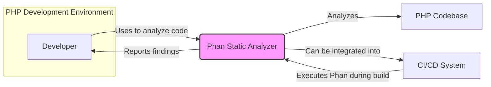
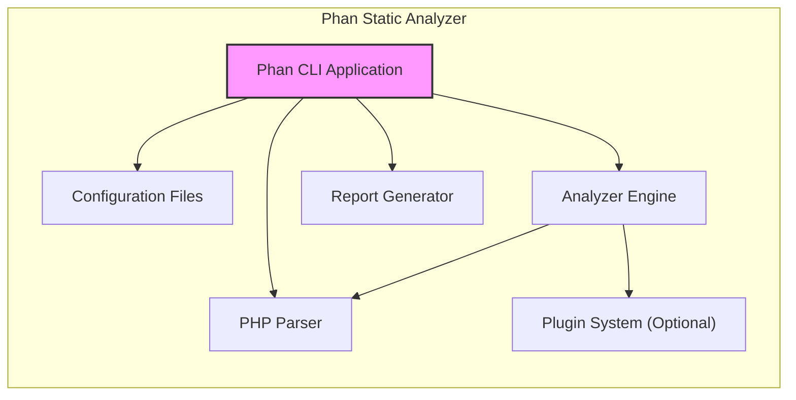
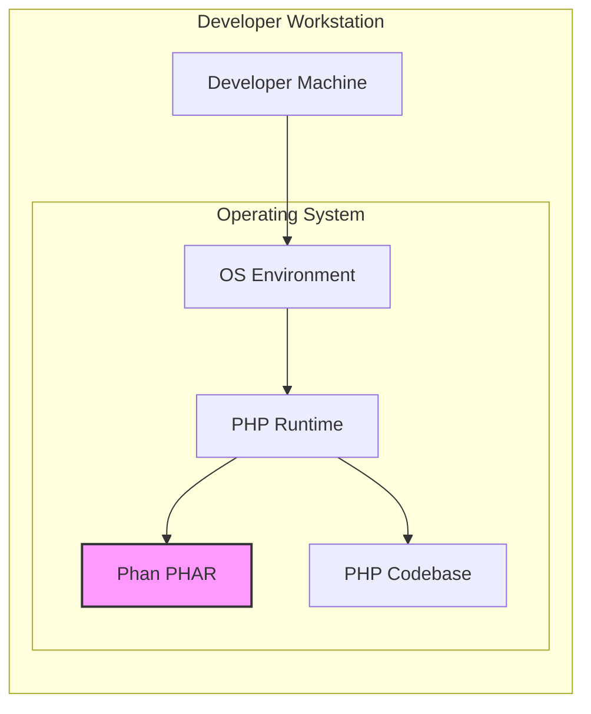

# BUSINESS POSTURE

This project aims to provide a static analysis tool for PHP, named Phan.

- Business Priorities:
  - Improve the quality and security of PHP codebases.
  - Reduce the number of bugs and vulnerabilities in PHP applications.
  - Enforce coding standards and best practices in PHP development.
  - Increase developer productivity by automating code analysis.

- Business Goals:
  - Offer a robust and accurate static analysis tool for PHP.
  - Provide actionable insights and recommendations to developers for code improvement.
  - Integrate seamlessly into existing PHP development workflows.
  - Support a wide range of PHP versions and frameworks.

- Business Risks:
  - Risk of false positives and false negatives in static analysis results, leading to developer frustration or missed vulnerabilities.
  - Risk of performance overhead during code analysis, impacting development speed.
  - Risk of vulnerabilities within Phan itself, potentially affecting the security of analyzed projects.
  - Risk of limited adoption if the tool is not user-friendly or does not provide sufficient value.

# SECURITY POSTURE

- Existing Security Controls:
  - security control: GitHub repository with standard GitHub security features (e.g., branch protection, vulnerability scanning for dependencies). Implemented by: GitHub.
  - security control: Open-source development model allowing for community review and contributions. Implemented by: GitHub repository and community.
  - security control: Reliance on PHP's security features and ecosystem. Implemented by: PHP runtime environment.

- Accepted Risks:
  - accepted risk: Inherent limitations of static analysis, leading to potential false positives and false negatives.
  - accepted risk: Performance impact of static analysis on development workflows.
  - accepted risk: Security vulnerabilities in third-party dependencies used by Phan.

- Recommended Security Controls:
  - security control: Regular security audits of Phan's codebase to identify and address potential vulnerabilities.
  - security control: Input validation and sanitization of analyzed PHP code to prevent code injection or other attacks against Phan itself.
  - security control: Dependency scanning and management to ensure Phan's dependencies are up-to-date and free of known vulnerabilities.
  - security control: Secure release process for Phan to prevent tampering or malicious modifications.
  - security control: Implementation of SAST (Static Application Security Testing) principles in Phan's design to minimize false negatives and improve accuracy.

- Security Requirements:
  - Authentication: Not directly applicable to Phan as a command-line tool. If Phan were to offer a web interface or API in the future, authentication would be required to control access.
  - Authorization: Not directly applicable to Phan as a command-line tool. Access control to the Phan repository and releases is managed by GitHub.
  - Input Validation: Critical for Phan. Phan must robustly handle and validate PHP code input to prevent vulnerabilities such as code injection or denial-of-service attacks against the analysis engine itself. This includes handling various PHP syntax constructs, file encodings, and potentially malicious code patterns.
  - Cryptography: Not directly required for Phan's core functionality of static analysis. Cryptography might be relevant if Phan were to implement features like secure updates or plugin verification in the future.

# DESIGN

## C4 CONTEXT



- Context Diagram Elements:
  - Element:
    - Name: Developer
    - Type: Person
    - Description: Software developer writing PHP code.
    - Responsibilities: Writes PHP code, uses Phan to analyze code quality and security, fixes issues reported by Phan.
    - Security controls: Code editor security features, developer workstation security controls.
  - Element:
    - Name: Phan Static Analyzer
    - Type: Software System
    - Description: Command-line tool for static analysis of PHP code.
    - Responsibilities: Parses PHP code, performs static analysis, identifies potential bugs, vulnerabilities, and code quality issues, generates reports.
    - Security controls: Input validation, secure coding practices, dependency management, secure release process.
  - Element:
    - Name: PHP Codebase
    - Type: Software System
    - Description: PHP source code repository being analyzed by Phan.
    - Responsibilities: Contains the PHP application code, configuration, and related files.
    - Security controls: Access control to the repository, code review processes, version control.
  - Element:
    - Name: CI/CD System
    - Type: Software System
    - Description: Continuous Integration and Continuous Delivery system used to automate build, test, and deployment processes.
    - Responsibilities: Automates the build and test process, integrates Phan into the pipeline to perform static analysis, reports analysis results, potentially blocks deployments based on analysis findings.
    - Security controls: CI/CD pipeline security, access control, secrets management, build environment security.

## C4 CONTAINER



- Container Diagram Elements:
  - Element:
    - Name: Phan CLI Application
    - Type: Application
    - Description: Command-line interface application that is the main entry point for Phan.
    - Responsibilities: Accepts user input (PHP code or project path), loads configuration, orchestrates the analysis process, invokes the PHP Parser and Analyzer Engine, generates reports, interacts with the Plugin System if enabled.
    - Security controls: Input validation, secure command-line argument parsing, secure configuration loading, logging and error handling.
  - Element:
    - Name: Configuration Files
    - Type: Configuration File
    - Description: Files (e.g., `.phan/config.php`) that store Phan's configuration settings, including analysis options, excluded files/directories, and plugin configurations.
    - Responsibilities: Defines the behavior of Phan, allows users to customize analysis settings.
    - Security controls: Access control to configuration files, validation of configuration parameters, secure storage of sensitive configuration data (if any).
  - Element:
    - Name: PHP Parser
    - Type: Library
    - Description: Component responsible for parsing PHP code into an Abstract Syntax Tree (AST) or similar representation that can be analyzed.
    - Responsibilities: Parses PHP code, handles different PHP syntax versions, reports parsing errors.
    - Security controls: Robust parsing logic to prevent vulnerabilities from malformed PHP code, handling of potential code injection during parsing.
  - Element:
    - Name: Analyzer Engine
    - Type: Core Component
    - Description: The core logic of Phan that performs static analysis on the parsed PHP code representation. This includes various analysis passes for bug detection, vulnerability identification, type checking, and code quality checks.
    - Responsibilities: Implements static analysis algorithms, detects code defects, enforces coding rules, generates analysis findings.
    - Security controls: Secure implementation of analysis algorithms, prevention of resource exhaustion during analysis, handling of potentially malicious code patterns, SAST principles implementation.
  - Element:
    - Name: Report Generator
    - Type: Component
    - Description: Component responsible for formatting and outputting the analysis results in various formats (e.g., text, JSON, XML).
    - Responsibilities: Generates reports in different formats, presents analysis findings to the user, allows customization of report output.
    - Security controls: Secure report generation to prevent information leakage, sanitization of output data, handling of potentially sensitive information in reports.
  - Element:
    - Name: Plugin System (Optional)
    - Type: Extension
    - Description: Optional plugin system that allows extending Phan's functionality with custom analysis rules, checks, and integrations.
    - Responsibilities: Provides extensibility to Phan, allows community contributions, enables integration with other tools.
    - Security controls: Plugin verification and validation, secure plugin loading and execution, isolation of plugins to prevent interference with core Phan functionality, access control for plugin installation and management.

## DEPLOYMENT

Deployment Option: Standalone PHAR Distribution



- Deployment Diagram Elements:
  - Element:
    - Name: Developer Machine
    - Type: Infrastructure
    - Description: Developer's local computer or virtual machine used for PHP development.
    - Responsibilities: Running Phan for local code analysis, developing PHP code.
    - Security controls: Workstation security controls, operating system security, user access control, endpoint protection.
  - Element:
    - Name: OS Environment
    - Type: Operating System
    - Description: Operating system (e.g., Linux, macOS, Windows) installed on the developer machine.
    - Responsibilities: Provides the underlying operating system environment for running PHP and Phan.
    - Security controls: OS security hardening, patching, access control, firewall.
  - Element:
    - Name: PHP Runtime
    - Type: Software
    - Description: PHP interpreter installed on the developer machine, required to execute Phan (which is written in PHP).
    - Responsibilities: Executes PHP code, provides PHP language features and libraries.
    - Security controls: PHP runtime security configuration, up-to-date PHP version, enabled security extensions.
  - Element:
    - Name: Phan PHAR
    - Type: Software Artifact
    - Description: Self-contained PHAR (PHP Archive) file containing the Phan application and its dependencies.
    - Responsibilities: Provides the executable form of Phan, distributed for easy installation and execution.
    - Security controls: Secure build process for PHAR creation, code signing of PHAR (if applicable), integrity checks during download and execution.
  - Element:
    - Name: PHP Codebase
    - Type: Data
    - Description: PHP source code files being analyzed by Phan, located on the developer machine's file system.
    - Responsibilities: Contains the PHP application code to be analyzed.
    - Security controls: File system access control, code repository security, encryption at rest (if required).

## BUILD

```mermaid
flowchart LR
    A["Developer"] -->|Code Changes, Commit, Push| B["GitHub Repository"]
    B -->|Webhook Trigger| C["GitHub Actions CI"]
    C -->|Checkout Code| D["Build Environment"]
    D -->|Install Dependencies (Composer)| E["Dependencies"]
    D -->|Run Linters & SAST (Phan)| F["Analysis Results"]
    D -->|Package as PHAR| G["Phan PHAR Artifact"]
    C -->|Upload Artifacts| H["GitHub Releases"]
    style G fill:#f9f,stroke:#333,stroke-width:2px
```

- Build Process Description:
  - Developer commits and pushes code changes to the GitHub repository.
  - GitHub repository webhook triggers a GitHub Actions workflow upon code push.
  - GitHub Actions CI environment is initiated.
  - Code is checked out into the build environment.
  - Dependencies are installed using Composer.
  - Linters and SAST tools (including Phan itself potentially for self-analysis) are executed.
  - Phan is packaged as a PHAR archive.
  - PHAR artifact is uploaded to GitHub Releases.

- Build Security Controls:
  - security control: Secure GitHub repository with access control and branch protection. Implemented by: GitHub.
  - security control: Use of GitHub Actions for automated CI/CD pipelines. Implemented by: GitHub Actions.
  - security control: Secure build environment in GitHub Actions, isolated and ephemeral. Implemented by: GitHub Actions.
  - security control: Dependency management using Composer with `composer.lock` for reproducible builds. Implemented by: Composer.
  - security control: Running linters and SAST tools (including Phan itself) during the build process to identify code quality and security issues early. Implemented by: GitHub Actions workflow configuration.
  - security control: Secure packaging of Phan as PHAR, potentially including code signing. Implemented by: Build scripts in GitHub Actions.
  - security control: Uploading build artifacts (Phan PHAR) to GitHub Releases for secure distribution. Implemented by: GitHub Releases.
  - security control: Regular security audits of build scripts and CI/CD configurations. Implemented by: Project maintainers.
  - security control: Supply chain security considerations for dependencies used in Phan's build process. Implemented by: Dependency scanning and management, Composer's security features.

# RISK ASSESSMENT

- Critical Business Processes:
  - Development of PHP applications.
  - Ensuring the quality and security of PHP code.
  - Maintaining developer productivity.

- Data to Protect:
  - PHP Source Code: Sensitivity varies depending on the project. For proprietary software, it is highly sensitive intellectual property. For open-source projects, it is publicly available but still needs to be protected from unauthorized modification in the repository.
  - Analysis Results: Potentially sensitive if they reveal vulnerabilities or security weaknesses in the code. Should be protected from unauthorized access or disclosure, especially in CI/CD environments.
  - Phan's Source Code: Needs to be protected to maintain the integrity and security of the tool itself.

- Data Sensitivity:
  - PHP Source Code: High to Public (depending on the project).
  - Analysis Results: Medium to High (depending on the findings and context).
  - Phan's Source Code: Medium (open source, but integrity is important).

# QUESTIONS & ASSUMPTIONS

- Questions:
  - Are there any plans to offer a web-based interface or API for Phan in the future? (Assumption: Currently CLI only).
  - Are there any mechanisms for users to contribute custom analysis rules or plugins? (Assumption: Plugin system exists or is planned).
  - What is the process for reporting and addressing security vulnerabilities in Phan itself? (Assumption: Standard open-source vulnerability reporting process).
  - How is Phan tested and validated to ensure accuracy and minimize false positives/negatives? (Assumption: Testing and validation are part of the development process).

- Assumptions:
  - BUSINESS POSTURE: The primary business goal is to improve PHP code quality and security for developers.
  - SECURITY POSTURE: Security is a significant concern, both for the analyzed code and for Phan itself. Standard open-source security practices are followed.
  - DESIGN: Phan is primarily a command-line tool, distributed as a PHAR file or via Composer. It is designed to be integrated into developer workflows and CI/CD pipelines.