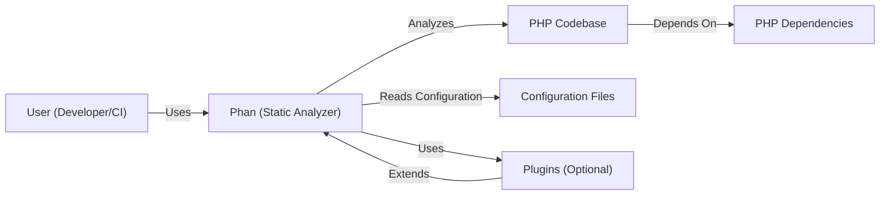
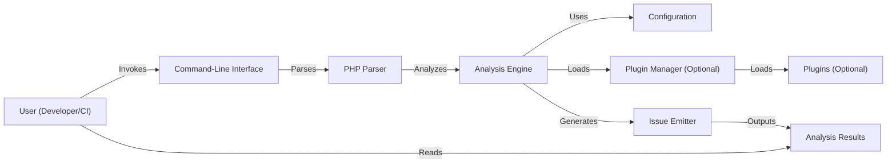
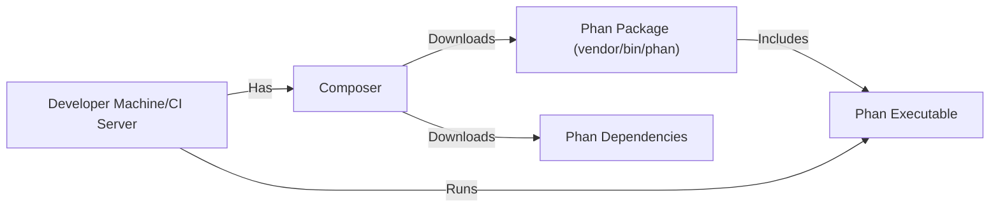
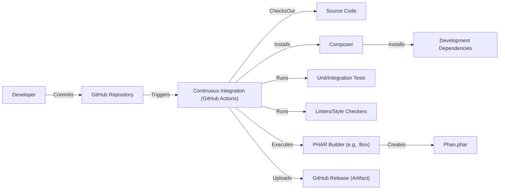

# BUSINESS POSTURE

Phan, as a static analysis tool for PHP, aims to improve code quality and reduce bugs in PHP projects. The primary business priorities and goals are:

*   Enhance software reliability: Reduce the likelihood of runtime errors and unexpected behavior in PHP applications.
*   Improve developer productivity: Help developers identify and fix potential issues early in the development lifecycle, saving time and effort.
*   Facilitate code maintainability: Promote cleaner, more understandable, and easier-to-maintain codebases.
*   Support a wide range of PHP versions: Be compatible with various PHP versions, allowing its use in diverse projects.
*   Provide extensibility: Allow users to customize and extend the analysis through plugins and configuration options.

The most important business risks that need to be addressed are:

*   False positives/negatives: Inaccurate analysis results can mislead developers, wasting time or allowing bugs to slip through.
*   Performance issues: Slow analysis can disrupt development workflows and hinder adoption.
*   Compatibility problems: Inability to analyze codebases using specific PHP versions or language features limits its usefulness.
*   Complexity of configuration: Difficult setup or customization can deter users.
*   Security vulnerabilities in Phan itself: Vulnerabilities in the analyzer could be exploited to compromise the systems on which it runs or the codebases it analyzes.

# SECURITY POSTURE

*   security control: Phan is a command-line tool, executed in a controlled environment (developer's machine or CI/CD pipeline).
*   security control: Phan operates on source code, not on live systems or production data.
*   security control: Phan's input (PHP source code) is inherently trusted in the context of its intended use (analyzing the user's own codebase).
*   security control: Phan's output is informational, providing analysis results to the user, not modifying the analyzed code directly.
*   security control: Phan's core functionality does not involve network communication or external data access.
*   security control: Phan's plugin system allows for extending functionality, but plugins are user-provided and run with the same privileges as Phan itself.
*   security control: Phan is developed using secure coding practices, with regular updates and vulnerability fixes. Described in: [https://github.com/phan/phan/security/policy](https://github.com/phan/phan/security/policy)
*   security control: Phan uses automated testing and continuous integration to ensure code quality and prevent regressions. Described in: [https://github.com/phan/phan/actions](https://github.com/phan/phan/actions)
*   accepted risk: Phan's analysis is based on heuristics and may produce false positives or negatives.
*   accepted risk: Phan's plugin system introduces a potential risk if users install malicious or poorly written plugins.
*   accepted risk: Phan's dependencies could have vulnerabilities.

Recommended security controls:

*   security control: Implement a mechanism for verifying the integrity of downloaded Phan releases (e.g., code signing).
*   security control: Provide guidance and tooling for users to assess the security of Phan plugins.
*   security control: Regularly audit Phan's dependencies for known vulnerabilities.
*   security control: Consider sandboxing the execution of Phan plugins to limit their potential impact.

Security Requirements:

*   Authentication: Not applicable, as Phan is a command-line tool executed locally.
*   Authorization: Not applicable, as Phan operates on the user's own codebase with the user's privileges.
*   Input Validation:
    *   Phan must handle malformed or unexpected PHP code gracefully, without crashing or exhibiting undefined behavior.
    *   Phan should validate configuration files and plugin inputs to prevent injection vulnerabilities.
*   Cryptography:
    *   If Phan implements any features involving network communication or sensitive data handling (e.g., reporting, plugin updates), appropriate cryptographic measures (e.g., TLS) should be used.
*   Output Encoding: Not applicable, as Phan's output is text-based analysis results.

# DESIGN

## C4 CONTEXT

*   User (Developer/CI):
    *   Name: User
    *   Type: Person/System
    *   Description: A developer or a continuous integration system that uses Phan to analyze PHP code.
    *   Responsibilities: Running Phan, interpreting its output, and fixing identified issues.
    *   Security controls: Executes Phan in a controlled environment.
*   Phan (Static Analyzer):
    *   Name: Phan
    *   Type: Software System
    *   Description: The static analysis tool for PHP.
    *   Responsibilities: Analyzing PHP code, reporting potential issues, and providing configuration options.
    *   Security controls: Operates on source code, informational output, controlled execution environment.
*   PHP Codebase:
    *   Name: PHP Codebase
    *   Type: Code
    *   Description: The PHP source code being analyzed.
    *   Responsibilities: N/A (passive input).
    *   Security controls: Inherently trusted in the context of static analysis.
*   Configuration Files:
    *   Name: Configuration Files
    *   Type: Data
    *   Description: Files that configure Phan's behavior (e.g., .phan/config.php).
    *   Responsibilities: N/A (passive input).
    *   Security controls: Should be validated by Phan.
*   Plugins (Optional):
    *   Name: Plugins
    *   Type: Code
    *   Description: Optional extensions that add functionality to Phan.
    *   Responsibilities: Extending Phan's analysis capabilities.
    *   Security controls: User-provided, run with Phan's privileges, potential security risk.
*   PHP Dependencies
    *   Name: PHP Dependencies
    *   Type: Code
    *   Description: External libraries used by PHP Codebase.
    *   Responsibilities: N/A
    *   Security controls: N/A

## C4 CONTAINER

*   Command-Line Interface (CLI):
    *   Name: CLI
    *   Type: Component
    *   Description: The entry point for Phan, handling command-line arguments and options.
    *   Responsibilities: Parsing user input, initiating analysis, and displaying results.
    *   Security controls: Standard command-line interface security practices.
*   PHP Parser:
    *   Name: Parser
    *   Type: Component
    *   Description: Parses PHP source code into an Abstract Syntax Tree (AST).
    *   Responsibilities: Transforming source code into a structured representation for analysis.
    *   Security controls: Must handle malformed code gracefully.
*   Analysis Engine:
    *   Name: Analyzer
    *   Type: Component
    *   Description: The core of Phan, performing static analysis on the AST.
    *   Responsibilities: Applying analysis rules, detecting issues, and managing the analysis process.
    *   Security controls: Core logic, should be thoroughly tested and reviewed.
*   Configuration:
    *   Name: Configuration
    *   Type: Data
    *   Description: Configuration settings that control Phan's behavior.
    *   Responsibilities: Providing parameters for analysis rules and other options.
    *   Security controls: Should be validated to prevent injection vulnerabilities.
*   Plugin Manager (Optional):
    *   Name: Plugin Manager
    *   Type: Component
    *   Description: Manages the loading and execution of Phan plugins.
    *   Responsibilities: Loading plugins, providing an API for plugins to interact with Phan.
    *   Security controls: Should isolate plugins to limit their potential impact.
*   Plugins (Optional):
    *   Name: Plugins
    *   Type: Component
    *   Description: User-provided extensions that add custom analysis rules or functionality.
    *   Responsibilities: Extending Phan's capabilities.
    *   Security controls: User-provided, potential security risk.
*   Issue Emitter:
    *   Name: Emitter
    *   Type: Component
    *   Description: Formats and outputs the analysis results.
    *   Responsibilities: Presenting the findings in a user-friendly format (e.g., text, JSON).
    *   Security controls: Output should be properly escaped if displayed in a web context.
*   Analysis Results:
    *   Name: Output
    *   Type: Data
    *   Description: The output of Phan's analysis, reporting potential issues.
    *   Responsibilities: N/A (passive output).
    *   Security controls: Informational output, no direct security implications.

## DEPLOYMENT

Phan is typically deployed as a command-line tool, installed locally on a developer's machine or on a CI/CD server. Several deployment options exist:

1.  **Composer (Recommended):** Installing Phan as a project dependency using Composer.
2.  **PHAR:** Downloading a pre-built PHAR archive.
3.  **Git:** Cloning the Phan repository and building it from source.
4.  **Docker:** Using a pre-built Docker image.

We will describe deployment using Composer, as it is the recommended approach.

*   Developer Machine/CI Server:
    *   Name: Developer Machine/CI Server
    *   Type: Environment
    *   Description: The environment where Phan is installed and executed.
    *   Responsibilities: Providing the runtime environment for Phan.
    *   Security controls: Should be a controlled and secure environment.
*   Composer:
    *   Name: Composer
    *   Type: Tool
    *   Description: PHP's dependency manager.
    *   Responsibilities: Downloading and managing Phan and its dependencies.
    *   Security controls: Uses HTTPS to download packages, verifies package signatures (if available).
*   Phan Package (vendor/bin/phan):
    *   Name: Phan Package
    *   Type: Package
    *   Description: The Phan package, installed by Composer.
    *   Responsibilities: Containing the Phan executable and its dependencies.
    *   Security controls: Installed in a project-specific directory (vendor).
*   Phan Dependencies:
    *   Name: Dependencies
    *   Type: Package
    *   Description: Libraries that Phan depends on.
    *   Responsibilities: Providing necessary functionality for Phan.
    *   Security controls: Managed by Composer, potential source of vulnerabilities.
*   Phan Executable:
    *   Name: Phan Executable
    *   Type: Executable
    *   Description: The main Phan executable file.
    *   Responsibilities: Running the static analysis.
    *   Security controls: Executed with the user's privileges.

## BUILD

Phan's build process involves several steps, from source code to a distributable package. The primary build method is creating a PHAR archive.

*   Developer: Initiates the build process by committing code.
*   GitHub Repository: Hosts the source code and triggers the CI pipeline.
*   Continuous Integration (GitHub Actions): Automates the build and testing process.
*   Source Code: The Phan source code.
*   Composer: Installs development dependencies (e.g., testing frameworks).
*   Development Dependencies: Libraries required for building and testing Phan.
*   Unit/Integration Tests: Verify the correctness of Phan's components.
*   Linters/Style Checkers: Enforce code style and identify potential issues.
*   PHAR Builder (e.g., Box): Creates a PHAR archive containing Phan and its runtime dependencies.
*   Phan.phar: The distributable PHAR archive.
*   GitHub Release (Artifact): The PHAR archive is uploaded as a release artifact.

Security controls during the build process:

*   security control: Automated testing (unit and integration tests) to catch bugs early.
*   security control: Linting and style checking to enforce code quality and consistency.
*   security control: Continuous integration (GitHub Actions) to automate the build and testing process, ensuring consistency and repeatability.
*   security control: Dependency management using Composer, which helps track and manage dependencies.
*   security control: Use of a PHAR builder (like Box) which can be configured to include only necessary files, reducing the attack surface.

# RISK ASSESSMENT

*   Critical business processes we are trying to protect:
    *   Software development lifecycle: Ensuring that Phan integrates smoothly into the development workflow and helps produce high-quality code.
    *   Reputation: Maintaining Phan's reputation as a reliable and effective static analysis tool.

*   Data we are trying to protect and their sensitivity:
    *   Source code: Phan analyzes user's source code, which is considered highly sensitive intellectual property. However, Phan operates locally and does not transmit the source code anywhere.
    *   Configuration files: Phan's configuration files may contain user-specific settings, but generally do not contain highly sensitive information.
    *   Analysis results: The output of Phan's analysis may reveal potential vulnerabilities in the user's code. This information is sensitive and should be treated with care. However, Phan does not store or transmit this data; it is presented directly to the user.

# QUESTIONS & ASSUMPTIONS

*   Questions:
    *   Are there any specific compliance requirements (e.g., coding standards, security certifications) that Phan needs to adhere to?
    *   What is the expected scale of codebases that Phan will be used to analyze (number of lines of code, number of files)?
    *   What are the performance expectations for Phan (analysis time)?
    *   Are there any specific PHP frameworks or libraries that Phan should provide enhanced support for?
    *   What is the process for reporting and handling security vulnerabilities discovered in Phan?

*   Assumptions:
    *   BUSINESS POSTURE: Users are primarily concerned with improving code quality and reducing bugs, not with enforcing strict security policies through static analysis alone.
    *   SECURITY POSTURE: Users trust the environment in which they run Phan (their local machine or CI/CD server).
    *   DESIGN: Phan's core functionality will remain focused on static analysis of PHP code, without expanding into areas like dynamic analysis or runtime monitoring.
    *   DESIGN: The primary distribution method will continue to be through Composer and PHAR archives.
    *   DESIGN: Phan will continue to support a plugin architecture for extensibility.