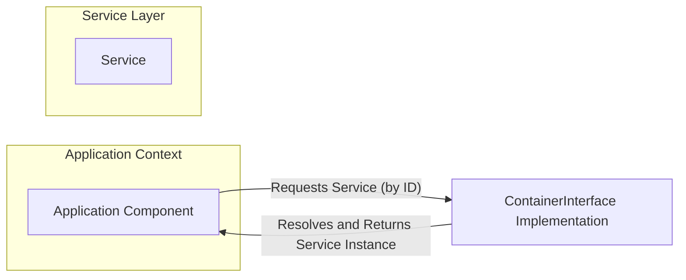
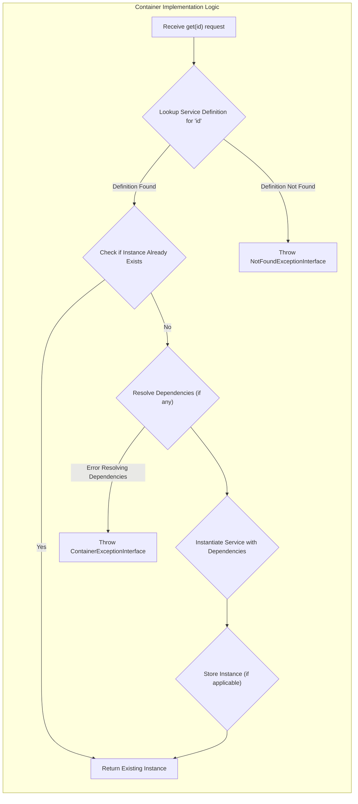
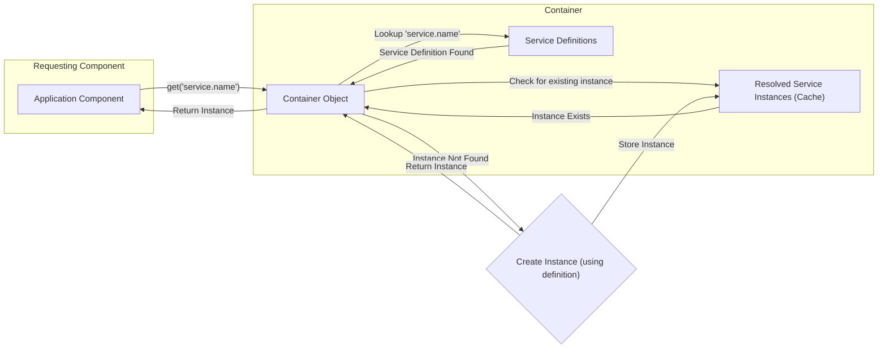

# Project Design Document: PHP-FIG Container Interface

**Version:** 1.1
**Date:** October 26, 2023
**Author:** AI Software Architect

## 1. Introduction

This document provides an enhanced design overview of the PHP-FIG Container interface project. The primary goal is to offer a clear and comprehensive understanding of the architecture, components, and interactions within the system. This detailed design will serve as a robust foundation for subsequent threat modeling activities, enabling a thorough security analysis of the project.

## 2. Goals and Objectives

The central goal of the PHP-FIG Container project remains the definition of a standard interface for dependency injection containers in PHP. The key objectives are further elaborated below:

* **Strict Interoperability:**  Guarantee that different container implementations adhering to this interface can be seamlessly substituted within PHP applications without requiring code modifications in the consuming application.
* **Minimalist Simplicity:**  Maintain a lean and easily understandable interface, focusing on the core functionalities of a dependency injection container. This simplicity aids in adoption and reduces the learning curve for developers.
* **Implementation Flexibility:**  Allow for a wide range of internal implementation strategies for concrete container libraries. The interface should not impose unnecessary constraints on how containers manage their dependencies.
* **Ecosystem Standardization:**  Establish a widely accepted standard for dependency injection in the PHP ecosystem, fostering code reusability and simplifying the integration of different libraries and frameworks.

## 3. Scope

This design document specifically focuses on the definition of the `ContainerInterface`, `ContainerExceptionInterface`, and `NotFoundExceptionInterface` within the `php-fig/container` repository. It comprehensively covers the core functionalities exposed by these interfaces and the expected behavior of any implementation conforming to them. The document intentionally avoids detailing the internal workings or specific features of individual container libraries.

## 4. High-Level Design

The project revolves around the `ContainerInterface`, which acts as a contract for dependency injection containers. The primary interaction involves an "Application Component" requesting a "Service" from a "Container Implementation".

**Key Entities:**

* **Application Component:** Any part of the application code that needs to utilize services managed by the container.
* **`ContainerInterface` Implementation:** A concrete PHP class that implements the `ContainerInterface`, responsible for managing and providing service instances.
* **Service:**  An object or value that is managed by the container and can be injected into other components. The definition of a service is handled by the container implementation.

## 5. Detailed Design

### 5.1. `ContainerInterface` Methods

The `ContainerInterface` defines the essential methods for interacting with a dependency injection container.

* **`get(string $id): mixed`**:
    * **Purpose:**  Retrieves a registered service or value from the container based on its unique identifier.
    * **Parameters:**
        * `$id` (string):  A string representing the unique identifier of the service to be retrieved. This identifier is used to look up the corresponding service definition within the container.
    * **Return Value:** The resolved service instance or value associated with the given `$id`. The returned type can be any valid PHP data type.
    * **Exceptions:**
        * `NotFoundExceptionInterface`:  Thrown if no service or value is registered with the provided `$id`. This indicates that the requested dependency is not known to the container.
        * `ContainerExceptionInterface`: Thrown if an error occurs during the process of retrieving the service. This could include issues during instantiation, dependency resolution, or other internal container operations.

* **`has(string $id): bool`**:
    * **Purpose:** Checks if the container can provide a service or value for the given identifier without actually retrieving it. This is useful for determining if a dependency is registered before attempting to retrieve it.
    * **Parameters:**
        * `$id` (string): The string identifier of the service to check for.
    * **Return Value:** `true` if a service or value is registered with the given `$id`, and `false` otherwise.
    * **Exceptions:** None. This method is designed to be non-intrusive and should not throw exceptions related to service retrieval.

### 5.2. Exception Interfaces

The `php-fig/container` project defines specific exception interfaces to ensure consistent error handling across different container implementations.

* **`ContainerExceptionInterface`**:
    * **Purpose:**  Serves as the base interface for all exceptions that can be thrown by a container implementation. This provides a common type to catch general container-related errors.
    * **Extends:** `Throwable`. This ensures that all container exceptions can be caught using standard exception handling mechanisms in PHP.
    * **Usage:** Any exception specific to the container's internal operations or service resolution process should implement this interface. This allows consumers to differentiate container exceptions from other types of exceptions.

* **`NotFoundExceptionInterface`**:
    * **Purpose:**  A specialized exception interface indicating that a requested service or value could not be found within the container.
    * **Extends:** `ContainerExceptionInterface`. This signifies that a "not found" error is a specific type of container exception.
    * **Usage:** The `get()` method MUST throw an exception implementing this interface when the provided service identifier does not correspond to any registered service.

### 5.3. Service Registration (Implementation-Specific Details)

While the `ContainerInterface` defines *how* to retrieve services, it deliberately leaves the *how* of service registration to the individual container implementations. This design choice promotes flexibility and allows containers to adopt different registration strategies. Common methods include:

* **Array-Based Configuration:** Defining services and their dependencies within associative arrays, often loaded from configuration files.
* **Fluent Interface Registration:** Providing a programmatic API with method chaining to register services and their dependencies.
* **Attribute-Based Registration (PHP 8+):** Utilizing PHP attributes to mark classes as services and define their dependencies directly within the class definition.
* **XML or YAML Configuration:** Defining service configurations in XML or YAML files.
* **Auto-wiring and Auto-discovery:** Automatically registering services and resolving dependencies based on type hints and naming conventions.

### 5.4. Service Resolution Process

The core responsibility of a container is to resolve dependencies and provide instances of requested services. The `get()` method initiates this process. The specific steps involved in resolution are implementation-dependent but generally follow this pattern:

* **Identifier Lookup:** The container receives a service identifier (the `$id` passed to `get()`). It then searches its internal registry or configuration for a matching service definition.
* **Existence Check:** The container verifies if a definition exists for the given identifier. If not, a `NotFoundExceptionInterface` is typically thrown.
* **Instance Check:** If a definition is found, the container checks if an instance of the service has already been created and stored (for singleton or cached services).
* **Dependency Resolution:** If an instance does not exist, the container analyzes the service definition to identify its dependencies. It then recursively resolves these dependencies, potentially using the `get()` method itself.
* **Service Instantiation:** Once all dependencies are resolved, the container instantiates the service, injecting the resolved dependencies as needed.
* **Instance Storage (Optional):** For services configured as singletons or with specific caching strategies, the newly created instance is stored for future requests.
* **Instance Return:** The resolved and instantiated service instance is returned to the requesting component.

## 6. Data Flow

The primary data flow involves an application component requesting a service, the container processing this request, and ultimately returning the service instance.

## 7. Security Considerations (For Threat Modeling)

This section expands on potential security considerations to guide threat modeling efforts.

* **Injection of Malicious Service Definitions:** If the mechanism for registering services is not properly secured, an attacker could inject malicious service definitions.
    * **Attack Vector:** Exploiting vulnerabilities in configuration loading, insecure access to registration APIs, or code injection flaws.
    * **Potential Impact:** Remote code execution by registering a service that executes arbitrary commands upon instantiation, data exfiltration by registering a service that intercepts sensitive data, or denial of service by registering a resource-intensive service.
    * **Example:**  Injecting a service definition that overrides a core application service with a compromised version.
* **Unauthorized Access to Services:** If the container lacks proper access controls, an attacker might be able to retrieve and utilize services they are not intended to access.
    * **Attack Vector:**  Exploiting vulnerabilities in how service access is determined or if the container exposes services without proper authentication.
    * **Potential Impact:** Information disclosure by accessing sensitive data through unauthorized services, privilege escalation by accessing administrative services, or data manipulation by interacting with services that modify data.
    * **Example:** Accessing a database connection service intended only for specific modules, leading to unauthorized data access.
* **Denial of Service through Resource Exhaustion:**  An attacker could flood the container with requests for complex or resource-intensive services, leading to resource exhaustion and application unavailability.
    * **Attack Vector:**  Sending a large number of requests for services with many dependencies or services that perform computationally expensive operations.
    * **Potential Impact:**  Application downtime, impacting availability and potentially leading to financial losses or reputational damage.
    * **Example:**  Repeatedly requesting a service that performs a complex image processing operation.
* **Information Disclosure via Exception Handling:**  Verbose error messages, particularly from `NotFoundExceptionInterface` or `ContainerExceptionInterface`, could reveal sensitive information about the application's internal structure, dependencies, or even file paths.
    * **Attack Vector:**  Triggering exceptions by providing invalid service identifiers or causing errors during service resolution.
    * **Potential Impact:**  Leaking information that can be used to plan further attacks or understand the application's architecture.
* **Vulnerabilities in Underlying Container Implementations:**  Security flaws within the specific container library being used (e.g., bugs in dependency resolution logic, insecure handling of service lifetimes) could be exploited.
    * **Attack Vector:**  Depends on the specific vulnerability in the chosen container implementation.
    * **Potential Impact:**  Remote code execution, arbitrary code injection, or other security breaches depending on the nature of the vulnerability.
* **Insecure Serialization/Deserialization:** If service definitions or instances involve serialization (e.g., for caching or persistence), vulnerabilities related to insecure deserialization could allow for remote code execution.
    * **Attack Vector:**  Providing malicious serialized data to the container.
    * **Potential Impact:**  Remote code execution, allowing the attacker to gain control of the server.

## 8. Future Considerations

* **Standardized Service Tagging:**  Consider adding optional mechanisms for tagging services, allowing for more flexible service retrieval and grouping.
* **Service Providers Interface:** Explore the possibility of a standardized interface for service providers, enabling modular registration of services and configurations.
* **Asynchronous Service Resolution:**  Investigate potential patterns for asynchronous service resolution to improve performance in certain scenarios.
* **Integration with Configuration Management Standards:**  Explore ways to better integrate the container interface with existing configuration management standards and practices.

## 9. Conclusion

This enhanced design document provides a more detailed and comprehensive understanding of the PHP-FIG Container interface project. By elaborating on the goals, architecture, components, and security considerations, this document serves as a valuable resource for developers and security professionals alike. It provides a solid foundation for conducting thorough threat modeling and ensuring the secure implementation and usage of dependency injection containers in PHP applications.
