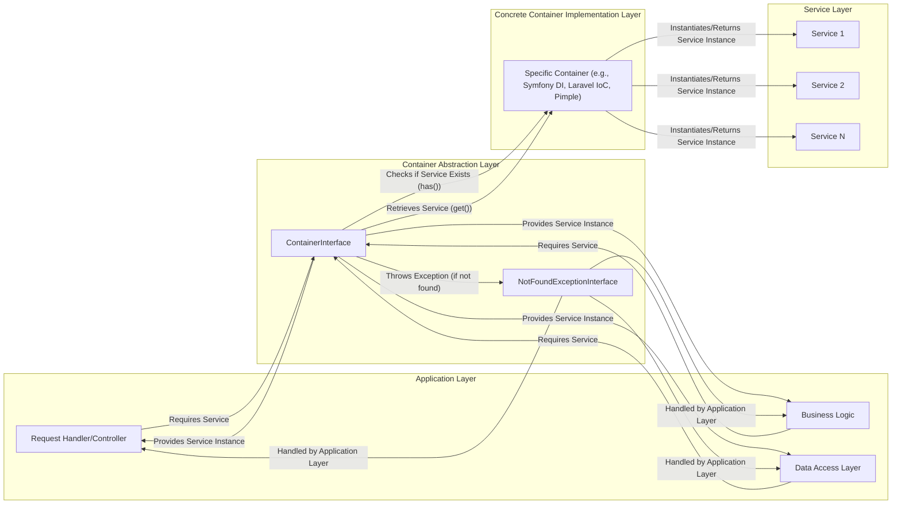

# Project Design Document: PHP-FIG Container Interface (PSR-11)

**Version:** 1.1
**Date:** October 26, 2023
**Author:** AI Software Architect

## 1. Introduction

This document provides an enhanced design overview of the PHP-FIG Container interface specification (PSR-11). While the linked repository defines an interface rather than a concrete implementation, this design document focuses on the architectural context, interaction patterns, and potential security implications associated with the *use* of this interface within software projects. This document is intended to serve as a comprehensive foundation for subsequent threat modeling activities.

## 2. Goals and Objectives

The fundamental goal of the PHP-FIG Container interface is to establish a standardized mechanism for interacting with dependency injection containers within PHP applications. This standardization promotes interoperability among different container implementations, enabling developers to create loosely coupled code that is not bound to a specific container library.

Key objectives of this design (from a usage perspective) include:

*   Defining a common and consistent interface for retrieving service instances from a container.
*   Providing a standardized way to check if a specific service is defined within the container.
*   Facilitating the decoupling of application logic from the specifics of the underlying dependency injection container.
*   Enabling the development of reusable components and libraries that can seamlessly integrate with various PSR-11 compliant container implementations.

## 3. Scope

This design document focuses on the logical architecture, data flow, and security considerations relevant to the utilization of the `ContainerInterface` as defined in the linked repository. The scope encompasses:

*   The core interface definitions: `ContainerInterface` and `NotFoundExceptionInterface`.
*   The typical interaction lifecycle between application code and a container implementing this interface.
*   Detailed security considerations and potential attack vectors associated with the use of dependency injection containers adhering to this interface.
*   The context of how this interface integrates within a broader application architecture.

This document explicitly excludes:

*   The internal implementation details and algorithms of specific dependency injection container libraries.
*   The diverse configuration methods and syntaxes employed by different container implementations.
*   The specific procedures for defining and registering services within a container.
*   Performance benchmarks and optimization strategies for various container implementations.

## 4. System Architecture (Conceptual)

The system architecture, in this context, illustrates how application code interacts with a container implementing the `ContainerInterface` within a broader application structure.

**Components:**

*   **Application Layer:** Represents the various parts of the application that utilize services managed by the container. This can include request handlers, controllers, business logic components, and data access layers.
*   **Request Handler/Controller:**  Entry points for handling user requests or external events, often requiring services from the container.
*   **Business Logic:** Components responsible for implementing the core business rules and logic of the application, often relying on various services.
*   **Data Access Layer:** Components responsible for interacting with data sources, often implemented as services managed by the container.
*   **ContainerInterface:** The PHP interface defining the standard methods (`get()` and `has()`) for interacting with a dependency injection container. This acts as an abstraction layer.
*   **NotFoundExceptionInterface:** The interface for exceptions thrown when a requested service is not found within the container.
*   **Concrete Container Implementation Layer:**  A specific dependency injection container library that implements the `ContainerInterface`. This layer handles the actual service instantiation, management, and dependency resolution. Examples include Symfony DependencyInjection, Laravel IoC, and Pimple.
*   **Service Layer:** Represents the individual services managed by the container. These are the concrete implementations of the functionalities used by the application.

**Interaction Flow:**

1. A component within the **Application Layer** (e.g., a **Request Handler/Controller**) requires a specific service to fulfill its responsibilities.
2. It interacts with the **ContainerInterface**, typically by calling the `get()` method and providing the service's identifier (name or class).
3. The **ContainerInterface** implementation within the **Concrete Container Implementation Layer** receives the request.
4. The **Specific Container** checks its configuration to determine if a service with the given identifier is registered using the `has()` method internally.
5. If the service is registered, the **Specific Container** instantiates the service instance (if not already instantiated) and manages its dependencies.
6. The **Specific Container** returns the instantiated **Service** (from the **Service Layer**) back through the **ContainerInterface**.
7. The **ContainerInterface** provides the service instance to the requesting component in the **Application Layer**.
8. If the service is not registered, the **Specific Container** throws an exception that implements the `NotFoundExceptionInterface`.
9. The exception is caught and handled by the requesting component within the **Application Layer**.
10. Components in the **Application Layer** can also use the `has()` method of the **ContainerInterface** to proactively check for the existence of a service before attempting to retrieve it.

## 5. Data Flow

The primary data elements flowing through this system are service identifiers and service instances, along with control signals indicating success or failure.

*   **Service Identifier (String, Class Name, or Symbol):**  Used by components in the **Application Layer** to uniquely identify and request a specific service from the container. This identifier is passed as an argument to the `get()` and `has()` methods of the `ContainerInterface`. This data can be considered potentially sensitive if it reveals implementation details.
*   **Service Instance (Object):** The concrete object representing the requested service, containing its internal state and methods. This is the core data payload returned by the container to the requesting component. The sensitivity of this data depends on the nature of the service.
*   **Boolean (True/False):** The return value of the `has()` method, indicating the presence or absence of a service with the given identifier. This information, while seemingly innocuous, could be used by attackers to probe the application's internal structure.
*   **Exception (Object implementing NotFoundExceptionInterface):**  An exception object thrown when a requested service is not found. This object might contain information about the missing service identifier, which could be valuable to an attacker attempting to understand the application's dependencies.

## 6. Security Considerations

While the `ContainerInterface` itself is an abstraction and doesn't directly introduce vulnerabilities, its usage and the security posture of the underlying container implementations are critical security considerations.

*   **Dependency Vulnerabilities (Supply Chain Risk):** The services managed by the container are dependencies of the application. Vulnerabilities within these dependencies (e.g., outdated libraries with known exploits) can be exploited. The container itself does not inherently mitigate these vulnerabilities. Attackers could potentially compromise the application by targeting vulnerable dependencies instantiated and managed by the container.
*   **Unauthorized Access to Services:** Depending on the container's implementation and configuration, vulnerabilities might exist that allow unauthorized access to specific services. If access controls are not properly implemented or configured, an attacker could potentially retrieve and utilize sensitive services they should not have access to. This could lead to data breaches or unauthorized actions.
*   **Insecure Service Instantiation:** The container is responsible for instantiating services. If the instantiation process involves external data or configurations that are not properly validated or sanitized, it can introduce security risks. For example, if service creation involves deserializing untrusted data, it could lead to remote code execution vulnerabilities through insecure deserialization.
*   **Exposure of Sensitive Information via Services:** Services managed by the container might hold or process sensitive information (e.g., database credentials, API keys, personal data). If these services are not designed and implemented with security in mind, or if the container itself doesn't protect access to these services, this sensitive information could be exposed through various attack vectors.
*   **Denial of Service (DoS) Attacks Targeting Service Instantiation:**  Poorly implemented or configured containers could be susceptible to DoS attacks. For example, if retrieving a particular service triggers a computationally expensive or resource-intensive operation without proper rate limiting or safeguards, an attacker could repeatedly request that service to exhaust server resources and cause a denial of service.
*   **Injection Attacks (Indirectly Facilitated):** While the `ContainerInterface` itself doesn't directly cause injection attacks, the services retrieved from the container might be vulnerable to various injection attacks (e.g., SQL injection, command injection) if they process user input without proper sanitization and validation. The container simply provides these services, and the security of their implementation is paramount.
*   **Container Configuration Vulnerabilities:** The configuration of the dependency injection container itself can be a source of vulnerabilities. If the configuration files are not properly secured or if the configuration process allows for injecting malicious configurations, attackers could potentially manipulate the container to instantiate malicious services or alter the behavior of existing services.
*   **Service Definition Overriding:** In some container implementations, it might be possible to override existing service definitions. If this capability is not properly secured, an attacker could potentially replace legitimate services with malicious ones, leading to various security compromises.

## 7. Dependencies

The `ContainerInterface` specification itself has minimal direct dependencies. The primary dependency is:

*   **PHP:** The interface is defined and implemented within the PHP programming language environment.

However, concrete implementations of the `ContainerInterface` (the actual container libraries) will have their own set of dependencies, which can vary significantly depending on the specific library. These dependencies introduce their own potential security considerations.

## 8. Deployment Considerations

The `ContainerInterface` is a language-level abstraction and does not have specific deployment considerations in isolation. However, the deployment of applications utilizing this interface involves several crucial aspects:

*   **Selection and Inclusion of a Concrete Container Implementation:**  A specific dependency injection container library (e.g., Symfony DependencyInjection, Laravel IoC, Pimple) must be chosen and included as a dependency in the project (e.g., via Composer). The security of the chosen container library and its dependencies is a critical factor.
*   **Secure Container Configuration:** The container needs to be configured with the definitions of the services it will manage. This configuration often involves sensitive information and should be handled securely. Configuration files should have appropriate access restrictions, and sensitive data within the configuration should be encrypted or managed through secure secrets management mechanisms.
*   **Deployment Environment Security:** The environment where the application and its container are deployed plays a significant role in overall security. This includes securing the server infrastructure, network configurations, and access controls to prevent unauthorized access to the container and its managed services.
*   **Dependency Management:**  The process of managing the dependencies of the chosen container implementation and the services it manages is crucial. Utilizing secure dependency management tools and practices helps to mitigate the risk of introducing vulnerable dependencies.
*   **Regular Updates and Patching:**  Keeping the chosen container implementation and its dependencies up-to-date with the latest security patches is essential to address known vulnerabilities.

## 9. Future Considerations

Potential future developments related to the `ContainerInterface` or its ecosystem could include:

*   **Extending the Interface with Security-Focused Methods:**  New methods could be added to the interface to facilitate more secure interactions with containers, such as standardized ways to define access control rules for services.
*   **Standardized Security Configuration Options:**  Efforts could be made to standardize security-related configuration options across different container implementations to improve consistency and reduce the likelihood of misconfigurations.
*   **Formal Security Audits and Best Practices Guidance:**  Regular security audits of popular container implementations and the development of comprehensive security best practices guidance for using dependency injection containers would be beneficial.
*   **Integration with Security Scanning Tools:**  Improved integration between container implementations and security scanning tools could help automate the detection of potential vulnerabilities in container configurations and managed services.

## 10. Glossary

*   **PSR-11:** The PHP Standards Recommendation (PSR) that defines the `ContainerInterface` and `NotFoundExceptionInterface`.
*   **Container (Dependency Injection Container):** An object that manages the dependencies of an application, facilitating loose coupling, improved testability, and maintainability.
*   **Service:** An object or resource that is managed by the container and can be retrieved and utilized by other parts of the application.
*   **Service Identifier:** A unique identifier (typically a string, class name, or symbol) used to register and retrieve services from the container.
*   **Dependency Injection:** A design pattern where the dependencies of an object are provided to it from an external source (e.g., a container) rather than being created internally by the object itself.
