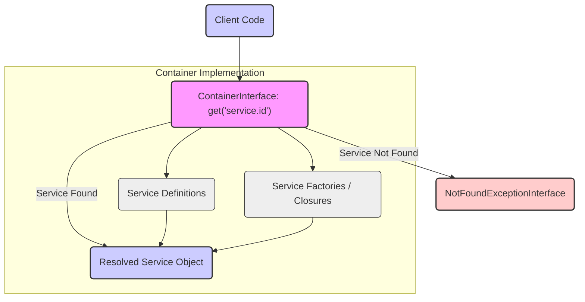

## Project Design Document: PHP-FIG Container Interface (Improved)

**1. Introduction**

This document provides an enhanced and detailed design overview of the PHP-FIG Container interface specification, accessible at [https://github.com/php-fig/container](https://github.com/php-fig/container). This document is specifically crafted to serve as a robust foundation for subsequent threat modeling activities. It meticulously outlines the key components, data flow, and architectural considerations inherent in the interface specification. It is crucial to understand that this document describes the *abstract interface specification* itself, and not any particular concrete implementation of a dependency injection container. The focus is on the contract defined by the interfaces.

**2. Goals**

*   Clearly and concisely define the purpose and scope of the PHP-FIG Container interface specification.
*   Identify and describe the core interfaces and their intended interactions within the specification.
*   Illustrate the expected data flow and the fundamental operations supported by the interface contract.
*   Establish a solid basis for identifying potential security vulnerabilities and threats that could arise in various implementations adhering to this interface.

**3. Overview**

The PHP-FIG Container interface specification aims to establish a standardized approach for utilizing dependency injection containers within PHP applications. It defines a common set of methods that any container implementation claiming compliance must adhere to. This standardization promotes loose coupling and interoperability, enabling developers to write application code that is independent of specific container implementations. The central concept is to provide a unified mechanism for retrieving services (objects) from a container without requiring knowledge of their creation or management details. This abstraction simplifies application development and enhances maintainability.

**4. Architectural Design**

The PHP-FIG Container specification comprises a set of key interfaces that collaboratively define the contract for container behavior.

*   **`ContainerInterface`**: This is the primary interface, defining the essential methods for interacting with a dependency injection container.
    *   `get(string $id)`:  This method is responsible for retrieving an entry (typically an object instance) from the container based on its unique identifier (`$id`).
    *   `has(string $id)`: This method checks if the container can return an entry for the given identifier (`$id`). It returns `true` if the container holds a definition or instance for the identifier, and `false` otherwise.

*   **`ServiceProviderInterface`**: This interface provides a structured way to register multiple services within a container. It decouples service registration logic from the core container implementation.
    *   `register()`: This method is invoked by the container to register the services provided by the service provider. The implementation of this method defines how the provider adds or configures services within the container.
    *   `provides(string $id)`: This method returns a list of service identifiers that this specific service provider is responsible for providing. This allows for optimization and deferred loading of services.

*   **`ContainerExceptionInterface`**: This interface extends the base `Throwable` interface. It serves as the base interface for all exceptions that a container implementation might throw. This provides a common type for catching container-related exceptions.

*   **`NotFoundExceptionInterface`**: This interface extends `ContainerExceptionInterface`. Implementations of the `get()` method *must* throw an exception that implements this interface if the requested identifier is not found within the container. This clearly signals that a requested service is unavailable.

**5. Component Interaction and Data Flow**

The following diagram illustrates the interaction between the key interfaces during the process of retrieving a service from a container.

**Detailed Data Flow for `ContainerInterface::get(string $id)`:**

*   The client code initiates the process by calling the `get()` method on an instance of a class that implements the `ContainerInterface`. The service identifier (`$id`) is passed as an argument.
*   The specific container implementation receives this request.
*   The container implementation then consults its internal `Service Definitions`. These definitions map service identifiers to concrete implementations or factories.
*   If a definition for the provided `$id` is located:
    *   The container might return an already instantiated instance of the service (depending on the service's scope).
    *   Alternatively, the container might invoke a `Service Factory / Closure` associated with the service definition to create a new instance of the service.
    *   The resolved service object is then returned to the originating client code.
*   If no definition is found for the given `$id`:
    *   The container implementation is obligated to throw an exception that implements the `NotFoundExceptionInterface`, signaling the absence of the requested service.

**Detailed Data Flow for `ServiceProviderInterface::register()`:**

*   Typically during the application's bootstrapping phase, client code interacts with the container to register instances of classes that implement `ServiceProviderInterface`.
*   The container implementation then invokes the `register()` method on each registered service provider instance.
*   Within the `register()` method, the service provider interacts with the container (the specifics of this interaction are implementation-dependent) to define and register the services it provides. This can involve:
    *   Associating service identifiers with concrete class names, potentially with information about how to instantiate them.
    *   Providing factory closures or callable functions that the container can use to create service instances on demand.
    *   Defining dependencies that the registered services might have on other services within the container.

**Detailed Data Flow for `ServiceProviderInterface::provides(string $id)`:**

*   A container implementation might call the `provides()` method of a registered service provider to determine if that provider is responsible for a specific service identifier. This can be used for optimization, such as lazy-loading services or providing information about available services without instantiating them.
*   The service provider returns a list of service identifiers that it is capable of providing. This allows the container to efficiently manage service registration and resolution.

**6. Security Considerations (Interface Level)**

While the PHP-FIG Container specification focuses on defining interfaces rather than concrete implementations, understanding its design is crucial for identifying potential security vulnerabilities that could arise in implementations. Here are some key security considerations at the interface level:

*   **Service Resolution Logic Vulnerabilities:** Implementations must implement the service resolution logic carefully to avoid potential security issues. Examples include:
    *   **Arbitrary Code Execution:** If service factories or closures are not handled securely, malicious actors might be able to inject code that gets executed during service instantiation.
    *   **Denial of Service (DoS):**  Poorly implemented resolution logic could lead to infinite loops or excessive resource consumption, especially with circular dependencies if not properly detected and handled.
    *   **Information Disclosure:** Errors during service resolution might inadvertently expose sensitive information about the application's internal structure or configuration.

*   **Service Provider Registration Risks:** The process of registering service providers needs to be secure to prevent malicious actors from injecting harmful code or configurations.
    *   **Unauthorized Registration:** Implementations should prevent unauthorized registration of service providers, as malicious providers could register services that compromise the application.
    *   **Malicious Service Definitions:**  If the container doesn't properly sanitize or validate service definitions provided by service providers, it could be vulnerable to code injection or other attacks.

*   **Exception Handling and Information Leakage:** While the interface defines exception types, implementations must handle exceptions gracefully. Improper handling could lead to:
    *   **Information Leakage:**  Stack traces or error messages exposed in production environments could reveal sensitive information to attackers.

*   **Dependency Management Security:** If container implementations integrate with external dependency management systems (like Composer), vulnerabilities in those systems could indirectly impact the container's security.
    *   **Dependency Confusion Attacks:** If the container fetches dependencies based on string identifiers, it might be tricked into loading malicious packages from public repositories if not configured correctly.

**7. Technologies Used**

*   PHP (The interface specification is defined using PHP code.)

**8. Future Considerations**

*   Exploring standardization of more advanced container features beyond the basic `get()` and `has()` operations, such as tagging and aliasing.
*   Investigating standardized ways to define service scopes (e.g., singleton, prototype, request-scoped) at the interface level.
*   Potentially defining interfaces for more sophisticated container functionalities like autowiring, constructor injection, and configuration management.

This improved document provides a more detailed and nuanced design overview of the PHP-FIG Container interface specification. It aims to provide a robust foundation for conducting thorough threat modeling of concrete container implementations by highlighting potential security considerations arising from the interface design. Understanding these aspects is crucial for building secure and reliable dependency injection containers in PHP.