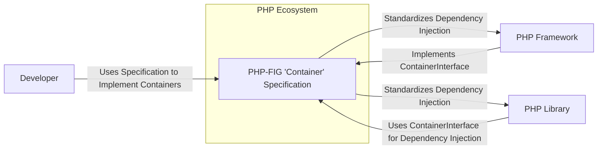
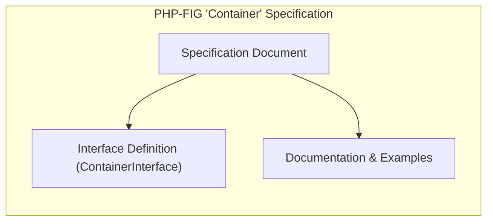
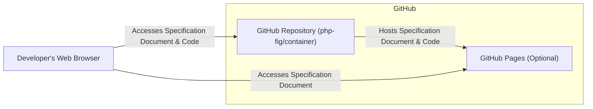
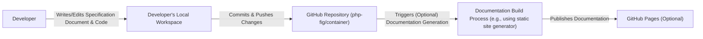

# BUSINESS POSTURE

This project defines a standard interface (`ContainerInterface`) for dependency injection containers in PHP. The goal is to promote interoperability between PHP frameworks and libraries by providing a common way to interact with dependency injection containers. This standardization aims to reduce vendor lock-in, improve code reusability, and enhance the overall developer experience within the PHP ecosystem.

Business Priorities and Goals:
- Primary goal: Establish a widely adopted standard interface for dependency injection containers in PHP.
- Secondary goal: Improve interoperability between PHP frameworks and libraries.
- Tertiary goal: Enhance developer experience and reduce framework lock-in within the PHP ecosystem.

Business Risks:
- Risk 1: Lack of adoption by the PHP community, rendering the specification ineffective.
- Risk 2: Security vulnerabilities introduced through implementations of the specification if not carefully considered.
- Risk 3: Ambiguity or flaws in the specification leading to inconsistent or insecure implementations.
- Risk 4: Performance issues arising from implementations of the specification.

# SECURITY POSTURE

Existing Security Controls:
- security control: Public repository on GitHub, allowing for community review and scrutiny of the specification. Implemented in: GitHub repository.
- security control: Open discussion and issue tracking on GitHub, enabling community feedback and identification of potential issues. Implemented in: GitHub repository issue tracker.

Accepted Risks:
- accepted risk: Security vulnerabilities might be present in initial versions of the specification, requiring iterative improvements.
- accepted risk: Implementations of the specification by third parties may introduce security vulnerabilities that are outside the scope of this project.

Recommended Security Controls:
- security control: Formal security review of the specification by security experts to identify potential vulnerabilities.
- security control: Provide security guidelines and best practices for implementers of the `ContainerInterface` to mitigate common security risks in dependency injection.
- security control: Establish a process for reporting and addressing security vulnerabilities found in the specification or its implementations.

Security Requirements:
- Authentication: Not directly applicable to the specification itself, but implementations using containers will need robust authentication mechanisms.
- Authorization: Not directly applicable to the specification itself, but implementations using containers will need robust authorization mechanisms to control access to resources and functionalities.
- Input Validation: Implementations using containers must perform thorough input validation to prevent injection attacks and other input-related vulnerabilities. This is indirectly related to the specification as containers are often used to manage components that handle user input.
- Cryptography: Not directly applicable to the specification itself, but implementations using containers might need to utilize cryptography for secure data handling and communication. The specification should not hinder the use of cryptography in implementations.

# DESIGN

## C4 CONTEXT

Context Diagram Elements:

- Element:
  - Name: PHP-FIG 'Container' Specification
  - Type: Specification
  - Description: Defines the `ContainerInterface` for dependency injection containers in PHP, aiming to standardize container usage across the PHP ecosystem.
  - Responsibilities: Provide a common interface for dependency injection containers, ensure interoperability, and guide implementations.
  - Security controls: Public review process, open issue tracking, potential formal security review.

- Element:
  - Name: Developer
  - Type: Person
  - Description: Software developers who use PHP frameworks and libraries and implement or utilize dependency injection containers.
  - Responsibilities: Implement dependency injection containers based on the specification, use containers in their applications, and contribute to the PHP ecosystem.
  - Security controls: Secure coding practices, input validation in applications, secure configuration of dependency injection containers.

- Element:
  - Name: PHP Framework
  - Type: Software System
  - Description: PHP frameworks that incorporate dependency injection containers and aim to be interoperable with other components using the `ContainerInterface`.
  - Responsibilities: Implement the `ContainerInterface`, provide a robust and secure dependency injection mechanism, and integrate with other PHP libraries.
  - Security controls: Framework-level security controls, secure dependency management, input validation, authorization mechanisms.

- Element:
  - Name: PHP Library
  - Type: Software System
  - Description: PHP libraries that can be used within PHP frameworks and applications, potentially relying on dependency injection through the `ContainerInterface`.
  - Responsibilities: Utilize dependency injection via the `ContainerInterface`, provide reusable functionalities, and integrate seamlessly with frameworks and applications.
  - Security controls: Library-level security controls, input validation, secure handling of dependencies.

## C4 CONTAINER

Container Diagram Elements:

- Element:
  - Name: Specification Document
  - Type: Document
  - Description: The main document defining the `ContainerInterface` and related concepts, including rationale, usage examples, and implementation guidelines.
  - Responsibilities: Clearly define the `ContainerInterface`, explain its purpose and usage, and provide guidance for implementers.
  - Security controls: Public review and discussion on GitHub, version control of the document, potential formal security review of the specification.

- Element:
  - Name: Interface Definition (ContainerInterface)
  - Type: Code (PHP Interface)
  - Description: The PHP code defining the `ContainerInterface`, which is the core component of the specification.
  - Responsibilities: Provide a precise and unambiguous definition of the interface, ensure it is technically sound and addresses the intended use cases.
  - Security controls: Code review, static analysis, unit testing (for example implementations), version control.

- Element:
  - Name: Documentation & Examples
  - Type: Document
  - Description: Supporting documentation and code examples to illustrate the usage of the `ContainerInterface` and guide developers in implementing and using containers.
  - Responsibilities: Provide clear and helpful documentation, demonstrate best practices, and assist developers in adopting the specification.
  - Security controls: Review of documentation for clarity and accuracy, code review of examples, ensuring examples do not promote insecure practices.

## DEPLOYMENT

The `php-fig/container` repository itself is not deployed as a running application. It is a specification document and code defining an interface. However, the specification document is "deployed" in the sense that it is published and made accessible to the PHP community.

Deployment Architecture: Web Publication

Deployment Diagram Elements:

- Element:
  - Name: GitHub Repository (php-fig/container)
  - Type: Code Repository
  - Description: The GitHub repository hosting the specification document, interface definition code, and related documentation.
  - Responsibilities: Version control, storage of specification artifacts, access control for contributors, public accessibility for the community.
  - Security controls: GitHub's security controls for repository access, branch protection, and vulnerability scanning.

- Element:
  - Name: GitHub Pages (Optional)
  - Type: Web Hosting Service
  - Description: Optionally, GitHub Pages can be used to host a rendered version of the specification document for easier online access.
  - Responsibilities: Serve the specification document as a website, provide a user-friendly interface for browsing the specification.
  - Security controls: GitHub Pages security controls, HTTPS, potentially custom domain configuration.

- Element:
  - Name: Developer's Web Browser
  - Type: Application
  - Description: The web browser used by developers to access and read the specification document online.
  - Responsibilities: Render the specification document, allow developers to navigate and read the content.
  - Security controls: Browser security features, user's responsibility to use a secure browser and network connection.

## BUILD

The build process for this project primarily involves creating the specification document and ensuring the interface definition code is valid. There isn't a traditional "build" in the sense of compiling code into an executable application. However, the process of creating and publishing the specification can be considered a build process.

Build Process: Specification Document Creation and Publication

Build Diagram Elements:

- Element:
  - Name: Developer's Local Workspace
  - Type: Development Environment
  - Description: The developer's local computer where they write and edit the specification document and interface definition code.
  - Responsibilities: Authoring and editing the specification, testing code examples, and preparing changes for submission.
  - Security controls: Developer's local security practices, secure coding habits, and protection of their development environment.

- Element:
  - Name: GitHub Repository (php-fig/container)
  - Type: Code Repository
  - Description: The central repository on GitHub where the specification document and code are stored and version controlled.
  - Responsibilities: Version control, collaboration platform, hosting the source of truth for the specification.
  - Security controls: GitHub's security controls, access management, branch protection, and audit logs.

- Element:
  - Name: Documentation Build Process (e.g., using static site generator)
  - Type: Automated Process
  - Description: An optional automated process that generates a formatted and web-ready version of the specification document from its source files (e.g., Markdown).
  - Responsibilities: Automate documentation generation, ensure consistent formatting, and prepare documentation for web publication.
  - Security controls: Secure configuration of build tools, dependency management for build tools, and secure deployment of generated documentation.

- Element:
  - Name: GitHub Pages (Optional)
  - Type: Web Hosting Service
  - Description: Optionally, GitHub Pages is used to host the automatically generated documentation.
  - Responsibilities: Serve the documentation website to the public.
  - Security controls: GitHub Pages security controls.

# RISK ASSESSMENT

Critical Business Processes:
- Process 1: Development and maintenance of the `ContainerInterface` specification. This is critical for achieving the goal of standardization and interoperability.
- Process 2: Adoption and implementation of the `ContainerInterface` by PHP frameworks and libraries. Widespread adoption is essential for the specification to be effective.

Data Sensitivity:
- Data 1: The specification document itself. Sensitivity: Publicly available, but integrity and availability are important. Modification by unauthorized parties or loss of access would be a risk.
- Data 2: Issue tracker discussions and community feedback. Sensitivity: Publicly available, but integrity and availability are important for the collaborative development process.
- Data 3: Source code of the `ContainerInterface`. Sensitivity: Publicly available, but integrity is crucial. Malicious modification could lead to vulnerabilities in implementations.

# QUESTIONS & ASSUMPTIONS

Questions:
- Q1: Is there a plan for formal security review of the specification by dedicated security experts?
- Q2: Are there specific guidelines or best practices being developed for implementers of the `ContainerInterface` to address security concerns in their container implementations?
- Q3: What is the process for reporting and addressing security vulnerabilities found in the specification or its implementations?
- Q4: Is there a plan to provide reference implementations or security-focused examples to guide developers?

Assumptions:
- Assumption 1: The primary goal is to create a widely adopted and beneficial standard for the PHP community, with security being a significant but secondary consideration compared to functionality and interoperability.
- Assumption 2: Security responsibility for implementations of the `ContainerInterface` primarily rests with the developers and projects implementing the specification, not directly with the specification project itself.
- Assumption 3: The PHP-FIG community is committed to addressing security concerns and improving the specification iteratively based on feedback and identified vulnerabilities.
- Assumption 4: The GitHub platform provides a reasonably secure environment for hosting the specification and facilitating collaboration.