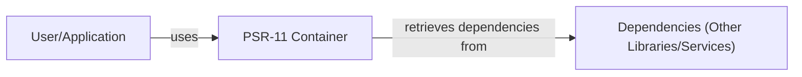
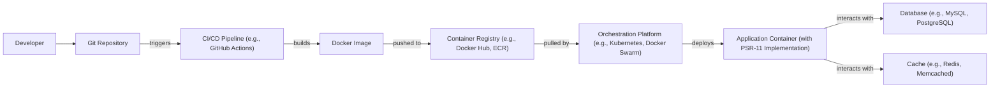

# BUSINESS POSTURE

Business Priorities and Goals:

*   Standardization: The primary goal of the PSR-11 (php-fig/container) project is to standardize how PHP frameworks and libraries access a shared container object for dependency injection. This promotes interoperability and reduces vendor lock-in.
*   Interoperability: Enable different PHP components (libraries, frameworks) to work together seamlessly by providing a common interface for accessing dependencies.
*   Simplicity: The interface is intentionally minimal, focusing solely on retrieving entries from the container by identifier. This simplicity makes it easy to adopt and implement.
*   Flexibility: While simple, the interface is flexible enough to accommodate various dependency injection container implementations.
*   Community Adoption: Encourage widespread adoption within the PHP community to maximize the benefits of standardization.

Most Important Business Risks:

*   Incompatible Implementations: If container implementations deviate significantly from the PSR-11 specification, interoperability will be compromised. This is a major risk, as it undermines the core purpose of the standard.
*   Security Vulnerabilities in Implementations: Since the container holds and manages object creation, vulnerabilities in specific container implementations could expose applications to various attacks (e.g., injection attacks, unauthorized access).
*   Lack of Adoption: If major frameworks or libraries don't adopt PSR-11, its impact will be limited, and the benefits of standardization won't be fully realized.
*   Performance Overhead: Poorly implemented containers could introduce performance bottlenecks, affecting the overall performance of applications using them.
*   Misuse of the Container: Developers might misuse the container (e.g., as a service locator instead of a proper dependency injection container), leading to tightly coupled and less maintainable code.

# SECURITY POSTURE

Existing Security Controls:

*   security control: Interface Specification: PSR-11 itself is a specification, not an implementation. The security relies heavily on the specific implementations of this interface. The specification itself does not mandate any specific security controls. (Described in the `Psr\Container\ContainerInterface` interface).
*   security control: Community Review: As a PHP-FIG standard, PSR-11 has undergone community review and scrutiny, which helps to identify potential issues, including security concerns. (Described in the PHP-FIG process and discussions).
*   security control: Type Hinting: The interface uses type hinting (string for identifiers, return types), which provides a basic level of type safety and helps prevent some common errors. (Described in the `Psr\Container\ContainerInterface` interface).

Accepted Risks:

*   accepted risk: Implementation-Specific Vulnerabilities: The PSR-11 standard does not, and cannot, address security vulnerabilities within specific container implementations. This is an accepted risk, and users must carefully evaluate the security of the container they choose.
*   accepted risk: Misconfiguration: The security of the application using a PSR-11 container depends heavily on how the container is configured and how dependencies are managed. Misconfiguration is a potential risk.
*   accepted risk: Lack of Input Validation in Implementations: The interface itself does not specify any input validation requirements. It is assumed that implementations will handle invalid identifiers appropriately, but this is not explicitly enforced.

Recommended Security Controls:

*   security control: Secure Coding Guidelines for Implementations: Develop and promote secure coding guidelines specifically for PSR-11 container implementations. This should include recommendations for input validation, error handling, and preventing injection attacks.
*   security control: Security Audits of Popular Implementations: Encourage or conduct security audits of popular PSR-11 container implementations to identify and address vulnerabilities.
*   security control: Dependency Management Best Practices: Promote best practices for managing dependencies, including using secure package repositories and regularly updating dependencies.

Security Requirements:

*   Authentication: Not directly applicable to the container interface itself. Authentication is typically handled at a higher level in the application.
*   Authorization: Not directly applicable to the container interface. Authorization (access control) is typically handled by the application logic using the objects retrieved from the container.
*   Input Validation:
    *   Implementations MUST handle invalid identifiers gracefully. They SHOULD throw a `NotFoundExceptionInterface` if an identifier is not found. They MUST NOT allow arbitrary code execution or injection attacks through the identifier.
    *   Implementations SHOULD validate that the identifier is a string, as specified in the interface.
*   Cryptography: Not directly applicable to the container interface. Cryptography might be used by the application logic or by specific dependencies managed by the container.

# DESIGN

## C4 CONTEXT

Element Description:

*   Element:
    *   Name: User/Application
    *   Type: User/System
    *   Description: Represents the application or framework that utilizes the PSR-11 container.
    *   Responsibilities: Uses the container to retrieve dependencies.
    *   Security controls: Implements application-level security controls (authentication, authorization, input validation).

*   Element:
    *   Name: PSR-11 Container
    *   Type: System
    *   Description: Represents a concrete implementation of the `Psr\Container\ContainerInterface`.
    *   Responsibilities: Manages and provides access to dependencies.
    *   Security controls: Implementation-specific security controls (input validation, error handling). Adheres to PSR-11 interface.

*   Element:
    *   Name: Dependencies (Other Libraries/Services)
    *   Type: System
    *   Description: Represents the various libraries, services, or objects that are managed by the container.
    *   Responsibilities: Provide specific functionalities to the application.
    *   Security controls: Implement their own security controls relevant to their functionality.

## C4 CONTAINER

Since PSR-11 is just an interface, the container diagram is essentially the same as the context diagram. A specific implementation *might* have internal components, but that's beyond the scope of the PSR-11 specification itself.

Element Description:

*   Element:
    *   Name: User/Application
    *   Type: User/System
    *   Description: Represents the application or framework that utilizes the PSR-11 container.
    *   Responsibilities: Uses the container to retrieve dependencies.
    *   Security controls: Implements application-level security controls (authentication, authorization, input validation).

*   Element:
    *   Name: PSR-11 Container
    *   Type: System
    *   Description: Represents a concrete implementation of the `Psr\Container\ContainerInterface`.
    *   Responsibilities: Manages and provides access to dependencies.
    *   Security controls: Implementation-specific security controls (input validation, error handling). Adheres to PSR-11 interface.

*   Element:
    *   Name: Dependencies (Other Libraries/Services)
    *   Type: System
    *   Description: Represents the various libraries, services, or objects that are managed by the container.
    *   Responsibilities: Provide specific functionalities to the application.
    *   Security controls: Implement their own security controls relevant to their functionality.

## DEPLOYMENT

PSR-11, being an interface, doesn't have a specific deployment model.  It's a *part* of a larger PHP application's deployment.  However, we can describe typical PHP deployment scenarios and how PSR-11 fits in.

Possible Deployment Solutions:

1.  **Traditional LAMP/LEMP Stack:** PHP application deployed on a server running Apache or Nginx, with MySQL/MariaDB as the database.
2.  **Containerized Deployment (Docker):** PHP application packaged within a Docker container, often along with a web server (e.g., Nginx, Apache) and potentially other services (database, cache).
3.  **Serverless (AWS Lambda, Azure Functions, Google Cloud Functions):** PHP application code deployed as serverless functions, triggered by events (e.g., HTTP requests).
4.  **Platform as a Service (PaaS) (Heroku, AWS Elastic Beanstalk, Google App Engine):** PHP application deployed to a managed platform that handles infrastructure and scaling.

Chosen Deployment Solution (Containerized Deployment - Docker):

Element Description:

*   Element:
    *   Name: Developer
    *   Type: Person
    *   Description: The developer writing and committing code.
    *   Responsibilities: Writing code, committing changes, adhering to coding standards.
    *   Security controls: Secure coding practices, access control to the Git repository.

*   Element:
    *   Name: Git Repository
    *   Type: System
    *   Description: The source code repository (e.g., GitHub, GitLab, Bitbucket).
    *   Responsibilities: Version control, code storage.
    *   Security controls: Access control, branch protection rules, code review policies.

*   Element:
    *   Name: CI/CD Pipeline (e.g., GitHub Actions)
    *   Type: System
    *   Description: The automated build and deployment pipeline.
    *   Responsibilities: Building the Docker image, running tests, pushing the image to the registry.
    *   Security controls: Secure configuration of the pipeline, secrets management, SAST/DAST scanning.

*   Element:
    *   Name: Docker Image
    *   Type: Artifact
    *   Description: The packaged application, including the PSR-11 implementation and all dependencies.
    *   Responsibilities: Contains all necessary code and runtime environment.
    *   Security controls: Minimal base image, vulnerability scanning of the image.

*   Element:
    *   Name: Container Registry (e.g., Docker Hub, ECR)
    *   Type: System
    *   Description: Stores the built Docker images.
    *   Responsibilities: Image storage, access control.
    *   Security controls: Access control, image signing, vulnerability scanning.

*   Element:
    *   Name: Orchestration Platform (e.g., Kubernetes, Docker Swarm)
    *   Type: System
    *   Description: Manages the deployment and scaling of the application containers.
    *   Responsibilities: Scheduling containers, managing resources, ensuring high availability.
    *   Security controls: Network policies, role-based access control (RBAC), secrets management.

*   Element:
    *   Name: Application Container (with PSR-11 Implementation)
    *   Type: Container
    *   Description: The running instance of the application, including the chosen PSR-11 container implementation.
    *   Responsibilities: Handling requests, interacting with other services.
    *   Security controls: All security controls from the chosen PSR-11 implementation, network isolation, resource limits.

*   Element:
    *   Name: Database (e.g., MySQL, PostgreSQL)
    *   Type: System
    *   Description: The database used by the application.
    *   Responsibilities: Data storage and retrieval.
    *   Security controls: Access control, encryption at rest and in transit, regular backups.

*   Element:
    *   Name: Cache (e.g., Redis, Memcached)
    *   Type: System
    *   Description: A caching layer used to improve performance.
    *   Responsibilities: Storing frequently accessed data.
    *   Security controls: Access control, data validation.

## BUILD

```mermaid
graph LR
    Developer["Developer"] -- commits code --> Git["Git Repository"];
    Git -- triggers webhook --> CI["CI Server (e.g., GitHub Actions, Jenkins)"];
    CI -- checks out code --> Checkout["Code Checkout"];
    Checkout -- runs --> Composer["Composer (Dependency Management)"];
    Composer -- installs dependencies --> Dependencies["Dependencies (including PSR-11 implementations)"];
    Dependencies -- runs --> Tests["Unit & Integration Tests"];
    Tests -- runs --> SAST["SAST (Static Application Security Testing)"];
    SAST -- if successful --> Artifact["Build Artifact (e.g., Phar, Code Directory)"];
```

Build Process Description:

1.  **Code Commit:** A developer commits code changes to the Git repository.
2.  **Webhook Trigger:** The Git repository is configured with a webhook that triggers the CI server (e.g., GitHub Actions, Jenkins) on code changes.
3.  **Code Checkout:** The CI server checks out the latest code from the repository.
4.  **Dependency Management (Composer):** Composer, the PHP dependency manager, is used to install project dependencies, including a chosen PSR-11 container implementation.  This is a critical step for supply chain security.
5.  **Testing:** Unit and integration tests are executed to ensure code quality and functionality.
6.  **Static Application Security Testing (SAST):** A SAST tool (e.g., PHPStan, Psalm, Phan) analyzes the code for potential security vulnerabilities.
7.  **Build Artifact:** If all steps are successful, a build artifact is created. This could be a simple directory of code, a Phar archive, or other deployment-ready package.

Security Controls in Build Process:

*   security control: **Dependency Management (Composer):** Using Composer with a `composer.lock` file ensures that the same versions of dependencies are used consistently.  This helps prevent supply chain attacks where malicious code might be injected into a dependency. Regularly auditing and updating dependencies is crucial.
*   security control: **SAST (Static Application Security Testing):** SAST tools help identify potential vulnerabilities in the code before deployment.
*   security control: **Secure CI/CD Configuration:** The CI/CD pipeline itself must be securely configured, with appropriate access controls and secrets management.
*   security control: **Code Review:** Code reviews are essential to catch potential security issues that might be missed by automated tools.

# RISK ASSESSMENT

Critical Business Processes:

*   **Dependency Management:** The process of retrieving and managing dependencies is critical. If compromised, it could lead to the execution of malicious code.
*   **Application Functionality:** The overall functionality of applications relying on PSR-11 is critical. Vulnerabilities in container implementations could disrupt these applications.
*   **Interoperability:** The ability of different PHP components to work together seamlessly is a key business process enabled by PSR-11.

Data to Protect:

*   **Configuration Data:** Container configurations might contain sensitive information (e.g., database credentials, API keys). While PSR-11 doesn't directly handle this, the *implementation* might. Sensitivity: High.
*   **Application Data:** The data processed by the applications using PSR-11. The container itself doesn't store this data, but vulnerabilities in the container could indirectly expose it. Sensitivity: Varies depending on the application.
*   **Source Code:** The source code of the application and the chosen container implementation. Sensitivity: Medium to High.

# QUESTIONS & ASSUMPTIONS

Questions:

*   Which specific PSR-11 container implementation will be used? (This is crucial for a more detailed security analysis.)
*   What are the specific security requirements of the applications that will be using this container?
*   What is the threat model for the applications using the container? (Who are the potential attackers, and what are their motivations?)
*   What level of security assurance is required? (e.g., informal code review, formal security audit)

Assumptions:

*   BUSINESS POSTURE: The organization prioritizes interoperability and standardization in its PHP development.
*   SECURITY POSTURE: The organization has a basic understanding of secure coding practices and dependency management. It is assumed that Composer will be used for dependency management.
*   DESIGN: The deployment will likely be containerized (e.g., using Docker) or on a PaaS. The build process will involve a CI/CD pipeline. A specific container implementation is *not* assumed.