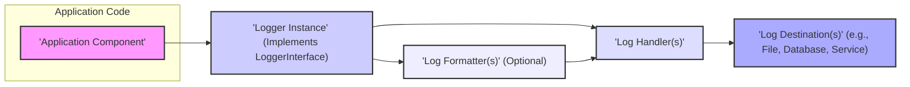
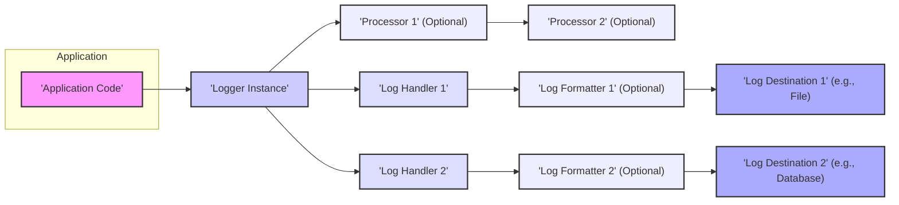

# Project Design Document: PSR-3 Logging Interface (`php-fig/log`)

**Version:** 1.1
**Date:** October 26, 2023
**Author:** AI Software Architect

## 1. Introduction

This document provides a detailed design overview of the PSR-3 Logging Interface (`php-fig/log`), a PHP Standards Recommendation (PSR) defined by the PHP Framework Interoperability Group (PHP-FIG). This specification defines a common interface for logging functionality within PHP applications. This document aims to clearly articulate the architecture, components, and data flow of systems implementing this standard, specifically to serve as a foundation for subsequent threat modeling activities. It focuses on the interface itself, its intended usage within PHP applications, and the security implications arising from its implementation.

## 2. Goals and Objectives

The primary goal of PSR-3 is to establish a standardized interface for logging in PHP applications. This standardization aims to achieve:

*   **Interoperability:** Enabling seamless integration and interchangeability of different logging libraries within an application without requiring extensive code modifications.
*   **Simplicity:** Providing a straightforward and intuitive interface for common logging operations.
*   **Flexibility:** Allowing developers to integrate diverse logging backends and customize log message formats.
*   **Consistency:** Promoting a uniform approach to logging practices across various PHP projects and frameworks, improving maintainability and understanding.

## 3. Architecture Overview

The PSR-3 specification centers around the `LoggerInterface`, which defines the contract for logging messages at various severity levels. Concrete implementations of this interface are responsible for the actual logging process, which may involve formatting the message and dispatching it to one or more handlers for output to various destinations.



**Components:**

*   **Application Component:** Any part of the PHP application that requires logging information about its execution or events.
*   **Logger Instance:** An object instantiated from a class that implements the `LoggerInterface`. This serves as the primary point of interaction for logging within the application.
*   **Log Handler(s):** Components responsible for receiving a log message from the logger instance, potentially formatting it, and then directing it to a specific output. A single logger instance can utilize multiple handlers to send logs to different destinations.
*   **Log Formatter(s):** Optional components that transform the log message into a specific structure or format (e.g., JSON, XML, a custom string format) before it is processed by a handler.
*   **Log Destination(s):** The final storage or output location for log messages. Examples include log files, databases, system logs, or external logging services.

## 4. Detailed Design

### 4.1. `LoggerInterface`

The `LoggerInterface` is the cornerstone of PSR-3, defining the methods that any compliant logging class must implement. These methods correspond to different severity levels of log messages:

*   `emergency(string|\Stringable $message, array $context = []): void`: Indicates the system is unusable. This should be used for critical failures.
*   `alert(string|\Stringable $message, array $context = []): void`: Signifies that action must be taken immediately. Examples include a corrupted database or loss of primary connectivity.
*   `critical(string|\Stringable $message, array $context = []): void`: Denotes critical conditions, such as hard device errors or unexpected data loss.
*   `error(string|\Stringable $message, array $context = []): void`: Represents runtime errors that do not require immediate intervention but should typically be recorded and monitored.
*   `warning(string|\Stringable $message, array $context = []): void`: Indicates exceptional occurrences that are not strictly errors but may indicate potential problems.
*   `notice(string|\Stringable $message, array $context = []): void`: Represents normal but significant events, such as user logins or successful data updates.
*   `info(string|\Stringable $message, array $context = []): void`: Provides interesting events, such as user actions or application configuration changes.
*   `debug(string|\Stringable $message, array $context = []): void`: Contains detailed debugging information, typically used during development and troubleshooting.
*   `log($level, string|\Stringable $message, array $context = []): void`: Allows logging with an arbitrary level, providing flexibility beyond the standard levels.
*   `withName(string $name): LoggerInterface`: Returns a new instance of the logger with the specified channel name. This allows for categorizing log messages.
*   `pushProcessor(callable $callback): LoggerInterface`: Adds a callable to the processor stack. Processors can modify the log record before it's handled.
*   `popProcessor(): callable`: Removes the topmost processor from the stack and returns it.

**Parameters:**

*   `$level`:  The severity of the log message. This should be one of the PSR-3 defined levels or a custom level.
*   `$message`: The log message itself. It can be a string or an object implementing the `Stringable` interface, allowing for more complex message representations.
*   `$context`: An optional associative array of contextual information to include with the log message. This allows for adding relevant data points to the log entry, facilitating analysis. Placeholders in the message string (e.g., `{user}`) can be replaced with values from the context array.

### 4.2. Log Levels

PSR-3 defines a standardized set of eight log levels, ordered by severity, providing a common vocabulary for describing the importance of log messages:

*   `emergency`
*   `alert`
*   `critical`
*   `error`
*   `warning`
*   `notice`
*   `info`
*   `debug`

### 4.3. Context

The `$context` parameter provides a structured way to include additional information with log messages. This is crucial for providing richer context for debugging and analysis. The context is an associative array where keys represent the context attribute and values represent the corresponding data. Placeholders within the log message string, enclosed in curly braces (`{}`), can be used to reference values from the context array.

**Example:**

```php
$logger->warning('User login failed for user "{username}" from IP "{ip}"', ['username' => $username, 'ip' => $clientIp]);
```

### 4.4. Logger Implementations

Developers choose and integrate specific logging libraries that implement the `LoggerInterface`. The PSR-3 specification does not dictate the implementation details, allowing for a variety of logging solutions. Common implementations include:

*   **Monolog:** A highly flexible and widely used logging library for PHP, offering a wide range of handlers and formatters.
*   **KLogger:** A simpler, file-based logging library.
*   **Custom implementations:** Developers can create their own logger classes tailored to specific application requirements or to integrate with proprietary logging systems.

### 4.5. Log Handlers and Formatters (Implementation Specific)

The mechanisms for handling and formatting log messages are specific to the chosen logger implementation.

**Log Handlers:**

*   Determine where log messages are ultimately sent. Examples include writing to files, databases, sending emails, or transmitting to external logging services like syslog or cloud-based logging platforms.
*   Often provide filtering capabilities, allowing only messages of a certain severity level or matching specific criteria to be processed.
*   May perform additional processing or enrichment of log messages before output.

**Log Formatters:**

*   Transform the log message and its associated context into a specific output format. This could be plain text with a defined structure, JSON, XML, or any other desired format.
*   Control the information included in the log output and its presentation.

## 5. Data Flow

The typical flow of a log message within an application utilizing PSR-3 involves the following steps:



**Detailed Steps:**

1. The **Application Code** initiates a logging event by calling a method on the **Logger Instance**, providing a message and optional context (e.g., `$logger->error('User authentication failed', ['username' => $username])`).
2. **Processors** attached to the logger instance (if any) are executed. Processors can modify the log record (message, context, or level) before it reaches the handlers.
3. The **Logger Instance** dispatches the log record to the configured **Log Handlers**.
4. Each **Log Handler** may have an associated **Log Formatter**. If a formatter is present, it transforms the log record into the desired output format.
5. The **Log Handler** then writes the formatted log message to its designated **Log Destination**.

## 6. Security Considerations for Threat Modeling

When performing threat modeling on systems utilizing PSR-3 logging, it's crucial to consider the following potential security vulnerabilities and attack vectors:

*   **Information Disclosure:**
    *   **Sensitive Data in Logs:**  Accidentally logging sensitive information like passwords, API keys, personal identifiable information (PII), or financial data within log messages or context arrays. This can expose this data if log files are compromised or accessed by unauthorized individuals.
    *   **Verbose Error Messages:**  Including overly detailed error messages in production logs can reveal internal system architecture, file paths, and other information that could aid attackers.
    *   **Log File Access:**  Insufficiently secured log files or log storage locations can allow unauthorized access, enabling attackers to read sensitive information or manipulate logs.
*   **Injection Attacks:**
    *   **Log Injection:** If user-supplied data is directly incorporated into log messages without proper sanitization or escaping, attackers can inject malicious content into log files. This can be exploited by log analysis tools or even lead to command injection if logs are processed by vulnerable systems. For example, injecting control characters or newlines to manipulate log entries.
    *   **Context Injection:** While less common, vulnerabilities in custom log handlers or formatters could potentially allow attackers to inject malicious data through the context array if not handled securely.
*   **Denial of Service (DoS):**
    *   **Excessive Logging:**  Attackers can intentionally trigger numerous log events (e.g., by repeatedly sending invalid requests) to overwhelm the logging system, consuming excessive disk space, CPU resources, and potentially impacting application performance or availability.
    *   **Log Forging:**  If attackers can inject arbitrary log messages, they could flood the logs with irrelevant data, making it difficult to identify genuine security incidents.
*   **Log Tampering and Manipulation:**
    *   **Log Deletion or Modification:** If log files are not properly secured with appropriate permissions and integrity checks, attackers might be able to delete or modify log entries to cover their tracks or disrupt forensic investigations.
*   **Configuration Vulnerabilities:**
    *   **Insecure Log Destinations:** Configuring log handlers to send logs to insecure or publicly accessible locations can expose sensitive information.
    *   **Overly Permissive Logging Levels:**  Enabling overly verbose logging levels in production environments can generate excessive amounts of data, making it harder to identify critical events and potentially impacting performance.
    *   **Lack of Log Rotation and Management:**  Failing to implement proper log rotation and archiving can lead to log files growing excessively large, potentially impacting system performance and making analysis difficult.
*   **Lack of Audit Trails:**
    *   Insufficient logging of security-relevant events (e.g., authentication attempts, authorization failures) can hinder the ability to detect and respond to security incidents effectively.

## 7. Assumptions and Constraints

*   It is assumed that developers implementing PSR-3 will select and configure appropriate logging libraries and handlers with security best practices in mind.
*   The security of the overall logging system is heavily dependent on the chosen logger implementation, its configuration, and the security measures applied to the log storage and access mechanisms.
*   This document focuses on the logical design and interface defined by PSR-3. Specific security implementations and mitigations will vary depending on the chosen logging libraries and the deployment environment.
*   Application code is responsible for sanitizing or escaping user-provided input before including it in log messages to mitigate log injection vulnerabilities.
*   Secure storage and access controls for log files and log management systems are considered out of scope for the PSR-3 specification itself but are critical for overall security.

## 8. Future Considerations

*   **Standardized Log Message Formats:**  Exploring further standardization of log message formats could enhance interoperability between different logging systems and facilitate easier log analysis and correlation.
*   **Integration with Security Information and Event Management (SIEM) Systems:**  Considering how PSR-3 implementations can seamlessly integrate with SIEM systems for centralized security monitoring and analysis is important.
*   **Secure Log Transport and Storage:**  Further investigation into secure methods for transporting and storing log data, including encryption and integrity checks, is crucial for protecting sensitive information.
*   **Context Sanitization Recommendations:** While the PSR-3 specification defines the interface, providing non-normative recommendations or best practices for sanitizing context data could help developers avoid common security pitfalls.