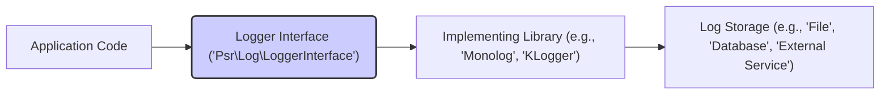

# Project Design Document: PSR-3 Logging Interface (php-fig/log)

**Version:** 1.1
**Date:** October 26, 2023
**Author:** AI Software Architect

## 1. Introduction

This document provides an enhanced design overview of the PSR-3 Logging Interface (`php-fig/log`), a cornerstone standard for logging within PHP applications. It serves as a detailed foundation for subsequent threat modeling, clearly outlining the system's components, data flow, and interactions to facilitate the identification of potential security vulnerabilities. A clear understanding of this design is crucial for effective security analysis.

## 2. Project Overview

The `php-fig/log` project defines the `Psr\Log\LoggerInterface`, a standard interface that dictates how logging operations should be performed in PHP. It is a specification, not an implementation, providing a contract for logging libraries to adhere to, thereby promoting interoperability and simplifying the process of switching between different logging implementations.

**Goals:**

*   To define a common and widely accepted interface for logging in PHP applications.
*   To ensure interoperability among various PHP logging libraries.
*   To offer a flexible and extensible framework for logging.
*   To simplify the integration of logging into PHP projects.

**Scope:**

This document focuses specifically on the design of the `Psr\Log\LoggerInterface` and its interactions with conforming logging libraries and the application code that utilizes them. The internal workings of specific logging implementations (such as Monolog or KLogger) are outside the scope of this document.

## 3. Architectural Design

The architecture of the `php-fig/log` ecosystem can be represented as a layered model, illustrating the relationships between different parts of the system:

**Components:**

*   **Application Code:** This represents the custom code of a PHP application that requires logging functionality. It initiates log events.
    *   Responsibility: Generating log messages and passing them to the logging interface.
    *   Security Aspect: Potential source of sensitive data being logged; needs careful handling of user input to prevent log injection.
*   **Logger Interface (`Psr\Log\LoggerInterface`):** This is the core interface defined by the `php-fig/log` project. It specifies the standard methods for logging at various severity levels.
    *   Responsibility: Providing a consistent API for logging, independent of the underlying implementation.
    *   Security Aspect:  Its design influences how logging is performed and can indirectly impact security if misused (e.g., not logging critical errors).
*   **Implementing Library:** A concrete PHP library (e.g., Monolog, KLogger, Analog) that implements the `Psr\Log\LoggerInterface`. These libraries handle the actual processing and persistence of log messages.
    *   Responsibility: Receiving log messages from the application, processing them, and writing them to the configured storage.
    *   Security Aspect: Contains the logic for handling log data; vulnerabilities in this library could lead to security breaches (e.g., improper sanitization leading to injection).
*   **Log Storage:** The destination where log messages are ultimately stored. This can vary widely depending on the chosen implementing library's configuration.
    *   Responsibility: Persistently storing log data.
    *   Security Aspect:  Needs appropriate access controls and security measures to prevent unauthorized access, modification, or deletion of logs.

**Key Interactions:**

*   The application code creates an instance of a class that implements `Psr\Log\LoggerInterface`.
*   When a logging event occurs, the application code calls a specific method on the logger interface (e.g., `$logger->info('User logged in')`).
*   The implementing library receives this method call and processes the log message according to its internal logic and configuration.
*   Finally, the implementing library writes the processed log message to the designated log storage.

## 4. Data Flow

The journey of log data through the system can be visualized as a sequence of steps:

**Data Flow Stages:**

*   **Log Initiation:** The application code generates a log message, which can be a simple string or an object implementing `Stringable`. It may also include an array of contextual data.
    *   Security Consideration:  Potential injection point if user-supplied data is directly included in the message without sanitization. Sensitive data might also be present.
*   **Interface Passing:** The application code calls a logging method on the `LoggerInterface` implementation, passing the log message and the optional context array.
    *   Security Consideration: The interface itself doesn't perform any sanitization; it simply passes the data along.
*   **Implementation Processing:** The implementing library receives the log message and context. It performs several operations:
    *   Formatting the log message, potentially incorporating context data.
    *   Filtering the log message based on the configured logging level.
    *   Enriching the log message with additional information (e.g., timestamp, source).
    *   Security Consideration: This is where crucial security measures should be implemented, such as sanitizing log messages to prevent injection attacks. Vulnerabilities here can have significant impact.
*   **Storage:** The implementing library writes the processed and formatted log entry to the configured log storage mechanism.
    *   Security Consideration: The security of the logs at rest depends entirely on the security measures implemented for the specific storage mechanism.

## 5. Security Considerations (For Threat Modeling)

Based on the architecture and data flow, several key security considerations emerge that are crucial for threat modeling:

*   **Exposure of Sensitive Information:**
    *   Risk: Application code might unintentionally log sensitive data (e.g., passwords, API keys, personal identifiable information) if developers are not careful.
    *   Mitigation: Implement policies and practices to avoid logging sensitive data. Consider using placeholders and redacting sensitive information.
*   **Log Injection Attacks:**
    *   Risk: If log messages are constructed using unsanitized user input, attackers can inject malicious content into the logs. This can lead to:
        *   **Log Forgery:** Injecting false log entries to cover tracks or mislead investigations.
        *   **Exploitation of Log Analysis Tools:** Injecting commands or scripts that are executed by log analysis tools.
    *   Mitigation:  Always sanitize user input before including it in log messages. Use parameterized logging or escaping mechanisms provided by the implementing library.
*   **Log Tampering and Integrity:**
    *   Risk: Unauthorized modification or deletion of log entries can hinder forensic investigations and mask malicious activity.
    *   Mitigation: Implement appropriate access controls on log storage. Consider using immutable logging solutions or signing log entries.
*   **Unauthorized Access to Logs:**
    *   Risk: If log files or databases are not properly secured, unauthorized individuals could gain access to sensitive information contained within the logs.
    *   Mitigation: Implement strong access controls and authentication mechanisms for log storage. Encrypt logs at rest.
*   **Denial of Service (Logging Flood):**
    *   Risk: Attackers might flood the logging system with excessive log messages, consuming resources and potentially causing a denial of service.
    *   Mitigation: Implement rate limiting or throttling mechanisms for logging. Monitor log volume and implement alerts for unusual activity.
*   **Vulnerabilities in Implementing Libraries:**
    *   Risk: Security vulnerabilities in the chosen implementing logging library can directly impact the security of the application's logging mechanism.
    *   Mitigation: Keep the implementing library up-to-date with the latest security patches. Regularly review the library's security advisories.
*   **Misconfiguration of Logging Libraries:**
    *   Risk: Incorrectly configured logging libraries can expose sensitive information or create security loopholes (e.g., logging to publicly accessible locations).
    *   Mitigation: Follow security best practices when configuring logging libraries. Regularly review and audit logging configurations.

## 6. Component Details (Security Focused)

This section details each component with a specific focus on its security implications and responsibilities:

*   **Application Code:**
    *   **Security Responsibility:**  Preventing the logging of sensitive data and sanitizing input to avoid log injection.
    *   **Security Considerations:**
        *   Avoid hardcoding sensitive information directly in log messages.
        *   Sanitize or escape user-provided data before including it in log messages.
        *   Be mindful of the logging level used for different types of information.
*   **Logger Interface (`Psr\Log\LoggerInterface`):**
    *   **Security Responsibility:**  Providing a standardized and predictable interface that doesn't inherently introduce vulnerabilities.
    *   **Security Considerations:**
        *   The interface itself is relatively simple and doesn't contain complex logic that could be exploited.
        *   Consistent use of the interface across different parts of the application can aid in security analysis.
*   **Implementing Library (e.g., Monolog, KLogger):**
    *   **Security Responsibility:**  Securely processing and storing log messages, including sanitization and protection of log data.
    *   **Security Considerations:**
        *   Ensure the library properly handles potentially malicious input to prevent log injection.
        *   Implement appropriate security measures for writing to the configured log storage (e.g., secure file permissions, database authentication).
        *   Keep the library updated to patch any discovered security vulnerabilities.
*   **Log Storage:**
    *   **Security Responsibility:**  Protecting the confidentiality, integrity, and availability of stored log data.
    *   **Security Considerations:**
        *   Implement strong access controls to restrict who can read, write, and delete logs.
        *   Consider encrypting logs at rest to protect sensitive information.
        *   Implement mechanisms to detect and prevent log tampering.
        *   Establish appropriate log retention policies.

## 7. Future Considerations (Security Implications)

*   **Standardized Structured Logging:**  Adopting structured logging formats (e.g., JSON) can improve the ability to securely analyze and query logs, but also introduces the need to sanitize data within structured formats to prevent injection.
*   **Context Propagation with Security Context:**  If context propagation is implemented, consider propagating security-related context (e.g., user roles, permissions) to aid in security auditing and analysis. However, ensure this context itself is not vulnerable to manipulation.
*   **Log Aggregation and Centralized Security Monitoring:**  Centralizing logs can improve security monitoring but also creates a single point of failure and a high-value target for attackers. Secure access and integrity of the central log store are paramount.

This improved design document provides a more detailed and security-focused overview of the `php-fig/log` project. It highlights potential security considerations at each stage of the logging process and within each component, making it a more effective foundation for subsequent threat modeling activities.