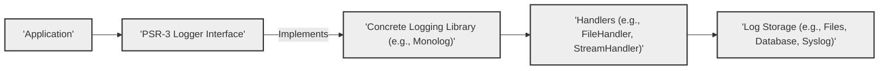
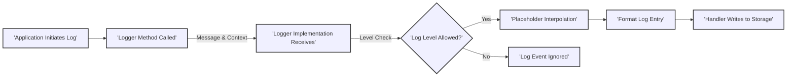

# Project Design Document: php-fig/log (PSR-3) - Improved

**Version:** 1.1
**Date:** October 26, 2023
**Author:** AI Software Architect

## 1. Introduction

This document provides an enhanced design overview of the `php-fig/log` project (PSR-3), the PHP standard recommendation defining an interface for logging. This document is specifically crafted to facilitate threat modeling activities by clearly outlining the system's components, data flow, and inherent security considerations. It serves as a blueprint for security analysts and developers to understand the potential attack surfaces and vulnerabilities associated with implementations of the PSR-3 interface.

## 2. Goals

*   Provide a precise and unambiguous definition of the `php-fig/log` interface's scope and boundaries.
*   Thoroughly describe the core components of the interface and their interactions within a logging system.
*   Illustrate the typical journey of log data within an application utilizing the PSR-3 standard.
*   Explicitly highlight potential security vulnerabilities and areas of concern that implementers of the interface must address.
*   Serve as a foundational document for subsequent threat modeling sessions and security analysis.

## 3. Scope

This design document is strictly focused on the `php-fig/log` interface definition (PSR-3). While it acknowledges the existence of various implementations, the document's primary concern is the interface contract itself and the security implications arising from its design and usage patterns. Specific implementation details of individual logging libraries are outside the scope of this document.

## 4. Overview of the System

The `php-fig/log` project establishes a standardized `LoggerInterface` for PHP applications and libraries to record events. This standardization promotes interoperability, allowing developers to switch between different logging backends without modifying the core logging logic within their applications. The fundamental principle is to decouple the *act* of logging from the *mechanism* of log storage and processing.

Key characteristics of the system:

*   **Interface Contract:** The project's primary output is the `LoggerInterface`, a PHP interface defining the methods for logging events.
*   **Decoupling:** It introduces an abstraction layer, enabling developers to log messages without direct dependencies on specific logging libraries. This separation is crucial for maintainability and flexibility.
*   **Standardization and Consistency:** It fosters uniform logging practices across diverse PHP projects, simplifying log analysis and management.

## 5. Detailed Design

### 5.1. Components

*   **`LoggerInterface`:** The central interface defined by PSR-3. Implementations must provide the methods specified in this interface.
    *   **Logging Methods:**  `emergency()`, `alert()`, `critical()`, `error()`, `warning()`, `notice()`, `info()`, `debug()`. Each method corresponds to a specific severity level.
        *   Accepts a `$message` (string) which is the log message itself.
        *   Accepts an optional `$context` (array) providing contextual information.
    *   **Generic `log()` Method:**  `log($level, $message, array $context = [])`. Allows logging with an arbitrary level specified by the `$level` parameter (using the `LogLevel` constants).
*   **`LogLevel` Constants:**  A set of predefined constants representing the different severity levels for log messages.
    *   `LogLevel::EMERGENCY`: System is unusable.
    *   `LogLevel::ALERT`: Action must be taken immediately.
    *   `LogLevel::CRITICAL`: Critical conditions.
    *   `LogLevel::ERROR`: Runtime errors that do not require immediate action but should typically be logged and monitored.
    *   `LogLevel::WARNING`: Exceptional occurrences that are not errors.
    *   `LogLevel::NOTICE`: Normal but significant events.
    *   `LogLevel::INFO`: Interesting events.
    *   `LogLevel::DEBUG`: Detailed debug information.
*   **Context Array:** An optional associative array passed to the logging methods.
    *   Provides structured data associated with the log event.
    *   Keys in the array are strings, and values can be of any type.
    *   Used for adding relevant details to the log message (e.g., user ID, transaction ID).
*   **Message Placeholders:** The interface defines a convention for using placeholders within the log message string.
    *   Placeholders are enclosed in curly braces (e.g., `{user}`, `{id}`).
    *   Implementations are responsible for replacing these placeholders with values from the `$context` array.

### 5.2. Data Flow

```mermaid
graph LR
    A["'Application Code'"] --> B["'Logger Instance (implements LoggerInterface)'"];
    B -- "log(level, message, context)" --> C["'Logger Implementation Logic'"];
    C -- "Process Message & Context" --> D["'Formatted Log Entry'"];
    D --> E["'Log Handler/Writer'"];
    E --> F["'Log Storage/Destination'"];
    style A fill:#ccf,stroke:#333,stroke-width:2px
    style B fill:#ccf,stroke:#333,stroke-width:2px
    style C fill:#ccf,stroke:#333,stroke-width:2px
    style D fill:#ccf,stroke:#333,stroke-width:2px
    style E fill:#ccf,stroke:#333,stroke-width:2px
    style F fill:#ccf,stroke:#333,stroke-width:2px
```

Detailed Data Flow Description:

*   The application code triggers a logging event by invoking a method on a `LoggerInterface` instance (e.g., `$logger->error('Failed to process order {orderId}', ['orderId' => $orderId])`).
*   The logging method receives the log level (either implicit in the method name or explicit in the `log()` method), the log message string, and the optional context array.
*   The concrete `LoggerInterface` implementation receives this data.
*   The implementation processes the message and context. This typically involves:
    *   Determining if the log level meets the configured threshold for logging.
    *   Performing placeholder interpolation, replacing placeholders in the message with corresponding values from the context array.
    *   Potentially adding metadata (timestamp, source information, etc.).
*   The formatted log entry is then passed to a log handler or writer component.
*   The log handler is responsible for writing the log entry to the designated storage or destination (e.g., file, database, remote service).

### 5.3. Security Considerations for Implementations

While PSR-3 defines an interface, the security implications primarily arise in the *implementations* of this interface. Here are key security considerations:

*   **Log Injection Vulnerabilities:** If user-provided data is directly incorporated into log messages without proper sanitization or encoding, attackers could inject malicious content. This could lead to:
    *   **Log Forgery:** Attackers could manipulate log entries to hide their activities or implicate others.
    *   **Command Injection:** In poorly designed log analysis tools, injected commands within log entries could be executed.
    *   **Cross-Site Scripting (XSS):** If logs are displayed in web interfaces without proper encoding, injected scripts could be executed in a user's browser.
    *   **Mitigation:** Implementations must sanitize or encode user-provided data before including it in log messages. Parameterized logging (using placeholders) is a crucial defense.
*   **Information Disclosure through Logs:**  Carelessly logging sensitive information can expose it to unauthorized individuals. This includes:
    *   Passwords, API keys, and other credentials.
    *   Personally Identifiable Information (PII) like email addresses, social security numbers, etc.
    *   Internal system details that could aid attackers.
    *   **Mitigation:**  Avoid logging sensitive data. If necessary, implement mechanisms to redact or mask such information before logging.
*   **Context Array Handling:** Implementations must handle the context array securely. Potential risks include:
    *   **Serialization Issues:** If context data is serialized for storage or transmission, vulnerabilities in the serialization process could be exploited.
    *   **Object Injection:** If the context array can contain arbitrary objects, insecure deserialization could lead to remote code execution.
    *   **Mitigation:**  Implementations should carefully handle the types of data allowed in the context array and sanitize or validate it appropriately. Avoid insecure serialization methods.
*   **Denial of Service (DoS) through Excessive Logging:** Attackers could flood the logging system with a large volume of log messages, potentially consuming resources (disk space, CPU, network bandwidth) and hindering legitimate operations.
    *   **Mitigation:** Implement rate limiting or throttling mechanisms for logging. Configure appropriate log rotation and archiving strategies.
*   **Log Tampering and Integrity:**  If log files are not adequately protected, attackers could tamper with them to cover their tracks.
    *   **Mitigation:** Secure log storage locations with appropriate file system permissions. Consider using log aggregation services with built-in integrity checks. Implement write-only access for logging processes.
*   **Error Handling within Logging Implementations:**  How does the logging implementation handle errors encountered during the logging process itself?  Poor error handling could lead to:
    *   **Information Leaks:** Error messages might reveal sensitive information about the system.
    *   **Cascading Failures:** Errors in the logging system could impact other parts of the application.
    *   **Mitigation:** Implement robust error handling within the logging implementation. Log internal errors securely and avoid exposing sensitive details in error messages.
*   **Placeholder Interpolation Vulnerabilities:** While intended for safe message formatting, vulnerabilities could arise in the placeholder replacement mechanism if not implemented correctly.
    *   **Mitigation:** Ensure the placeholder interpolation logic is secure and prevents injection attacks. Use well-vetted libraries or implement the logic carefully.

## 6. Deployment Considerations

While the `php-fig/log` interface itself isn't deployed, the logging libraries implementing it are integral parts of application deployments. Security considerations during deployment include:

*   **Secure Configuration:**  Properly configure the chosen logging library, including setting appropriate log levels, output destinations, and security settings.
*   **Log Storage Security:** Ensure the security of the chosen log storage mechanism (e.g., file system permissions, database access controls, secure remote logging protocols).
*   **Log Rotation and Management:** Implement secure log rotation, archiving, and retention policies to manage disk space and comply with security and regulatory requirements.
*   **Access Control:** Restrict access to log files and log management tools to authorized personnel only.
*   **Secure Transmission:** If logs are transmitted to a remote server, use secure protocols (e.g., TLS/SSL).

## 7. Future Considerations

*   Future versions of PSRs might introduce new logging-related interfaces or enhancements to the existing `LoggerInterface`.
*   Evolving security threats and best practices may necessitate updates to recommendations regarding the secure implementation and usage of PSR-3.
*   Consideration for structured logging formats and their security implications.

## 8. Diagrams

### 8.1. High-Level Component Interaction

### 8.2. Detailed Log Message Processing

## 9. Conclusion

This improved design document provides a more in-depth analysis of the `php-fig/log` (PSR-3) project, with a strong emphasis on the security considerations relevant to its implementations. By understanding the components, data flow, and potential vulnerabilities outlined here, developers and security professionals can effectively perform threat modeling and build more secure applications that utilize this widely adopted logging standard. The focus on implementation-specific security risks is crucial for mitigating potential threats and ensuring the integrity and confidentiality of application logs.