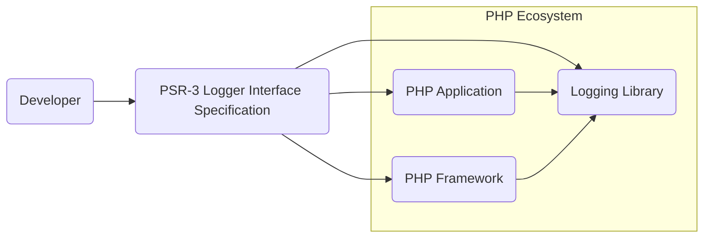
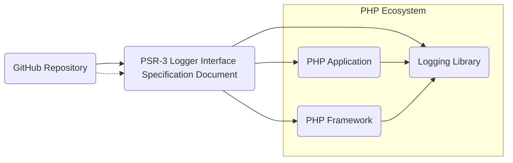
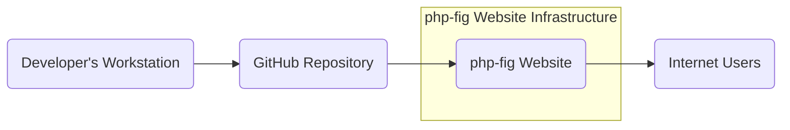
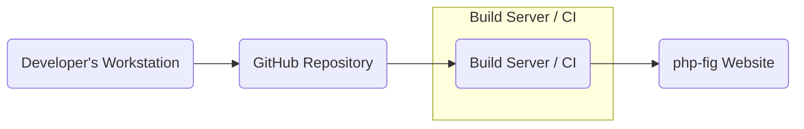

# BUSINESS POSTURE

- Business Priorities and Goals:
 - Goal: To standardize logging interfaces in PHP.
 - Priority: Increase interoperability between different PHP logging libraries and frameworks.
 - Goal: Simplify the process of switching logging implementations in PHP projects.
 - Priority: Promote best practices for logging in PHP applications.
 - Goal: Reduce vendor lock-in for logging solutions in PHP ecosystem.
 - Priority: Improve the maintainability and understandability of PHP codebases that utilize logging.

- Most Important Business Risks:
 - Risk: Lack of adoption by the PHP community, leading to continued fragmentation of logging interfaces.
 - Risk: Specification flaws or ambiguities that could lead to inconsistent implementations and interoperability issues.
 - Risk: Security vulnerabilities in implementations of the PSR-3 interface (although the interface itself is not executable code, implementations are).
 - Risk: Misinterpretation of the specification by developers, leading to incorrect usage and potential issues.
 - Risk: Changes in the PHP ecosystem that could render the specification obsolete or less relevant over time.

# SECURITY POSTURE

- Existing Security Controls:
 - security control: Version control using Git (GitHub). Implemented in: GitHub repository.
 - security control: Publicly accessible repository for transparency and community review. Implemented in: GitHub repository.
 - security control: Issue tracking system for reporting and managing issues. Implemented in: GitHub repository issue tracker.
 - security control: Pull Request process for contributions, allowing for code review. Implemented in: GitHub Pull Requests.

- Accepted Risks:
 - accepted risk: Potential for undiscovered flaws in the specification itself.
 - accepted risk: Reliance on community review for identifying security considerations in implementations.
 - accepted risk: Risk of misinterpretations of the specification leading to insecure implementations.

- Recommended Security Controls:
 - recommended security control: Formal security review of the specification document by security experts.
 - recommended security control: Provide clear security guidance for implementers of the PSR-3 interface, focusing on common logging security pitfalls (e.g., injection vulnerabilities).
 - recommended security control: Establish a process for reporting and addressing security concerns related to the specification and its implementations.
 - recommended security control: Regularly review and update the specification to address emerging security threats and best practices.

- Security Requirements:
 - Authentication: Not directly applicable to the PSR-3 specification itself. Authentication is relevant for systems that *use* logging, but not for the interface definition.
 - Authorization: Not directly applicable to the PSR-3 specification itself. Authorization is relevant for systems that *use* logging to control access to logs, but not for the interface definition.
 - Input Validation: Highly relevant for implementations of the PSR-3 interface. Implementations MUST ensure that data being logged is properly sanitized to prevent injection vulnerabilities (e.g., log injection). The specification should emphasize the importance of input validation in implementations.
 - Cryptography: Not directly applicable to the PSR-3 interface itself. Cryptography might be relevant in logging implementations if logs need to be encrypted for storage or transmission, but this is outside the scope of the interface definition. However, the specification could consider mentioning the importance of secure logging practices, including potential encryption of sensitive data in logs, as a best practice for implementers.

# DESIGN

## C4 CONTEXT

- Context Diagram Elements:
 - Element:
  - Name: PHP Application
  - Type: Software System
  - Description: A PHP application that requires logging functionality.
  - Responsibilities: Generate log messages during its execution. Consume logging libraries to handle log output.
  - Security controls: Input validation, output encoding, secure configuration management (related to application security, not PSR-3 itself).
 - Element:
  - Name: PHP Framework
  - Type: Software System
  - Description: A PHP framework that provides a structure for building PHP applications and may include or integrate with logging functionality.
  - Responsibilities: Provide a logging abstraction or integration point for applications built on top of it. Potentially implement or recommend PSR-3 compatible logging.
  - Security controls: Framework security best practices, secure defaults, input validation, output encoding (related to framework security, and how it handles logging).
 - Element:
  - Name: Logging Library
  - Type: Software System
  - Description: A PHP library that provides concrete logging implementations, such as writing logs to files, databases, or external services.
  - Responsibilities: Implement the PSR-3 Logger Interface. Handle log message formatting, storage, and output.
  - Security controls: Input validation for log messages, secure handling of sensitive data in logs, protection of log storage, secure communication with external logging services.
 - Element:
  - Name: PSR-3 Logger Interface Specification
  - Type: Specification / Document
  - Description: A PHP-FIG specification defining a common interface for logging libraries in PHP.
  - Responsibilities: Define a standard interface for logging operations in PHP. Ensure clarity and consistency in logging practices across different libraries.
  - Security controls: Specification review process, public feedback and issue tracking, clear documentation of security considerations for implementers.
 - Element:
  - Name: Developer
  - Type: Person
  - Description: A software developer who uses PHP, frameworks, and logging libraries to build applications.
  - Responsibilities: Implement logging in PHP applications. Choose and configure logging libraries. Understand and apply security best practices in logging.
  - Security controls: Secure coding practices, awareness of logging security risks, proper configuration of logging libraries.

## C4 CONTAINER

- Container Diagram Elements:
 - Element:
  - Name: PHP Application
  - Type: Software System
  - Description: A PHP application that utilizes logging.  This remains at the system level as it's an external entity interacting with the specification.
  - Responsibilities: Using logging functionality provided by libraries that implement PSR-3.
  - Security controls: Application level security controls.
 - Element:
  - Name: PHP Framework
  - Type: Software System
  - Description: A PHP framework that integrates with logging. This remains at the system level.
  - Responsibilities: Providing framework level logging abstractions, potentially based on PSR-3.
  - Security controls: Framework level security controls.
 - Element:
  - Name: Logging Library
  - Type: Software System
  - Description: A PHP logging library that implements the PSR-3 interface. This remains at the system level.
  - Responsibilities: Providing concrete logging implementations adhering to PSR-3.
  - Security controls: Logging library level security controls.
 - Element:
  - Name: PSR-3 Logger Interface Specification Document
  - Type: Document
  - Description: The document defining the PSR-3 Logger Interface, written in Markdown and potentially published in other formats (HTML, PDF).
  - Responsibilities: Clearly and accurately define the PSR-3 Logger Interface. Be publicly accessible and understandable.
  - Security controls: Version control of the document, review process for changes, public accessibility for scrutiny.
 - Element:
  - Name: GitHub Repository
  - Type: Code Repository
  - Description: The GitHub repository hosting the source files of the PSR-3 specification (primarily Markdown documents).
  - Responsibilities: Store and version control the specification document. Facilitate collaboration and contribution to the specification. Provide issue tracking and pull request mechanisms.
  - Security controls: GitHub's security controls for repository access, branch protection, and vulnerability scanning (if applicable to document files). Access control to repository contributors.

## DEPLOYMENT

- Deployment Architecture:
 - The PSR-3 specification itself is not deployed as software. Deployment in this context refers to the publication and distribution of the specification document. A common deployment is publishing the specification on a website for public access.

- Deployment Diagram Elements:
 - Element:
  - Name: Developer's Workstation
  - Type: Development Environment
  - Description: The local computer used by specification authors to write and edit the PSR-3 specification document.
  - Responsibilities: Authoring and modifying the specification document. Testing document formatting and rendering.
  - Security controls: Local workstation security controls, access control to development tools and files.
 - Element:
  - Name: GitHub Repository
  - Type: Version Control System
  - Description: The GitHub repository where the PSR-3 specification document is stored and version controlled.
  - Responsibilities: Securely store and manage the specification document. Track changes and revisions. Facilitate collaboration.
  - Security controls: GitHub's security controls, access control to the repository, branch protection, audit logs.
 - Element:
  - Name: php-fig Website
  - Type: Web Server
  - Description: The official website of PHP-FIG (PHP Framework Interoperability Group) where the PSR-3 specification document is published for public access.
  - Responsibilities: Host and serve the specification document in a publicly accessible manner. Ensure website availability and performance.
  - Security controls: Web server security hardening, HTTPS encryption, access control to website administration, regular security updates and patching.
 - Element:
  - Name: Internet Users
  - Type: User Group
  - Description: Developers and other individuals who access the php-fig website to read and use the PSR-3 specification.
  - Responsibilities: Understand and correctly interpret the specification. Implement PSR-3 in logging libraries and applications.
  - Security controls: User-side security practices (browser security, safe browsing habits). (Indirectly related to the deployment, more about users consuming the deployed specification).

## BUILD

- Build Process:
 - The build process for the PSR-3 specification involves converting the source Markdown documents into a publishable format, such as HTML or PDF, and deploying it to the php-fig website.  For a specification, the 'build' is more about document generation and publication.

- Build Diagram Elements:
 - Element:
  - Name: Developer's Workstation
  - Type: Development Environment
  - Description: Where specification authors write and commit changes to the specification document.
  - Responsibilities: Authoring, editing, and committing changes to the specification source files (Markdown).
  - Security controls: Local workstation security, secure coding practices for any build scripts, access control to development tools.
 - Element:
  - Name: GitHub Repository
  - Type: Version Control System
  - Description: Stores the source files of the specification and triggers the build process upon changes.
  - Responsibilities: Version control, trigger build process, store build artifacts (potentially).
  - Security controls: GitHub's security features, branch protection, access control, audit logs.
 - Element:
  - Name: Build Server / CI (e.g., GitHub Actions)
  - Type: Automation Server
  - Description: An automated system that builds the specification document from the source files. This could be GitHub Actions or a dedicated build server.
  - Responsibilities: Automate the process of converting Markdown to HTML/PDF. Run linters or validators on the specification document. Publish build artifacts to the php-fig website.
  - Security controls: Secure configuration of CI/CD pipeline, access control to CI/CD system, secure storage of build secrets (if any), vulnerability scanning of build tools and dependencies.
 - Element:
  - Name: php-fig Website
  - Type: Web Server / Content Delivery
  - Description: The destination where the built specification document is deployed and served to the public.
  - Responsibilities: Host and serve the specification document. Ensure website security and availability.
  - Security controls: Web server security hardening, HTTPS, access control, regular security updates.

# RISK ASSESSMENT

- Critical Business Processes:
 - Ensuring interoperability of PHP logging libraries.
 - Promoting consistent logging practices in the PHP ecosystem.
 - Maintaining the credibility and authority of PHP-FIG as a standards body.

- Data to Protect and Sensitivity:
 - Specification Document: High sensitivity. Integrity and accuracy are crucial for its purpose. Public availability is also important.
 - Website Content: Medium sensitivity. Availability and integrity are important for disseminating the specification.
 - GitHub Repository: Medium sensitivity. Integrity and availability are important for collaboration and version control.

# QUESTIONS & ASSUMPTIONS

- Questions:
 - What is the intended audience for this design document (technical, business, security)?
 - Are there any specific security concerns that are particularly important for the PSR-3 specification?
 - What level of detail is required for the threat modeling exercise that will follow this document?
 - Are there any existing security policies or guidelines that should be considered?

- Assumptions:
 - The primary goal is to create a well-structured and informative design document suitable for threat modeling.
 - The focus is on the PSR-3 specification itself and the processes around its creation and publication, rather than implementations of the interface.
 - Security considerations are important for the specification to guide secure implementations and prevent potential issues arising from misinterpretations or flaws in the specification.
 - The php-fig website is the primary channel for publishing and distributing the PSR-3 specification.
 - The GitHub repository is the primary platform for collaboration and version control of the specification.