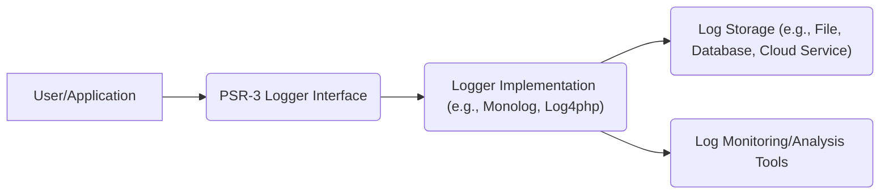
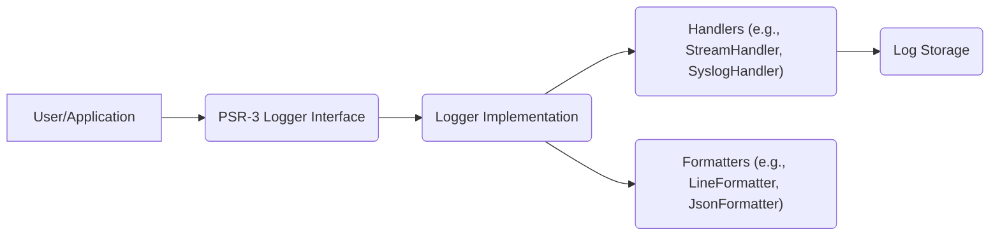
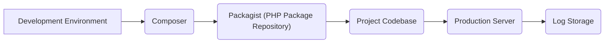
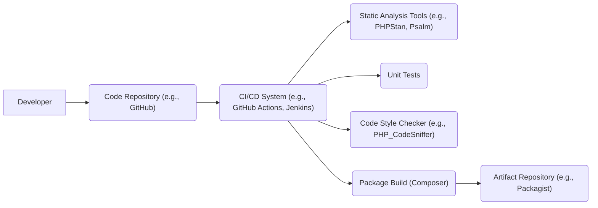

# Project Design Document: PSR-3 Logger Interface

## BUSINESS POSTURE

*   Priorities:
    *   Provide a standardized logging interface for PHP libraries and frameworks.
    *   Promote interoperability between different logging implementations.
    *   Enable developers to easily switch between different loggers without modifying their code.
    *   Facilitate consistent logging practices across the PHP ecosystem.

*   Goals:
    *   Define a common interface for logging messages.
    *   Specify log levels and their intended usage.
    *   Allow for contextual data to be included with log messages.
    *   Ensure the interface is simple, flexible, and easy to implement.

*   Business Risks:
    *   Inconsistent logging practices across different libraries and frameworks, making it difficult to aggregate and analyze logs.
    *   Tight coupling between application code and specific logging implementations, hindering flexibility and maintainability.
    *   Lack of a standardized way to handle contextual data in log messages, leading to incomplete or inconsistent log information.
    *   Adoption failure: If the standard is not widely adopted, the benefits of interoperability will not be realized.

## SECURITY POSTURE

*   Existing Security Controls:
    *   security control: The PSR-3 standard itself does not directly implement security controls. It is an interface definition. Security is the responsibility of the implementing libraries. (Described in the PSR-3 specification).
    *   security control: Implementations should avoid logging sensitive data directly. (Implicit in good logging practices, but not explicitly enforced by the interface).
    *   security control: Implementations should consider the security of the underlying transport and storage mechanisms used for logging. (Responsibility of the implementation).

*   Accepted Risks:
    *   accepted risk: The PSR-3 interface does not mandate specific security mechanisms, relying on implementations to handle security appropriately.
    *   accepted risk: The interface does not specify how to handle sensitive data, leaving this to the discretion of developers and implementers.

*   Recommended Security Controls:
    *   security control: Implementations SHOULD provide mechanisms for sanitizing or redacting sensitive data from log messages (e.g., using placeholders or filtering).
    *   security control: Implementations SHOULD offer options for secure transport and storage of log data (e.g., encryption, access control).
    *   security control: Implementations SHOULD follow secure coding practices to prevent vulnerabilities such as injection attacks.
    *   security control: Implementations SHOULD clearly document their security considerations and recommendations.

*   Security Requirements:

    *   Authentication: Not directly applicable to the logging interface itself. Authentication is relevant to the systems that consume or manage the logs.
    *   Authorization: Not directly applicable to the logging interface. Authorization is relevant to accessing and managing log data.
    *   Input Validation: Implementations MUST ensure that contextual data passed to the logger does not introduce vulnerabilities (e.g., injection attacks). Context data should be treated as untrusted input.
    *   Cryptography: Implementations SHOULD provide options for encrypting log data at rest and in transit, especially when dealing with sensitive information.

## DESIGN

### C4 CONTEXT

*   Elements:

    *   1. Name: User/Application
        *   Type: External System/User
        *   Description: The application or user code that utilizes the PSR-3 logging interface.
        *   Responsibilities: Calls the methods of the PSR-3 logger interface to log messages.
        *   Security controls: Should avoid passing sensitive data directly to the logger.

    *   2. Name: PSR-3 Logger Interface
        *   Type: Interface
        *   Description: The standardized logging interface defined by PSR-3.
        *   Responsibilities: Defines the methods for logging messages at different levels and with contextual data.
        *   Security controls: None directly implemented; relies on implementations.

    *   3. Name: Logger Implementation (e.g., Monolog, Log4php)
        *   Type: Library/Component
        *   Description: A concrete implementation of the PSR-3 logger interface.
        *   Responsibilities: Handles the actual logging of messages to the configured storage.
        *   Security controls: Should implement secure coding practices, data sanitization, and secure transport/storage options.

    *   4. Name: Log Storage (e.g., File, Database, Cloud Service)
        *   Type: Data Store
        *   Description: The storage mechanism used to persist log data.
        *   Responsibilities: Stores log data securely and provides access for analysis.
        *   Security controls: Access control, encryption at rest, data retention policies.

    *   5. Name: Log Monitoring/Analysis Tools
        *   Type: External System
        *   Description: Tools used to monitor, analyze, and visualize log data.
        *   Responsibilities: Provides insights into application behavior and potential issues.
        *   Security controls: Authentication, authorization, secure communication with log storage.

### C4 CONTAINER

*   Elements:

    *   1. Name: User/Application
        *   Type: External System/User
        *   Description: The application or user code that utilizes the PSR-3 logging interface.
        *   Responsibilities: Calls the methods of the PSR-3 logger interface to log messages.
        *   Security controls: Should avoid passing sensitive data directly to the logger.

    *   2. Name: PSR-3 Logger Interface
        *   Type: Interface
        *   Description: The standardized logging interface defined by PSR-3.
        *   Responsibilities: Defines the methods for logging messages at different levels and with contextual data.
        *   Security controls: None directly implemented; relies on implementations.

    *   3. Name: Logger Implementation
        *   Type: Library/Component
        *   Description: A concrete implementation of the PSR-3 logger interface (e.g., Monolog).
        *   Responsibilities: Manages handlers and formatters, processes log records.
        *   Security controls: Should implement secure coding practices.

    *   4. Name: Handlers (e.g., StreamHandler, SyslogHandler)
        *   Type: Component
        *   Description: Components responsible for writing log records to specific destinations.
        *   Responsibilities: Writes log records to files, databases, network services, etc.
        *   Security controls: Should handle sensitive data appropriately, use secure transport protocols.

    *   5. Name: Formatters (e.g., LineFormatter, JsonFormatter)
        *   Type: Component
        *   Description: Components responsible for formatting log records into specific formats.
        *   Responsibilities: Formats log records as strings, JSON, XML, etc.
        *   Security controls: Should sanitize data to prevent injection vulnerabilities.

    *   6. Name: Log Storage
        *   Type: Data Store
        *   Description: The storage mechanism used to persist log data.
        *   Responsibilities: Stores log data securely and provides access for analysis.
        *   Security controls: Access control, encryption at rest, data retention policies.

### DEPLOYMENT

*   Possible Deployment Solutions:
    *   1.  Composer Dependency: The PSR-3 interface and its implementations are typically included as project dependencies via Composer, the PHP package manager.
    *   2.  Framework Integration: Many PHP frameworks provide built-in logging facilities that are PSR-3 compliant or offer easy integration with PSR-3 loggers.
    *   3.  Standalone Library: The PSR-3 interface can be used as a standalone library in projects that do not use a framework.

*   Chosen Solution (Composer Dependency):

*   Elements:

    *   1.  Name: Development Environment
        *   Type: Environment
        *   Description: The developer's local machine or development server.
        *   Responsibilities: Writing and testing code.
        *   Security controls: Standard development environment security practices.

    *   2.  Name: Composer
        *   Type: Tool
        *   Description: The PHP package manager.
        *   Responsibilities: Manages project dependencies, including the PSR-3 interface and logger implementations.
        *   Security controls: Dependency verification, signature checking (if available).

    *   3.  Name: Packagist (PHP Package Repository)
        *   Type: External Service
        *   Description: The central repository for PHP packages.
        *   Responsibilities: Hosts and distributes PHP packages.
        *   Security controls: Security measures to protect the repository and its packages.

    *   4.  Name: Project Codebase
        *   Type: Code
        *   Description: The application code that uses the PSR-3 logger.
        *   Responsibilities: Contains the application logic and logging calls.
        *   Security controls: Secure coding practices, avoiding logging of sensitive data.

    *   5.  Name: Production Server
        *   Type: Environment
        *   Description: The server where the application is deployed.
        *   Responsibilities: Runs the application and handles user requests.
        *   Security controls: Server hardening, firewall, intrusion detection/prevention systems.

    *   6.  Name: Log Storage
        *   Type: Data Store
        *   Description: The storage mechanism used to persist log data (e.g., file system, database, cloud service).
        *   Responsibilities: Stores log data securely.
        *   Security controls: Access control, encryption at rest, data retention policies.

### BUILD

*   The PSR-3 interface itself is a specification and does not have a build process. However, implementations of the interface (e.g., Monolog, Log4php) will have their own build processes.  Since PSR-3 is an *interface*, the build process is more relevant to concrete *implementations* of that interface.  We'll describe a generalized build process for a typical PSR-3 compliant logging library.

*   Elements Description:

    *   1.  Name: Developer
        *   Type: Actor
        *   Description: The person writing and committing code.
        *   Responsibilities: Writes code, runs tests locally, commits changes.
        *   Security controls: Secure coding practices, code review.

    *   2.  Name: Code Repository (e.g., GitHub)
        *   Type: System
        *   Description: Version control system storing the library's source code.
        *   Responsibilities: Stores code, tracks changes, facilitates collaboration.
        *   Security controls: Access control, branch protection rules.

    *   3.  Name: CI/CD System (e.g., GitHub Actions, Jenkins)
        *   Type: System
        *   Description: Automated system for building, testing, and deploying the library.
        *   Responsibilities: Runs tests, builds packages, deploys releases.
        *   Security controls: Secure configuration, access control, secrets management.

    *   4.  Name: Static Analysis Tools (e.g., PHPStan, Psalm)
        *   Type: Tool
        *   Description: Tools that analyze code for potential errors and vulnerabilities without executing it.
        *   Responsibilities: Identifies potential bugs, security issues, and code quality problems.
        *   Security controls: Detects common coding errors that could lead to vulnerabilities.

    *   5.  Name: Unit Tests
        *   Type: Test Suite
        *   Description: Automated tests that verify the functionality of individual components.
        *   Responsibilities: Ensures that code behaves as expected.
        *   Security controls: Can help prevent regressions and ensure security-related code functions correctly.

    *   6.  Name: Code Style Checker (e.g., PHP_CodeSniffer)
        *   Type: Tool
        *   Description: Tool that enforces coding style standards.
        *   Responsibilities: Ensures consistent code style, improving readability and maintainability.
        *   Security controls: Indirectly improves security by making code easier to understand and review.

    *   7.  Name: Package Build (Composer)
        *   Type: Process
        *   Description: The process of creating a distributable package using Composer.
        *   Responsibilities: Creates a package that can be installed via Composer.
        *   Security controls: Dependency verification, signature checking (if available).

    *   8.  Name: Artifact Repository (e.g., Packagist)
        *   Type: System
        *   Description: Repository where the built package is stored and made available for download.
        *   Responsibilities: Hosts and distributes the library package.
        *   Security controls: Security measures to protect the repository and its packages.

## RISK ASSESSMENT

*   Critical Business Processes:
    *   Maintaining application stability and availability.
    *   Troubleshooting and debugging application issues.
    *   Monitoring application performance and behavior.
    *   Auditing user actions and system events.
    *   Compliance with regulatory requirements (if applicable).

*   Data Sensitivity and Protection:
    *   Data: Log messages, including contextual data.
    *   Sensitivity: Varies depending on the application and the data being logged. Can range from low (debug messages) to high (sensitive user data, if logged inappropriately).
    *   Protection:
        *   Avoid logging sensitive data directly.
        *   Use placeholders or redaction for sensitive information.
        *   Implement secure transport and storage for log data (encryption, access control).
        *   Regularly review and audit log data.
        *   Implement appropriate data retention policies.

## QUESTIONS & ASSUMPTIONS

*   Questions:
    *   What specific logging implementations are being considered? (This will affect the detailed security controls and recommendations.)
    *   What are the specific regulatory or compliance requirements related to logging?
    *   What is the expected volume of log data? (This will impact storage and performance considerations.)
    *   What are the existing security policies and procedures for the organization?
    *   What level of access control is required for log data?

*   Assumptions:
    *   BUSINESS POSTURE: The organization values interoperability and maintainability of its logging infrastructure.
    *   SECURITY POSTURE: The organization has a basic understanding of security best practices and is willing to implement reasonable security controls.
    *   DESIGN: The PSR-3 interface will be used in conjunction with a concrete logging implementation (e.g., Monolog). The log data will be stored in a secure manner, with appropriate access controls. The build process will include static analysis and unit testing.