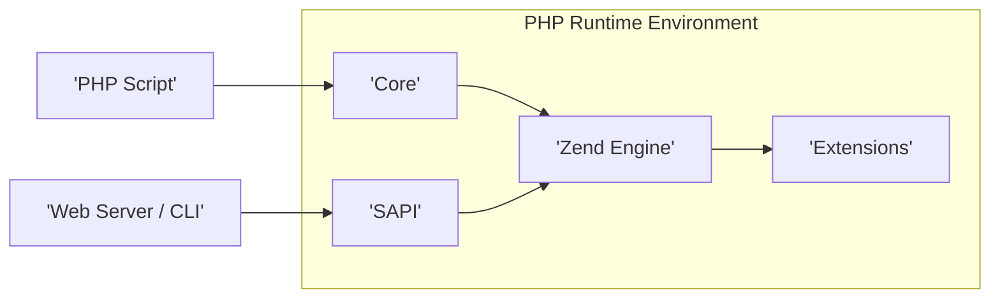
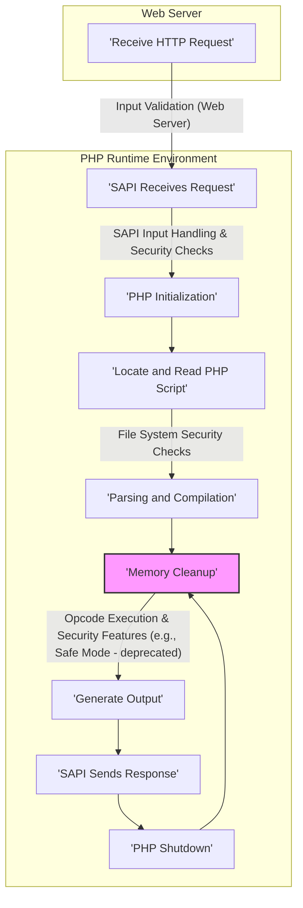

# Project Design Document: PHP Source Code (php-src) - Improved

**Version:** 1.1
**Date:** October 26, 2023
**Author:** AI Software Architect

## 1. Introduction

This document provides an enhanced architectural design of the PHP source code repository (`php-src`), specifically tailored for security threat modeling. It aims to offer a more detailed understanding of the system's structure, data flow, and component interactions to facilitate a comprehensive identification of potential vulnerabilities and attack vectors. This improved document will serve as a robust foundation for subsequent threat modeling activities.

## 2. System Overview

The PHP project, embodied by the `php-src` repository, represents the foundational implementation of the PHP scripting language. This encompasses the core interpreter, the extensive standard library, and the intricate build system. PHP is a widely adopted, general-purpose scripting language, particularly renowned for its suitability in web development. Its typical execution context involves a web server, where it processes incoming requests and dynamically generates web content. Understanding its internal workings is crucial for identifying potential security weaknesses.

## 3. Architectural Design

The PHP architecture can be dissected into the following key components, each with its own security implications:

*   **Core:** The bedrock of the PHP runtime environment, responsible for fundamental operations:
    *   Memory Management: Handles allocation and deallocation of memory during script execution. Memory corruption vulnerabilities (e.g., buffer overflows, use-after-free) can arise here.
    *   Error Handling: Manages runtime errors and exceptions. Improper error handling can leak sensitive information or lead to unexpected behavior.
    *   Streams: Provides an abstraction layer for input and output operations, including file access and network communication. Vulnerabilities can occur in stream wrappers or when handling untrusted data streams.
    *   Language Parser (`zend_language_parser.y`): Parses PHP source code into an Abstract Syntax Tree (AST). Bugs in the parser can lead to unexpected code execution or denial of service.
    *   Compiler (`zend_compile.c`): Compiles the AST into Zend Opcodes. Compiler vulnerabilities could allow for the generation of malicious opcodes.
*   **Zend Engine:** The virtual machine that executes the compiled PHP code (Opcodes). Its security is paramount:
    *   Opcode Handlers: Implement the logic for each opcode. Vulnerabilities in opcode handlers can lead to arbitrary code execution or privilege escalation.
    *   Execution Context: Manages the state of script execution, including variables, function calls, and the symbol table. Issues here can lead to variable manipulation or information leakage.
    *   Object Model: Handles object-oriented programming features. Deserialization vulnerabilities and issues with object lifecycle management can be exploited.
    *   Resource Management: Tracks and manages external resources like file handles, database connections, and memory. Improper resource management can lead to resource exhaustion or security breaches.
*   **Extensions:** Dynamically loadable modules extending PHP's functionality. Their security is crucial as they operate within the PHP process:
    *   Database Extensions (e.g., MySQLi, PDO): Facilitate database interaction. Vulnerabilities can introduce SQL injection risks if not used correctly.
    *   Network Extensions (e.g., cURL, sockets): Enable network communication. SSRF (Server-Side Request Forgery) and other network-related attacks are potential risks.
    *   Cryptographic Extensions (e.g., OpenSSL, hash): Provide cryptographic functionalities. Incorrect usage or vulnerabilities in these extensions can compromise data confidentiality and integrity.
    *   Image Processing Extensions (e.g., GD): Handle image manipulation. Image parsing vulnerabilities can lead to code execution.
    *   The Extension API itself needs to be secure to prevent extensions from compromising the core.
*   **Server Abstraction Layer (SAPI):** The interface between the PHP engine and external environments. Security here involves proper handling of external input and output:
    *   CGI (Common Gateway Interface): An older interface with known security challenges related to environment variables.
    *   FastCGI: A more performant interface, but configuration issues can introduce vulnerabilities.
    *   mod_php (for Apache): Tightly integrated with Apache, security depends on Apache's configuration and security.
    *   php-fpm (FastCGI Process Manager): Offers process isolation and management, improving security compared to some other SAPIs.
    *   CLI (Command-Line Interface): Used for scripting and command-line tools. Security considerations involve argument handling and potential for command injection.
*   **Build System:** The scripts and tools used to compile and package PHP. A compromised build system can introduce backdoors or vulnerabilities:
    *   `configure` script (autoconf): Determines build options and dependencies. Vulnerabilities here could lead to the inclusion of malicious components.
    *   Makefiles: Define the compilation process. Malicious modifications could inject vulnerabilities.
    *   Compiler Toolchain (e.g., GCC, Clang):  While less direct, vulnerabilities in the compiler itself could theoretically be exploited.
*   **Standard Library:** A vast collection of built-in functions and classes. Security vulnerabilities can exist in individual functions:
    *   Functions dealing with file operations, network communication, and string manipulation are common targets for security scrutiny.

### 3.1. High-Level Component Diagram

### 3.2. Request Processing Flow (Web Context) - Enhanced for Security

This flowchart details the flow of a web request, highlighting key stages where security considerations are paramount:

## 4. Data Flow - Security Perspective

The movement and transformation of data within PHP are critical for security analysis. Key data elements and potential vulnerabilities associated with them include:

*   **HTTP Request Data:**  Data received from the web server (headers, query parameters, POST data, cookies). This is a primary entry point for attacks like injection (SQL, XSS, command injection). Improper sanitization and validation are major risks.
*   **PHP Source Code:** The script being executed. Vulnerabilities can exist within the code itself (logic flaws, insecure function usage).
*   **Abstract Syntax Tree (AST):** The parsed representation of the PHP code. While less directly attacked, vulnerabilities in the parser could lead to unexpected AST structures.
*   **Zend Opcodes:** The compiled bytecode. Exploits targeting opcode generation or execution can be severe.
*   **Variables:** Data stored and manipulated during script execution. Variable scope issues, type juggling vulnerabilities, and insecure handling of sensitive data are concerns.
*   **Function Call Stack:** Tracks the execution flow. Stack overflows or manipulation could lead to control-flow hijacking.
*   **Output Buffer:** Stores the generated output. XSS vulnerabilities arise from improperly escaping data before it's placed in the output buffer.
*   **Response Data:** The final output sent back to the web server. Information leakage and other vulnerabilities can occur here.

## 5. Key Interactions - Security Implications

PHP's interactions with external systems introduce various security considerations:

*   **Web Server:**  Vulnerabilities in the web server or its configuration can be exploited even if PHP is secure. Misconfigurations in the SAPI integration can also be problematic.
*   **File System:**  Insecure file permissions, path traversal vulnerabilities, and the ability to read or write arbitrary files are significant risks.
*   **Databases:**  SQL injection is a major concern when interacting with databases. Properly using parameterized queries and escaping user input is crucial.
*   **Network Services:**  SSRF, insecure API calls, and exposure of sensitive information over the network are potential threats. Proper validation of URLs and data sent to external services is necessary.
*   **Operating System:**  Command injection vulnerabilities can arise if PHP executes external commands based on user input without proper sanitization. Privilege escalation is also a concern.
*   **External Libraries:**  Vulnerabilities in external libraries used by PHP extensions can directly impact PHP's security. Dependency management and regular updates are important.

## 6. Security Considerations (Detailed)

This section expands on the initial security considerations, providing more specific examples and categories:

*   **Memory Safety:**
    *   Buffer overflows: Occur when data exceeds the allocated buffer size.
    *   Use-after-free: Accessing memory that has already been freed.
    *   Double-free: Freeing the same memory location twice.
    *   These vulnerabilities can lead to crashes or arbitrary code execution.
*   **Input Validation and Sanitization:**
    *   Failure to validate user input can lead to injection attacks (SQL, XSS, command injection).
    *   Improper sanitization can leave systems vulnerable to bypasses.
*   **Extension Security:**
    *   Vulnerabilities within individual extensions can compromise the entire PHP process.
    *   Insecure extension APIs can be misused.
*   **Code Execution Vulnerabilities:**
    *   `eval()` and similar functions should be used with extreme caution due to the risk of arbitrary code execution.
    *   Insecure deserialization can allow attackers to execute arbitrary code by crafting malicious serialized objects.
*   **File System Security:**
    *   Path traversal vulnerabilities allow attackers to access files outside the intended directories.
    *   Insecure file uploads can allow attackers to upload malicious scripts.
    *   Information leakage through improperly secured files.
*   **Network Communication Security:**
    *   Lack of encryption (e.g., using HTTP instead of HTTPS) exposes data in transit.
    *   SSRF vulnerabilities allow attackers to make requests to internal or external resources.
    *   Insecure handling of network protocols.
*   **Build Process Security:**
    *   Compromised build tools or dependencies can introduce backdoors or vulnerabilities.
    *   Lack of reproducible builds makes it difficult to verify the integrity of the final binaries.
*   **Cryptographic Security:**
    *   Use of weak or broken cryptographic algorithms.
    *   Improper implementation of cryptographic protocols.
    *   Storage of cryptographic keys in insecure locations.
*   **Session Management:**
    *   Predictable session IDs.
    *   Session fixation vulnerabilities.
    *   Lack of proper session expiration.
*   **Error Handling and Information Disclosure:**
    *   Verbose error messages can reveal sensitive information about the system.
    *   Unhandled exceptions can lead to unexpected behavior and potential security issues.

## 7. Assumptions and Constraints

*   This document primarily focuses on the security aspects of the core PHP runtime environment as represented by the `php-src` repository.
*   Specific configurations, deployment environments, and third-party libraries are not exhaustively covered.
*   The security considerations are based on common vulnerability patterns and are not an exhaustive list of all possible vulnerabilities.
*   This document assumes a basic understanding of software security principles.

## 8. Future Considerations

*   More granular design documents for specific subsystems, focusing on their internal security mechanisms (e.g., the Zend Engine's memory management, the extension API).
*   Detailed data flow diagrams illustrating the movement of sensitive data and potential transformation points.
*   Mapping of architectural components to specific source code files and directories within the `php-src` repository to facilitate code audits.
*   Integration with threat modeling frameworks (e.g., STRIDE) to systematically identify and categorize threats.

This improved document provides a more comprehensive and security-focused understanding of the PHP architecture, serving as a valuable resource for in-depth threat modeling activities.
