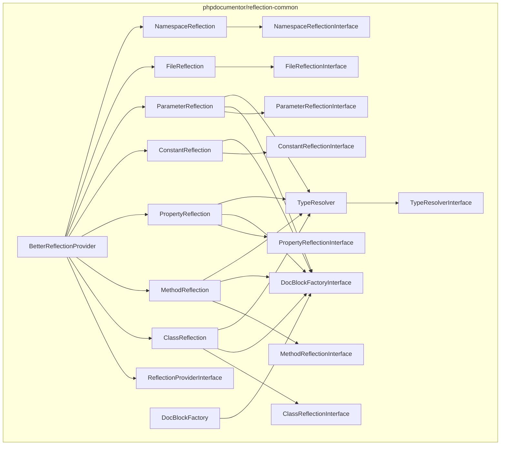
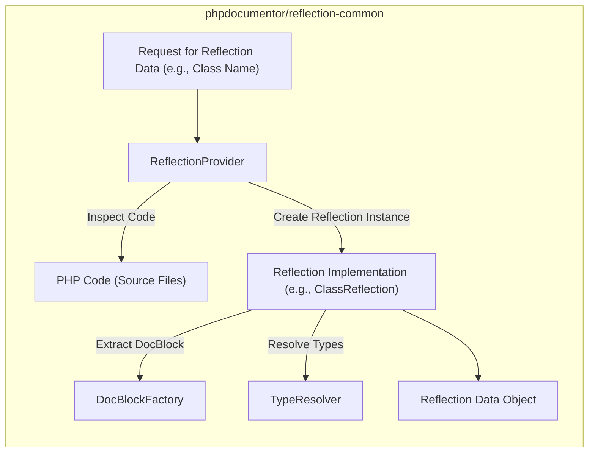

# Project Design Document: phpdocumentor/reflection-common

**Version:** 1.1
**Date:** October 26, 2023
**Author:** AI Software Architect

## 1. Introduction

This document provides a detailed design overview of the `phpdocumentor/reflection-common` library. This library is a foundational component designed to offer a consistent and reliable abstraction layer over PHP's native reflection API. It serves as a building block for other PHP tools, particularly within the `phpDocumentor` ecosystem, simplifying common reflection tasks and promoting code consistency. This document is intended to serve as the basis for subsequent threat modeling activities.

## 2. Goals and Objectives

The primary goals of the `phpdocumentor/reflection-common` library are:

* **Abstraction of Reflection:** To provide a higher-level, more user-friendly abstraction over PHP's built-in reflection capabilities, mitigating inconsistencies across different PHP versions.
* **Standardized Interface:** To define a common set of interfaces and classes for representing reflected code elements, ensuring interoperability within the `phpDocumentor` project and potentially with external tools.
* **Structured Data Representation:** To establish well-defined data structures for representing reflected code elements such as classes, methods, properties, and parameters.
* **Utility Functionality:** To offer helper functions that streamline frequent reflection-related operations.
* **Maintainable Codebase:** To ensure the library's codebase is well-organized, easy to understand, and maintainable.

## 3. Scope

This design document focuses on the internal architecture, data flow, and key interfaces of the `phpdocumentor/reflection-common` library. The scope includes:

* Definition of core interfaces for representing reflected elements (e.g., `ClassReflectionInterface`, `MethodReflectionInterface`, `PropertyReflectionInterface`).
* Concrete implementations of these interfaces.
* Utility classes and functions designed to facilitate common reflection tasks.
* The interactions and relationships between these internal components.

The scope explicitly excludes:

* The specific ways in which external tools utilize this library (these will be detailed in the design documents of those respective tools).
* The intricate internal workings of PHP's native reflection API.
* Low-level implementation details concerning how reflection data is retrieved from the PHP engine.

## 4. Architectural Overview

The `reflection-common` library is built upon object-oriented principles, providing interfaces that define contracts for interacting with reflected code elements and concrete classes that implement these contracts. The central concept is to abstract away the direct manipulation of PHP's `Reflection*` classes, offering a more stable and manageable API.

### 4.1. Component Diagram

### 4.2. Key Components and Responsibilities

* **Reflection Interfaces (`ClassReflectionInterface`, `MethodReflectionInterface`, etc.):** These interfaces define the contract for accessing information about reflected code elements. They provide methods to retrieve details such as name, visibility modifiers, associated docblocks, parameters, and return types.
* **Reflection Implementations (`ClassReflection`, `MethodReflection`, etc.):** These concrete classes implement the reflection interfaces. They encapsulate the logic for obtaining and representing reflection data, often acting as wrappers around PHP's native `Reflection*` classes or utilizing more advanced reflection mechanisms.
* **`ReflectionProviderInterface`:** This interface defines the contract for components responsible for providing reflection instances for specific code elements (e.g., retrieving a `ClassReflection` object for a given class name).
* **`BetterReflectionProvider`:** A concrete implementation of `ReflectionProviderInterface`. This component likely employs a more sophisticated reflection mechanism, potentially leveraging libraries like `nikic/PHP-Parser` for more accurate and feature-rich reflection capabilities.
* **`DocBlockFactoryInterface`:** An interface defining the contract for creating `DocBlock` objects from docblock strings.
* **`DocBlockFactory`:** A concrete implementation of `DocBlockFactoryInterface`, responsible for parsing docblock comments and extracting structured information.
* **`TypeResolverInterface`:** An interface defining the contract for resolving type hints and docblock types to more concrete and understandable representations.
* **`TypeResolver`:** A concrete implementation of `TypeResolverInterface`.

## 5. Data Flow

The typical data flow within the `reflection-common` library involves a request for reflection information about a specific code element, which is then processed and returned.

### 5.1. Data Flow Diagram

### 5.2. Detailed Data Flow Description

1. An external component or another part of `phpDocumentor` initiates a request for reflection information, specifying a code element such as a class name, method name, or property name.
2. This request is typically handled by an instance of a class implementing the `ReflectionProviderInterface`, such as `BetterReflectionProvider`.
3. The `ReflectionProvider` examines the provided PHP code, potentially by parsing source files or utilizing cached reflection data.
4. Based on the request, the `ReflectionProvider` instantiates the appropriate reflection implementation object (e.g., `ClassReflection` for a class).
5. The reflection implementation object may perform the following actions:
    * Internally utilize PHP's native reflection API to gather basic information about the code element.
    * Employ a `DocBlockFactory` to parse the docblock associated with the code element, extracting structured information about parameters, return types, and other annotations.
    * Utilize a `TypeResolver` to interpret type hints and docblock types, providing more concrete type information.
6. The reflection implementation object encapsulates the retrieved and processed reflection data.
7. The library returns a reflection data object (e.g., an instance of `ClassReflection`) containing the requested information to the requesting component.

## 6. Security Considerations (For Threat Modeling)

While `reflection-common`'s primary function is to inspect existing PHP code, several security considerations are relevant for threat modeling:

* **Code Injection (Indirect):** Although `reflection-common` doesn't directly execute code, if the source code it reflects upon is compromised (e.g., through a file upload vulnerability), the reflection data could expose malicious code structure, potentially misleading analysis tools. **Relevant Components:** `ReflectionProvider`, `FileReflection`.
* **Denial of Service:** Reflecting on extremely large or deeply nested codebases could consume significant resources, potentially leading to performance degradation or denial of service. **Relevant Components:** `ReflectionProvider`.
* **Information Disclosure:** Reflection inherently reveals the structure and internal workings of code, including potentially sensitive information like private properties or internal logic. If this reflection data is exposed inappropriately (e.g., through a debugging interface), it could be exploited. **Relevant Components:** All Reflection Interfaces and Implementations.
* **Dependency Vulnerabilities:**  If `reflection-common` depends on other libraries with known security vulnerabilities, these vulnerabilities could be indirectly introduced into systems using `reflection-common`. **Relevant Aspect:** Dependency Management.
* **Data Integrity:** If the process of obtaining or parsing reflection information is flawed, it could lead to inaccurate or incomplete reflection data, potentially causing misinterpretations by tools relying on this library. **Relevant Components:** `DocBlockFactory`, `TypeResolver`.

## 7. Dependencies

The `reflection-common` library has the following dependencies:

* **PHP Core:** It fundamentally relies on PHP's built-in reflection capabilities.
* **Composer:** Used for installation and management of dependencies.
* **Potentially other `phpDocumentor` components:**  Depending on the specific version and features, it might depend on other internal `phpDocumentor` libraries.
* **Potentially external libraries for advanced reflection or parsing (e.g., `nikic/PHP-Parser`):** This should be verified by examining the `composer.json` file for the specific version being used.

## 8. Deployment

The `reflection-common` library is typically deployed as a dependency within other PHP projects using Composer. To include it in a project, developers add it to the `require` section of their `composer.json` file and run `composer install`. No specific deployment steps are usually required beyond this.

## 9. Future Considerations

Potential future enhancements and considerations for the library include:

* **Performance Optimization:** Investigating and implementing optimizations to improve the speed and efficiency of reflection operations, especially when dealing with large codebases.
* **Extensibility Improvements:** Enhancing the library's extensibility to allow for custom reflection providers or data representations, catering to specific needs or alternative reflection mechanisms.
* **Enhanced Type Resolution:**  Improving the accuracy and robustness of the `TypeResolver` component to handle more complex type hints and docblock annotations.
* **Integration with Static Analysis Tools:**  Providing clearer interfaces or data structures that facilitate easier integration with static analysis tools for code quality and security analysis.

This document provides an improved and more detailed design overview of the `phpdocumentor/reflection-common` library, specifically tailored for use in subsequent threat modeling activities. It clarifies the components, data flow, and highlights potential security considerations relevant to each aspect of the library.