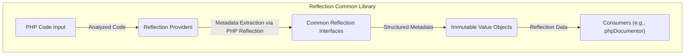
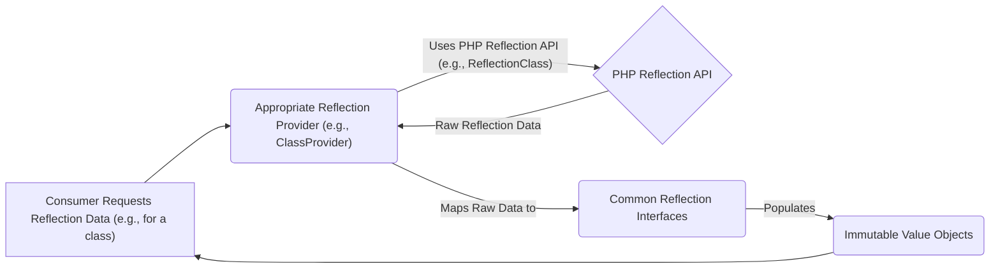

# Project Design Document: phpDocumentor Reflection Common Library

**Version:** 1.1
**Date:** October 26, 2023
**Author:** AI Software Architect

## 1. Introduction

This document details the design of the `phpDocumentor/reflection-common` library, a foundational component for static analysis of PHP code. It provides a consistent and structured abstraction over PHP's native reflection capabilities, offering interfaces and immutable value objects to represent code elements. This design aims to facilitate understanding for development, maintenance, and, crucially, for conducting thorough threat modeling.

## 2. Goals and Objectives

*   **Provide a Stable Abstraction:** Offer a reliable and consistent interface to PHP reflection, insulating consumers from internal API changes.
*   **Define Clear Contracts:** Establish well-defined interfaces for representing PHP code structures (classes, methods, etc.) to ensure predictable interactions.
*   **Ensure Data Integrity:** Utilize immutable value objects to guarantee that reflected information remains unchanged after retrieval.
*   **Maintain High Performance:** Minimize the overhead introduced by the abstraction layer to ensure efficient static analysis.
*   **Promote Interoperability:** Enable seamless integration with various static analysis tools by providing a common data model for PHP code.

## 3. Target Audience

This document is intended for:

*   **Security Auditors and Engineers:** To understand the library's internal workings and identify potential security vulnerabilities for threat modeling and risk assessment.
*   **Software Developers:** To gain a deep understanding of the library's architecture for contribution, extension, and effective integration into other projects.
*   **Project Maintainers:** To serve as a comprehensive reference for understanding the system's design, facilitating maintenance, debugging, and future development.

## 4. Scope

This document comprehensively describes the design of the `phpDocumentor/reflection-common` library, including its interfaces, value objects, and their interactions.

**In Scope:**

*   The architecture and design of the core reflection interfaces (e.g., `ClassReflection`, `MethodReflection`).
*   The structure and purpose of the value objects used to represent reflected data.
*   The role and responsibilities of the reflection providers.
*   The data flow within the library.

**Out of Scope:**

*   The implementation details of PHP's native reflection API.
*   The specific usage patterns or integrations of this library within consuming applications (e.g., phpDocumentor itself).
*   The detailed implementation of individual methods within the library's classes.
*   Performance benchmarks or specific optimization strategies.

## 5. System Architecture

### 5.1. High-Level Architecture

*   **PHP Code Input:** The PHP source code that is the target of the reflection process.
*   **Reflection Providers:** Components responsible for using PHP's internal reflection API to extract metadata from the input PHP code. They act as an intermediary between the raw reflection data and the library's internal representation.
*   **Common Reflection Interfaces:** A set of clearly defined interfaces that establish contracts for representing various PHP code elements in an abstract and consistent manner.
*   **Immutable Value Objects:** Data containers that hold the extracted metadata about PHP code elements. These objects are immutable, ensuring data integrity and predictability.
*   **Consumers:** External software components or applications that utilize the structured reflection information provided by this library for purposes such as documentation generation, static analysis, or code understanding.

### 5.2. Component View

The library is organized into distinct components, each with specific responsibilities:

*   **Reflection Providers (Located typically in `src/Provider`)**:
    *   **Responsibility:**  Interact directly with PHP's native reflection API (`ReflectionClass`, `ReflectionMethod`, etc.).
    *   **Function:**  Extract raw metadata for different types of code elements (classes, interfaces, functions, properties, etc.).
    *   **Example:** A `ClassProvider` would handle the reflection of class-related information.
*   **Common Reflection Interfaces (Located in `src/Interfaces`)**:
    *   **Responsibility:** Define the abstract contracts for representing reflected code elements.
    *   **Function:**  Provide a consistent API for accessing metadata, regardless of the underlying PHP reflection details.
    *   **Examples:**
        *   `ClassLike`:  A shared interface for classes, interfaces, and traits, defining common methods.
        *   `ClassReflection`:  Interface for representing class-specific information.
        *   `InterfaceReflection`: Interface for representing interface-specific information.
        *   `TraitReflection`: Interface for representing trait-specific information.
        *   `MethodReflection`: Interface for representing method information.
        *   `PropertyReflection`: Interface for representing property information.
        *   `ConstantReflection`: Interface for representing constant information.
        *   `ParameterReflection`: Interface for representing function or method parameter information.
*   **Value Objects (Located in `src/`)**:
    *   **Responsibility:** Hold the extracted metadata as immutable data structures.
    *   **Function:** Ensure data integrity and provide a structured way to access reflection information.
    *   **Examples:**
        *   `FQSEN` (Fully Qualified Structural Element Name): Represents the unique identifier of a code element.
        *   `Context`: Provides information about the namespace and other contextual details of a code element.
        *   `DocBlock`: Represents the parsed content of a PHPDoc comment.
        *   Concrete implementations of the reflection interfaces (e.g., `ClassReflector` implementing `ClassReflection`).
*   **Exceptions (Located in `src/Exception`)**:
    *   **Responsibility:** Define custom exception types for specific error conditions within the library.
    *   **Function:** Provide a structured way to handle errors and communicate issues during the reflection process.

## 6. Data Flow

The typical flow of data within the library during a reflection operation is as follows:

1. A consumer of the library requests reflection data for a specific code element, such as a class.
2. The relevant `Reflection Provider` (e.g., `ClassProvider` for class reflection) is invoked to handle the request.
3. The `Reflection Provider` utilizes PHP's native reflection API (e.g., `ReflectionClass`) to retrieve raw metadata about the requested code element.
4. The raw reflection data obtained from PHP's API is passed back to the `Reflection Provider`.
5. The `Reflection Provider` then maps this raw data into the library's defined `Common Reflection Interfaces`.
6. The interfaces are implemented by concrete classes, which are often immutable `Value Objects`, holding the structured reflection data.
7. The populated `Value Objects` containing the reflection information are returned to the requesting consumer.

## 7. Security Considerations

While the `phpDocumentor/reflection-common` library is primarily focused on reading code metadata and does not involve the execution of arbitrary code, security considerations are still important, especially given its role in static analysis tools. Potential areas of concern include:

*   **Input Handling and Validation (of Analyzed Code):** Although the library doesn't directly handle user input, the PHP code being analyzed serves as input. Maliciously crafted PHP code, while not directly executable by this library, could potentially trigger unexpected behavior, infinite loops, or excessive resource consumption during the reflection process. Sanitization or validation of the *structure* of the code being analyzed might be necessary in consuming applications.
*   **Error Handling and Information Disclosure:** Improper error handling within the reflection process could inadvertently expose sensitive information about the codebase structure or internal workings. Exceptions and error messages should be carefully crafted to avoid revealing unnecessary details.
*   **Dependency Security:** The security of the libraries that `phpDocumentor/reflection-common` depends on is crucial. Vulnerabilities in dependencies could potentially be exploited. Regular dependency updates and security audits are necessary.
*   **Resource Exhaustion:** Processing extremely large or complex codebases could potentially lead to resource exhaustion (memory or CPU). While not a direct vulnerability, it's a consideration for the robustness of consuming applications.
*   **Denial of Service (DoS):**  Maliciously crafted PHP code could be designed to cause the reflection process to consume excessive resources, potentially leading to a denial of service in the consuming application.

## 8. Deployment

The `phpDocumentor/reflection-common` library is typically deployed as a dependency within other PHP projects using the Composer package manager.

**Deployment Steps:**

*   **Add as a Dependency:** Include the `phpdocumentor/reflection-common` package in the `require` or `require-dev` section of the consuming project's `composer.json` file.
*   **Install Dependencies:** Run `composer install` or `composer update` to download and install the library and its dependencies.
*   **Usage:** The library's classes and interfaces can then be used within the consuming project by referencing their namespaces.

No specific server configurations or deployment procedures are required for this library itself, as it operates within the context of a PHP application.

## 9. Technologies Used

*   **PHP:** The core programming language in which the library is developed.
*   **PHP Reflection API:** The underlying native PHP functionality used for code introspection.
*   **Composer:** The dependency management tool used for installation and management of the library.

## 10. Future Considerations

*   **Enhanced Support for Newer PHP Features:** As new versions of PHP are released with new language constructs (e.g., fibers, enums with backing types), the library will need to be updated to accurately reflect these features.
*   **Performance Optimizations:** Continuously explore opportunities to optimize the performance of the reflection process, particularly for large codebases. This could involve caching strategies or more efficient use of the native reflection API.
*   **Extensibility and Customization:** Consider ways to make the library more extensible to accommodate custom reflection needs or to allow users to provide their own reflection providers for specific scenarios.
*   **Improved DocBlock Handling:**  Potentially enhance the `DocBlock` component to provide more detailed and structured information about annotations and other DocBlock elements.
*   **Static Analysis Integration Improvements:**  Explore ways to further improve the library's integration with static analysis tools, potentially by providing more specific or specialized reflection interfaces for common analysis tasks.