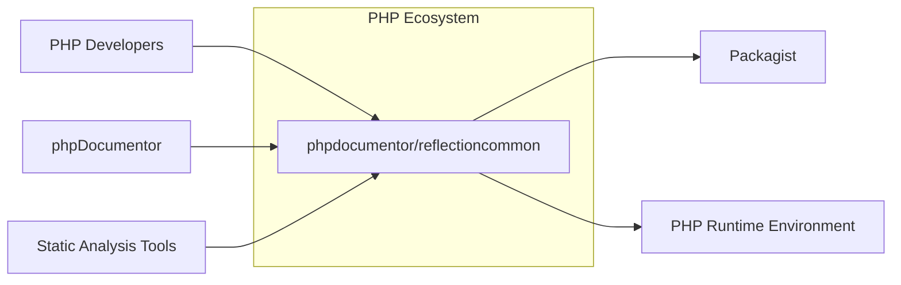
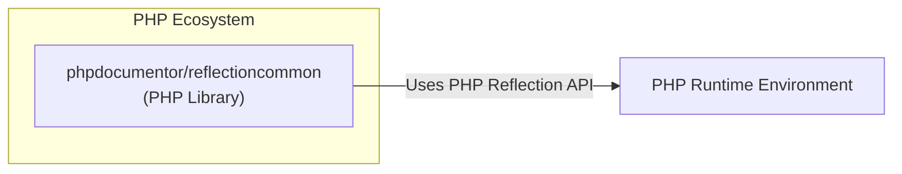
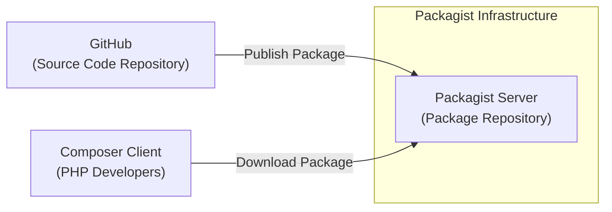
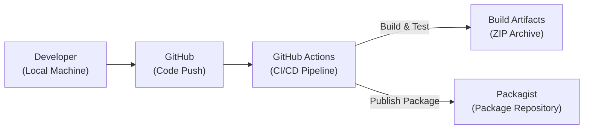

# BUSINESS POSTURE

- Business Priorities and Goals:
  - Provide a stable and reliable PHP reflection library for use in other PHP projects, such as documentation generators, static analysis tools, and IDEs.
  - Ensure compatibility with various PHP versions to maximize usability across different projects.
  - Maintain the library as an open-source project, fostering community contributions and ensuring long-term availability.

- Most Important Business Risks:
  - Security vulnerabilities within the library could be inherited by dependent projects, potentially leading to security breaches in those projects.
  - Breaking changes introduced in new versions could cause compatibility issues and disrupt the functionality of dependent projects, leading to developer frustration and potential project delays.
  - Lack of maintenance and updates could result in the library becoming outdated, incompatible with newer PHP versions, and vulnerable to newly discovered security threats.
  - Poor performance or resource consumption could negatively impact the performance of dependent projects.

# SECURITY POSTURE

- Existing Security Controls:
  - security control: GitHub repository hosting with standard GitHub security features (e.g., vulnerability scanning for dependencies). Implemented by: GitHub platform.
  - security control: Open-source development model with community review (implicit code review by contributors and users). Implemented by: Open-source nature of the project.
  - security control: Use of Composer for dependency management, leveraging Packagist as a package repository. Implemented by: Project build and distribution process.

- Accepted Risks:
  - accepted risk: Potential for undiscovered vulnerabilities due to the complexity of code and the open-source development model.
  - accepted risk: Reliance on community contributions for security fixes and updates, which may have variable response times.
  - accepted risk: Supply chain risks associated with dependencies managed by Composer and Packagist.

- Recommended Security Controls:
  - security control: Implement automated Static Application Security Testing (SAST) tools in the CI/CD pipeline to identify potential code-level vulnerabilities.
  - security control: Implement automated Dependency Scanning to identify known vulnerabilities in third-party libraries used by the project.
  - security control: Establish a clear process for reporting and handling security vulnerabilities, including a security policy and contact information.
  - security control: Conduct regular security code reviews, focusing on critical components and areas prone to vulnerabilities.
  - security control: Implement input validation and sanitization practices to mitigate injection vulnerabilities.

- Security Requirements:
  - Authentication: Not applicable for a library. Authentication is relevant for systems that use this library, but not for the library itself.
  - Authorization: Not applicable for a library. Authorization is relevant for systems that use this library, but not for the library itself.
  - Input Validation: The library should perform robust input validation to ensure that it can safely handle various types of PHP code and user-provided input without leading to unexpected behavior or vulnerabilities. This is especially important when reflecting on code provided by external sources.
  - Cryptography: Not directly applicable for the core functionality of a reflection library. However, if the library were to handle sensitive data or configuration (which is not the case for `reflectioncommon`), cryptographic measures would be relevant.

# DESIGN

## C4 CONTEXT

- Context Diagram Elements:
  - - Name: phpdocumentor/reflectioncommon
    - Type: Software System
    - Description: A PHP library providing reflection capabilities for use in other PHP projects. It allows inspection of code structure, classes, functions, and other elements.
    - Responsibilities:
      - Provide a robust and accurate API for reflecting on PHP code.
      - Support various PHP language features and versions.
      - Be performant and resource-efficient.
    - Security controls:
      - Input validation to handle potentially untrusted code safely.
      - Regular security updates and vulnerability patching.

  - - Name: PHP Developers
    - Type: Person
    - Description: Developers who use the `reflectioncommon` library in their PHP projects.
    - Responsibilities:
      - Integrate the library into their projects using Composer.
      - Utilize the library's API to perform reflection tasks.
      - Report issues and contribute to the library's development.
    - Security controls:
      - Secure coding practices in their own projects to properly utilize the library and handle reflected data.

  - - Name: phpDocumentor
    - Type: Software System
    - Description: A documentation generator for PHP code that likely uses `reflectioncommon` to analyze code structure and generate documentation.
    - Responsibilities:
      - Utilize `reflectioncommon` to parse and understand PHP code.
      - Generate documentation based on the reflected code structure.
    - Security controls:
      - Securely handle the output from `reflectioncommon`.
      - Ensure that documentation generation process does not introduce new vulnerabilities.

  - - Name: Static Analysis Tools
    - Type: Software System
    - Description: Tools that analyze PHP code for potential errors, bugs, and security vulnerabilities. These tools might use `reflectioncommon` to understand code structure.
    - Responsibilities:
      - Utilize `reflectioncommon` to parse and analyze PHP code.
      - Identify potential issues in the code based on reflection data.
    - Security controls:
      - Securely handle the output from `reflectioncommon`.
      - Ensure that analysis process does not introduce new vulnerabilities.

  - - Name: Packagist
    - Type: Software System
    - Description: The primary package repository for PHP packages, used to distribute `reflectioncommon` via Composer.
    - Responsibilities:
      - Host and distribute the `reflectioncommon` package.
      - Provide package management services for Composer.
    - Security controls:
      - Package integrity checks to prevent malicious package distribution.
      - Vulnerability scanning of hosted packages.

  - - Name: PHP Runtime Environment
    - Type: Technology
    - Description: The PHP interpreter and environment in which `reflectioncommon` and its dependent projects are executed.
    - Responsibilities:
      - Execute PHP code, including `reflectioncommon` library.
      - Provide necessary PHP functionalities for reflection.
    - Security controls:
      - Security features of the PHP runtime itself (e.g., memory management, security extensions).
      - Configuration and hardening of the PHP runtime environment.

## C4 CONTAINER

- Container Diagram Elements:
  - - Name: phpdocumentor/reflectioncommon (PHP Library)
    - Type: Container - Library
    - Description: A PHP library providing reflection capabilities. It is distributed as a Composer package and intended to be included in other PHP projects.
    - Responsibilities:
      - Expose a PHP API for performing reflection operations on PHP code.
      - Implement reflection logic using PHP's built-in reflection capabilities.
      - Manage dependencies using Composer.
    - Security controls:
      - Input validation within the library's API.
      - Dependency scanning of Composer dependencies.
      - SAST during development.

  - - Name: PHP Runtime Environment
    - Type: Container - Runtime Environment
    - Description: The PHP interpreter that executes the `reflectioncommon` library and its dependent projects.
    - Responsibilities:
      - Provide the PHP Reflection API used by `reflectioncommon`.
      - Execute PHP code securely.
    - Security controls:
      - PHP runtime security features and configurations.
      - Operating system level security controls.

## DEPLOYMENT

- Deployment Architecture Options:
  - Option 1: Packagist Distribution - The library is primarily deployed as a package on Packagist, making it available for download and inclusion in other PHP projects via Composer.
  - Option 2: Direct Inclusion (Less Common) - Developers could theoretically download the source code directly from GitHub and include it in their projects, bypassing Packagist. This is less common and not the recommended deployment method.

- Detailed Deployment Architecture (Packagist Distribution):

- Deployment Diagram Elements:
  - - Name: Packagist Server (Package Repository)
    - Type: Infrastructure - Server
    - Description: The Packagist server infrastructure that hosts and distributes PHP packages, including `reflectioncommon`.
    - Responsibilities:
      - Store and serve package files (e.g., ZIP archives).
      - Manage package metadata and indexing.
      - Handle Composer client requests for package downloads.
    - Security controls:
      - Infrastructure security of Packagist servers.
      - Package integrity verification.
      - Access controls to package publishing.

  - - Name: GitHub (Source Code Repository)
    - Type: Infrastructure - Code Repository
    - Description: GitHub hosts the source code repository for `reflectioncommon`.
    - Responsibilities:
      - Store and manage the source code using Git.
      - Provide version control and collaboration features.
      - Trigger CI/CD pipelines for building and publishing packages.
    - Security controls:
      - GitHub platform security features (access control, vulnerability scanning).
      - Secure development practices by maintainers.

  - - Name: Composer Client (PHP Developers)
    - Type: Software - Package Manager Client
    - Description: Composer is the PHP dependency manager used by PHP developers to download and install `reflectioncommon` and other packages.
    - Responsibilities:
      - Resolve and download package dependencies from Packagist.
      - Install packages into PHP projects.
    - Security controls:
      - Composer client security features (e.g., package signature verification - although not widely used for Packagist).
      - Secure configuration of Composer.

## BUILD

- Build Process Description:
  - Developer develops code locally and pushes changes to the GitHub repository.
  - GitHub Actions CI/CD pipeline is triggered on code push.
  - The CI/CD pipeline performs the following steps:
    - Checkout code.
    - Install dependencies using Composer.
    - Run automated tests (unit tests, integration tests).
    - Run SAST and dependency scanning tools.
    - Build package artifacts (e.g., create a ZIP archive).
    - Publish the package artifact to Packagist.

- Build Diagram Elements:
  - - Name: Developer (Local Machine)
    - Type: Person/Environment
    - Description: The developer's local development environment where code is written and tested before being pushed to the repository.
    - Responsibilities:
      - Write and test code.
      - Use Git for version control.
      - Run local builds and tests.
    - Security controls:
      - Developer workstation security practices.
      - Code review before pushing changes.

  - - Name: GitHub (Code Push)
    - Type: Platform - Code Repository
    - Description: GitHub repository receiving code pushes from developers.
    - Responsibilities:
      - Store code changes.
      - Trigger CI/CD pipelines.
      - Manage access control to the repository.
    - Security controls:
      - GitHub platform security features.
      - Access control and permissions.

  - - Name: GitHub Actions (CI/CD Pipeline)
    - Type: Platform - CI/CD
    - Description: GitHub Actions is used as the CI/CD platform to automate the build, test, and publish process.
    - Responsibilities:
      - Automate build, test, and deployment steps.
      - Run security scans (SAST, dependency checks).
      - Publish packages to Packagist.
    - Security controls:
      - Secure configuration of CI/CD pipelines.
      - Use of secure credentials management in CI/CD.
      - Security scanning tools integration.

  - - Name: Build Artifacts (ZIP Archive)
    - Type: Data - Artifact
    - Description: The packaged library (e.g., ZIP archive) created by the build process.
    - Responsibilities:
      - Contain the distributable version of the library.
    - Security controls:
      - Integrity checks during build and publishing.

  - - Name: Packagist (Package Repository)
    - Type: Platform - Package Repository
    - Description: Packagist is the PHP package repository where the built library is published.
    - Responsibilities:
      - Host and distribute the package.
    - Security controls:
      - Packagist platform security.
      - Package integrity verification.

# RISK ASSESSMENT

- Critical Business Processes:
  - Providing reliable and secure reflection capabilities to dependent PHP projects.
  - Maintaining the stability and compatibility of the library to avoid breaking changes for users.
  - Ensuring the long-term availability and maintenance of the library as an open-source project.

- Data to Protect and Sensitivity:
  - Source code of the `reflectioncommon` library: Medium sensitivity. Confidentiality is less critical for open-source, but integrity and availability are important.
  - PHP code being reflected upon by users of the library: High sensitivity. This code can contain business logic, sensitive data, and intellectual property. The library must handle this input securely to prevent information leakage or vulnerabilities in user applications.
  - Package artifacts on Packagist: Medium sensitivity. Integrity and availability are crucial to ensure users download legitimate and functional packages.

# QUESTIONS & ASSUMPTIONS

- Questions:
  - What are the specific security testing practices currently in place for `reflectioncommon`?
  - Is there a documented security policy or vulnerability reporting process for the project?
  - Are there any specific coding standards or security guidelines followed by contributors?
  - What is the process for managing and updating dependencies, especially regarding security vulnerabilities?
  - Are there any known security vulnerabilities or past security incidents related to `reflectioncommon`?

- Assumptions:
  - The primary goal of `reflectioncommon` is to provide a general-purpose PHP reflection library for the PHP ecosystem.
  - Security is considered an important aspect of the library, as vulnerabilities could impact dependent projects.
  - Standard open-source development practices are generally followed, including code review and testing.
  - The library is intended to be used in a variety of PHP environments and projects, including potentially security-sensitive applications.
  - The project relies on community contributions for maintenance and security updates.