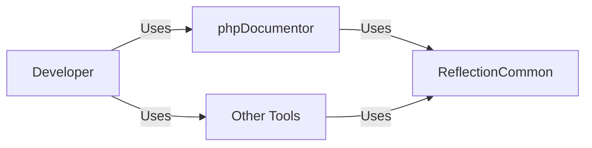
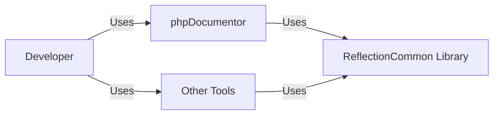
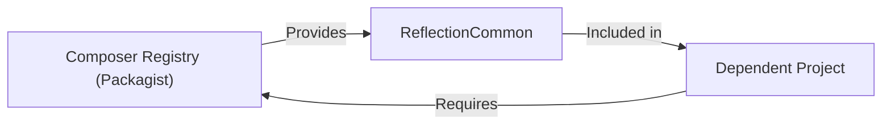
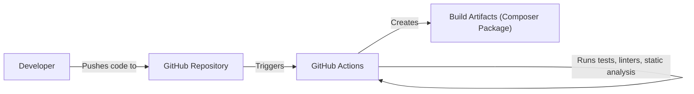

# Project Design Document: phpDocumentor/ReflectionCommon

## BUSINESS POSTURE

*   Priorities:
    *   Provide a stable and reliable common reflection library for PHP projects.
    *   Ensure high code quality and maintainability.
    *   Facilitate interoperability between different PHP projects that require reflection capabilities.
    *   Minimize external dependencies.
*   Goals:
    *   Serve as a foundational component for the phpDocumentor project and potentially other tools.
    *   Offer a consistent and well-documented API for reflection functionalities.
    *   Reduce code duplication across projects using this library.
*   Business Risks:
    *   Inconsistent reflection behavior across different PHP versions could lead to compatibility issues and inaccurate results in dependent projects.
    *   Security vulnerabilities in the library could be exploited in applications that rely on it, potentially leading to information disclosure or other security breaches.
    *   Lack of proper documentation or unclear API could hinder adoption and increase the learning curve for developers.
    *   Performance bottlenecks in the library could impact the performance of applications using it, especially those performing extensive reflection operations.

## SECURITY POSTURE

*   Existing Security Controls:
    *   security control: Static code analysis (using tools like PHPStan, Psalm) is integrated into the build process, helping to identify potential bugs and vulnerabilities. (Mentioned in the GitHub Actions workflow: .github/workflows/continuous-integration.yml)
    *   security control: Code style checks (using tools like PHP_CodeSniffer) are enforced to maintain code consistency and readability, reducing the likelihood of introducing errors. (Mentioned in the GitHub Actions workflow: .github/workflows/continuous-integration.yml)
    *   security control: Automated tests are run as part of the continuous integration pipeline to ensure code correctness and prevent regressions. (Mentioned in the GitHub Actions workflow: .github/workflows/continuous-integration.yml)
    *   security control: Dependency management using Composer helps to track and manage external libraries, allowing for easier updates and vulnerability patching. (composer.json file)
*   Accepted Risks:
    *   accepted risk: The library relies on PHP's built-in reflection capabilities, which may have inherent limitations or potential vulnerabilities that are outside the control of this project.
    *   accepted risk: The library does not directly handle user input or external data, reducing the attack surface, but vulnerabilities in dependent projects could indirectly affect this library.
*   Recommended Security Controls:
    *   security control: Regularly review and update dependencies to address known vulnerabilities.
    *   security control: Implement a security policy and reporting process for handling potential security issues.
    *   security control: Consider adding more specific security-focused static analysis checks, such as those related to data handling and sanitization, even if the library's primary focus isn't on direct user input.
*   Security Requirements:
    *   Authentication: Not applicable, as this is a library and not a service.
    *   Authorization: Not applicable, as this is a library and not a service.
    *   Input Validation: While the library itself doesn't directly handle user input, any functions that accept parameters should validate the type and format of those parameters to prevent unexpected behavior or errors. This is partially addressed by type hinting in the code, but additional runtime checks might be beneficial in some cases.
    *   Cryptography: Not applicable, as this library does not handle cryptographic operations.

## DESIGN

### C4 CONTEXT

*   Elements:
    *   Name: Developer
        *   Type: Person
        *   Description: A software developer who uses tools that rely on ReflectionCommon.
        *   Responsibilities: Uses tools like phpDocumentor or other reflection-based utilities.
        *   Security controls: Not directly applicable.
    *   Name: phpDocumentor
        *   Type: Software System
        *   Description: A documentation generator for PHP that uses ReflectionCommon.
        *   Responsibilities: Generates documentation from PHP source code.
        *   Security controls: Relies on the security controls of ReflectionCommon and its own implementation.
    *   Name: Other Tools
        *   Type: Software System
        *   Description: Other PHP tools that might use ReflectionCommon for reflection purposes.
        *   Responsibilities: Varies depending on the specific tool.
        *   Security controls: Relies on the security controls of ReflectionCommon and their own implementations.
    *   Name: ReflectionCommon
        *   Type: Software System
        *   Description: The ReflectionCommon library providing common reflection functionalities.
        *   Responsibilities: Provides a consistent API for reflection operations.
        *   Security controls: Static code analysis, code style checks, automated tests, dependency management.

### C4 CONTAINER

*   Elements:
    *   Name: Developer
        *   Type: Person
        *   Description: A software developer who uses tools that rely on ReflectionCommon.
        *   Responsibilities: Uses tools like phpDocumentor or other reflection-based utilities.
        *   Security controls: Not directly applicable.
    *   Name: phpDocumentor
        *   Type: Software System
        *   Description: A documentation generator for PHP that uses ReflectionCommon.
        *   Responsibilities: Generates documentation from PHP source code.
        *   Security controls: Relies on the security controls of ReflectionCommon and its own implementation.
    *   Name: Other Tools
        *   Type: Software System
        *   Description: Other PHP tools that might use ReflectionCommon for reflection purposes.
        *   Responsibilities: Varies depending on the specific tool.
        *   Security controls: Relies on the security controls of ReflectionCommon and their own implementations.
    *   Name: ReflectionCommon Library
        *   Type: Library
        *   Description: The ReflectionCommon library providing common reflection functionalities.
        *   Responsibilities: Provides a consistent API for reflection operations.
        *   Security controls: Static code analysis, code style checks, automated tests, dependency management.

### DEPLOYMENT

*   Possible Deployment Solutions:
    1.  Inclusion via Composer: The library is typically included as a dependency in other PHP projects using Composer.
    2.  Manual Inclusion: While less common, the library could be manually downloaded and included in a project.

*   Chosen Deployment Solution (Composer):

*   Elements:
    *   Name: Composer Registry (Packagist)
        *   Type: Package Repository
        *   Description: The central repository for PHP packages managed by Composer.
        *   Responsibilities: Hosts and provides access to PHP packages, including ReflectionCommon.
        *   Security controls: Packagist.org implements security measures to protect the integrity of packages.
    *   Name: Dependent Project
        *   Type: Software System
        *   Description: A PHP project that depends on ReflectionCommon.
        *   Responsibilities: Varies depending on the project.
        *   Security controls: Relies on the security controls of its dependencies, including ReflectionCommon.
    *   Name: ReflectionCommon
        *   Type: Library
        *   Description: The ReflectionCommon library.
        *   Responsibilities: Provides reflection functionalities.
        *   Security controls: Static code analysis, code style checks, automated tests, dependency management.

### BUILD

*   Build Process Description:
    1.  A developer pushes code changes to the GitHub repository.
    2.  GitHub Actions is triggered by the push event.
    3.  The GitHub Actions workflow executes a series of steps:
        *   Checks out the code.
        *   Sets up the PHP environment.
        *   Installs dependencies using Composer.
        *   Runs static analysis tools (PHPStan, Psalm).
        *   Runs code style checks (PHP_CodeSniffer).
        *   Runs unit tests (using PHPUnit).
    4.  If all checks and tests pass, the build is considered successful.
    5.  While this project doesn't explicitly create deployable artifacts in the traditional sense (like a JAR file), the successful build indicates that the code is ready to be packaged and distributed via Composer. The "artifact" in this case is the validated code itself, ready for inclusion in other projects.

*   Security Controls:
    *   security control: GitHub Actions provides a secure and isolated environment for running the build process.
    *   security control: Static analysis tools (PHPStan, Psalm) help identify potential security vulnerabilities in the code.
    *   security control: Code style checks (PHP_CodeSniffer) enforce coding standards, reducing the risk of introducing errors.
    *   security control: Automated tests (PHPUnit) ensure that the code behaves as expected and help prevent regressions.
    *   security control: Dependency management using Composer helps to track and manage external libraries, allowing for easier updates and vulnerability patching.

## RISK ASSESSMENT

*   Critical Business Processes:
    *   Providing accurate and reliable reflection information to dependent projects.
    *   Maintaining the stability and compatibility of the library across different PHP versions.
*   Data:
    *   The library itself does not handle sensitive data directly. It primarily deals with code metadata (classes, methods, properties, etc.).
    *   Data Sensitivity: Low, as the library does not handle user data or sensitive information. The primary concern is the integrity and correctness of the reflection information it provides.

## QUESTIONS & ASSUMPTIONS

*   Questions:
    *   Are there any specific performance requirements or benchmarks for the library?
    *   Are there any plans to extend the library's functionality beyond the current scope?
    *   Are there any specific PHP versions that need to be supported or excluded?
*   Assumptions:
    *   BUSINESS POSTURE: The primary goal is to provide a stable and reliable reflection library for internal use within phpDocumentor and potentially other projects.
    *   SECURITY POSTURE: The library is not expected to handle sensitive data directly. Security efforts are primarily focused on code quality and preventing vulnerabilities that could be exploited indirectly.
    *   DESIGN: The library is designed to be a lightweight and focused component with minimal external dependencies. The current design is sufficient for its intended purpose.