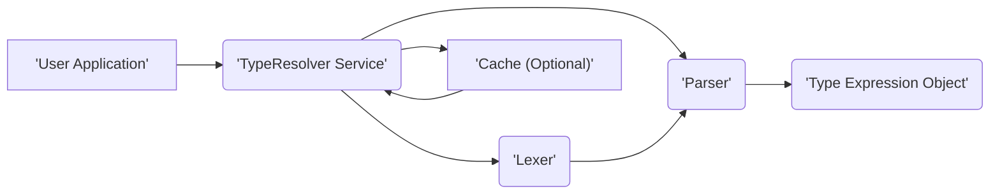
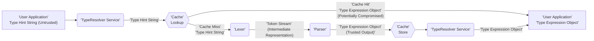

# Project Design Document: phpDocumentor TypeResolver

**Version:** 1.1
**Date:** October 26, 2023
**Author:** AI Software Architect

## 1. Introduction

This document provides a detailed design overview of the `phpDocumentor/TypeResolver` project. This document serves as a foundation for understanding the system's architecture, components, and data flow, which is crucial for subsequent threat modeling activities. This revision aims to provide more granular detail and explicitly highlight areas relevant to security considerations.

### 1.1. Purpose

The primary purpose of this document is to clearly and comprehensively describe the design of the `phpDocumentor/TypeResolver` library. This documentation will be used as input for a threat modeling exercise to identify potential security vulnerabilities and design flaws. The focus is on providing sufficient detail for security experts to understand the system's attack surface.

### 1.2. Scope

This document covers the core functionality of the `phpDocumentor/TypeResolver` library, focusing on its internal components, data flow, and interactions. It includes:

*   High-level architecture of the library with clear component boundaries.
*   Detailed description of key components and their specific responsibilities, including input and output data types.
*   Data flow within the library, highlighting data transformations and potential points of manipulation.
*   Specific considerations for deployment and usage that impact security.

### 1.3. Goals

The goals of this design document are to:

*   Provide a clear and understandable overview of the `phpDocumentor/TypeResolver` architecture, suitable for security analysis.
*   Identify the key components and their interactions, emphasizing trust boundaries and data exchange.
*   Describe the data flow within the system, highlighting potential vulnerabilities at each stage.
*   Serve as a concrete basis for identifying potential security threats, vulnerabilities, and attack vectors.

## 2. High-Level Architecture

The `phpDocumentor/TypeResolver` library is designed to resolve type hints in PHP code. It takes a string representing a type hint as input and returns a structured representation of that type. The core components involved in this process are illustrated in the following diagram:

**Components:**

*   **User Application:** The external system or code that utilizes the `TypeResolver` library to resolve type hints. This is the untrusted boundary where input originates.
*   **TypeResolver Service:** The main entry point of the library, acting as an orchestrator. It manages the lifecycle of type resolution and interacts with other components. It might interact with a cache for performance optimization. This component handles the initial input and final output.
*   **Lexer:** Responsible for the lexical analysis of the input type hint string. It breaks down the string into a sequence of tokens based on predefined grammatical rules. This component is crucial for input sanitization and preventing injection attacks.
*   **Parser:** Takes the stream of tokens from the Lexer and constructs an Abstract Syntax Tree (AST) or a similar structured representation of the type expression. This component enforces the grammar of type hints and is susceptible to vulnerabilities if the grammar is not strictly enforced.
*   **Type Expression Object:** Represents the successfully resolved type hint in a structured object format. This object is the trusted output of the resolution process and should be immutable.
*   **Cache (Optional):** An optional component used to store previously resolved type hints to improve performance by avoiding redundant parsing and resolution. This component introduces potential risks related to cache poisoning and data integrity.

## 3. Detailed Design

This section provides a more in-depth look at the key components and their functionalities, with a focus on security-relevant aspects.

### 3.1. TypeResolver Service

*   **Responsibilities:**
    *   Receives the raw type hint string as input from the **User Application**. This is the primary point of entry for potentially malicious input.
    *   Performs initial input sanitization or validation (if any).
    *   Checks the **Cache** for a previously resolved version of the type hint.
    *   If not in the cache, it invokes the **Lexer** and **Parser** to process the type hint.
    *   Stores the resolved **Type Expression Object** in the **Cache** (if caching is enabled). The process of storing needs to be secure to prevent cache poisoning.
    *   Returns the **Type Expression Object** to the **User Application**. This output should be carefully considered to avoid information leakage.
    *   Manages configuration options, such as enabling/disabling caching and potentially setting cache parameters. Improper configuration can introduce vulnerabilities.
*   **Input:** Raw type hint string (potentially untrusted).
*   **Output:** Resolved **Type Expression Object** or an error indication.

### 3.2. Lexer

*   **Responsibilities:**
    *   Takes the raw type hint string as input from the **TypeResolver Service**.
    *   Identifies individual tokens within the string based on predefined regular expressions or finite automata.
    *   Outputs a stream of tokens representing the basic building blocks of the type hint.
    *   Handles basic syntax errors in the type hint string, such as invalid characters or token sequences. Robust error handling is crucial to prevent unexpected behavior.
*   **Input:** Raw type hint string.
*   **Output:** Stream of tokens.
*   **Security Considerations:**
    *   Vulnerable to regular expression denial-of-service (ReDoS) if complex or poorly written regular expressions are used for tokenization.
    *   Improper handling of character encoding could lead to bypasses or unexpected tokenization.

### 3.3. Parser

*   **Responsibilities:**
    *   Receives the stream of tokens from the **Lexer**.
    *   Applies grammar rules (defined formally or informally) to the token stream to build a structured representation of the type expression (e.g., an Abstract Syntax Tree).
    *   Enforces the syntax rules of valid PHP type hints. Strict enforcement is critical to prevent the interpretation of malicious strings as valid type hints.
    *   Identifies and reports syntax errors in the type hint. Error messages should be informative but avoid revealing sensitive information.
    *   Creates the **Type Expression Object** representing the parsed type. The creation process should ensure the integrity and immutability of the object.
*   **Input:** Stream of tokens.
*   **Output:** **Type Expression Object** or an error indication.
*   **Security Considerations:**
    *   Vulnerable to stack overflow or excessive memory consumption if the grammar allows for deeply nested or recursive type definitions without proper limits.
    *   Bugs in the parsing logic could lead to misinterpretation of type hints, potentially causing unexpected behavior in the consuming application.

### 3.4. Type Expression Object

*   **Responsibilities:**
    *   Represents the resolved type hint in a structured and easily accessible format. This object should be designed to be immutable to prevent tampering.
    *   Provides methods or properties to access information about the type, such as:
        *   The base type (e.g., `'string'`, `'int'`, `'array'`).
        *   Generic type parameters (e.g., `'array<string>'`).
        *   Nullable status (e.g., `'?string'`).
        *   Iterable types (e.g., `'iterable<int>'`).
        *   Class names and interfaces.
        *   Union and intersection types.
    *   Should not contain any logic that could be exploited. It should be purely a data structure.
*   **Input:** Data representing the parsed type hint from the **Parser**.
*   **Output:**  Provides access to type information.
*   **Security Considerations:**
    *   Ensure the object is immutable to prevent modification after creation.
    *   Carefully consider the data types used within the object to avoid potential overflow or underflow issues if the type hint represents extreme values.

### 3.5. Cache (Optional)

*   **Responsibilities:**
    *   Stores resolved **Type Expression Objects** keyed by the original type hint string.
    *   Provides a mechanism to retrieve previously resolved types quickly.
    *   May implement a time-to-live (TTL) or other eviction strategies for cached entries.
    *   Could be implemented using various caching mechanisms (e.g., in-memory array, external cache like Redis). The choice of caching mechanism has significant security implications.
*   **Input:** Type hint string and the corresponding **Type Expression Object**.
*   **Output:** **Type Expression Object** (on cache hit).
*   **Security Considerations:**
    *   **Cache Poisoning:** If an external cache is used, ensure proper authentication and authorization mechanisms are in place to prevent unauthorized modification of cached entries.
    *   **Data Integrity:** Ensure the integrity of cached data. Use checksums or other mechanisms to detect tampering.
    *   **Information Disclosure:**  Avoid storing sensitive information in the cache if it's not necessary. Consider the security implications of the chosen caching mechanism (e.g., is it encrypted at rest?).
    *   **Denial of Service:**  An attacker might attempt to fill the cache with invalid or malicious entries to degrade performance or cause resource exhaustion.

## 4. Data Flow

The following diagram illustrates the flow of data through the `TypeResolver` library, highlighting potential points of interest for security analysis.

**Data Flow Description:**

1. The **User Application** provides a type hint string (which is considered **untrusted**) to the **TypeResolver Service**.
2. The **TypeResolver Service** passes the **Type Hint String** to the **Cache** for a lookup.
3. **Cache Hit:** If the type hint is found in the cache, the corresponding **Type Expression Object** is returned directly to the **User Application**. **Security Note:** Data retrieved from the cache should be treated with caution, as it could potentially be compromised (cache poisoning).
4. **Cache Miss:** If the type hint is not in the cache:
    *   The **TypeResolver Service** passes the **Type Hint String** to the **Lexer**.
    *   The **Lexer** tokenizes the string and produces a **Token Stream** (an intermediate representation of the input).
    *   The **Token Stream** is passed to the **Parser**.
    *   The **Parser** analyzes the tokens and generates a **Type Expression Object** (considered the **trusted output** of the parsing process).
    *   The **Type Expression Object** is stored in the **Cache** (if enabled).
    *   The **TypeResolver Service** returns the **Type Expression Object** to the **User Application**.

## 5. Security Considerations (Detailed)

This section expands on the initial security considerations, providing more specific examples and potential attack vectors.

*   **Input Validation Vulnerabilities:**
    *   **ReDoS in Lexer:** Maliciously crafted type hint strings with repeating patterns could cause the Lexer's regular expressions to consume excessive CPU time, leading to denial of service. Example: `array<<<<<<<<<<<<<<<<string>>>>>>>>>>>>>>>>`.
    *   **Parser Exploits:**  Type hints with deeply nested structures or excessive use of union/intersection types could exhaust the Parser's stack or memory, leading to crashes or denial of service. Example: `(int|string)|(bool|float)|...` repeated many times.
    *   **Injection Attacks (Less Likely):** While less likely in a type resolver, if the parsing logic has flaws, it might be possible to inject unexpected tokens or structures that could be misinterpreted by the consuming application.
*   **Cache-Related Vulnerabilities:**
    *   **Cache Poisoning:** An attacker could potentially inject malicious or incorrect type information into the cache, leading to the application making incorrect assumptions about types. This is especially relevant if an external, less secure cache is used.
    *   **Cache Snooping/Information Disclosure:** If the cache is not properly secured, an attacker might be able to access the cached type information, potentially revealing details about the application's internal structure or data types.
    *   **Cache DoS:** An attacker could flood the cache with requests for unique, non-existent type hints, causing the cache to grow excessively and potentially impacting performance or leading to resource exhaustion.
*   **Error Handling Issues:**
    *   **Information Leakage:** Error messages generated by the Lexer or Parser might reveal sensitive information about the internal workings of the library or the structure of the code being analyzed.
    *   **Unhandled Exceptions:**  Unexpected errors during parsing or resolution could lead to unhandled exceptions, potentially crashing the application or leaving it in an inconsistent state.
*   **Dependency Vulnerabilities:**
    *   If the `TypeResolver` library relies on other third-party libraries, vulnerabilities in those dependencies could also pose a security risk. Regularly updating dependencies is crucial.
*   **Configuration Issues:**
    *   **Insecure Cache Configuration:**  Using a caching mechanism without proper authentication or encryption could expose the cache to attacks.
    *   **Overly Permissive Configuration:** Allowing excessively large or complex type hints without limits could make the library more susceptible to DoS attacks.

## 6. Deployment Considerations

The `phpDocumentor/TypeResolver` library is typically deployed as a dependency within other PHP projects. Security considerations during deployment include:

*   **Dependency Management:** Use a reliable package manager like Composer and ensure dependencies are regularly updated to patch known vulnerabilities.
*   **Environment Security:** The security of the environment where the library is deployed (e.g., web server, PHP interpreter) is crucial. Ensure proper security configurations and hardening.
*   **Caching Infrastructure:** If caching is enabled, the security of the chosen caching mechanism (e.g., Redis, Memcached) must be carefully considered, including authentication, authorization, and encryption.
*   **Resource Limits:** Configure appropriate resource limits (e.g., memory limits, execution time limits) to prevent denial-of-service attacks related to parsing complex type hints.

## 7. Future Considerations

While not directly relevant to the immediate threat modeling exercise, future development considerations might include:

*   Support for more granular control over parsing strictness and error handling.
*   Mechanisms for sanitizing or escaping type hint strings before parsing.
*   Integration with security scanning tools to automatically identify potential vulnerabilities.
*   Performance optimizations to mitigate potential DoS attacks.

This improved document provides a more detailed and security-focused overview of the `phpDocumentor/TypeResolver` project's design, making it more suitable for a thorough threat modeling exercise.
