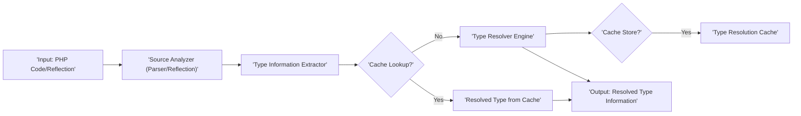

# Project Design Document: PHP Type Resolver

**Project Name:** PHP Type Resolver

**Project Repository:** [https://github.com/phpdocumentor/typeresolver](https://github.com/phpdocumentor/typeresolver)

**Version:** 1.1

**Date:** October 26, 2023

**Author:** AI Software Architect

## 1. Introduction

This document provides an enhanced and more detailed design overview of the PHP Type Resolver project. This library is crucial for static analysis tools, IDEs, and other applications that need to understand the types of variables, function parameters, and return values in PHP code. Accurate type resolution enables better code understanding, improved code completion, and the detection of potential type-related errors before runtime. This design document will serve as a comprehensive reference for developers and security analysts, facilitating a deeper understanding of the system's architecture, components, and data flow, which is essential for effective threat modeling.

## 2. Goals

*   Provide a highly accurate and reliable mechanism for resolving PHP type declarations from various sources.
*   Comprehensive support for diverse sources of type information, including:
    *   PHPDoc blocks (`@param`, `@return`, `@var`, `@property`, etc.).
    *   Native PHP type hints in function/method signatures and property declarations.
    *   Intersection and union types.
    *   Nullable types.
    *   Array shapes and generic types (where applicable and parsable).
*   Design for extensibility to seamlessly accommodate future PHP language features and evolving type declaration syntaxes without requiring significant architectural changes.
*   Offer a well-defined, consistent, and easy-to-use API for integration into a wide range of other PHP projects and tools.
*   Maintain a balance between accuracy and performance to ensure the library can be used efficiently in performance-sensitive applications.

## 3. Non-Goals

*   Performing any form of static analysis beyond the scope of type resolution (e.g., code style checks, detecting unused variables, identifying potential bugs based on control flow).
*   Providing runtime type checking or enforcement capabilities; this library focuses solely on static analysis of types.
*   Rewriting, modifying, or formatting the input PHP code in any way. The focus is purely on understanding existing code.
*   Supporting programming languages other than PHP.
*   Resolving types across different files or projects without explicit context or input. The resolver operates on the provided code snippet or reflection object.

## 4. High-Level Architecture

The PHP Type Resolver is architected as a pipeline of interconnected components, each responsible for a specific aspect of the type resolution process.

```mermaid
graph LR
    subgraph "Type Resolver Core"
        direction LR
        A["'Input: PHP Code Snippet or Reflection Object'"] --> B["'Source Analyzer'"];
        B --> C["'Type Information Aggregator'"];
        C --> D["'Type Resolver Engine'"];
        D --> E["'Output: Resolved Type Information'"];
    end
    F["'Type Resolution Cache (Optional)'"] <--.-> D
```

*   **Input: PHP Code Snippet or Reflection Object:** The initial entry point, accepting either a raw string containing PHP code or a pre-existing PHP Reflection object representing a code element.
*   **Source Analyzer:**  The first stage, responsible for taking the input and transforming it into a structured format suitable for further analysis. This might involve parsing code into an Abstract Syntax Tree (AST) or extracting relevant data from a Reflection object.
*   **Type Information Aggregator:** This component gathers all available type information from the structured representation produced by the Source Analyzer. It extracts type hints from signatures, docblock annotations, and potentially other sources.
*   **Type Resolver Engine:** The core of the system, responsible for processing the aggregated type information and resolving it into a definitive type. This involves handling complex type scenarios, inheritance, and potentially using a cache for efficiency.
*   **Output: Resolved Type Information:** The final output, representing the resolved type in a structured and easily consumable format.
*   **Type Resolution Cache (Optional):** An optional component that stores the results of previous type resolutions to improve performance by avoiding redundant computations.

## 5. Detailed Design

### 5.1. Input Handling and Source Analysis

*   The system provides a clear entry point (likely a class with a `resolveType()` method or similar) that accepts either a PHP code string or a PHP Reflection object (`ReflectionFunction`, `ReflectionMethod`, `ReflectionProperty`, etc.).
*   **For Code String Input:**
    *   A robust PHP parser library (e.g., nikic/PHP-Parser) is utilized to convert the code string into an Abstract Syntax Tree (AST).
    *   Error handling during parsing is crucial. The system should gracefully handle syntax errors and potentially provide informative error messages, although strict syntax validation is not the primary goal.
*   **For Reflection Object Input:**
    *   The system directly accesses the properties and methods of the Reflection object to extract relevant information about the code element.
    *   This path bypasses the parsing stage, making it more efficient when reflection objects are readily available.
*   The Source Analyzer component encapsulates this logic, providing a consistent interface for the subsequent stages regardless of the input type.

### 5.2. Type Information Aggregator

*   **Purpose:** To systematically gather all potential sources of type information associated with the code element being analyzed.
*   **Process:**
    *   **Signature Analysis:** Extracts type hints directly from function/method signatures (e.g., `: string`, `: ?int`).
    *   **Docblock Parsing:** Parses PHPDoc comments associated with the code element to extract type information from tags like `@param`, `@return`, `@var`, `@property`, `@method`, and `@template`. This involves handling various docblock formats and syntax variations.
    *   **Property Declaration Analysis:** For class properties, extracts type hints declared directly in the property definition.
    *   **Precedence Rules:** Defines clear rules for resolving conflicts when type information is available from multiple sources (e.g., native type hints generally take precedence over docblock hints).
    *   **Normalization:**  Normalizes the extracted type information into a consistent internal representation, handling syntax variations and aliases.

### 5.3. Type Resolver Engine

*   **Purpose:** The core logic for resolving the aggregated type information into a canonical and unambiguous representation.
*   **Key Responsibilities:**
    *   **Basic Type Resolution:** Handles scalar types (int, string, bool, float), object types (class names), and resource types.
    *   **Nullability Handling:**  Correctly identifies and represents nullable types (`?string`, `string|null`).
    *   **Union and Intersection Type Resolution:**  Processes union types (e.g., `int|string`) and intersection types (e.g., `Countable&Iterator`), representing them accurately in the output.
    *   **Array Type Resolution:** Handles array types, including simple arrays (`array`), indexed arrays (`string[]`), and associative arrays with key and value types (`array<int, string>`).
    *   **Pseudo-Type Resolution:**  Attempts to resolve pseudo-types like `mixed`, `callable`, and `object` to more specific types when possible based on context.
    *   **Contextual Type Resolution:** Resolves `$this`, `self`, `static`, and `parent` types within class methods based on the class hierarchy.
    *   **Template/Generic Type Resolution (Future Enhancement):**  Potentially handles template types defined in docblocks (e.g., `@template T`) by attempting to infer the actual type based on usage or constraints.
    *   **Cache Utilization:**  Interacts with the optional Type Resolution Cache to retrieve previously resolved types, improving performance.
    *   **Error Handling:**  Defines how to handle cases where type information is ambiguous, incomplete, or contradictory.

### 5.4. Type Resolution Cache (Optional)

*   **Purpose:** To store the results of type resolutions to avoid redundant computations, especially for frequently analyzed code elements.
*   **Implementation Considerations:**
    *   **Storage Mechanism:** Can be implemented using various methods:
        *   In-memory array (for short-lived caching).
        *   Filesystem-based caching.
        *   External caching systems (e.g., Redis, Memcached) for persistent and shared caching.
    *   **Cache Key Generation:**  A robust method for generating unique cache keys based on the input (e.g., the PHP code string or a hash of it, combined with relevant context like the class name for method resolution).
    *   **Cache Invalidation:** Strategies for invalidating cached entries when the underlying code changes. This could involve time-based expiry or more sophisticated mechanisms based on file modification times or code analysis.
    *   **Configuration:**  Allowing users to configure the caching mechanism and its behavior.

### 5.5. Output: Resolved Type Information

*   **Format:** The resolved type information should be represented in a structured and easily parsable format. Examples include:
    *   Dedicated Value Objects:  Objects representing different type categories (scalar, object, array, union, intersection, etc.) with relevant properties.
    *   Standard PHP Data Structures: Arrays or nested arrays representing the type structure.
*   **Information Included:** The output should provide:
    *   The primary resolved type (e.g., `'string'`, `'MyClass'`).
    *   Information about nullability (e.g., a boolean flag indicating if the type can be null).
    *   For union and intersection types, a list of the constituent types.
    *   For array types, information about key types and value types (if available).
    *   Potentially metadata about the source of the type information (e.g., whether it came from a native type hint or a docblock).

## 6. Data Flow



1. The process begins with receiving either a PHP code snippet or a Reflection object.
2. The **Source Analyzer** processes the input, either by parsing the code into an AST or extracting data from the Reflection object.
3. The **Type Information Extractor** analyzes the structured representation to gather all available type hints and annotations.
4. The **Type Resolver Engine** checks the **Type Resolution Cache** to see if the type has been resolved previously.
5. If a cached result is found, it is immediately returned as the **Output**.
6. If not found in the cache, the **Type Resolver Engine** performs the type resolution logic.
7. Optionally, the resolved type information is stored in the **Type Resolution Cache**.
8. The resolved type information is returned as the **Output**.

## 7. Technology Stack

*   **Programming Language:** PHP
*   **Core Parsing Library:** Likely nikic/PHP-Parser (for converting code strings to AST).
*   **Testing Framework:**  PHPUnit (for unit and integration testing).
*   **Caching (Optional):**
    *   symfony/cache (a popular caching abstraction library).
    *   ext-redis or ext-memcached (for external caching).
    *   Native PHP array caching.
*   **Development Tools:** Composer (for dependency management).

## 8. Deployment Considerations

*   **Installation:** Distributed as a Composer package, easily installable via `composer require phpdocumentor/typeresolver`.
*   **Dependencies:** Requires PHP and potentially the chosen parsing and caching libraries. Dependencies are managed by Composer.
*   **Configuration (Optional):**  Configuration options might include:
    *   Selecting the caching mechanism.
    *   Setting cache expiry times.
    *   Options for controlling the verbosity of error handling.
*   **Usage:**  Intended to be integrated into other PHP applications and tools as a library. Developers will instantiate the resolver class and call its methods to resolve types.

## 9. Security Considerations (For Threat Modeling)

This section highlights potential security vulnerabilities and attack vectors that should be thoroughly examined during threat modeling:

*   **Input Validation and Injection:**
    *   **Code Injection:** If accepting raw PHP code as input, vulnerabilities in the parser could allow for the injection of malicious code that gets executed during the parsing process. Thoroughly vetting and regularly updating the parser library is crucial.
    *   **Denial of Service (DoS) through Malformed Input:**  Crafted, excessively large, or deeply nested code snippets could potentially overwhelm the parser, leading to resource exhaustion and DoS. Input size limits and timeouts might be necessary.
*   **Cache Poisoning:**
    *   If a cache is used, vulnerabilities in the cache implementation or logic could allow attackers to inject incorrect or malicious type information into the cache. This could lead to tools using the resolver making incorrect assumptions about code. Secure cache implementations and proper access controls are essential.
    *   Ensure that cache keys are generated in a way that prevents predictable or easily guessable keys.
*   **Dependency Vulnerabilities:**
    *   The project relies on external libraries (parser, caching). Vulnerabilities in these dependencies could directly impact the security of the type resolver. Regular security audits and updates of dependencies are critical.
*   **Information Disclosure:**
    *   Error messages or logging could potentially reveal sensitive information about the internal workings of the resolver or the code being analyzed. Implement careful error handling and logging practices to avoid information leakage.
*   **ReDoS (Regular Expression Denial of Service):** If regular expressions are used for parsing docblocks or other type information, poorly written regexes could be vulnerable to ReDoS attacks. Thoroughly test and optimize any regular expressions used.
*   **Type Confusion Vulnerabilities in Integrating Applications:** While not a direct vulnerability in the type resolver itself, if the resolver provides incorrect type information, applications relying on it might introduce type confusion vulnerabilities. Thorough testing and validation of the resolver's accuracy are important.
*   **Supply Chain Attacks:** Ensure the integrity of the distribution mechanism (e.g., Composer). Verify checksums and use signed releases to prevent the use of compromised versions of the library.

## 10. Assumptions

*   The input PHP code generally adheres to valid PHP syntax. While the parser should handle minor errors gracefully, it's not designed to resolve types in completely invalid code.
*   The underlying parser library (nikic/PHP-Parser) is considered a reliable and secure component.
*   The project will be used in environments where understanding PHP types is beneficial and where the potential security implications of incorrect type resolution are understood.

## 11. Future Considerations

*   Enhanced support for more advanced and recently introduced PHP type system features, such as:
    *   First-class callable syntax.
    *   More complex generic types.
    *   Return type covariance and parameter type contravariance.
*   Performance optimizations to reduce the time and resources required for type resolution, especially for large codebases.
*   More granular control over the type resolution process, allowing users to customize how certain type ambiguities are handled.
*   Improved error reporting and diagnostics to provide more context when type resolution fails or encounters ambiguities.
*   Integration with static analysis tools and IDEs to provide a seamless type resolution experience.
*   Development of a plugin system to allow for extending the resolver with custom type resolution logic for specific frameworks or libraries.

This improved design document provides a more in-depth understanding of the PHP Type Resolver project, offering valuable insights for both development and security analysis efforts. The detailed explanations of each component and the explicit security considerations will be crucial for effective threat modeling.