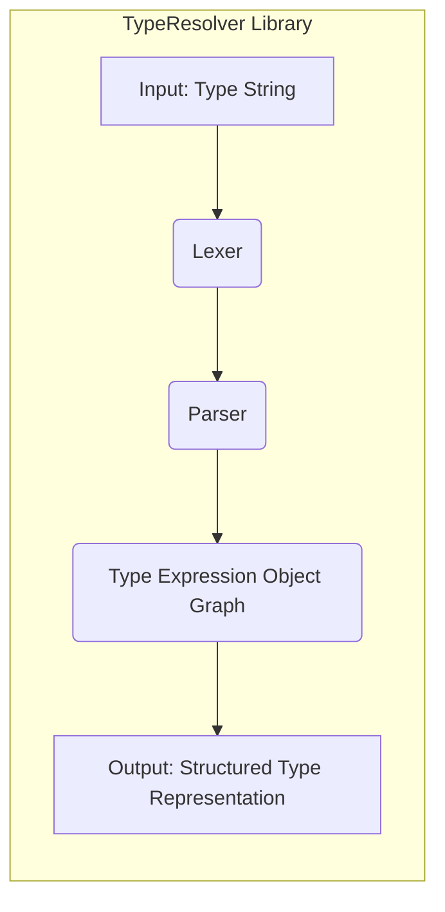

# Project Design Document: phpDocumentor TypeResolver

**Version:** 1.1
**Date:** October 26, 2023
**Author:** AI Software Architect

## 1. Introduction

This document provides an enhanced and more detailed design overview of the `phpDocumentor/TypeResolver` project. This document is intended to serve as a robust foundation for understanding the system's architecture, components, and data flow, with a specific focus on providing the necessary information for subsequent threat modeling activities.

## 2. Project Overview

The `phpDocumentor/TypeResolver` is a crucial PHP library dedicated to the precise resolution of type declarations found in PHP code. It accepts a string representation of a PHP type (e.g., `int`, `string[]`, `\My\Class|null`, `iterable<string>`) and meticulously parses it into a well-defined, structured representation. This structured output facilitates easy analysis and manipulation of the type information. As a core component of `phpDocumentor`, it plays a vital role in understanding and accurately documenting the types utilized within PHP projects.

## 3. Goals

*   **Comprehensive Type Parsing:** Accurately parse a wide spectrum of PHP type declarations, encompassing:
    *   Scalar types (e.g., `int`, `string`, `bool`, `float`).
    *   Object types (e.g., `\My\Class`, `ClassName`).
    *   Array types (e.g., `string[]`, `array<int, string>`).
    *   Callable types (e.g., `callable`, `callable(string): int`).
    *   Iterable types (e.g., `iterable`, `iterable<int>`).
    *   Union types (e.g., `int|string`, `\My\Class|null`).
    *   Intersection types (e.g., `Countable&Iterator`).
    *   Nullable types (e.g., `?string`).
    *   Constant references (e.g., `self::CONSTANT`).
*   **Structured Type Representation:** Provide a consistent and easily traversable object-oriented representation of the parsed type information, allowing for programmatic inspection of type components.
*   **Performance and Efficiency:** Achieve high performance and efficiency in parsing type strings to minimize overhead in consuming applications.
*   **Seamless Integration:**  Facilitate straightforward integration into other PHP projects through standard dependency management practices (e.g., Composer).
*   **Robust Error Handling:** Gracefully handle edge cases and invalid type declarations, providing informative error messages or specific representations for invalid input.

## 4. Non-Goals

*   **Static Analysis/Type Inference:** The library's sole purpose is parsing explicitly declared types; it does not perform static analysis or attempt to infer types where they are not explicitly declared.
*   **Class/Interface Existence Validation:**  The library does not validate whether classes or interfaces referenced in type declarations actually exist within the project.
*   **PHP Code Execution:** The `TypeResolver` does not execute any PHP code. Its operation is purely based on parsing string representations.
*   **PHP Code Generation:** The library is focused on understanding existing type declarations, not generating new PHP code.

## 5. Architecture Overview

The `TypeResolver` library employs a classic compiler-like architecture, processing the input type string through distinct stages.

*   **Input: Type String:** The raw string containing the PHP type declaration to be resolved. This is the entry point of the process.
*   **Lexer:**  This component performs lexical analysis, scanning the input type string and breaking it down into a stream of meaningful tokens. Tokens represent the basic building blocks of the type declaration (e.g., identifiers, keywords, operators, delimiters).
*   **Parser:**  The parser takes the stream of tokens produced by the Lexer and applies grammatical rules to construct a hierarchical representation of the type expression. This often involves building an Abstract Syntax Tree (AST) or a similar structure that reflects the relationships between the different parts of the type declaration.
*   **Type Expression Object Graph:**  The parser instantiates a network of PHP objects representing the parsed type structure. Each object in this graph corresponds to a specific part of the type declaration (e.g., a `ScalarType` object for `int`, an `ArrayType` object for `string[]`, a `UnionType` object for `int|string`). The relationships between these objects represent the overall structure of the type.
*   **Output: Structured Type Representation:** The final output is the root of the Type Expression Object Graph. This structured representation can be traversed and inspected programmatically to understand the details of the parsed type.

## 6. Component Details

*   **Lexer:**
    *   Functionality:  Scans the input type string character by character, identifying and categorizing sequences of characters into tokens based on predefined lexical rules. This includes identifying keywords (e.g., `array`, `callable`), identifiers (e.g., class names, type names), operators (e.g., `|`, `&`), and delimiters (e.g., `<`, `>`).
    *   Inputs: The raw type string to be parsed.
    *   Outputs: An ordered stream of tokens representing the lexical components of the input string.
    *   Key Considerations for Threat Modeling:
        *   **Denial of Service (DoS):**  A maliciously crafted, extremely long type string could potentially overwhelm the lexer, consuming excessive memory or processing time. Regular expression vulnerabilities within the lexer's tokenization rules could also be exploited for DoS.
        *   **Injection Attacks (Less Likely):** While less likely in a lexer, vulnerabilities in handling escape sequences or special characters could theoretically lead to unexpected tokenization, though the impact in this context is limited.
*   **Parser:**
    *   Functionality:  Takes the stream of tokens from the Lexer and attempts to build a valid parse tree (or equivalent structure) according to the grammar of PHP type declarations. This involves applying rules to recognize valid combinations of tokens and their relationships. The parser also handles error recovery when encountering invalid syntax.
    *   Inputs: The ordered stream of tokens produced by the Lexer.
    *   Outputs: A structured representation of the type expression (the Type Expression Object Graph) or an error indication if the input is not a valid type declaration.
    *   Key Considerations for Threat Modeling:
        *   **Denial of Service (DoS):**  Deeply nested or overly complex type declarations could lead to stack overflow errors or excessive memory consumption during parsing. Recursive descent parsers are particularly susceptible to this.
        *   **Logic Errors/Misinterpretation:**  Bugs in the parser's grammar rules or implementation could lead to incorrect interpretation of valid type declarations, potentially causing downstream applications to misinterpret type information.
        *   **Unexpected Behavior with Malformed Input:**  The parser's error handling mechanisms are crucial. Improperly handled malformed input could lead to unexpected exceptions or program termination.
*   **Type Expression Objects:**
    *   Functionality: A set of concrete PHP classes designed to represent different kinds of PHP types. Examples include:
        *   `ScalarType`: Represents scalar types like `int`, `string`, `bool`.
        *   `ObjectType`: Represents object types, storing the fully qualified class name.
        *   `ArrayType`: Represents array types, potentially including information about key and value types (e.g., `array<string, int>`).
        *   `CallableType`: Represents callable types, including information about parameters and return types.
        *   `UnionType`: Represents union types, holding a collection of possible types.
        *   `IntersectionType`: Represents intersection types, holding a collection of required types.
        *   `NullableType`: Represents nullable types, wrapping another type.
    *   Inputs: Data extracted and structured by the Parser.
    *   Outputs: A cohesive object graph representing the parsed type.
    *   Key Considerations for Threat Modeling:
        *   **Data Integrity:**  Ensuring the properties of these objects accurately reflect the parsed type is crucial. Errors in object construction could lead to misrepresentation of type information.
        *   **Object Relationships:** The relationships between these objects (e.g., the types within a `UnionType`) must be correctly established to accurately represent the type structure.
        *   **Improper Instantiation/State:**  Vulnerabilities in the constructors or setters of these objects could potentially lead to inconsistent or invalid object states if manipulated directly (though this is less likely as the parser controls instantiation).

## 7. Data Flow

The data flows sequentially through the `TypeResolver` library, with each component transforming the data as it progresses:

1. A consuming PHP application provides a string representing a PHP type declaration to the `TypeResolver`'s entry point (typically a `resolve()` method).
2. The **Lexer** receives the raw type string.
3. The Lexer tokenizes the input string, producing a stream of tokens.
4. The stream of tokens is passed to the **Parser**.
5. The Parser analyzes the token stream according to the grammar rules.
6. As the Parser recognizes type components, it instantiates corresponding **Type Expression Objects**.
7. The Parser builds the **Type Expression Object Graph**, establishing relationships between the objects.
8. The root of the **Type Expression Object Graph** (representing the complete parsed type) is returned to the calling application.

## 8. Security Considerations

*   **Input Validation and Sanitization:** The library must robustly handle invalid or malformed type strings. While sanitization isn't directly applicable here, thorough validation and clear error reporting are essential.
*   **Denial of Service (DoS):**
    *   **Lexer Level:**  Protect against excessively long or complex type strings that could cause the lexer to consume excessive resources. Implement limits or safeguards.
    *   **Parser Level:** Guard against deeply nested or recursive type declarations that could lead to stack overflow errors or excessive memory usage. Consider iterative parsing techniques or limits on nesting depth.
*   **Parser Vulnerabilities:**  Thorough testing and code review are necessary to identify and mitigate potential bugs in the parser's logic that could be exploited with crafted input. Fuzzing techniques can be valuable here.
*   **Dependency Management:**  Regularly review and update dependencies to patch any known security vulnerabilities in external libraries used by the `TypeResolver` (though it ideally has minimal external dependencies).
*   **Error Handling:** Ensure that error conditions during parsing are handled gracefully and do not expose sensitive information or lead to unexpected program termination. Provide informative error messages to developers.
*   **Code Injection (Low Risk):**  Since the library doesn't execute the input type string as code, direct code injection is unlikely. However, vulnerabilities in how the parsed type information is used by consuming applications could potentially lead to indirect injection issues.

## 9. Trust Boundaries

The primary trust boundary exists between the **consuming application** providing the type string and the **TypeResolver library**. The library must treat the input string as potentially untrusted.

*   **Boundary 1: Consuming Application -> TypeResolver:** The type string provided by the consuming application is the untrusted input. The TypeResolver must validate this input.

## 10. Potential Attack Vectors

Based on the design, potential attack vectors include:

*   **Maliciously Crafted Type Strings (DoS):** An attacker could provide extremely long or deeply nested type strings to exhaust the resources of the server running the consuming application.
*   **Exploiting Parser Vulnerabilities:**  Crafted type strings designed to trigger bugs in the parser could lead to unexpected behavior, errors, or potentially even remote code execution if the consuming application mishandles the parser's output or exceptions.
*   **Resource Exhaustion:**  Providing a large volume of complex type resolution requests could potentially overwhelm the server.
*   **Information Disclosure (Indirect):** While the library itself doesn't directly disclose information, vulnerabilities leading to incorrect parsing could cause consuming applications to misinterpret type information, potentially leading to security vulnerabilities elsewhere.

## 11. Deployment Considerations

The `TypeResolver` library is typically deployed as a dependency within other PHP projects using a package manager like Composer. Security considerations extend to the deployment environment:

*   **Dependency Management:** Ensure secure practices for managing dependencies, including using verified sources and regularly updating to patch vulnerabilities.
*   **Resource Limits:**  The environment where the consuming application runs should have appropriate resource limits (e.g., memory limits, execution time limits) to mitigate potential DoS attacks.

## 12. Future Considerations

*   **More Context-Aware Parsing:**  Potentially incorporating information about the surrounding code context to improve the accuracy of type resolution in certain edge cases.
*   **Standardized Type Representation:** Exploring alignment with emerging standards for representing type information in PHP.
*   **Extensibility:**  Designing the library to be more easily extensible to support custom type notations or language extensions.

This enhanced design document provides a more comprehensive understanding of the `phpDocumentor/TypeResolver` project, specifically tailored for informing threat modeling activities. By detailing the architecture, components, data flow, and potential vulnerabilities, this document serves as a valuable resource for identifying and mitigating security risks.