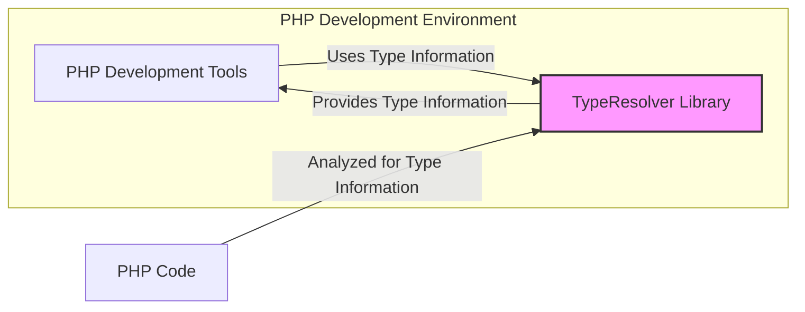
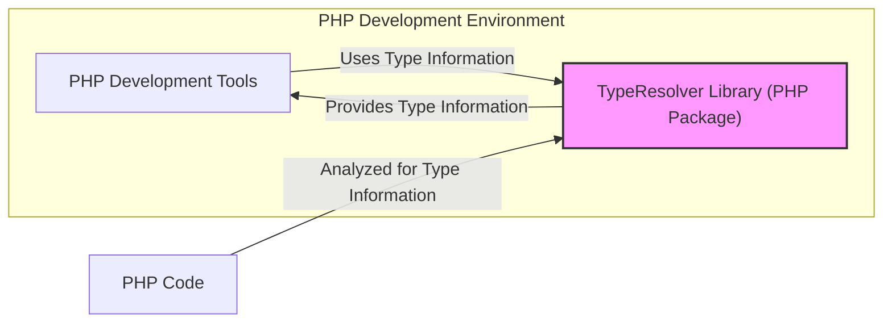
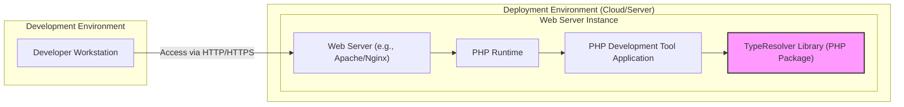

# BUSINESS POSTURE

This project, `phpdocumentor/typeresolver`, aims to provide a robust and accurate PHP type resolution library. This library is intended to be used by other software, primarily PHP development tools such as static analyzers, IDEs, and documentation generators.

*   Business Priorities:
    *   Accuracy of type resolution: The primary goal is to correctly identify and resolve PHP types to ensure the reliability of tools that depend on this information.
    *   Performance: The library should be efficient to avoid slowing down the performance of the tools that integrate it.
    *   Maintainability: The codebase should be well-structured and maintainable to allow for ongoing updates, bug fixes, and feature enhancements.
    *   Compatibility: The library needs to be compatible with various PHP versions and coding styles to be widely adopted.

*   Business Risks:
    *   Inaccurate type resolution: If the library incorrectly resolves types, it can lead to errors and incorrect behavior in the tools that use it, potentially impacting developer productivity and code quality.
    *   Performance bottlenecks: Slow type resolution can negatively impact the performance of integrated tools, leading to a poor user experience.
    *   Lack of adoption: If the library is not reliable, performant, or easy to use, it may not be adopted by the PHP development community, reducing its impact and value.
    *   Security vulnerabilities: Although not a primary business driver for a library, security vulnerabilities could indirectly affect tools that use it, potentially leading to security issues in those tools.

# SECURITY POSTURE

*   Existing security controls:
    *   security control: Public GitHub repository with issue tracking and pull request review process. (Implemented: GitHub repository)
    *   security control: Open-source development model allowing community contributions and scrutiny. (Implemented: GitHub repository)

*   Accepted risks:
    *   accepted risk: As a library, direct exposure to end-users and external threats is limited. The primary risk is vulnerabilities affecting dependent tools.
    *   accepted risk: Reliance on community contributions for security vulnerability identification and patching.

*   Recommended security controls:
    *   security control: Implement automated Static Application Security Testing (SAST) in the Continuous Integration (CI) pipeline to detect potential vulnerabilities in the code.
    *   security control: Regularly update dependencies, including the PHP parser and any other external libraries, to patch known vulnerabilities.
    *   security control: Consider incorporating fuzz testing to identify edge cases and potential vulnerabilities in the type parsing logic, especially when handling complex or unusual PHP code structures.
    *   security control: Establish a process for reporting and handling security vulnerabilities, including a security policy and contact information.

*   Security Requirements:
    *   Authentication: Not applicable. This library is not directly involved in authentication processes.
    *   Authorization: Not applicable. This library does not handle authorization.
    *   Input Validation:
        *   security requirement: The library must robustly handle various forms of PHP code as input, including potentially malformed or unexpected syntax.
        *   security requirement: Input validation should be implemented to prevent unexpected behavior or errors when processing unusual or edge-case PHP code structures. This is crucial to maintain stability and prevent potential denial-of-service or logic vulnerabilities.
    *   Cryptography: Not applicable. Cryptography is not a core requirement for a type resolution library.

# DESIGN

## C4 CONTEXT

*   Context Diagram Elements:
    *   Element:
        *   Name: PHP Development Tools
        *   Type: Software System
        *   Description:  A broad category of software applications used by PHP developers, such as IDEs (Integrated Development Environments), static analysis tools, documentation generators, and code refactoring tools.
        *   Responsibilities:  To utilize type information provided by the TypeResolver Library to enhance their functionality, such as providing accurate code completion, detecting type errors, generating documentation with type hints, and performing static analysis.
        *   Security controls:  Security controls are specific to each PHP Development Tool and are outside the scope of the TypeResolver Library. They are responsible for their own security, including how they use and process type information.
    *   Element:
        *   Name: TypeResolver Library
        *   Type: Software System
        *   Description:  A PHP library responsible for analyzing PHP code and resolving type declarations. It takes PHP code as input and outputs structured information about the types of variables, functions, classes, and other code elements.
        *   Responsibilities:
            *   Parsing PHP code to understand its structure.
            *   Analyzing type declarations (e.g., docblocks, type hints).
            *   Resolving types based on context, inheritance, and other PHP language rules.
            *   Providing accurate and reliable type information to consuming tools.
        *   Security controls:
            *   security control: Input validation to handle various PHP code inputs robustly.
            *   security control: Automated SAST in CI/CD pipeline.
            *   security control: Dependency updates.
            *   security control: Potential fuzz testing.
    *   Element:
        *   Name: PHP Code
        *   Type: Data
        *   Description:  The source code written in the PHP programming language that needs to be analyzed for type information. This can be code from various sources, including user projects, open-source libraries, or internal company codebases.
        *   Responsibilities:  To be provided as input to the TypeResolver Library for analysis. The structure and content of the PHP code directly influence the output of the library.
        *   Security controls:  Security controls related to PHP Code are outside the scope of the TypeResolver Library itself. The security of the PHP code is the responsibility of the developers and systems that manage and execute it.

## C4 CONTAINER

*   Container Diagram Elements:
    *   Element:
        *   Name: PHP Development Tools
        *   Type: Software System
        *   Description:  Same as in the Context Diagram. PHP applications that utilize the TypeResolver Library.
        *   Responsibilities: Same as in the Context Diagram. To consume and utilize the type information provided by the TypeResolver Library.
        *   Security controls: Same as in the Context Diagram. Security controls are specific to each PHP Development Tool.
    *   Element:
        *   Name: TypeResolver Library (PHP Package)
        *   Type: Library/Package
        *   Description:  The TypeResolver Library is packaged and distributed as a PHP package, likely via Composer. It is integrated into PHP Development Tools as a dependency.  This container represents the deployable unit of the TypeResolver functionality.
        *   Responsibilities:
            *   Encapsulating the type resolution logic.
            *   Providing a well-defined API for PHP Development Tools to access type information.
            *   Being easily installable and integrable into PHP projects via package managers.
        *   Security controls:
            *   security control: Input validation within the library's code.
            *   security control: SAST in CI/CD pipeline for the library's codebase.
            *   security control: Dependency management and updates for the library's dependencies.
            *   security control: Potential fuzz testing of the library's parsing and resolution logic.
    *   Element:
        *   Name: PHP Code
        *   Type: Data
        *   Description: Same as in the Context Diagram. The PHP source code being analyzed.
        *   Responsibilities: Same as in the Context Diagram. To be the input for the TypeResolver Library.
        *   Security controls: Same as in the Context Diagram. Security controls for PHP Code are external to the library.

## DEPLOYMENT

The TypeResolver Library is not deployed as a standalone application. It is distributed as a PHP package and deployed as a dependency within other PHP applications (PHP Development Tools). Therefore, the deployment diagram is contextual to the PHP Development Tools that utilize this library.

Assuming a typical deployment scenario for a PHP Development Tool (e.g., a web-based static analyzer):

*   Deployment Diagram Elements:
    *   Element:
        *   Name: Developer Workstation
        *   Type: Infrastructure
        *   Description: The local computer used by a developer to access and interact with the PHP Development Tool.
        *   Responsibilities:  To provide a user interface for developers to interact with the PHP Development Tool, send requests, and receive results.
        *   Security controls:  Security controls are managed by the developer and their organization, including endpoint security, access controls, and network security.
    *   Element:
        *   Name: Web Server (e.g., Apache/Nginx)
        *   Type: Infrastructure - Web Server
        *   Description:  A web server responsible for handling HTTP/HTTPS requests and serving the PHP Development Tool application.
        *   Responsibilities:
            *   Receiving and routing HTTP/HTTPS requests.
            *   Serving static content.
            *   Forwarding requests to the PHP Runtime for dynamic content.
            *   Handling TLS/SSL termination for secure communication.
        *   Security controls:
            *   security control: Web server configuration hardening.
            *   security control: TLS/SSL configuration for secure communication.
            *   security control: Access control lists (ACLs) and firewall rules.
            *   security control: Regular security patching and updates.
    *   Element:
        *   Name: PHP Runtime
        *   Type: Infrastructure - Application Runtime
        *   Description:  The PHP runtime environment responsible for executing the PHP Development Tool application and the TypeResolver Library.
        *   Responsibilities:
            *   Executing PHP code.
            *   Managing resources for PHP applications.
            *   Providing necessary PHP extensions and libraries.
        *   Security controls:
            *   security control: PHP runtime configuration hardening.
            *   security control: Regular security patching and updates of the PHP runtime.
            *   security control: Resource limits and process isolation.
    *   Element:
        *   Name: PHP Development Tool Application
        *   Type: Software System - Application
        *   Description:  The specific PHP Development Tool application that utilizes the TypeResolver Library. This could be a static analyzer, IDE backend, or documentation generator.
        *   Responsibilities:
            *   Implementing the core functionality of the development tool.
            *   Integrating and using the TypeResolver Library to obtain type information.
            *   Handling user requests and presenting results.
        *   Security controls:
            *   security control: Application-level security controls (authentication, authorization, input validation specific to the tool).
            *   security control: Secure coding practices in the application development.
            *   security control: Regular security testing of the application.
    *   Element:
        *   Name: TypeResolver Library (PHP Package)
        *   Type: Software System - Library
        *   Description:  The TypeResolver Library, deployed as a PHP package within the PHP Development Tool Application.
        *   Responsibilities: Same as in Container Diagram. Providing type resolution functionality to the PHP Development Tool Application.
        *   Security controls: Same as in Container Diagram. Security controls implemented within the library itself.

## BUILD

```mermaid
flowchart LR
    A["Developer"] -- "Code Changes" --> B["Version Control (GitHub)"]
    B -- "Code Repository" --> C["CI/CD System (e.g., GitHub Actions)"]
    C -- "Build Trigger" --> D["Build Process"]
    subgraph "Build Process Steps"
        D --> E["Checkout Code"]
        E --> F["Install Dependencies (Composer)"]
        F --> G["Run Static Analysis (SAST)"]
        G --> H["Run Unit Tests"]
        H --> I["Build Package (e.g., Phar)"]
    end
    I -- "Build Artifacts" --> J["Package Repository (e.g., Packagist)"]
    J -- "Package Distribution" --> K["PHP Development Tools"]
    style I fill:#f9f,stroke:#333,stroke-width:2px
```

*   Build Process Elements:
    *   Element:
        *   Name: Developer
        *   Type: Human Role
        *   Description:  A software developer who writes and modifies the code for the TypeResolver Library.
        *   Responsibilities:  Writing code, fixing bugs, implementing new features, and committing code changes to the version control system.
        *   Security controls:
            *   security control: Developer training on secure coding practices.
            *   security control: Code review process for all code changes.
            *   security control: Secure workstation and development environment.
    *   Element:
        *   Name: Version Control (GitHub)
        *   Type: Software System - Code Repository
        *   Description:  GitHub repository used for storing and managing the source code of the TypeResolver Library.
        *   Responsibilities:
            *   Storing the codebase and its history.
            *   Managing branches and merges.
            *   Providing access control to the codebase.
            *   Triggering CI/CD pipelines on code changes.
        *   Security controls:
            *   security control: Access control and authentication for repository access.
            *   security control: Branch protection rules.
            *   security control: Audit logging of repository activities.
    *   Element:
        *   Name: CI/CD System (e.g., GitHub Actions)
        *   Type: Software System - Automation
        *   Description:  A Continuous Integration and Continuous Delivery system used to automate the build, test, and release process of the TypeResolver Library.
        *   Responsibilities:
            *   Automating the build process.
            *   Running automated tests (unit tests, SAST).
            *   Packaging the library.
            *   Publishing build artifacts.
        *   Security controls:
            *   security control: Secure configuration of CI/CD pipelines.
            *   security control: Access control to CI/CD system and secrets management.
            *   security control: Audit logging of CI/CD activities.
    *   Element:
        *   Name: Build Process
        *   Type: Automated Process
        *   Description:  The sequence of automated steps performed by the CI/CD system to build and test the TypeResolver Library.
        *   Responsibilities:
            *   Compiling or packaging the code.
            *   Running static analysis security testing (SAST).
            *   Executing unit tests.
            *   Creating distributable packages.
        *   Security controls:
            *   security control: SAST tools integrated into the build process.
            *   security control: Dependency vulnerability scanning during build.
            *   security control: Secure build environment.
    *   Element:
        *   Name: Build Artifacts
        *   Type: Data - Software Package
        *   Description:  The packaged and tested output of the build process, typically a PHP package (e.g., distributed via Packagist).
        *   Responsibilities:  To be distributed to PHP Development Tools for integration.
        *   Security controls:
            *   security control: Signing of build artifacts (if applicable).
            *   security control: Secure storage of build artifacts before distribution.
    *   Element:
        *   Name: Package Repository (e.g., Packagist)
        *   Type: Software System - Package Registry
        *   Description:  A public or private package repository used to host and distribute the TypeResolver Library package. For PHP, Packagist is the primary public repository.
        *   Responsibilities:
            *   Hosting and managing software packages.
            *   Providing package download and installation services.
            *   Managing package versions and dependencies.
        *   Security controls:
            *   security control: Package integrity checks.
            *   security control: Security scanning of hosted packages (by the repository provider).
            *   security control: Access control for publishing packages (if private repository).
    *   Element:
        *   Name: PHP Development Tools
        *   Type: Software System
        *   Description:  Same as in Context and Container Diagrams. PHP applications that consume the TypeResolver Library.
        *   Responsibilities:  To download and integrate the TypeResolver Library package from the package repository as a dependency.
        *   Security controls:
            *   security control: Dependency management practices in PHP Development Tools.
            *   security control: Vulnerability scanning of dependencies in PHP Development Tools.

# RISK ASSESSMENT

*   Critical Business Processes:
    *   Ensuring the accuracy and reliability of PHP type resolution for dependent tools.
    *   Maintaining the performance of PHP Development Tools that rely on the library.
    *   Maintaining the reputation and trustworthiness of the `phpdocumentor` project and its libraries.

*   Data Sensitivity:
    *   The TypeResolver Library processes PHP code, which can contain sensitive information (e.g., API keys, database credentials, business logic).
    *   While the library itself does not store or manage this sensitive data, vulnerabilities in the library could potentially be exploited by malicious PHP code to gain access to or manipulate sensitive information within the context of a PHP Development Tool.
    *   Data sensitivity is considered moderate to high, depending on the context and the sensitivity of the PHP code being analyzed by tools using this library.

# QUESTIONS & ASSUMPTIONS

*   BUSINESS POSTURE:
    *   Question: What are the key performance indicators (KPIs) for the success of the TypeResolver Library? (Assumption: Accuracy and adoption rate are primary KPIs).
    *   Question: What is the expected lifespan and long-term maintenance plan for the library? (Assumption: Long-term maintenance and community support are expected).

*   SECURITY POSTURE:
    *   Question: Are there any specific security compliance requirements that the library needs to adhere to? (Assumption: No specific compliance requirements beyond general secure development practices for open-source libraries).
    *   Question: Is there a dedicated security team or individual responsible for overseeing the security of the `phpdocumentor` projects? (Assumption: Security is likely handled by core contributors and community members).
    *   Question: What is the process for users to report security vulnerabilities in the library? (Assumption: Standard GitHub issue reporting process is used, but a dedicated security contact or policy might be beneficial).

*   DESIGN:
    *   Question: What are the expected input sources for PHP code that the library will analyze? (Assumption: Primarily files from local file systems or code repositories).
    *   Question: Are there any specific limitations or known edge cases in the current type resolution implementation? (Assumption: There might be edge cases, especially with highly dynamic or complex PHP code, which should be documented and addressed over time).
    *   Question: What are the performance benchmarks and targets for type resolution? (Assumption: Performance is important, but specific benchmarks and targets might not be formally defined and should be considered for future development).