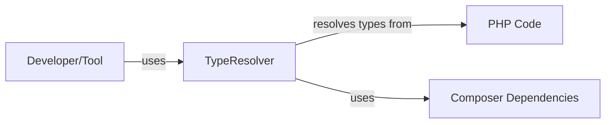
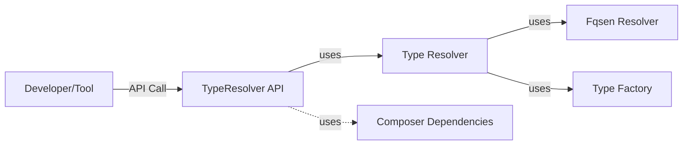
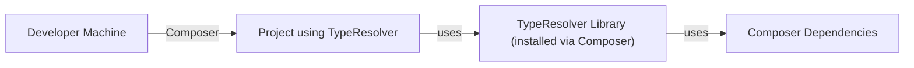
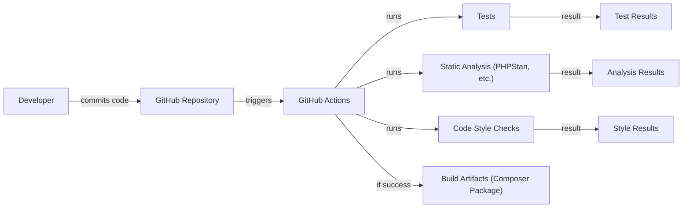

Okay, let's create a design document for the phpDocumentor/TypeResolver project.

# BUSINESS POSTURE

Business Priorities and Goals:

*   Provide a reliable and accurate type resolution library for PHP code.
*   Support static analysis tools and IDEs in understanding PHP types.
*   Improve the quality and maintainability of PHP projects by enabling better type hinting.
*   Be a foundational component for other tools in the PHP ecosystem, like phpDocumentor itself.
*   Maintain backward compatibility where possible, while evolving to support new PHP language features.

Most Important Business Risks:

*   Inaccurate type resolution leading to incorrect analysis results and potentially flawed software behavior.
*   Performance bottlenecks in the library impacting the speed of dependent tools.
*   Lack of support for new PHP versions or language features, making the library obsolete.
*   Security vulnerabilities within the library that could be exploited in a larger system.
*   Difficult integration with other tools due to complex API or dependencies.

# SECURITY POSTURE

Existing Security Controls:

*   security control: Code Reviews: The project is open-source and hosted on GitHub, implying that code reviews are part of the development process. (Described in GitHub pull request process).
*   security control: Static Analysis: The project uses static analysis tools, as indicated by the presence of configuration files like `phpstan.neon.dist` and `.php-cs-fixer.php`. (Described in project configuration files).
*   security control: Automated Testing: The project has a comprehensive test suite, suggesting a focus on preventing regressions and ensuring code quality. (Described in the `tests` directory and GitHub Actions workflows).
*   security control: Dependency Management: The project uses Composer for dependency management, allowing for tracking and updating of external libraries. (Described in `composer.json`).
*   security control: GitHub Actions: Project use GitHub Actions to automate build, test and security checks. (Described in `.github/workflows` directory).

Accepted Risks:

*   accepted risk: The library primarily deals with parsing and analyzing code, not handling sensitive data directly. The risk of data breaches is relatively low.
*   accepted risk: The library is intended for use in development and analysis tools, not in production runtime environments. This reduces the attack surface.

Recommended Security Controls:

*   security control: Regularly update dependencies to address known vulnerabilities in third-party libraries.
*   security control: Integrate a Software Composition Analysis (SCA) tool to identify and track vulnerabilities in dependencies.
*   security control: Consider adding more fuzzing tests to identify potential edge cases and vulnerabilities in parsing logic.

Security Requirements:

*   Authentication: Not directly applicable, as the library is not an application with user authentication.
*   Authorization: Not directly applicable, as the library does not manage access control.
*   Input Validation:
    *   The library should handle invalid or malformed PHP code gracefully, without crashing or exposing vulnerabilities.
    *   Input validation should focus on preventing unexpected behavior or resource exhaustion due to malicious input.
*   Cryptography: Not directly applicable, as the library does not handle encryption or cryptographic operations.
*   Error Handling:
    *   The library should provide clear and informative error messages when encountering issues.
    *   Error handling should not expose sensitive information or internal implementation details.

# DESIGN

## C4 CONTEXT

Element List:

*   Element:
    *   Name: Developer/Tool
    *   Type: User
    *   Description: A developer or a static analysis tool (e.g., phpDocumentor, PHPStan) that utilizes the TypeResolver library.
    *   Responsibilities: Provides PHP code to be analyzed, consumes the type resolution results.
    *   Security controls: Not directly applicable, as this is an external entity.

*   Element:
    *   Name: TypeResolver
    *   Type: System
    *   Description: The phpDocumentor/TypeResolver library itself.
    *   Responsibilities: Parses PHP code, resolves types, provides an API for accessing type information.
    *   Security controls: Code reviews, static analysis, automated testing, dependency management.

*   Element:
    *   Name: PHP Code
    *   Type: External System
    *   Description: The PHP code that is being analyzed by the TypeResolver.
    *   Responsibilities: Provides the input for type resolution.
    *   Security controls: Not directly applicable, as this is an external input.

*   Element:
    *   Name: Composer Dependencies
    *   Type: External System
    *   Description: Third-party libraries used by TypeResolver, managed by Composer.
    *   Responsibilities: Provide functionality required by TypeResolver.
    *   Security controls: Dependency management, SCA (recommended).

## C4 CONTAINER

Element List:

*   Element:
    *   Name: Developer/Tool
    *   Type: User
    *   Description: A developer or a static analysis tool that utilizes the TypeResolver library.
    *   Responsibilities: Provides PHP code to be analyzed, consumes the type resolution results.
    *   Security controls: Not directly applicable.

*   Element:
    *   Name: TypeResolver API
    *   Type: API
    *   Description: The public API of the TypeResolver library.
    *   Responsibilities: Provides entry points for interacting with the library, handles input validation.
    *   Security controls: Input validation.

*   Element:
    *   Name: Resolver
    *   Type: Component
    *   Description: The core type resolution logic.
    *   Responsibilities: Resolves types based on the provided PHP code and context.
    *   Security controls: Code reviews, static analysis, automated testing.

*   Element:
    *   Name: FqsenResolver
    *   Type: Component
    *   Description: Resolves Fully Qualified Structural Element Names (FQSENs).
    *   Responsibilities: Handles the resolution of FQSENs within the PHP code.
    *   Security controls: Code reviews, static analysis, automated testing.

*   Element:
    *   Name: TypeFactory
    *   Type: Component
    *   Description: Creates type objects.
    *   Responsibilities: Constructs the type representations used within the library.
    *   Security controls: Code reviews, static analysis, automated testing.

*   Element:
    *   Name: Composer Dependencies
    *   Type: External Library
    *   Description: Third-party libraries used by TypeResolver.
    *   Responsibilities: Provide supporting functionality.
    *   Security controls: Dependency management, SCA (recommended).

## DEPLOYMENT

Possible Deployment Solutions:

1.  Integration via Composer: The library is primarily used as a dependency within other PHP projects.
2.  Standalone usage (less common): While primarily a library, it could theoretically be used in a standalone script.

Chosen Solution (Composer Integration):

Element List:

*   Element:
    *   Name: Developer Machine
    *   Type: Environment
    *   Description: The developer's local machine where the project is being developed.
    *   Responsibilities: Hosts the development environment.
    *   Security controls: Standard development environment security practices.

*   Element:
    *   Name: Project using TypeResolver
    *   Type: System
    *   Description: The PHP project that depends on the TypeResolver library.
    *   Responsibilities: Utilizes the TypeResolver for type analysis.
    *   Security controls: Dependent on the project's own security posture.

*   Element:
    *   Name: TypeResolver Library (installed via Composer)
    *   Type: Library
    *   Description: The TypeResolver library, installed as a Composer dependency.
    *   Responsibilities: Provides type resolution functionality.
    *   Security controls: Inherited from the library's development process (code reviews, static analysis, etc.).

*   Element:
    *   Name: Composer Dependencies
    *   Type: External Libraries
    *   Description: Third-party libraries used by TypeResolver and the main project.
    *   Responsibilities: Provide supporting functionality.
    *   Security controls: Dependency management, SCA (recommended).

## BUILD

Build Process Description:

1.  Developer commits code to the GitHub repository.
2.  GitHub Actions is triggered by the commit.
3.  GitHub Actions runs the following checks:
    *   Tests: Executes the test suite to ensure code correctness.
    *   Static Analysis: Performs static analysis using tools like PHPStan to identify potential issues.
    *   Code Style Checks: Enforces code style guidelines using tools like PHP CS Fixer.
4.  The results of the checks are reported.
5.  If all checks pass, build artifacts (the Composer package) are created.  Since this is a library, the "artifact" is simply the tagged version in the repository, ready to be installed via Composer.  There's no separate deployment artifact in the traditional sense.

Security Controls in Build Process:

*   security control: Automated Testing: The test suite helps prevent regressions and ensures code quality.
*   security control: Static Analysis: Tools like PHPStan identify potential bugs and security vulnerabilities.
*   security control: Code Style Checks: Enforce consistent coding standards, improving maintainability and reducing the risk of errors.
*   security control: GitHub Actions: Provides a controlled and auditable build environment.

# RISK ASSESSMENT

Critical Business Processes:

*   Accurate type resolution for PHP code.
*   Providing a stable and reliable library for dependent tools.

Data:

*   The library primarily processes PHP code, which is not typically considered sensitive data in itself.
*   The library does not store or transmit any data persistently.
*   Data Sensitivity: Low. The primary concern is the integrity of the code analysis, not the confidentiality of the code being analyzed.

# QUESTIONS & ASSUMPTIONS

Questions:

*   Are there any specific performance requirements or limitations for the library?
*   Are there any specific coding standards or guidelines beyond what's already enforced by the existing tools?
*   Are there plans to support specific upcoming PHP features or language changes?

Assumptions:

*   BUSINESS POSTURE: The primary users are developers and static analysis tools.
*   BUSINESS POSTURE: The library is intended to be used as a dependency, not a standalone application.
*   SECURITY POSTURE: The library does not handle sensitive data directly.
*   SECURITY POSTURE: The main security concern is the correctness and reliability of the type resolution.
*   DESIGN: The library is well-structured and follows established PHP coding practices.
*   DESIGN: Composer is the primary method for distributing and integrating the library.
*   DESIGN: GitHub Actions is used for continuous integration and testing.