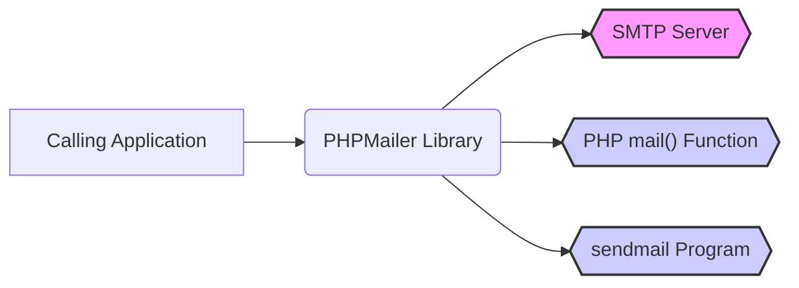
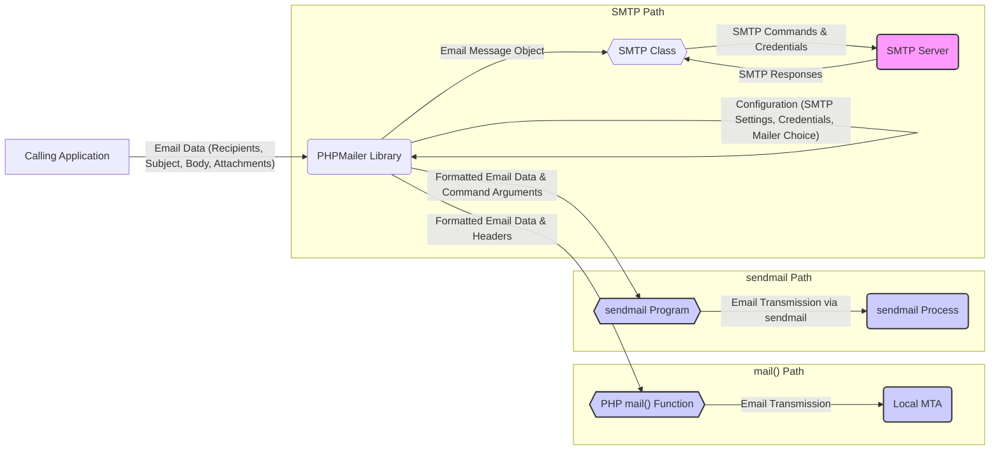

# Project Design Document: PHPMailer Library

**Version:** 1.1
**Date:** October 26, 2023
**Author:** AI Software Architect

## 1. Introduction

This document provides an enhanced and detailed design overview of the PHPMailer library, a widely adopted open-source PHP library for facilitating email sending. The purpose of this document is to offer a thorough understanding of the library's architectural structure, its constituent components, and the flow of data within it. This understanding is crucial for conducting effective threat modeling exercises.

## 2. Goals

The primary objectives of this design document are to:

* Provide a clear and comprehensive description of the PHPMailer library's architecture and its core components.
* Detail the data flow within the library during the processes of email composition and transmission.
* Identify key interaction points with external systems and highlight dependencies.
* Serve as a robust foundation for identifying potential security vulnerabilities and attack vectors during subsequent threat modeling activities.

## 3. Scope

This document encompasses the essential functionalities of the PHPMailer library related to the creation and delivery of email messages. This includes:

* The primary classes and their respective responsibilities within the library.
* The step-by-step process of constructing an email message using the library.
* The different methodologies supported for sending emails (SMTP, the PHP `mail()` function, and the `sendmail` program).
* The mechanisms for handling email attachments, headers, and various types of email content.
* The library's basic error handling and logging capabilities.

This document explicitly excludes:

* In-depth implementation details of every individual function or method within the library.
* Detailed, line-by-line code-level analysis.
* Specific configurations or the diverse environments in which PHPMailer might be deployed.
* Third-party plugins, extensions, or integrations built upon the core PHPMailer library.

## 4. High-Level Architecture

The PHPMailer library functions as a central orchestrator for the creation and delivery of email messages. It interacts directly with the application that utilizes it and with external Mail Transfer Agents (MTAs) or servers.

* **Calling Application:** The PHP-based application that integrates the PHPMailer library to send emails. This application provides the necessary email details, such as recipient addresses, the email subject, and the message body.
* **PHPMailer Library:** The core of the email sending process, responsible for:
    * Structuring the email message according to established email standards and protocols.
    * Managing different methods for sending emails.
    * Handling email attachments and custom headers.
    * Encoding and formatting the email content to ensure proper delivery and rendering.
* **SMTP Server:** An external server dedicated to relaying emails. PHPMailer can establish connections with SMTP servers using various authentication mechanisms and security protocols.
* **PHP `mail()` Function:** A built-in function within PHP that leverages the local MTA configured on the server to send emails.
* **`sendmail` Program:** An external executable, commonly found on Unix-like operating systems, used for sending emails directly from the command line.

## 5. Detailed Design

The PHPMailer library is primarily structured around a central class (`PHPMailer`) and a set of supporting classes that handle specific functionalities.

### 5.1. Key Components

* **`PHPMailer` Class:**
    * This is the primary class that exposes the API for interacting with the library's functionalities.
    * It holds global configuration settings, including SMTP server details, authentication credentials, and the selected mailer type.
    * It manages lists of recipients for various categories (To, CC, BCC).
    * It stores the core content of the email, such as the subject, HTML body, and plain-text alternative body.
    * It provides mechanisms for adding and managing attachments and custom headers.
    * It includes the crucial `send()` method, which initiates the email sending process.
    * It implements error handling mechanisms and debugging features to aid in troubleshooting.
* **`SMTP` Class:**
    * This class is specifically designed to handle communication with SMTP servers.
    * It implements the Simple Mail Transfer Protocol (SMTP).
    * It manages the entire lifecycle of an SMTP connection, including establishing the connection, handling authentication (supporting methods like PLAIN, LOGIN, CRAM-MD5), and implementing secure connections using protocols like STARTTLS and SMTPS.
    * It is responsible for sending SMTP commands to the server (e.g., EHLO, MAIL FROM, RCPT TO, DATA).
    * It parses and interprets responses from the SMTP server, handling both successful responses and errors.
* **`Exception` Class (PHPMailer's Custom Exception):**
    * This class is used for throwing and catching exceptions that occur within the PHPMailer library.
    * It provides detailed information about the nature of the error encountered, facilitating debugging and error handling.

### 5.2. Email Composition Process

The process of composing an email using PHPMailer involves setting various properties and utilizing methods of the `PHPMailer` object:

* **Setting Recipients:**
    * `addAddress(string $address, string $name = ''): void`: Adds a recipient to the "To" list. Optionally includes the recipient's name.
    * `addCC(string $address, string $name = ''): void`: Adds a recipient to the "CC" (Carbon Copy) list.
    * `addBCC(string $address, string $name = ''): void`: Adds a recipient to the "BCC" (Blind Carbon Copy) list.
    * `addReplyTo(string $address, string $name = ''): void`: Sets the "Reply-To" address, which differs from the sender address.
* **Setting Email Content:**
    * `Subject: string`: Sets the subject line of the email.
    * `Body: string`: Sets the main body of the email, typically in HTML format.
    * `AltBody: string`: Sets a plain-text alternative body for email clients that do not support HTML rendering.
    * `isHTML(bool $ishtml): void`: Specifies whether the content of the `Body` property is in HTML format.
* **Adding Attachments:**
    * `addAttachment(string $path, string $name = '', string $encoding = 'base64', string $type = ''): void`: Adds a file as an attachment. Allows specifying the attachment's name, encoding, and MIME type.
    * Supports various methods for providing attachment data, including file paths, string content, and resource streams.
* **Setting Headers:**
    * `addCustomHeader(string $header, string $value = ''): void`: Adds custom email headers to the message.
    * Several predefined header properties can also be set directly as properties of the `PHPMailer` object (e.g., `Sender`, `Priority`, `X-Mailer`).
* **Configuring Mailer:**
    * `isMail(): void`: Configures PHPMailer to use the PHP `mail()` function for sending emails.
    * `isSendmail(): void`: Configures PHPMailer to use the `sendmail` program for sending emails.
    * `isSMTP(): void`: Configures PHPMailer to use an external SMTP server for sending emails.
    * When using SMTP:
        * `Host: string`: Sets the hostname or IP address of the SMTP server.
        * `Port: int`: Sets the port number for the SMTP server connection (typically 25, 465, or 587).
        * `SMTPAuth: bool`: Enables or disables SMTP authentication.
        * `Username: string`: Sets the username for SMTP authentication.
        * `Password: string`: Sets the password for SMTP authentication.
        * `SMTPSecure: string`: Sets the encryption method for the SMTP connection ('tls' or 'ssl').
        * `SMTPAutoTLS: bool`: Enables or disables automatic TLS negotiation using the STARTTLS command.

### 5.3. Email Sending Process

The `send()` method initiates the email transmission process. The specific steps involved depend on the mailer method configured for PHPMailer.

**5.3.1. Using SMTP:**

1. **Establish Connection:** The `SMTP` class attempts to establish a TCP connection with the specified SMTP server on the given host and port.
2. **Identify Self (EHLO/HELO):** The `SMTP` class sends either an EHLO (Extended Hello) or HELO (Hello) command to the server to identify itself. EHLO is preferred as it indicates support for extended SMTP commands.
3. **Start TLS (Optional):** If `SMTPSecure` is set to `tls` and `SMTPAutoTLS` is enabled, the `SMTP` class attempts to upgrade the connection to a secure TLS connection using the STARTTLS command. This encrypts the communication channel.
4. **Authentication (Optional):** If `SMTPAuth` is enabled, the `SMTP` class authenticates with the server using the provided `Username` and `Password`. It supports various authentication mechanisms advertised by the server.
5. **Send Mail From (MAIL FROM):** The `SMTP` class sends the MAIL FROM command, specifying the sender's email address.
6. **Send Recipient To (RCPT TO):** For each recipient (To, CC, BCC), the `SMTP` class sends an RCPT TO command, indicating the intended recipient's email address.
7. **Send Data (DATA):** The `SMTP` class sends the DATA command, signaling the start of the email message content.
8. **Transmit Email Data:** The `PHPMailer` library formats the email headers and body according to RFC standards and transmits this data to the SMTP server.
9. **End Data:** The `SMTP` class sends a termination sequence (a single period on a new line) to indicate the end of the email data.
10. **Quit (QUIT):** After successfully sending the email or encountering an error, the `SMTP` class sends the QUIT command to gracefully close the connection to the SMTP server.
11. **Handle Responses:** Throughout the process, the `SMTP` class parses the responses received from the SMTP server. It checks for success codes and handles any error responses according to SMTP protocol specifications.

**5.3.2. Using PHP `mail()` function:**

1. **Format Headers:** PHPMailer constructs the necessary email headers as a string, including recipient information, MIME type, and other relevant details.
2. **Call `mail()`:** PHPMailer invokes the built-in PHP `mail()` function, passing the recipient's email address, the email subject, the email body, and the formatted headers as arguments.
3. **Handle Potential Errors:** PHPMailer checks the boolean return value of the `mail()` function. A `false` return value indicates a failure in sending the email.

**5.3.3. Using `sendmail` program:**

1. **Construct Command:** PHPMailer constructs the command-line arguments required to execute the `sendmail` program, including recipient addresses and necessary flags.
2. **Execute `sendmail`:** PHPMailer uses PHP's process execution functions (e.g., `proc_open()`, `shell_exec()`) to execute the `sendmail` program.
3. **Pipe Email Data:** PHPMailer pipes the formatted email headers and body to the standard input of the `sendmail` process.
4. **Handle Errors:** PHPMailer checks the exit code returned by the `sendmail` process. A non-zero exit code typically indicates an error during email transmission.

### 5.4. Error Handling and Logging

* PHPMailer employs exceptions (instances of its custom `Exception` class) to signal errors that occur during the email sending process.
* Calling code should use `try...catch` blocks to handle these exceptions gracefully.
* The `$mail->ErrorInfo` property of the `PHPMailer` object stores the last error message generated by the library, providing details about the failure.
* Debugging output can be enabled by setting the `$mail->SMTPDebug` property to a value greater than 0. This will output detailed information about the communication with the SMTP server, which is useful for troubleshooting connection and authentication issues.

## 6. Data Flow Diagram

This diagram illustrates the flow of email data from the initiating application, through the PHPMailer library, and finally to the chosen email delivery mechanism, highlighting the different paths depending on the configured mailer.

## 7. Security Considerations (Initial)

This section outlines initial security considerations and potential areas of concern that will require further investigation during the threat modeling phase.

* **Sensitive Data Exposure via SMTP Credentials:**
    * **Threat:** Improper storage or handling of SMTP usernames and passwords can lead to unauthorized access to email sending capabilities.
    * **Examples:** Storing credentials in plain text configuration files, hardcoding credentials in the application code, or using weak encryption methods.
* **Email Header Injection Attacks:**
    * **Threat:** Failure to properly validate and sanitize email headers (e.g., `To`, `CC`, `BCC`, `Subject`, custom headers) can allow attackers to inject malicious headers, potentially leading to spam, phishing, or the execution of arbitrary commands by mail servers.
    * **Example:** Injecting additional `BCC` headers to send emails to unintended recipients or injecting `Sender` headers to spoof the sender's identity.
* **Attachment-Related Vulnerabilities:**
    * **Threat:** Improper handling of file attachments can introduce risks such as the distribution of malware or the exploitation of path traversal vulnerabilities.
    * **Examples:** Allowing users to upload arbitrary file types without proper scanning, or failing to sanitize file names, potentially allowing attackers to overwrite system files.
* **Insecure SMTP Connection Handling:**
    * **Threat:** Failure to use secure connections (TLS/SSL) for SMTP communication can expose sensitive information, including email content and authentication credentials, to eavesdropping. Insufficient certificate verification can leave the application vulnerable to man-in-the-middle attacks.
    * **Examples:** Not enabling `SMTPSecure`, or disabling certificate verification in production environments.
* **Dependency Vulnerabilities:**
    * **Threat:** Using outdated versions of PHPMailer or its dependencies can expose the application to known security vulnerabilities that have been patched in newer versions.
    * **Mitigation:** Regularly updating PHPMailer to the latest stable version is crucial.
* **Information Disclosure via Error Handling:**
    * **Threat:** Verbose error messages, especially in production environments, can reveal sensitive information about the application's configuration or internal workings to potential attackers.
    * **Mitigation:** Implement proper error handling and logging practices, ensuring that detailed error messages are only logged and not displayed to end-users.
* **Configuration Security:**
    * **Threat:** Misconfigurations in PHPMailer or the underlying PHP environment can create security loopholes.
    * **Examples:** Incorrect file permissions on configuration files, or enabling insecure PHP settings.
* **Potential for Remote Code Execution (Indirect):**
    * **Threat:** While PHPMailer itself might not directly execute arbitrary code, vulnerabilities in how the calling application uses PHPMailer to process user-supplied data (e.g., in email templates) could potentially be exploited to achieve remote code execution.
    * **Mitigation:**  Carefully sanitize and validate all user inputs used in conjunction with PHPMailer.

## 8. Assumptions and Constraints

* It is assumed that the calling application provides semantically valid email addresses and other necessary data to the PHPMailer library.
* It is assumed that the underlying operating system and the PHP runtime environment are configured according to security best practices.
* The design is inherently constrained by the specifications and limitations of the SMTP protocol, the functionality of the PHP `mail()` function, and the behavior of the `sendmail` program.
* This document primarily focuses on the core functionalities of PHPMailer and does not delve into the specifics of various deployment scenarios, integrations with other systems, or custom extensions.

## 9. Future Considerations

* Conduct a thorough threat modeling exercise based on the details outlined in this design document to identify specific attack vectors and vulnerabilities.
* Perform a detailed analysis of potential security vulnerabilities within the PHPMailer codebase, focusing on areas identified in the security considerations section.
* Develop and document specific recommendations and best practices for securely using the PHPMailer library in various application contexts.
* Evaluate potential security enhancements that could be implemented within the PHPMailer library itself to mitigate identified risks. This could include features like built-in input validation or more robust handling of attachments.
* Investigate and document secure coding practices for developers using PHPMailer to minimize the risk of introducing vulnerabilities in the calling application.
