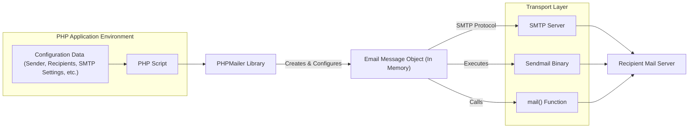

# Project Design Document: PHPMailer

**Version:** 1.1
**Date:** October 26, 2023
**Author:** Gemini (AI Language Model)
**Project:** PHPMailer - Email Creation and Transport Library

## 1. Introduction

This document provides an enhanced and detailed design overview of the PHPMailer library, a widely used open-source PHP library for sending emails. This document is specifically intended to serve as a foundation for subsequent threat modeling activities, providing a clear understanding of the library's architecture, components, and data flow from a security perspective.

## 2. Project Goals

The primary goals of PHPMailer are:

*   To offer a dependable and robust method for sending emails from PHP applications.
*   To simplify the creation of sophisticated emails, encompassing HTML content, attachments, and alternative body formats.
*   To manage diverse email transport methods, including SMTP, sendmail, and the PHP `mail()` function.
*   To provide features for authentication, encryption (TLS/SSL), and comprehensive error handling.
*   To maintain broad compatibility across various PHP versions and server configurations.

## 3. Architectural Overview

PHPMailer employs a class-based structure, offering a set of methods and properties for constructing and dispatching emails. The central element of this architecture is the `PHPMailer` class, which orchestrates the entire email sending process.

**Explanation of the Diagram:**

*   A PHP script within a PHP application environment utilizes the PHPMailer library.
*   Configuration data, including sender and recipient details and transport settings, is provided to the PHP script.
*   The PHP script interacts with the PHPMailer library, passing configuration details.
*   The PHPMailer library then creates and configures an email message object in memory.
*   Based on the configuration, the library selects one of the supported transport methods:
    *   **SMTP:** Establishes a connection with an SMTP server using a specified protocol (plain, TLS, SSL).
    *   **Sendmail:** Executes the local `sendmail` binary.
    *   **`mail()`:** Invokes the built-in PHP `mail()` function.
*   The chosen transport method is then used to deliver the email to the recipient's mail server.

## 4. Key Components

The PHPMailer library is composed of several essential classes and functionalities:

*   **`PHPMailer` Class:** This is the core class responsible for:
    *   **Configuration Management:**  Setting up email properties such as sender, recipients (To, CC, BCC), subject, and body content.
    *   **Attachment Handling:** Managing file attachments and embedded images, including specifying filenames, MIME types, and encoding.
    *   **Email Formatting:**  Handling different email formats, supporting both plain text and HTML content, and managing alternative body formats.
    *   **Transport Layer Abstraction:** Selecting and managing the underlying email transport mechanism (SMTP, Sendmail, `mail()`).
    *   **SMTP Handling:** Managing SMTP server connections, authentication processes, and encryption negotiation (TLS/SSL).
    *   **Error and Exception Handling:** Providing mechanisms for detecting, reporting, and handling errors that occur during the email sending process.
    *   **Debugging Capabilities:** Offering features for logging and debugging email sending activities.
*   **Transport Classes:** These classes implement the specific logic for different email sending methods:
    *   **`SMTP` Class:**  Handles direct communication with SMTP servers, including establishing connections, performing authentication, issuing SMTP commands, and managing responses.
    *   **Internal Handling for `mail()`:** The `PHPMailer` class itself manages the invocation of the PHP `mail()` function.
    *   **Internal Handling for Sendmail:** The `PHPMailer` class manages the execution of the `sendmail` binary with the constructed email data.
*   **Authentication Handlers:** These components manage various SMTP authentication methods:
    *   **Plain Authentication:**  Handles simple username and password authentication.
    *   **Login Authentication:**  Another common username and password authentication method.
    *   **CRAM-MD5 Authentication:**  A challenge-response authentication mechanism.
    *   **OAuth 2.0 Authentication:**  Supports authentication using OAuth 2.0 tokens for services like Gmail.
*   **Attachment Handling Logic:**  Provides methods for adding attachments to emails, allowing specification of the file path, desired filename, MIME type, and encoding.
*   **Address Handling Logic:**  Includes functionality for parsing and validating email addresses and managing lists of recipients for To, CC, and BCC fields.
*   **Encoding and MIME Handling Logic:**  Responsible for encoding email content and attachments according to MIME (Multipurpose Internet Mail Extensions) standards to ensure proper rendering by email clients.
*   **Error Reporting and Logging:**  Provides mechanisms for capturing and reporting errors encountered during the email sending process, often including detailed error messages and debugging information.

## 5. Data Flow

The typical data flow within PHPMailer follows these steps:

1. **Configuration Input:** The PHP application provides configuration data to the `PHPMailer` object. This includes:
    *   Sender's email address and name.
    *   Recipient email addresses (To, CC, BCC).
    *   Email subject.
    *   Email body content (plain text and/or HTML).
    *   File paths and desired names for attachments.
    *   SMTP server connection details (hostname, port, authentication credentials, encryption method).
    *   The selected email transport method.
2. **Message Composition:** The `PHPMailer` object uses the provided configuration to construct the email message in memory. This involves:
    *   Setting email headers (From, To, Subject, Date, etc.).
    *   Encoding the email body content according to the specified charset and format.
    *   Adding attachments and setting their appropriate MIME types and encoding.
3. **Transport Method Selection:** Based on the configured transport method, PHPMailer determines how to send the email.
4. **Connection and Authentication (SMTP Path):** If the SMTP transport is selected:
    *   The `SMTP` class establishes a network connection to the specified SMTP server.
    *   Authentication is performed using the provided credentials and the selected authentication mechanism.
    *   Encryption (TLS/SSL) is negotiated if configured, securing the communication channel.
5. **Email Transmission:** The composed email message is transmitted to the mail server using the chosen transport method:
    *   **SMTP:** The `SMTP` class sends SMTP commands to deliver the message content to the server.
    *   **Sendmail:** The `PHPMailer` class executes the `sendmail` binary, passing the constructed email message as input via standard input or command-line arguments.
    *   **`mail()`:** The `PHPMailer` class calls the PHP `mail()` function with the necessary parameters (recipient, subject, message, headers).
6. **Response Handling:** PHPMailer receives and processes the response from the mail server or the transport mechanism. This includes:
    *   **SMTP:** Parsing SMTP server responses to determine success or failure.
    *   **Sendmail/`mail()`:** Checking the return status of the executed command or function.
7. **Error Reporting and Handling:** If any errors occur during any stage of the process, PHPMailer provides mechanisms to access and handle these errors, often through exceptions or error properties.

## 6. Security Considerations

Several security aspects are critical when using PHPMailer:

*   **SMTP Credentials Security:**
    *   **Vulnerability:** Hardcoding SMTP credentials directly in the code is a significant risk.
    *   **Mitigation:** Store SMTP credentials securely using environment variables, configuration files with restricted access, or dedicated secrets management systems. Avoid committing credentials to version control.
*   **Input Validation and Sanitization:**
    *   **Vulnerability:** Failure to validate and sanitize user-provided data (e.g., recipient addresses, subject, body) can lead to email header injection attacks.
    *   **Mitigation:** Implement robust input validation on the application side before passing data to PHPMailer. PHPMailer provides some internal checks, but the primary responsibility lies with the developer. Sanitize data to remove potentially malicious characters.
*   **Header Injection Prevention:**
    *   **Vulnerability:** Attackers might attempt to inject arbitrary headers into emails to manipulate the message or perform phishing attacks.
    *   **Mitigation:** PHPMailer provides some built-in protection against basic header injection by checking for newline characters in header values. However, developers should still be vigilant about sanitizing input.
*   **Attachment Security:**
    *   **Vulnerability:** Allowing users to attach arbitrary files can introduce malware risks.
    *   **Mitigation:** Implement strict controls on allowed attachment types and sizes. Consider scanning attachments for malware before sending. Inform users about the risks of opening attachments from unknown sources.
*   **Transport Layer Security (TLS/SSL):**
    *   **Vulnerability:** Sending email over unencrypted connections exposes message content and credentials.
    *   **Mitigation:** Always configure PHPMailer to use secure connections (TLS/SSL) when communicating with SMTP servers. Verify the server's SSL certificate.
*   **SMTP Authentication Security:**
    *   **Vulnerability:** Using weak or default SMTP credentials can allow unauthorized access to the email sending functionality.
    *   **Mitigation:** Use strong, unique passwords for SMTP accounts. Consider using more secure authentication mechanisms like OAuth 2.0 where appropriate.
*   **Dependency Management:**
    *   **Vulnerability:** Outdated versions of PHPMailer or its dependencies might contain known security vulnerabilities.
    *   **Mitigation:** Keep PHPMailer and all its dependencies up-to-date with the latest security patches. Use a dependency management tool like Composer to manage updates.
*   **Error Reporting in Production:**
    *   **Vulnerability:** Displaying detailed error messages in production environments can reveal sensitive information about the system's configuration.
    *   **Mitigation:** Configure error reporting to log errors securely without displaying them to end-users.
*   **OAuth 2.0 Implementation Security:**
    *   **Vulnerability:** Improper implementation of OAuth 2.0 can lead to token theft or misuse.
    *   **Mitigation:** Follow OAuth 2.0 best practices for token storage and handling. Ensure proper validation of redirect URIs.
*   **Sendmail Configuration Security:**
    *   **Vulnerability:** If using the Sendmail transport, vulnerabilities in the underlying Sendmail installation can be exploited.
    *   **Mitigation:** Ensure the Sendmail installation is properly configured and secured according to best practices.

## 7. Deployment Considerations

Deploying PHPMailer involves integrating it into a PHP application. Key considerations include:

*   **Library Inclusion:** Include the PHPMailer library files in the project. This is typically done using Composer for dependency management.
*   **Instantiation and Configuration:** Instantiate the `PHPMailer` class within the PHP code and configure it with the necessary settings.
*   **Extension Requirements:** Ensure the PHP environment has the required extensions enabled. `openssl` is crucial for secure SMTP connections. `mbstring` is recommended for proper character encoding.
*   **Transport Configuration:** Configure the chosen transport method. For SMTP, this involves providing server details and credentials. For Sendmail, ensure the binary is accessible.
*   **Security Best Practices:** Implement the security mitigations outlined in the "Security Considerations" section, especially regarding credential management and input validation.
*   **Error Handling Implementation:** Implement proper error handling to catch exceptions or errors thrown by PHPMailer and handle them gracefully.
*   **Logging:** Implement logging to track email sending activities and potential issues.

## 8. Dependencies

PHPMailer has minimal core dependencies. However, certain functionalities rely on specific PHP extensions:

*   **`openssl` Extension:**  **Required** for establishing secure SMTP connections using TLS/SSL.
*   **`mbstring` Extension:** **Recommended** for handling multi-byte character encoding correctly, especially for internationalized emails.
*   **`intl` Extension:** **Optional**, but may be used for more advanced internationalization features.

## 9. Conclusion

This enhanced design document provides a detailed overview of the PHPMailer library, emphasizing its architecture, key components, data flow, and critical security considerations. This information is essential for understanding the library's functionality and for effectively conducting threat modeling activities. By carefully considering the design and potential vulnerabilities, developers can leverage PHPMailer securely and efficiently within their PHP applications, mitigating potential risks and ensuring the integrity and confidentiality of email communications.