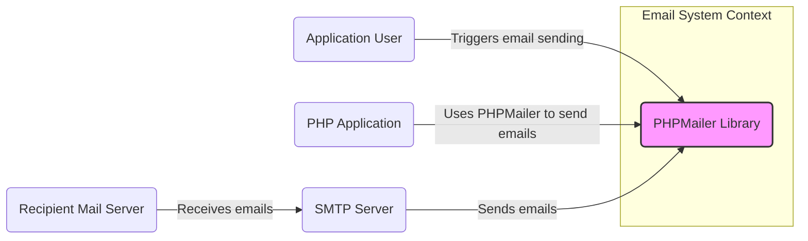
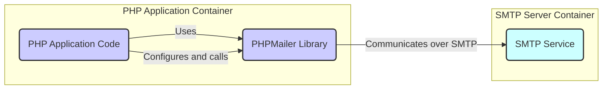
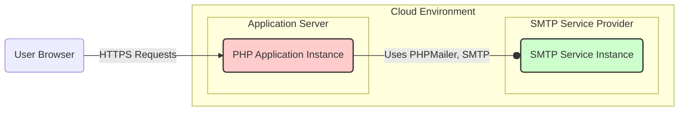

# BUSINESS POSTURE

This project, PHPMailer, is a widely used open-source library for sending emails from PHP applications. Its primary business priority is to provide a reliable and feature-rich solution for developers to integrate email sending functionality into their applications.

Business priorities:
- Reliable email delivery: Ensuring emails are sent and received successfully.
- Ease of integration: Providing a simple and straightforward API for developers to use.
- Feature richness: Supporting various email protocols, authentication methods, and email formats.
- Maintainability: Keeping the library up-to-date, secure, and compatible with modern PHP environments.
- Community support: Leveraging the open-source community for contributions, bug fixes, and feature enhancements.

Business goals:
- To be the leading PHP email sending library.
- To maintain a large and active user base.
- To ensure the library remains secure and reliable.
- To adapt to evolving email standards and technologies.

Most important business risks:
- Security vulnerabilities in the library could lead to exploitation of applications using PHPMailer, resulting in data breaches, spam campaigns, or reputational damage.
- Email delivery failures due to misconfiguration, compatibility issues, or changes in email service provider policies could disrupt critical business processes relying on email communication.
- Lack of maintenance or slow response to security issues could erode user trust and lead to migration to alternative solutions.
- Supply chain attacks targeting dependencies or the PHPMailer distribution channels could compromise the library's integrity.

# SECURITY POSTURE

Existing security controls:
- security control: TLS encryption for SMTP communication. Implemented within PHPMailer configuration options to enable secure connections to SMTP servers.
- security control: Input validation on email addresses and headers to prevent basic injection attacks. Implemented within PHPMailer code, but might not be comprehensive.
- security control: Open-source nature allows for community review and identification of potential vulnerabilities. Described by the project's public availability on GitHub.
- security control: Usage of prepared statements or parameterized queries for database interactions (if applicable for email storage or logging). Depends on the application using PHPMailer.

Accepted risks:
- accepted risk: Reliance on the security of underlying PHP environment and server infrastructure.
- accepted risk: Potential vulnerabilities in third-party dependencies used by PHPMailer.
- accepted risk: Misconfiguration of PHPMailer by developers leading to security weaknesses (e.g., insecure SMTP settings).
- accepted risk: Vulnerabilities might be discovered and exploited before patches are available, despite community review.

Recommended security controls:
- security control: Implement automated dependency scanning to identify and address vulnerabilities in third-party libraries used by PHPMailer.
- security control: Integrate static application security testing (SAST) tools into the development process to automatically detect potential security flaws in the code.
- security control: Provide secure configuration guidelines and best practices documentation for developers using PHPMailer.
- security control: Implement regular security audits and penetration testing to proactively identify and address vulnerabilities.
- security control: Establish a clear vulnerability disclosure and incident response process.

Security requirements:
- Authentication:
    - requirement: PHPMailer must support secure authentication mechanisms for SMTP servers, such as username/password, OAuth 2.0, and client certificates.
    - requirement: Credentials for SMTP authentication should be securely stored and managed, avoiding hardcoding in application code.
- Authorization:
    - requirement: The application using PHPMailer should implement authorization controls to ensure only authorized users or processes can send emails. PHPMailer itself does not handle application-level authorization.
- Input validation:
    - requirement: PHPMailer must perform robust input validation on all email inputs, including recipient addresses, sender addresses, subject, body, and headers, to prevent injection attacks (e.g., header injection, command injection).
    - requirement: Input validation should include checks for format, length, and character encoding to prevent unexpected behavior and security issues.
- Cryptography:
    - requirement: PHPMailer must enforce TLS encryption for all SMTP communication to protect the confidentiality and integrity of email messages in transit.
    - requirement: PHPMailer should support and encourage the use of cryptographic signatures (e.g., DKIM) and encryption (e.g., S/MIME) for email messages to enhance security and authenticity.

# DESIGN

## C4 CONTEXT

Context Diagram Elements:

- Element:
    - Name: Application User
    - Type: Person
    - Description: End-user of the PHP application that triggers email sending functionality.
    - Responsibilities: Initiates actions within the application that result in emails being sent.
    - Security controls: Authentication to the PHP application, authorization to perform actions that trigger email sending.

- Element:
    - Name: PHP Application
    - Type: Software System
    - Description: The web application or system built using PHP that integrates the PHPMailer library.
    - Responsibilities:  Utilizes PHPMailer to construct and send emails based on user actions or system events. Manages user authentication and authorization within the application.
    - Security controls: Application-level authentication and authorization, input validation of user-provided data, secure coding practices.

- Element:
    - Name: PHPMailer Library
    - Type: Software System
    - Description: The PHPMailer library itself, responsible for handling email composition and transmission.
    - Responsibilities:  Constructing email messages according to provided parameters, establishing connections to SMTP servers, authenticating with SMTP servers, sending emails over SMTP protocol, handling email formatting and encoding.
    - Security controls: Input validation within the library, TLS encryption for SMTP communication, secure handling of SMTP credentials (within the application using it).

- Element:
    - Name: SMTP Server
    - Type: Software System
    - Description:  A Simple Mail Transfer Protocol server responsible for relaying emails to recipient mail servers. Could be a service like SendGrid, Mailgun, or a self-hosted SMTP server.
    - Responsibilities: Receiving emails from PHPMailer, authenticating senders, routing emails to recipient mail servers, handling email delivery retries and bounces.
    - Security controls: SMTP authentication mechanisms, TLS encryption for communication with PHPMailer and recipient servers, spam filtering, rate limiting, access control lists.

- Element:
    - Name: Recipient Mail Server
    - Type: Software System
    - Description: The mail server that ultimately receives and stores the email for the intended recipient.
    - Responsibilities: Receiving emails from SMTP servers, performing spam and virus scanning, storing emails in recipient mailboxes, making emails accessible to recipients.
    - Security controls: Spam and virus filtering, email authentication mechanisms (SPF, DKIM, DMARC), access control to mailboxes, data encryption at rest.

## C4 CONTAINER

Container Diagram Elements:

- Element:
    - Name: PHP Application Code
    - Type: Container - Application
    - Description: The custom PHP code of the web application that utilizes PHPMailer to send emails. This includes application logic, user interface, and integration with other application components.
    - Responsibilities:  Handling user requests, generating email content, configuring PHPMailer with necessary settings (SMTP server details, credentials, recipient addresses, email body), calling PHPMailer functions to send emails, managing SMTP credentials securely.
    - Security controls: Application-level authentication and authorization, input validation of user inputs before using them in email content or PHPMailer configuration, secure storage and management of SMTP credentials (e.g., using environment variables or secrets management systems), output encoding to prevent injection attacks in email content.

- Element:
    - Name: PHPMailer Library
    - Type: Container - Library
    - Description: The PHPMailer library, included as a dependency within the PHP application. It provides the core functionality for email sending.
    - Responsibilities:  Providing API for email composition and sending, handling SMTP protocol communication, implementing TLS encryption for SMTP connections, performing basic input validation on email parameters, supporting various SMTP authentication methods.
    - Security controls: Input validation within the library, TLS encryption for SMTP communication, adherence to secure coding practices, regular security updates and patches.

- Element:
    - Name: SMTP Service
    - Type: Container - External Service
    - Description: An external SMTP server or service used by PHPMailer to relay emails. This could be a cloud-based email service or a self-hosted SMTP server.
    - Responsibilities: Receiving email sending requests from PHPMailer, authenticating senders, relaying emails to recipient mail servers, handling email delivery, providing delivery status notifications.
    - Security controls: SMTP authentication mechanisms (e.g., username/password, OAuth), TLS encryption for communication, spam filtering, rate limiting, access control lists, security monitoring and logging.

## DEPLOYMENT

Deployment Scenario: Cloud-based PHP Application with External SMTP Service

Deployment Diagram Elements:

- Element:
    - Name: User Browser
    - Type: Infrastructure - Client Device
    - Description: The web browser used by the application user to interact with the PHP application.
    - Responsibilities: Rendering the application user interface, sending HTTPS requests to the application server, receiving and displaying responses.
    - Security controls: Browser security features (e.g., sandboxing, content security policy), user authentication (handled by the application).

- Element:
    - Name: PHP Application Instance
    - Type: Infrastructure - Server
    - Description: A virtual machine or container instance running the PHP application code and PHPMailer library within a cloud environment (e.g., AWS EC2, Google Compute Engine, Azure VM).
    - Responsibilities: Hosting and executing the PHP application, processing user requests, running PHPMailer to send emails, managing application logs and monitoring.
    - Security controls: Operating system security hardening, web server security configuration (e.g., HTTPS, firewall), application security controls (authentication, authorization, input validation), regular security patching, intrusion detection systems, access control lists, security monitoring and logging.

- Element:
    - Name: SMTP Service Instance
    - Type: Infrastructure - External Service
    - Description: An instance of an external SMTP service provided by a cloud provider or third-party service (e.g., AWS SES, SendGrid, Mailgun).
    - Responsibilities: Receiving SMTP connections from the PHP application instance, authenticating senders, relaying emails, managing email queues, handling bounces and delivery notifications.
    - Security controls: SMTP authentication mechanisms, TLS encryption, spam filtering, rate limiting, access control lists, security monitoring and logging provided by the SMTP service provider.

## BUILD

```mermaid
flowchart LR
    developer("Developer") -- "Code Changes, Commit, Push" --> git_repo("Git Repository (GitHub)")
    git_repo -- "Webhook Trigger" --> ci_server("CI Server (GitHub Actions)")
    ci_server -- "Checkout Code, Dependencies, Build" --> build_process("Build Process")
    build_process -- "Run Security Checks (SAST, Dependency Scan)" --> security_checks("Security Checks")
    security_checks -- "Build Artifacts" --> build_artifacts("Build Artifacts (Distribution Package)")

    style git_repo fill:#eee,stroke:#333,stroke-width:2px
    style ci_server fill:#eee,stroke:#333,stroke-width:2px
    style build_process fill:#eee,stroke:#333,stroke-width:2px
    style security_checks fill:#eee,stroke:#333,stroke-width:2px
    style build_artifacts fill:#eee,stroke:#333,stroke-width:2px
```

Build Process Description:

1. Developer: Developers write code, commit changes, and push them to the Git repository (GitHub).
2. Git Repository (GitHub): Hosts the source code of PHPMailer. Code changes trigger a webhook to the CI server.
3. CI Server (GitHub Actions): GitHub Actions is used as the CI server. It receives webhook triggers from the Git repository on code changes (e.g., push, pull request).
4. Build Process: The CI server executes the build process defined in GitHub Actions workflows. This typically includes:
    - Checking out the code from the Git repository.
    - Installing dependencies using Composer.
    - Running linters and code formatters.
    - Building distribution packages (e.g., ZIP, Phar).
5. Security Checks: As part of the build process, security checks are performed:
    - Static Application Security Testing (SAST): Tools like Psalm or PHPStan can be used to analyze the code for potential security vulnerabilities.
    - Dependency Scanning: Tools like `composer audit` or third-party dependency scanning tools can be used to identify known vulnerabilities in dependencies.
6. Build Artifacts: If the build and security checks are successful, the CI server produces build artifacts, such as distribution packages (ZIP files, Phar archives) of PHPMailer. These artifacts are then ready for release or distribution.

Security Controls in Build Process:
- security control: Automated build process using CI/CD (GitHub Actions) to ensure consistent and repeatable builds.
- security control: Source code hosted in a version control system (Git/GitHub) to track changes and enable code review.
- security control: Static Application Security Testing (SAST) integrated into the build pipeline to detect potential code vulnerabilities.
- security control: Dependency scanning to identify and alert on vulnerabilities in third-party dependencies.
- security control: Code linting and formatting to enforce code quality and consistency.
- security control: Build artifacts are generated automatically and can be signed or checksummed for integrity verification.
- security control: Access control to CI/CD pipelines and build artifacts to prevent unauthorized modifications.

# RISK ASSESSMENT

Critical business processes we are trying to protect:
- For applications using PHPMailer, critical business processes often rely on email communication. Examples include:
    - User registration and account verification.
    - Password reset functionality.
    - Order confirmations and transaction notifications.
    - Marketing and promotional emails.
    - System alerts and notifications.
    - Contact forms and customer support communication.

Disruption or compromise of email sending capabilities can directly impact these business processes, leading to:
- Loss of revenue (e.g., if order confirmations are not sent).
- Customer dissatisfaction and churn (e.g., if password resets fail).
- Reputational damage (e.g., if spam or malicious emails are sent due to vulnerabilities).
- Operational disruptions (e.g., if system alerts are missed).

Data we are trying to protect and their sensitivity:
- Email content: Can contain sensitive information depending on the application and use case. This could include:
    - Personal Identifiable Information (PII) of users (names, email addresses, order details, etc.).
    - Confidential business information.
    - Financial data.
- Recipient email addresses: Considered PII and should be protected to maintain user privacy and prevent unauthorized access or misuse.
- SMTP credentials: Usernames and passwords or API keys used to authenticate with SMTP servers. These are highly sensitive and must be protected to prevent unauthorized email sending and potential abuse of SMTP services.
- Application logs: Logs might contain email sending details, recipient addresses, and potentially parts of email content. Logs should be secured to prevent unauthorized access and disclosure of sensitive information.

Sensitivity levels of data:
- SMTP Credentials: Highly Sensitive - Compromise can lead to unauthorized email sending, spam, and reputational damage.
- PII in Email Content and Recipient Addresses: Sensitive - Requires protection to comply with privacy regulations (e.g., GDPR, CCPA) and maintain user trust.
- Business Confidential Information in Email Content: Confidential - Requires protection to maintain competitive advantage and prevent leaks of sensitive business data.
- Application Logs: Moderately Sensitive - Should be protected to prevent unauthorized access to email details and potential PII.

# QUESTIONS & ASSUMPTIONS

Questions:
- What type of application will be using PHPMailer? (e.g., e-commerce, CRM, CMS, custom web application). This will help to understand the specific business context and sensitivity of emails being sent.
- What SMTP service provider will be used? (e.g., SendGrid, Mailgun, AWS SES, self-hosted). This impacts the deployment and security controls of the SMTP server component.
- What are the specific compliance requirements for the application and the data being handled in emails? (e.g., GDPR, HIPAA, PCI DSS). This will influence the required security controls and data protection measures.
- What is the organization's risk appetite regarding security vulnerabilities in open-source libraries? This will determine the level of investment in security controls and risk mitigation strategies.
- Are there any specific security policies or standards that the application and PHPMailer integration must adhere to?

Assumptions:
- BUSINESS POSTURE:
    - The organization using PHPMailer values reliable email delivery as a critical business function.
    - Security of email communication is important to protect sensitive data and maintain user trust.
    - The organization has a moderate risk appetite and is willing to invest in reasonable security controls.
- SECURITY POSTURE:
    - The application using PHPMailer will be deployed in a cloud environment.
    - An external SMTP service provider will be used for email relaying.
    - Developers using PHPMailer will follow secure coding practices and configuration guidelines.
    - Regular security updates and patches will be applied to PHPMailer and its dependencies.
- DESIGN:
    - PHPMailer will be integrated into a typical PHP web application.
    - SMTP credentials will be managed securely, outside of the application code (e.g., using environment variables or secrets management).
    - TLS encryption will be enabled for all SMTP communication.
    - Basic input validation will be implemented within the application and PHPMailer.