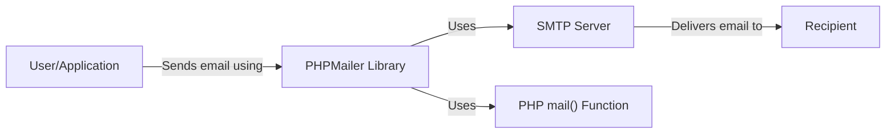
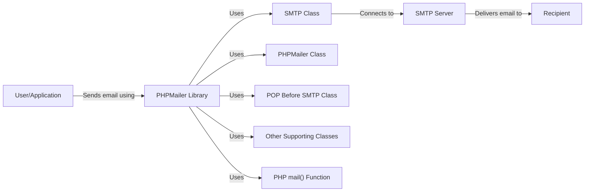
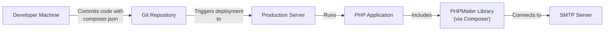
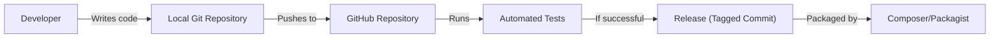

# BUSINESS POSTURE

Business Priorities and Goals:

*   Provide a robust, easy-to-use, and secure email sending library for PHP applications.
*   Maintain broad compatibility with various PHP versions and server environments.
*   Offer a comprehensive feature set supporting various email functionalities (attachments, HTML content, SMTP, etc.).
*   Ensure the library is well-documented and easy to integrate.
*   Maintain an active open-source community and respond to user issues and contributions.

Most Important Business Risks:

*   Vulnerabilities in the library could lead to email spoofing, data breaches, or server compromise.
*   Lack of compatibility with newer PHP versions or email standards could limit adoption.
*   Inadequate documentation or support could hinder developer usage.
*   Reputational damage due to security incidents or poor code quality.
*   Failure to keep up with evolving email security best practices.

# SECURITY POSTURE

Existing Security Controls:

*   security control: Input validation: The library appears to perform some input validation, particularly on email addresses and other user-provided data. (Mentioned throughout the codebase, e.g., address validation functions).
*   security control: SMTP authentication: Supports SMTP authentication to prevent unauthorized relaying. (Implemented in the SMTP class).
*   security control: Encryption (TLS/SSL): Encourages and supports secure connections via TLS/SSL for SMTP. (Implemented in the SMTP class).
*   security control: Escaping/Encoding: Likely performs some escaping or encoding of data to prevent injection vulnerabilities, though this needs further verification. (Needs more specific code references).
*   security control: Community code review: Open-source nature allows for community scrutiny and contributions, potentially catching vulnerabilities.

Accepted Risks:

*   accepted risk: Reliance on external SMTP servers: The library's security partially depends on the configuration and security of the SMTP servers used.
*   accepted risk: Potential for misconfiguration: Users might misconfigure the library (e.g., weak authentication, disabling TLS) leading to security issues.
*   accepted risk: Limited control over the underlying PHP environment: Vulnerabilities in the PHP environment itself could impact the library.
*   accepted risk: Dependency on third-party libraries: If any dependencies have vulnerabilities, PHPMailer could be indirectly affected.

Recommended Security Controls:

*   security control: Implement comprehensive output encoding to prevent cross-site scripting (XSS) vulnerabilities if email content is displayed in web interfaces.
*   security control: Provide clear guidance and defaults for secure configurations (e.g., enforcing TLS, strong authentication).
*   security control: Regularly audit the codebase for potential vulnerabilities using static analysis tools.
*   security control: Implement a Content Security Policy (CSP) if the library generates any HTML output that's displayed in a browser.
*   security control: Consider signing releases to ensure integrity and authenticity.
*   security control: Implement robust error handling and avoid disclosing sensitive information in error messages.
*   security control: Provide examples and documentation on how to securely handle attachments to prevent potential file upload vulnerabilities.

Security Requirements:

*   Authentication:
    *   Must support secure SMTP authentication mechanisms (e.g., OAuth 2.0, strong passwords).
    *   Should provide options for secure credential storage and management.
*   Authorization:
    *   Should not allow unauthorized access to email sending functionality.
    *   Access control should be enforced based on the application's requirements.
*   Input Validation:
    *   Must validate all user-provided input, including email addresses, headers, and body content.
    *   Should sanitize input to prevent injection vulnerabilities (e.g., header injection, SMTP command injection).
*   Cryptography:
    *   Must use strong encryption (TLS/SSL) for all communication with SMTP servers.
    *   Should support modern cryptographic protocols and ciphers.
    *   Should avoid using deprecated or weak cryptographic algorithms.
*   Output Encoding:
    *   If email content is displayed in web interfaces, must implement robust output encoding to prevent XSS.

# DESIGN

## C4 CONTEXT

Elements Description:

*   Element:
    *   Name: User/Application
    *   Type: User/External System
    *   Description: The user or application that utilizes the PHPMailer library to send emails.
    *   Responsibilities: Initiates email sending requests, provides email content and recipient information.
    *   Security controls: Authentication and authorization within the application itself. Input validation before passing data to PHPMailer.

*   Element:
    *   Name: PHPMailer Library
    *   Type: Software System
    *   Description: The PHPMailer library itself, a PHP code library for sending emails.
    *   Responsibilities: Provides an interface for creating and sending emails, handles SMTP communication, supports various email features.
    *   Security controls: Input validation, SMTP authentication, TLS/SSL encryption, escaping/encoding (needs verification).

*   Element:
    *   Name: SMTP Server
    *   Type: External System
    *   Description: An external SMTP server used to relay emails to recipients.
    *   Responsibilities: Receives emails from PHPMailer, delivers emails to recipients' mail servers.
    *   Security controls: Relies on the security configuration of the SMTP server (authentication, TLS/SSL, spam filtering, etc.).

*   Element:
    *   Name: MailFunction
    *   Type: External System
    *   Description: PHP's built-in mail() function.
    *   Responsibilities: Provides basic email sending.
    *   Security controls: Relies on the security configuration of the PHP environment and underlying system.

*   Element:
    *   Name: Recipient
    *   Type: User
    *   Description: The recipient of the email.
    *   Responsibilities: Receives and views the email.
    *   Security controls: Relies on the security of the recipient's email client and server.

## C4 CONTAINER

Since PHPMailer is a library, the container diagram is essentially an extension of the context diagram. The "containers" are logical components within the library itself.

Elements Description:

*   Element:
    *   Name: User/Application
    *   Type: User/External System
    *   Description: The user or application using PHPMailer.
    *   Responsibilities: Initiates email sending.
    *   Security controls: Application-level security.

*   Element:
    *   Name: PHPMailer Library
    *   Type: Software System
    *   Description: The overall PHPMailer library.
    *   Responsibilities: Provides the main interface for email sending.
    *   Security controls: Input validation, overall security logic.

*   Element:
    *   Name: SMTP Class
    *   Type: Component
    *   Description: Handles SMTP-specific communication.
    *   Responsibilities: Connects to SMTP servers, sends commands, handles authentication and encryption.
    *   Security controls: SMTP authentication, TLS/SSL encryption.

*   Element:
    *   Name: PHPMailer Class
    *   Type: Component
    *   Description: The core PHPMailer class.
    *   Responsibilities: Provides the main email creation and sending methods.
    *   Security controls: Input validation, header management.

*   Element:
    *   Name: POP Before SMTP Class
    *   Type: Component
    *   Description: Handles POP-before-SMTP authentication (if used).
    *   Responsibilities: Connects to a POP server before sending via SMTP.
    *   Security controls: POP authentication.

*   Element:
    *   Name: Other Supporting Classes
    *   Type: Component
    *   Description: Other classes for handling attachments, exceptions, etc.
    *   Responsibilities: Provide supporting functionalities.
    *   Security controls: Context-specific security measures.

*   Element:
    *   Name: SMTP Server
    *   Type: External System
    *   Description: The external SMTP server.
    *   Responsibilities: Relays emails.
    *   Security controls: External server security.

*   Element:
    *   Name: Recipient
    *   Type: User
    *   Description: The email recipient.
    *   Responsibilities: Receives the email.
    *   Security controls: Recipient-side security.

*   Element:
    *   Name: MailFunction
    *   Type: External System
    *   Description: PHP's built-in mail() function.
    *   Responsibilities: Provides basic email sending.
    *   Security controls: Relies on the security configuration of the PHP environment and underlying system.

## DEPLOYMENT

PHPMailer, being a library, is deployed as part of a larger PHP application.  There are several ways to include it:

1.  **Composer (Recommended):**  `composer require phpmailer/phpmailer` This is the preferred method, as it manages dependencies and updates.
2.  **Manual Download:** Downloading the source code and including it directly in the project.  This is less manageable for updates.
3.  **Git Submodule/Subtree:**  Including the repository as a submodule or subtree within the application's repository.

We'll describe deployment using Composer, as it's the best practice.

Elements Description:

*   Element:
    *   Name: Developer Machine
    *   Type: Development Environment
    *   Description: The developer's local machine.
    *   Responsibilities: Writing code, managing dependencies (via Composer).
    *   Security controls: Development environment security best practices.

*   Element:
    *   Name: Git Repository
    *   Type: Version Control System
    *   Description: The repository storing the application code and PHPMailer dependency information.
    *   Responsibilities: Version control, collaboration.
    *   Security controls: Access control to the repository, branch protection rules.

*   Element:
    *   Name: Production Server
    *   Type: Server Environment
    *   Description: The server where the PHP application is deployed.
    *   Responsibilities: Running the application, handling requests.
    *   Security controls: Server hardening, firewall, intrusion detection/prevention systems.

*   Element:
    *   Name: PHP Application
    *   Type: Application
    *   Description: The application that uses PHPMailer.
    *   Responsibilities: The application's core functionality.
    *   Security controls: Application-level security measures.

*   Element:
    *   Name: PHPMailer Library (via Composer)
    *   Type: Library
    *   Description: The PHPMailer library, installed and managed by Composer.
    *   Responsibilities: Email sending functionality.
    *   Security controls: PHPMailer's internal security controls.

*   Element:
    *   Name: SMTP Server
    *   Type: External System
    *   Description: The external SMTP server.
    *   Responsibilities: Relaying emails.
    *   Security controls: External server security.

Deployment Steps (Composer):

1.  The developer includes PHPMailer as a dependency in `composer.json`.
2.  `composer install` or `composer update` is run, downloading PHPMailer and its dependencies into the `vendor` directory.
3.  The application code includes PHPMailer's autoloader (`vendor/autoload.php`).
4.  The application is deployed to the production server (e.g., via Git, FTP, or a deployment pipeline).
5.  Composer is run on the server (if necessary) to install dependencies.
6.  The PHP application, now including PHPMailer, runs on the server.

## BUILD

PHPMailer itself doesn't have a complex build process in the traditional sense, as it's a library, not a standalone application. However, we can consider the steps involved in packaging and distributing it, and the security considerations involved.

Build Process:

1.  **Development:** Developers write code and commit it to a local Git repository.
2.  **Push to GitHub:** Code is pushed to the central GitHub repository.
3.  **Automated Tests:** GitHub Actions (or similar) run automated tests (unit tests, static analysis) on each push or pull request. This is a crucial security step.
4.  **Release:** When a new version is ready, a release is created on GitHub (typically by tagging a commit).
5.  **Packaging:** Composer/Packagist automatically picks up the new release from GitHub and makes it available for installation via `composer require phpmailer/phpmailer`.

Security Controls in the Build Process:

*   security control: **Automated Tests:** Running unit tests and static analysis tools (like PHPStan, Psalm) on each commit helps catch bugs and potential vulnerabilities early.
*   security control: **Dependency Management (Composer):** Composer helps manage dependencies and ensures that known vulnerable versions are not used (with proper configuration and regular updates).
*   security control: **Code Review:** Pull requests on GitHub should be reviewed by other developers before merging, providing another layer of security scrutiny.
*   security control: **Signed Releases:** Tagging releases with GPG signatures can help verify the integrity of the released code. (Recommended, not currently implemented consistently).
*   security control: **Two-Factor Authentication (2FA):** Enforcing 2FA on GitHub accounts protects against unauthorized access to the repository.

# RISK ASSESSMENT

Critical Business Processes to Protect:

*   **Email Sending Reliability:** Ensuring that emails sent via PHPMailer are delivered reliably and without errors.
*   **Reputation:** Maintaining the reputation of the PHPMailer project and the applications that use it.
*   **User Trust:** Protecting user data and preventing misuse of the library for malicious purposes.

Data to Protect and Sensitivity:

*   **Email Content:** This can range from highly sensitive (e.g., financial transactions, personal information) to less sensitive (e.g., marketing emails). Sensitivity varies greatly depending on the application using PHPMailer.
*   **Email Headers:** Headers can contain information about the sender, recipient, and routing, which could be sensitive in some contexts.
*   **SMTP Credentials:** If PHPMailer is configured to use SMTP authentication, the credentials (username, password, potentially API keys) are highly sensitive and must be protected.
*   **Recipient Email Addresses:** Lists of email addresses can be valuable targets for spammers or attackers.

# QUESTIONS & ASSUMPTIONS

Questions:

*   What specific static analysis tools are currently used in the PHPMailer development process?
*   Are there any plans to implement more robust output encoding to prevent XSS vulnerabilities?
*   Are there any plans to formally support OAuth 2.0 for SMTP authentication?
*   What is the process for handling security vulnerability reports?
*   Is there a documented secure configuration guide for users?
*   What are the specific versions of PHP that are officially supported?

Assumptions:

*   BUSINESS POSTURE: The PHPMailer project prioritizes security and aims to provide a secure email sending solution.
*   SECURITY POSTURE: Users are responsible for securely configuring their SMTP servers and handling sensitive data appropriately.
*   DESIGN: The library is primarily used within PHP web applications, but could also be used in other PHP contexts (e.g., command-line scripts).
*   DESIGN: Composer is the primary method for installing and managing PHPMailer.
*   DESIGN: The provided GitHub repository is the official source of truth for the PHPMailer codebase.