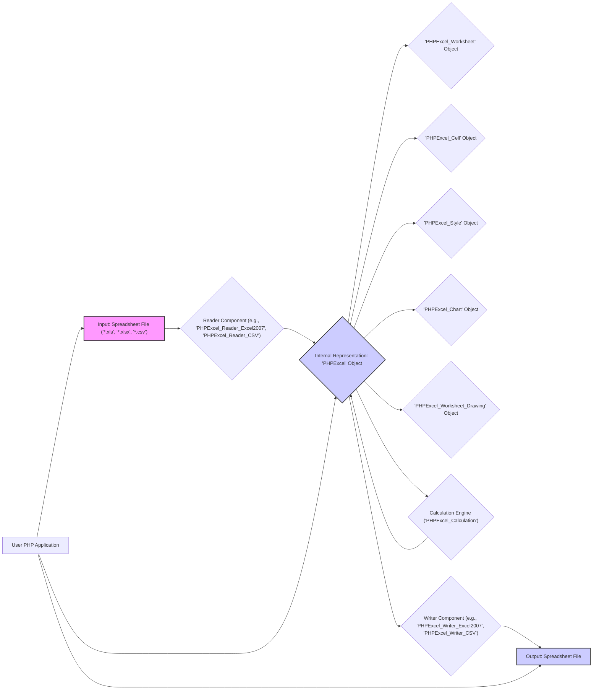

## Project Design Document: PHPExcel Library (Improved)

**1. Project Overview**

The PHPExcel library (now known as PhpSpreadsheet) is a widely adopted PHP library designed for programmatic manipulation of spreadsheet files. It enables PHP applications to read data from and write data to various spreadsheet formats, including older Excel formats (XLS), modern Office Open XML spreadsheets (XLSX), and plain text formats like CSV. PHPExcel provides a rich set of classes and methods for interacting with spreadsheet data, formatting cells, managing worksheets, and even creating charts and drawings. This document details the architectural design of PHPExcel as it existed prior to its transition to PhpSpreadsheet, focusing on the key components and data flow to facilitate effective threat modeling.

**2. Goals**

* **Read Spreadsheet Data:** Provide a robust PHP API for reading data and metadata from various spreadsheet file formats.
* **Write Spreadsheet Data:** Offer a comprehensive PHP API for generating and writing spreadsheet files in multiple formats.
* **Manipulate Spreadsheet Data:** Enable in-memory manipulation of spreadsheet content, including adding, modifying, and deleting cells, rows, and columns.
* **Apply Cell Formatting:** Support a wide range of cell formatting options, such as fonts, colors, borders, number formats, and alignment.
* **Create and Manage Worksheets:** Allow the creation, deletion, and manipulation of individual worksheets within a spreadsheet.
* **Generate Charts and Drawings:** Facilitate the programmatic creation and embedding of charts and graphical elements within spreadsheets.
* **Offer Extensibility:** Provide a flexible architecture that can be extended to support new file formats or features.

**3. Non-Goals**

* **User Interface (UI):** PHPExcel is a library intended for use by developers within PHP code; it does not provide a graphical user interface for direct user interaction with spreadsheets.
* **Direct Database Interaction:** While PHPExcel can read data from and write data to files that might originate from or be imported into databases, it does not have built-in functionality for direct database connections or operations.
* **Real-time Collaboration:** PHPExcel is designed for single-user, file-based spreadsheet manipulation and does not support real-time collaborative editing.
* **Advanced Statistical Analysis:**  PHPExcel focuses on core spreadsheet operations and does not offer advanced statistical analysis or data mining capabilities beyond basic formula calculations.

**4. Architecture Overview**

PHPExcel employs a modular architecture centered around an in-memory representation of the spreadsheet. Data flows from the input file through a format-specific reader, into the internal object model, and then out through a format-specific writer.

**5. Key Components**

* **Reader Components:**
    * **Purpose:** Responsible for parsing spreadsheet files of specific formats and converting their data into the internal PHPExcel object model.
    * **Examples:** `PHPExcel_Reader_Excel2007` (for XLSX), `PHPExcel_Reader_Excel5` (for older XLS), `PHPExcel_Reader_CSV`.
    * **Functionality:** Handles file format-specific structures, extracts data, validates file integrity, and manages potential errors during parsing.

* **Writer Components:**
    * **Purpose:** Responsible for taking the data from the internal PHPExcel object model and generating spreadsheet files in a specific format.
    * **Examples:** `PHPExcel_Writer_Excel2007`, `PHPExcel_Writer_Excel5`, `PHPExcel_Writer_CSV`.
    * **Functionality:** Structures data according to the target file format specification, handles formatting and metadata, and writes the output file.

* **PHPExcel Object Model:**
    * **Purpose:** The central in-memory representation of the spreadsheet and its contents.
    * **Key Objects:**
        * **`PHPExcel`:** The top-level object representing the entire spreadsheet file. It contains collections of worksheets, styles, and other global settings.
        * **`PHPExcel_Worksheet`:** Represents a single sheet within the spreadsheet, containing cells, drawings, and chart objects.
        * **`PHPExcel_Cell`:** Represents an individual cell within a worksheet, holding its value, data type, and style information.
        * **`PHPExcel_Style`:**  Encapsulates formatting attributes (font, fill, borders, etc.) that can be applied to cells, rows, or columns.
        * **`PHPExcel_Chart`:** Represents a chart embedded within a worksheet, defining its type, data series, and formatting.
        * **`PHPExcel_Worksheet_Drawing`:** Represents images or other graphical elements embedded within a worksheet.

* **Calculation Engine (`PHPExcel_Calculation`):**
    * **Purpose:** Responsible for evaluating formulas within spreadsheet cells.
    * **Functionality:** Parses formula expressions, resolves cell references, performs calculations using a wide range of built-in functions, and manages dependencies between cells with formulas.

**6. Data Flow**

The flow of data through PHPExcel generally follows these patterns:

* **Reading a Spreadsheet File:**
    1. The user's PHP application initiates the read process, providing the file path and optionally specifying the reader type.
    2. The appropriate Reader component is instantiated based on the file extension or explicitly provided type.
    3. The Reader component opens and parses the input file, interpreting its structure and data.
    4. Data and metadata are extracted from the file and used to populate the PHPExcel object model in memory. This involves creating `PHPExcel`, `PHPExcel_Worksheet`, `PHPExcel_Cell`, `PHPExcel_Style`, and other relevant objects.
    5. The user's application can then access and manipulate the spreadsheet data by interacting with the methods and properties of the PHPExcel object model.

* **Writing a Spreadsheet File:**
    1. The user's PHP application creates a new `PHPExcel` object or modifies an existing one in memory, setting cell values, applying formatting, adding worksheets, etc.
    2. The user's application instantiates the appropriate Writer component based on the desired output file format.
    3. The Writer component traverses the PHPExcel object model.
    4. Based on the data and structure within the object model, the Writer component generates the output file in the specified format (e.g., creating XML structures for XLSX or writing comma-separated values for CSV).
    5. The generated file is saved to the specified location.

**7. Security Considerations**

Potential security vulnerabilities within PHPExcel can be categorized as follows:

* **File Parsing Vulnerabilities:**
    * **Malicious File Exploitation:** Reader components might be vulnerable to specially crafted spreadsheet files designed to exploit parsing logic flaws. This could lead to:
        * **Remote Code Execution (RCE):**  If vulnerabilities allow execution of arbitrary code on the server.
        * **Denial of Service (DoS):** By providing files that consume excessive resources (memory, CPU) during parsing.
        * **Information Disclosure:** By exploiting vulnerabilities to access sensitive information on the server.
    * **XML External Entity (XXE) Injection:** Reader components that parse XML-based formats (like XLSX) might be susceptible to XXE attacks if XML processing is not properly secured. This could allow attackers to:
        * **Access local files:** By referencing local file paths in external entities.
        * **Perform Server-Side Request Forgery (SSRF):** By making requests to internal or external resources.
    * **Zip Archive Vulnerabilities (e.g., Zip Slip):** When handling compressed formats like XLSX, improper handling of archive entries could allow writing files outside the intended extraction directory.

* **Data Handling and Calculation Vulnerabilities:**
    * **Formula Injection:** If user-supplied data is directly incorporated into spreadsheet formulas without proper sanitization, attackers could inject malicious formulas to:
        * **Execute arbitrary code:** Through the use of external command execution functions (if available and not restricted).
        * **Access sensitive data:** By referencing cells containing sensitive information.
    * **Integer Overflow/Underflow:**  Potential vulnerabilities in the calculation engine when handling extremely large or small numbers, leading to unexpected behavior or security flaws.

* **Dependency Vulnerabilities:**
    * PHPExcel relies on external PHP extensions (like `zip` and `xml`) and potentially other libraries. Vulnerabilities in these dependencies could indirectly impact PHPExcel's security.

* **General Security Best Practices:**
    * **Input Validation:**  Ensure proper validation of spreadsheet data before processing or using it in other parts of the application.
    * **Output Encoding:** When displaying spreadsheet data in web applications, ensure proper output encoding to prevent Cross-Site Scripting (XSS) attacks.

**8. Dependencies**

PHPExcel's functionality relies on the following PHP extensions and potentially other libraries:

* **`zip` extension:**  Essential for reading and writing XLSX files, as they are essentially ZIP archives.
* **`xml` extension:** Required for parsing XML-based spreadsheet formats like XLSX.
* **`mbstring` extension:** Highly recommended for handling multi-byte character sets correctly, ensuring proper display and processing of text in various languages.
* Potentially other libraries for specific features or file format support (though core functionality relies primarily on the above).

**9. Deployment Considerations**

PHPExcel is typically deployed as a library within a PHP web application or script. Security considerations during deployment include:

* **Regular Updates:** Keeping PHPExcel and its dependencies updated is crucial to patch known security vulnerabilities.
* **Secure Server Configuration:**  The underlying web server and PHP environment should be securely configured to prevent unauthorized access and execution of code.
* **Input Sanitization:**  Applications using PHPExcel should sanitize any user-provided data before incorporating it into spreadsheets or formulas.
* **File Handling Security:**  Implement secure file upload and storage mechanisms if users are allowed to upload spreadsheet files.
* **Resource Limits:**  Configure appropriate resource limits (memory, execution time) to mitigate potential Denial of Service attacks through maliciously crafted files.

This improved design document provides a more detailed and structured overview of the PHPExcel library, enhancing its suitability for threat modeling activities.
