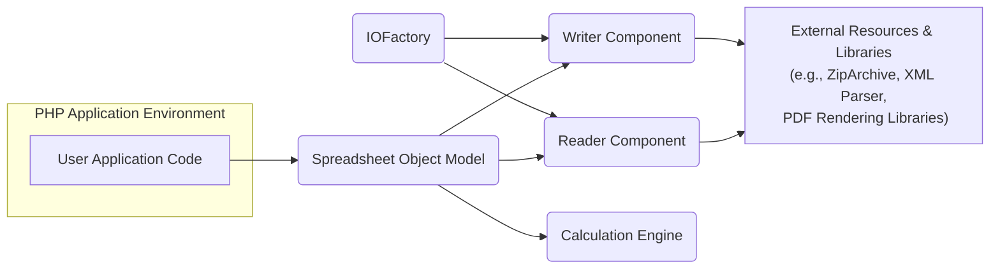
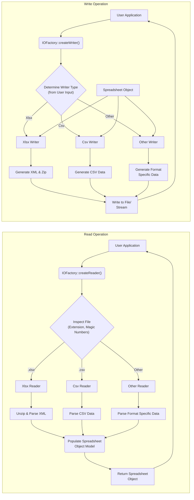

# Project Design Document: PHPSpreadsheet

**Version:** 1.1
**Date:** October 26, 2023
**Author:** AI Software Architect

## 1. Introduction

This document provides an enhanced and more detailed design overview of the PHPSpreadsheet library, a widely adopted PHP library for reading, writing, and manipulating spreadsheet files. This document is specifically crafted to serve as a robust foundation for subsequent threat modeling exercises, offering a comprehensive understanding of the library's architecture, internal components, data flow, and potential security considerations. It focuses on PHPSpreadsheet, the actively maintained successor to PHPExcel.

## 2. Goals and Objectives

The core goals of PHPSpreadsheet are to:

* Provide a reliable and feature-rich mechanism for reading data from a variety of spreadsheet file formats, including but not limited to: `.xlsx`, `.xls`, `.csv`, `.ods`, `.slk`, `.gnumeric`, and HTML tables.
* Enable the programmatic creation and writing of spreadsheet files in multiple formats.
* Offer extensive functionalities for manipulating spreadsheet data, encompassing cell formatting, formula calculations, data validation rules, and more.
* Facilitate seamless integration into PHP-based applications.
* Maintain broad compatibility across different PHP versions.
* Offer a well-documented and intuitive Application Programming Interface (API) for developers.

## 3. High-Level Architecture

The PHPSpreadsheet library is structured around several key interacting components:

* **User Application Code:** Represents the custom PHP code that integrates and utilizes the PHPSpreadsheet library to perform operations on spreadsheet files.
* **Spreadsheet Object Model:** The central in-memory representation of a spreadsheet. It's a hierarchical structure of PHP objects mirroring the spreadsheet's organization (e.g., `Spreadsheet`, `Worksheet`, `Cell`, `Style`).
* **Reader Component:**  Responsible for parsing various spreadsheet file formats and populating the internal Spreadsheet Object Model. Different reader classes are implemented for each supported format, handling format-specific parsing logic.
* **Writer Component:** Takes the in-memory Spreadsheet Object Model and serializes it into a file of the desired format. Dedicated writer classes exist for each supported output format.
* **Calculation Engine:** Provides the functionality to evaluate formulas within spreadsheet cells, handling cell references, built-in functions, and external data lookups.
* **IOFactory:** A factory design pattern implementation that simplifies the creation of appropriate Reader or Writer instances based on file extensions or specified types.
* **External Resources & Libraries:**  PHPSpreadsheet relies on standard PHP extensions and potentially external libraries for specific tasks, such as `ZipArchive` for handling `.xlsx` files, XML parsers for XML-based formats, and PDF rendering libraries for PDF output.

## 4. Component Design

This section provides a more detailed look at the internal workings of each key component:

### 4.1. Spreadsheet Object Model

* **Description:** The core data structure of the library, holding the entire spreadsheet in memory. Changes made through the API directly modify this model.
* **Key Classes:**
    * `\PhpOffice\PhpSpreadsheet\Spreadsheet`: Represents the root of the object model, containing metadata and a collection of `Worksheet` objects.
    * `\PhpOffice\PhpSpreadsheet\Worksheet\Worksheet`: Represents a single sheet within the spreadsheet, containing `Row` and `Column` collections, and ultimately `Cell` objects.
    * `\PhpOffice\PhpSpreadsheet\Cell\Cell`: Represents an individual cell, storing its value, data type, formula (if any), and style information.
    * `\PhpOffice\PhpSpreadsheet\Style\Style`:  Encapsulates the formatting properties applied to cells or ranges (e.g., font, fill, borders, alignment).
    * `\PhpOffice\PhpSpreadsheet\Worksheet\Row`: Represents a row in the worksheet.
    * `\PhpOffice\PhpSpreadsheet\Worksheet\Column`: Represents a column in the worksheet.
    * `\PhpOffice\PhpSpreadsheet\Chart`: Represents a chart embedded within a worksheet.
* **Functionality:** Provides methods for accessing, modifying, and iterating through the spreadsheet data and structure. Changes to this model are reflected when the Writer component saves the spreadsheet.
* **Security Considerations:**  The integrity of this object model is crucial. Malicious input during the reading process could lead to unexpected states or vulnerabilities if not properly sanitized.

### 4.2. Reader Component

* **Description:** Responsible for the complex task of interpreting various spreadsheet file formats and translating them into the internal Spreadsheet Object Model.
* **Key Classes (Examples):**
    * `\PhpOffice\PhpSpreadsheet\Reader\Xlsx`: Parses `.xlsx` files (Office Open XML format). This involves unzipping the file and parsing multiple XML files within the archive. Relies heavily on `ZipArchive` and XML parsing extensions.
    * `\PhpOffice\PhpSpreadsheet\Reader\Xls`: Parses older binary `.xls` files (BIFF format). This requires handling a complex binary structure.
    * `\PhpOffice\PhpSpreadsheet\Reader\Csv`: Parses comma-separated value files. While seemingly simple, handling different delimiters, enclosures, and character encodings is crucial.
    * `\PhpOffice\PhpSpreadsheet\Reader\Ods`: Parses Open Document Spreadsheet files, which are also XML-based and often compressed.
    * `\PhpOffice\PhpSpreadsheet\Reader\Html`: Parses HTML tables, which can be highly variable and may contain unexpected or malicious content.
* **Functionality:**
    * Takes a file path or stream as input.
    * Determines the file format and instantiates the appropriate reader class.
    * Parses the file content according to the specific format's specification.
    * Creates and populates the `Spreadsheet` object model with the extracted data, styles, and metadata.
    * Implements error handling and potentially data validation during the reading process.
* **Security Considerations:** This component is a primary entry point for potentially malicious data. Vulnerabilities here could include:
    * **XML External Entity (XXE) Injection:** Particularly relevant for XML-based formats like `.xlsx` and `.ods`.
    * **Path Traversal:**  If file paths are extracted from the input file (e.g., in external links or embedded objects), improper handling could lead to accessing arbitrary files on the server.
    * **Buffer Overflows/Memory Corruption:**  Parsing complex or malformed binary formats could potentially lead to memory safety issues.
    * **Denial of Service (DoS):**  Processing extremely large or deeply nested files could consume excessive resources.

### 4.3. Writer Component

* **Description:**  Takes the in-memory Spreadsheet Object Model and serializes it into a file of the specified format.
* **Key Classes (Examples):**
    * `\PhpOffice\PhpSpreadsheet\Writer\Xlsx`: Generates `.xlsx` files by creating the necessary XML files and packaging them into a zip archive.
    * `\PhpOffice\PhpSpreadsheet\Writer\Xls`: Writes to the binary `.xls` format.
    * `\PhpOffice\PhpSpreadsheet\Writer\Csv`: Writes data to a comma-separated value file, handling delimiters, enclosures, and encoding.
    * `\PhpOffice\PhpSpreadsheet\Writer\Pdf\*`:  Uses external PDF rendering libraries (like Dompdf, mPDF, TCPDF) to generate PDF output from the spreadsheet data.
    * `\PhpOffice\PhpSpreadsheet\Writer\Html`: Generates HTML tables from the spreadsheet data.
* **Functionality:**
    * Accepts a `Spreadsheet` object and the desired output file path or stream.
    * Selects the appropriate writer class based on the specified format.
    * Iterates through the Spreadsheet Object Model and generates the file content according to the target format's specification.
    * Writes the generated content to the output.
* **Security Considerations:**
    * **Cross-Site Scripting (XSS):** When writing to HTML, proper escaping of cell content is crucial to prevent XSS vulnerabilities if the generated HTML is displayed in a web browser.
    * **Local File Inclusion (LFI):** If the writer allows embedding external resources based on user-controlled data, improper handling could lead to LFI.
    * **Denial of Service (DoS):** Generating extremely large output files could consume excessive disk space or processing time.

### 4.4. Calculation Engine

* **Description:**  The component responsible for evaluating formulas within spreadsheet cells.
* **Key Classes:**
    * `\PhpOffice\PhpSpreadsheet\Calculation\Calculation`: The main class that orchestrates formula parsing, dependency resolution, and evaluation.
    * Numerous classes within the `\PhpOffice\PhpSpreadsheet\Calculation\Functions` namespace, each implementing a specific spreadsheet function (e.g., `SUM`, `AVERAGE`, `VLOOKUP`, `IF`).
    * Classes for handling operators, cell references, and external data sources.
* **Functionality:**
    * Parses cell formulas from the Spreadsheet Object Model.
    * Resolves cell references to obtain the values of dependent cells.
    * Executes the formula logic based on the defined functions and operators.
    * Manages dependencies between formulas to ensure calculations are performed in the correct order.
    * Supports external data sources and custom functions (potentially introducing further security considerations).
* **Security Considerations:**
    * **Formula Injection:**  Maliciously crafted formulas could potentially be used to execute arbitrary code on the server if the calculation engine is not properly sandboxed or if it interacts with external systems without proper authorization.
    * **Denial of Service (DoS):**  Extremely complex or recursive formulas could lead to excessive CPU usage or stack overflows.
    * **Information Disclosure:** Formulas that access external data sources could potentially leak sensitive information if not properly controlled.

### 4.5. IOFactory

* **Description:** A factory class that simplifies the instantiation of Reader and Writer objects, abstracting away the need to know the specific class names.
* **Functionality:**
    * `createReader(string $spreadsheetFile)`:  Inspects the file extension or file content (using techniques like checking magic numbers) to determine the appropriate Reader class and returns an instance of it.
    * `createWriter(Spreadsheet $spreadsheet, string $writerType)`: Takes a `Spreadsheet` object and a string representing the desired writer type (e.g., 'Xlsx', 'Csv') and returns an instance of the corresponding Writer class.
* **Security Considerations:** While seemingly simple, incorrect logic in determining the reader type could potentially lead to using an inappropriate parser for a given file, potentially exposing vulnerabilities in that parser.

## 5. Data Flow

The typical data flow within PHPSpreadsheet for read and write operations is illustrated below:

* **Read Operation:**
    * The user application initiates the reading process by calling `IOFactory::createReader()`.
    * `IOFactory` inspects the input file to determine its format.
    * The appropriate Reader class is instantiated.
    * The Reader parses the file content, potentially involving decompression and format-specific parsing.
    * The parsed data is used to populate the Spreadsheet Object Model in memory.
    * The populated Spreadsheet Object is returned to the user application.

* **Write Operation:**
    * The user application initiates the writing process by calling `IOFactory::createWriter()`.
    * `IOFactory` determines the appropriate Writer based on the desired output format specified by the user.
    * The corresponding Writer class is instantiated.
    * The Writer iterates through the provided Spreadsheet Object.
    * The Writer generates the file content in the specified format, potentially involving compression and format-specific serialization.
    * The generated content is written to the specified file path or output stream.

## 6. Security Considerations (Detailed for Threat Modeling)

This section expands on the initial security considerations, providing more specific examples of potential threats:

* **Input Validation Vulnerabilities:**
    * **File Format Exploits (e.g., XXE in XLSX/ODS):** Maliciously crafted XML within spreadsheet files could be used to access local files or internal network resources. Example: An XLSX file containing an external entity definition that reads `/etc/passwd`.
    * **Formula Injection:** Injecting malicious formulas that, when evaluated, could execute arbitrary PHP code (if using `evaluate()` with user-supplied formulas, which is generally discouraged) or access sensitive data. Example: `=SYSTEM("rm -rf /")` (if `SYSTEM` function were available and executed).
    * **CSV Injection (Formula Injection in Spreadsheet Software):**  Injecting formulas into CSV files that, when opened in spreadsheet software like Excel or Google Sheets, are interpreted as commands. Example: A CSV cell containing `=SYSTEM("calc")`.
    * **Buffer Overflows/Memory Corruption:**  Maliciously crafted files with excessively long strings or deeply nested structures could potentially trigger buffer overflows in the parsing logic of certain Readers (especially for binary formats).
    * **Path Traversal during Read:** If the library processes embedded links or references within the spreadsheet file without proper sanitization, an attacker could potentially read arbitrary files on the server. Example: An XLSX file containing a link to `file:///etc/shadow`.
* **Resource Consumption Attacks (Denial of Service):**
    * **Large File Processing:**  Submitting extremely large spreadsheet files could exhaust server memory or CPU resources during parsing or writing.
    * **Formula Complexity:**  Spreadsheets with excessively complex or deeply nested formulas could lead to excessive CPU usage during calculation.
    * **Zip Bomb (for XLSX/ODS):**  Submitting a specially crafted zip archive that expands to a huge size when unzipped, overwhelming disk space or memory.
* **Dependency Vulnerabilities:**
    * **Vulnerabilities in `ZipArchive`:** Exploits in the PHP `ZipArchive` extension could be triggered when processing XLSX or ODS files.
    * **Vulnerabilities in XML Parsers:**  Exploits in the underlying XML parsing extensions could be leveraged when processing XML-based spreadsheet formats.
    * **Vulnerabilities in PDF Rendering Libraries:** If using PDF output, vulnerabilities in libraries like Dompdf, mPDF, or TCPDF could be exploited.
* **Output Sanitization Issues:**
    * **Cross-Site Scripting (XSS) in HTML Output:** If spreadsheet data contains unescaped HTML or JavaScript, generating HTML output could introduce XSS vulnerabilities if the output is displayed in a web browser. Example: A cell containing ``.
* **File System Access Control:**
    * **Unauthorized Read Access:**  If the library is used in a context where it has access to sensitive files, vulnerabilities in the Reader could potentially be exploited to read those files.
    * **Unauthorized Write Access:**  If the library is used to write files based on user input without proper validation, it could be used to overwrite critical system files.
* **Calculation Engine Security:**
    * **Unsafe Function Execution:** If the calculation engine allows the execution of arbitrary PHP functions or system commands (which is generally not the case by default but could be a risk with custom extensions or misconfiguration), this could lead to severe security breaches.
    * **Information Disclosure through External Data Sources:** If formulas can access external databases or APIs without proper authorization controls, sensitive information could be leaked.

## 7. Deployment Model

PHPSpreadsheet is typically deployed as a library integrated directly into a PHP application. The application server running the PHP code will execute the PHPSpreadsheet library code when spreadsheet operations are required. No separate server or service is inherently required for PHPSpreadsheet itself. Security considerations in deployment include:

* **Web Server Configuration:** Proper web server configuration is crucial to prevent direct access to uploaded spreadsheet files or generated output files if they contain sensitive information.
* **Permissions:**  File system permissions for the PHP process need to be carefully configured to limit read and write access to only necessary directories.
* **Secure Coding Practices:** The application code using PHPSpreadsheet should follow secure coding practices, including proper input validation and output encoding, to mitigate risks.

## 8. Dependencies

PHPSpreadsheet relies on the following key dependencies:

* **PHP:**  Requires a specific minimum PHP version (refer to the official documentation for the most up-to-date requirements).
* **Required PHP Extensions:**
    * `zip`: Essential for handling `.xlsx` files.
    * `xmlreader` and `xmlwriter`:  Crucial for parsing and generating XML-based formats like `.xlsx` and `.ods`.
* **Recommended PHP Extensions:**
    * `mbstring`: Strongly recommended for handling multi-byte character encodings correctly.
    * `gd` or `imagick`: Recommended for image handling within spreadsheets.
* **Optional PDF Rendering Libraries (for PDF output):**
    * Dompdf
    * mPDF
    * TCPDF
* **Security Considerations related to Dependencies:**  It's crucial to keep all dependencies up-to-date to patch any known security vulnerabilities. Regularly auditing the versions of PHP and its extensions is a vital security practice.

## 9. Future Considerations

* **Performance Enhancements:** Continued optimization of reading and writing performance, especially for large files.
* **Enhanced Security Measures:**  Implementing more robust and granular input validation, potentially including sandboxing for formula evaluation.
* **Support for Emerging File Formats:**  Adding support for newer spreadsheet file formats as they emerge.
* **Improved Cloud Integration:**  Developing more seamless ways to interact with cloud storage services for reading and writing spreadsheet files.
* **Static Analysis and Security Audits:**  Regularly performing static analysis and security audits of the codebase to identify potential vulnerabilities.

This enhanced design document provides a more detailed and security-focused overview of the PHPSpreadsheet library. It serves as a valuable resource for conducting thorough threat modeling and implementing appropriate security measures to protect applications utilizing this library.