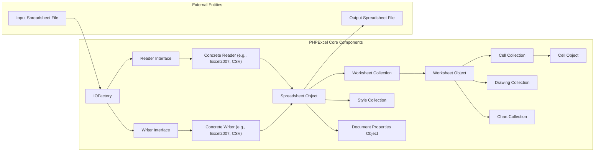
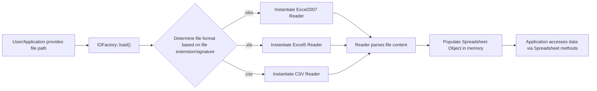
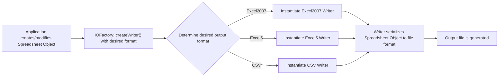

## Project Design Document: PHPExcel Library (Improved)

**1. Introduction**

This document provides an enhanced design overview of the PHPExcel library, a project hosted on GitHub at [https://github.com/phpoffice/phpexcel](https://github.com/phpoffice/phpexcel). The primary goal is to offer a clear and detailed understanding of the library's internal structure, components, and data handling processes. This detailed design serves as a critical foundation for subsequent threat modeling activities, enabling a comprehensive assessment of potential security vulnerabilities. This document is primarily intended for security architects, software developers, and anyone involved in evaluating the security posture of applications that integrate the PHPExcel library.

**2. Project Overview**

PHPExcel is a PHP library designed to facilitate the reading and writing of spreadsheet files in various formats. It offers an object-oriented programming interface for interacting with spreadsheet data, applying formatting, and managing metadata. While officially deprecated and superseded by PhpSpreadsheet, PHPExcel remains in use within numerous legacy applications. Therefore, a thorough understanding of its design is essential for securing these existing systems.

**3. System Architecture**

PHPExcel's architecture is built upon a collection of interconnected classes and components, each responsible for specific aspects of spreadsheet processing. The core architectural relationships can be visualized as follows:

**3.1. Detailed Component Descriptions:**

*   **`IOFactory`:** This central factory class is responsible for dynamically determining the appropriate Reader or Writer class to instantiate based on the file format being processed. It simplifies the process of loading and saving spreadsheets.
*   **`Reader Interface`:** Defines the common methods that all concrete Reader classes must implement (e.g., `load()`).
*   **`Writer Interface`:** Defines the common methods that all concrete Writer classes must implement (e.g., `save()`).
*   **`Concrete Reader (e.g., Excel2007, CSV)`:**  Specific implementations of the `Reader` interface, each tailored to parse a particular spreadsheet file format (e.g., `.xlsx`, `.xls`, `.csv`). These classes handle the complexities of interpreting the binary or text structure of each format.
*   **`Concrete Writer (e.g., Excel2007, CSV)`:** Specific implementations of the `Writer` interface, responsible for generating output files in a particular spreadsheet format. They handle the process of structuring data and formatting according to the specifications of each format.
*   **`Spreadsheet Object`:** The core data model representing the entire spreadsheet document in memory. It acts as a container for worksheets, styles, and document properties.
*   **`Worksheet Collection`:**  A collection of `Worksheet` objects within the `Spreadsheet`.
*   **`Style Collection`:**  A collection of `Style` objects that define the visual formatting of cells.
*   **`Document Properties Object`:**  Stores metadata associated with the spreadsheet, such as the author, title, and creation date.
*   **`Worksheet Object`:** Represents a single sheet within the spreadsheet.
*   **`Cell Collection`:** A collection of `Cell` objects within a `Worksheet`.
*   **`Drawing Collection`:** A collection of `Drawing` objects representing embedded images.
*   **`Chart Collection`:** A collection of `Chart` objects representing embedded charts.
*   **`Cell Object`:** Represents an individual cell within a worksheet, storing its value, data type, and a reference to its style.

**4. Data Flow Analysis**

The flow of data within PHPExcel can be categorized into two primary operations: reading data from a spreadsheet file and writing data to a spreadsheet file.

**4.1. Reading a Spreadsheet File:**

**Detailed Description:**

*   The process begins when a user or an application provides the file path to a spreadsheet file that needs to be read.
*   The `IOFactory::load()` static method is invoked. This method analyzes the provided file path to determine the file format, typically by examining the file extension or file signature (magic numbers).
*   Based on the identified file format, the `IOFactory` instantiates the appropriate concrete `Reader` class (e.g., `Excel2007`, `Excel5`, `CSV`).
*   The instantiated `Reader` class proceeds to parse the contents of the input file. This involves interpreting the file's structure according to its specific format specification.
*   The parsed data, including cell values, formatting information, and metadata, is then used to populate a `Spreadsheet` object in memory. This object represents the entire spreadsheet structure.
*   The application can then access and manipulate the data contained within the `Spreadsheet` object through its various methods and properties.

**4.2. Writing a Spreadsheet File:**

**Detailed Description:**

*   The application either creates a new `Spreadsheet` object programmatically or modifies an existing one by adding or changing data, formatting, or metadata.
*   The `IOFactory::createWriter()` static method is called, specifying the desired output file format (e.g., "Excel2007", "Excel5", "CSV").
*   Based on the specified format, the `IOFactory` instantiates the corresponding concrete `Writer` class.
*   The instantiated `Writer` class takes the data and structure from the `Spreadsheet` object and serializes it into the specified file format. This involves structuring the data according to the format's specifications (e.g., generating XML for XLSX, binary structures for XLS, comma-separated values for CSV).
*   The resulting output file, containing the spreadsheet data in the chosen format, is then generated.

**5. Security Considerations for Threat Modeling**

Based on the architecture and data flow, several potential security vulnerabilities and attack vectors should be considered during threat modeling:

*   **Malicious Spreadsheet File Processing:**
    *   **Exploitation of Reader Vulnerabilities:** Carefully crafted, malicious spreadsheet files could exploit vulnerabilities within the `Reader` classes. This could lead to various outcomes, including remote code execution (RCE) if the parser has exploitable flaws, denial-of-service (DoS) by providing files that consume excessive resources, or memory corruption. Different `Reader` implementations for different file formats have their own unique parsing logic and potential vulnerabilities.
    *   **XML External Entity (XXE) Injection:** File formats like XLSX are based on XML. If the XML parsing within the `Excel2007` reader (or other XML-based readers) is not properly configured to disable external entity processing, attackers could potentially perform XXE attacks, leading to information disclosure (reading local files) or server-side request forgery (SSRF).
    *   **Zip Slip Vulnerability:** When handling compressed file formats like XLSX, improper handling of file paths during extraction could allow attackers to write files to arbitrary locations on the server's file system, potentially overwriting critical system files or introducing malicious code.
*   **Data Injection Vulnerabilities:**
    *   If data read from spreadsheets is subsequently used in other parts of the application without proper sanitization or validation, it could lead to injection attacks. For example, if cell data is directly incorporated into SQL queries, it could result in SQL injection vulnerabilities. Similarly, if used in operating system commands, it could lead to command injection.
*   **Denial of Service (DoS) Attacks:**
    *   Providing extremely large or deeply nested spreadsheet files can consume excessive server resources (CPU, memory), leading to a denial of service.
    *   Maliciously crafted files with a large number of formatting rules or complex formulas (though PHPExcel's formula evaluation is limited) could also strain resources.
*   **Information Disclosure:**
    *   If the application processes spreadsheets containing sensitive information, vulnerabilities in file handling or temporary file management could lead to unintended disclosure of this data.
*   **Dependency Vulnerabilities:**
    *   While PHPExcel has relatively few direct dependencies, vulnerabilities in the underlying PHP extensions it relies on (e.g., `zip`, `xmlreader`, `xmlwriter`) could indirectly impact PHPExcel's security.
*   **Limited Formula Evaluation Risks:** Although PHPExcel's formula evaluation capabilities are less extensive than full spreadsheet applications, there might still be potential risks if user-controlled data influences formula processing in unexpected ways.

**6. Dependencies**

PHPExcel relies on several core PHP extensions for its functionality:

*   **`zip` extension:** Required for reading and writing ZIP archives, which is the foundation of the XLSX format.
*   **`xmlreader` extension:** Used for parsing XML data, essential for handling XLSX files.
*   **`xmlwriter` extension:** Used for writing XML data when generating XLSX files.
*   Potentially other standard PHP extensions depending on specific features used.

**7. Deployment Considerations**

PHPExcel is typically deployed as a library integrated within a PHP web application or script. The security of PHPExcel is intrinsically linked to the security practices of the encompassing application and the environment in which it operates. Key deployment considerations for security include:

*   **Strict Input Validation:** Applications using PHPExcel must implement robust validation of uploaded spreadsheet files, including checks on file size, format, and potentially even the complexity of the file structure.
*   **Secure File Handling:** Implement secure practices for handling uploaded files, such as storing them outside the webroot and using unique, unpredictable filenames.
*   **Resource Limits:** Configure appropriate resource limits (e.g., memory limits, execution time limits) within the PHP environment to mitigate potential DoS attacks caused by processing large or complex files.
*   **Regular Updates and Migration:** Given that PHPExcel is deprecated, the strongest security recommendation is to migrate to its actively maintained successor, PhpSpreadsheet. If continued use of PHPExcel is unavoidable, ensure the underlying PHP environment and its extensions are kept up-to-date with the latest security patches.
*   **Sandboxing (Consideration):** In highly sensitive environments, consider running PHPExcel processing within a sandboxed environment to limit the potential impact of any vulnerabilities.

**8. Future Considerations for Threat Modeling**

*   **Focus on PhpSpreadsheet:**  For ongoing projects and new development, threat modeling efforts should primarily focus on PhpSpreadsheet, as it is the actively maintained and recommended library. Understanding the differences in architecture and security features between PHPExcel and PhpSpreadsheet is crucial.
*   **Custom Extensions/Modifications:** If any custom Reader or Writer classes or modifications to the core PHPExcel library have been implemented, these should be subjected to rigorous security review and testing.

This improved design document provides a more detailed and nuanced understanding of the PHPExcel library, specifically tailored to facilitate effective threat modeling. By understanding the components, data flow, and potential vulnerabilities outlined here, security professionals and developers can better assess and mitigate the risks associated with using PHPExcel in their applications.