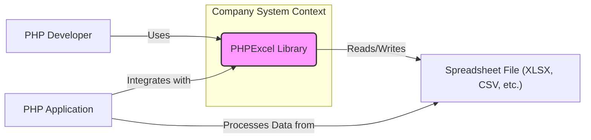
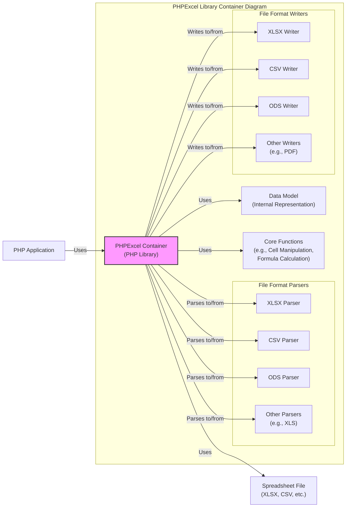
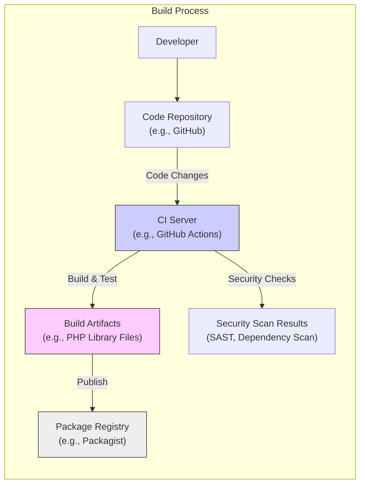

# BUSINESS POSTURE

- Business Priorities and Goals:
  - Enable PHP developers to efficiently process spreadsheet files (e.g., XLSX, CSV, ODS).
  - Provide a reliable and feature-rich library for reading, writing, and manipulating spreadsheet data.
  - Ensure compatibility with various spreadsheet file formats and versions.
  - Facilitate data exchange between PHP applications and spreadsheet software.
  - Support data analysis, reporting, and data transformation tasks within PHP environments.
- Business Risks:
  - Security vulnerabilities in PHPExcel could lead to data breaches, data corruption, or denial of service in applications using the library.
  - Incompatibility with emerging or less common spreadsheet formats could limit the library's usefulness.
  - Performance bottlenecks when processing large or complex spreadsheet files could negatively impact application performance.
  - Bugs in data processing logic could result in incorrect data transformations or calculations, leading to business errors.
  - Lack of timely security updates and maintenance could expose users to known vulnerabilities.

# SECURITY POSTURE

- Existing Security Controls:
  - security control: Code review by project maintainers and community contributors (location: GitHub pull requests and issue discussions).
  - security control: Unit and integration tests to ensure code correctness and prevent regressions (location: test suite in the GitHub repository).
  - security control: Public vulnerability reporting through GitHub issues and security advisories (location: GitHub repository issues and security tab).
- Accepted Risks:
  - accepted risk: Potential for undiscovered security vulnerabilities in the codebase due to complexity and broad functionality.
  - accepted risk: Reliance on the open-source community for timely vulnerability reporting and security patches.
  - accepted risk: Risk of vulnerabilities in third-party dependencies used by PHPExcel.
- Recommended Security Controls:
  - security control: Implement Static Application Security Testing (SAST) tools in the CI/CD pipeline to automatically detect potential code vulnerabilities.
  - security control: Integrate Dependency Vulnerability Scanning to identify and manage vulnerabilities in third-party libraries used by PHPExcel.
  - security control: Conduct regular security audits and penetration testing to proactively identify and address security weaknesses.
  - security control: Implement Fuzz testing for spreadsheet file parsing logic to discover vulnerabilities related to malformed or malicious input files.
  - security control: Establish a clear security incident response plan to handle reported vulnerabilities and release security patches promptly.
- Security Requirements:
  - Authentication: Not directly applicable to a library. Applications using PHPExcel are responsible for their own authentication mechanisms.
  - Authorization: Not directly applicable to a library. Applications using PHPExcel are responsible for their own authorization mechanisms to control access to spreadsheet data.
  - Input Validation:
    - security requirement: Implement robust input validation and sanitization for all spreadsheet file formats parsed by PHPExcel to prevent vulnerabilities such as XML External Entity (XXE) injection, formula injection, and denial-of-service attacks.
    - security requirement: Validate file structure and data types according to the specifications of each supported spreadsheet format.
    - security requirement: Handle potentially malicious or malformed spreadsheet files gracefully without causing crashes or security breaches.
  - Cryptography:
    - security requirement: Ensure secure handling of encrypted spreadsheet files, if supported by PHPExcel.
    - security requirement: If PHPExcel implements any cryptographic operations internally, use well-vetted and secure cryptographic libraries and algorithms.

# DESIGN

## C4 CONTEXT



- Context Diagram Elements:
  - - Name: PHPExcel Library
    - Type: Software System
    - Description: A PHP library for reading and writing spreadsheet files in various formats. It provides functionalities to create, modify, and extract data from spreadsheet documents.
    - Responsibilities:
      - Parsing and reading data from spreadsheet files.
      - Creating and writing data to spreadsheet files.
      - Providing an API for PHP developers to manipulate spreadsheet data programmatically.
      - Supporting various spreadsheet formats (e.g., XLSX, CSV, ODS).
    - Security controls:
      - security control: Input validation during file parsing.
      - security control: Secure coding practices to prevent vulnerabilities.
  - - Name: PHP Developer
    - Type: Person
    - Description: Software developers who use the PHPExcel library to integrate spreadsheet functionality into their PHP applications.
    - Responsibilities:
      - Integrating PHPExcel into PHP applications.
      - Using the PHPExcel API correctly and securely.
      - Handling spreadsheet data within their applications.
    - Security controls:
      - security control: Secure development practices when using PHPExcel.
      - security control: Input validation in their applications when processing data from PHPExcel.
  - - Name: Spreadsheet File (XLSX, CSV, etc.)
    - Type: Data Store / Document
    - Description: Spreadsheet files in various formats (e.g., XLSX, CSV, ODS) that are processed by the PHPExcel library. These files can contain data to be read or can be created/modified by PHPExcel.
    - Responsibilities:
      - Storing spreadsheet data.
      - Providing data to be processed by PHPExcel.
      - Receiving data written by PHPExcel.
    - Security controls:
      - security control: Access control to spreadsheet files at the file system level.
      - security control: Encryption of spreadsheet files at rest or in transit (if applicable in the application context).
  - - Name: PHP Application
    - Type: Software System
    - Description: Applications built using PHP that integrate the PHPExcel library to handle spreadsheet data. These applications can range from simple scripts to complex web applications.
    - Responsibilities:
      - Utilizing PHPExcel to read, write, and manipulate spreadsheet data.
      - Implementing business logic that uses spreadsheet data.
      - Providing user interfaces or APIs that interact with spreadsheet data.
    - Security controls:
      - security control: Authentication and authorization to control access to the application and its data.
      - security control: Input validation and output encoding within the application.
      - security control: Secure deployment and configuration of the PHP application.

## C4 CONTAINER



- Container Diagram Elements:
  - - Name: PHPExcel Container
    - Type: Library
    - Description: The main PHPExcel library container, encapsulating all the functionalities for spreadsheet processing. It provides the API for PHP applications to interact with spreadsheet data.
    - Responsibilities:
      - Exposing the PHP API for spreadsheet manipulation.
      - Orchestrating file parsing and writing operations.
      - Managing the internal data model.
      - Providing core functionalities for cell manipulation, formula calculation, etc.
    - Security controls:
      - security control: API design with security in mind (e.g., avoiding insecure defaults).
      - security control: Centralized input validation and sanitization within the container.
  - - Name: File Format Parsers (XLSX Parser, CSV Parser, ODS Parser, Other Parsers)
    - Type: Component
    - Description: Components responsible for parsing different spreadsheet file formats and converting them into the internal data model.
    - Responsibilities:
      - Parsing specific spreadsheet file formats (e.g., XLSX, CSV, ODS).
      - Validating the structure and content of input files.
      - Converting file format specific data into the internal data model.
    - Security controls:
      - security control: Format-specific input validation to prevent format-related vulnerabilities.
      - security control: Secure parsing logic to handle malformed or malicious files.
  - - Name: File Format Writers (XLSX Writer, CSV Writer, ODS Writer, Other Writers)
    - Type: Component
    - Description: Components responsible for writing the internal data model into different spreadsheet file formats.
    - Responsibilities:
      - Converting the internal data model into specific spreadsheet file formats.
      - Generating valid and well-formed output files.
    - Security controls:
      - security control: Output encoding and sanitization to prevent injection vulnerabilities in generated files.
  - - Name: Data Model
    - Type: Data Structure
    - Description: The internal representation of spreadsheet data within PHPExcel. It provides a structured way to access and manipulate spreadsheet content.
    - Responsibilities:
      - Storing spreadsheet data in a structured format.
      - Providing an interface for accessing and modifying spreadsheet data.
    - Security controls:
      - security control: Data integrity checks to ensure data consistency.
  - - Name: Core Functions (Cell Manipulation, Formula Calculation)
    - Type: Component
    - Description: Components providing core functionalities for manipulating spreadsheet data, such as cell value manipulation, formula calculation, and styling.
    - Responsibilities:
      - Implementing core spreadsheet functionalities.
      - Performing calculations and data transformations.
    - Security controls:
      - security control: Secure implementation of formula calculation to prevent formula injection vulnerabilities.
      - security control: Input validation for cell values and formulas.

## DEPLOYMENT

- Deployment Options:
  - Option 1: Deployed as a dependency within a PHP web application running on a web server (e.g., Apache, Nginx) with PHP-FPM.
  - Option 2: Deployed as part of a PHP command-line script executed in a server environment or locally.
  - Option 3: Deployed within a containerized PHP application (e.g., Docker) running in a container orchestration platform (e.g., Kubernetes).

- Detailed Deployment (Option 1: PHP Web Application on Web Server):

```mermaid
flowchart LR
    subgraph "Deployment Environment"
    web_server["Web Server\n(e.g., Apache, Nginx)"]
    php_fpm["PHP-FPM\n(PHP Processor)"]
    application_code["PHP Application Code\n(includes PHPExcel)"]
    file_system["File System\n(Spreadsheet Files)"]
    end_user["End User\n(Web Browser)"]

    end_user -- "HTTP Request" --> web_server
    web_server -- "PHP Requests" --> php_fpm
    php_fpm -- "Executes" --> application_code
    application_code -- "Uses PHPExcel" --> php_fpm
    application_code -- "Reads/Writes Files" --> file_system
    web_server -- "HTTP Response" --> end_user

    style web_server fill:#ccf,stroke:#333,stroke-width:1px
    style php_fpm fill:#ccf,stroke:#333,stroke-width:1px
    style application_code fill:#fcf,stroke:#333,stroke-width:1px
    style file_system fill:#eee,stroke:#333,stroke-width:1px
```

- Deployment Diagram Elements:
  - - Name: Web Server (e.g., Apache, Nginx)
    - Type: Infrastructure - Web Server
    - Description: The web server handles HTTP requests from end users and serves the PHP application. It forwards PHP requests to PHP-FPM for processing.
    - Responsibilities:
      - Receiving HTTP requests from end users.
      - Serving static content.
      - Forwarding PHP requests to PHP-FPM.
      - Handling SSL/TLS termination (HTTPS).
    - Security controls:
      - security control: Web server hardening (e.g., disabling unnecessary modules, setting appropriate permissions).
      - security control: SSL/TLS configuration for secure communication (HTTPS).
      - security control: Web Application Firewall (WAF) to protect against web attacks.
  - - Name: PHP-FPM (PHP Processor)
    - Type: Infrastructure - Application Server
    - Description: PHP-FPM (FastCGI Process Manager) is a PHP processor that executes the PHP application code, including PHPExcel.
    - Responsibilities:
      - Executing PHP code.
      - Managing PHP processes.
      - Interacting with the file system.
    - Security controls:
      - security control: PHP-FPM configuration hardening (e.g., process isolation, resource limits).
      - security control: Keeping PHP version up-to-date with security patches.
  - - Name: PHP Application Code (includes PHPExcel)
    - Type: Software - Application
    - Description: The PHP application code that utilizes the PHPExcel library to process spreadsheet files. This code is executed by PHP-FPM.
    - Responsibilities:
      - Implementing application logic.
      - Using PHPExcel API to handle spreadsheet data.
      - Interacting with the file system to read and write spreadsheet files.
    - Security controls:
      - security control: Secure coding practices in the application code.
      - security control: Input validation and output encoding in the application.
      - security control: Access control within the application.
  - - Name: File System (Spreadsheet Files)
    - Type: Infrastructure - Data Store
    - Description: The file system where spreadsheet files are stored. The PHP application reads and writes spreadsheet files from/to this file system.
    - Responsibilities:
      - Storing spreadsheet files.
      - Providing access to spreadsheet files for the PHP application.
    - Security controls:
      - security control: File system permissions to restrict access to spreadsheet files.
      - security control: Encryption of spreadsheet files at rest (if required).

## BUILD



- Build Process Elements:
  - - Name: Developer
    - Type: Person
    - Description: Software developers who write and maintain the PHPExcel library code.
    - Responsibilities:
      - Writing and updating code.
      - Committing code changes to the code repository.
      - Reviewing code changes.
    - Security controls:
      - security control: Secure coding training for developers.
      - security control: Code review process to identify potential vulnerabilities.
  - - Name: Code Repository (e.g., GitHub)
    - Type: Tool - Version Control System
    - Description: A version control system (e.g., Git on GitHub) that stores the source code of the PHPExcel library and tracks changes.
    - Responsibilities:
      - Storing source code.
      - Managing code versions and branches.
      - Providing access control to the codebase.
    - Security controls:
      - security control: Access control to the code repository (authentication and authorization).
      - security control: Audit logging of code changes.
  - - Name: CI Server (e.g., GitHub Actions)
    - Type: Tool - CI/CD System
    - Description: A Continuous Integration (CI) server that automates the build, test, and security check processes whenever code changes are pushed to the repository.
    - Responsibilities:
      - Automating the build process.
      - Running unit and integration tests.
      - Performing security scans (SAST, dependency scanning).
      - Generating build artifacts.
      - Publishing build artifacts to package registry.
    - Security controls:
      - security control: Secure configuration of the CI/CD pipeline.
      - security control: Integration of SAST and dependency scanning tools.
      - security control: Access control to the CI/CD system.
  - - Name: Build Artifacts (e.g., PHP Library Files)
    - Type: Software - Artifacts
    - Description: The output of the build process, which includes the compiled or packaged PHPExcel library files ready for distribution and use.
    - Responsibilities:
      - Containing the built PHPExcel library.
      - Being published to a package registry.
    - Security controls:
      - security control: Integrity checks (e.g., checksums) for build artifacts.
      - security control: Secure storage of build artifacts before publishing.
  - - Name: Package Registry (e.g., Packagist)
    - Type: Tool - Package Manager Registry
    - Description: A package registry (e.g., Packagist for PHP Composer packages) where the PHPExcel library is published for developers to download and use in their projects.
    - Responsibilities:
      - Hosting and distributing PHP packages.
      - Providing a package management interface (e.g., Composer).
    - Security controls:
      - security control: Package signing to ensure package integrity and authenticity.
      - security control: Security scanning of published packages (by the registry provider).

# RISK ASSESSMENT

- Critical Business Processes:
  - Data import and export using spreadsheet files in applications that rely on PHPExcel.
  - Data processing, reporting, and analysis workflows that utilize spreadsheet data through PHPExcel.
  - Application functionality that depends on the correct and secure handling of spreadsheet files.
- Data to Protect and Sensitivity:
  - Spreadsheet data itself is the primary data to protect.
  - Sensitivity of data depends on the context of applications using PHPExcel. Spreadsheet files can contain:
    - Business sensitive data (financial records, sales data, strategic plans).
    - Personally Identifiable Information (PII) (customer lists, employee data).
    - Confidential research data or intellectual property.
  - The sensitivity level can range from low (publicly available data) to high (highly confidential and regulated data). The impact of a data breach or data corruption would vary accordingly.

# QUESTIONS & ASSUMPTIONS

- Questions:
  - What are the specific use cases and applications for PHPExcel that are of most concern from a security perspective? (e.g., processing user-uploaded spreadsheets, automated data import from external sources).
  - What is the expected sensitivity level of the data being processed by PHPExcel in typical use cases?
  - Are there any specific regulatory compliance requirements that apply to applications using PHPExcel (e.g., GDPR, HIPAA, PCI DSS)?
  - What is the current process for handling security vulnerability reports for PHPExcel?
  - Is there a dedicated security team or person responsible for overseeing the security of PHPExcel?
- Assumptions:
  - PHPExcel is used in applications that handle potentially sensitive data from spreadsheet files.
  - The primary security concern is related to vulnerabilities in parsing untrusted spreadsheet files, which could lead to data breaches, denial of service, or other security impacts.
  - Security is a significant concern for users of PHPExcel, especially in enterprise environments.
  - The project aims to maintain a reasonable level of security for an open-source library, relying on community contributions and best practices.