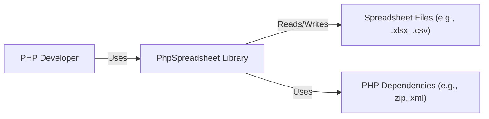
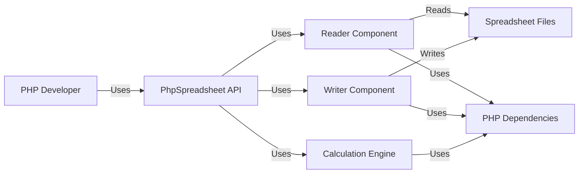
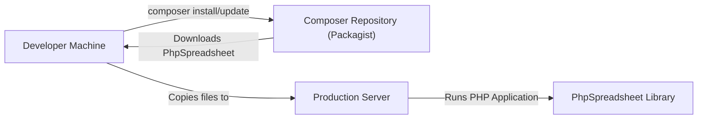
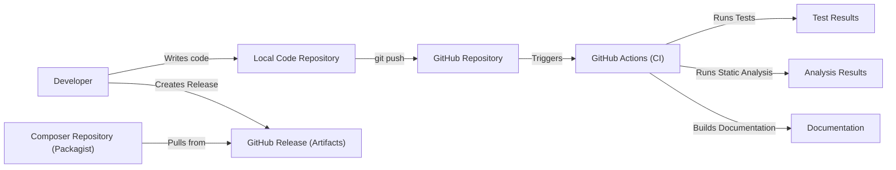

# BUSINESS POSTURE

Business Priorities and Goals:

*   Provide a set of classes that allow developers to read and write various spreadsheet file formats (Excel, CSV, etc.).
*   Maintain compatibility with a wide range of PHP versions.
*   Ensure the library is easy to use and integrate into existing PHP projects.
*   Maintain a high level of code quality and stability.
*   Provide a solution that is actively maintained and supported.

Business Risks:

*   Data breaches: Sensitive data stored in spreadsheets could be exposed if the library has vulnerabilities.
*   Data corruption: Errors in the library could lead to data loss or corruption in spreadsheets.
*   Compatibility issues: Changes in PHP or spreadsheet formats could break the library's functionality.
*   Performance bottlenecks: Inefficient code could lead to slow processing of large spreadsheets.
*   Reputational damage: Security vulnerabilities or bugs could damage the reputation of the library and its maintainers.
*   Supply chain attacks: Compromised dependencies could introduce vulnerabilities into the library.

# SECURITY POSTURE

Existing Security Controls:

*   security control: Input validation: The library likely performs some input validation to prevent processing malicious files. (Needs to be verified in the code and documentation).
*   security control: Code reviews: The project uses pull requests, suggesting code reviews are part of the development process. (Visible on GitHub).
*   security control: Static analysis: The project may use static analysis tools to identify potential security vulnerabilities. (Needs to be verified in the project configuration).
*   security control: Dependency management: The project uses Composer to manage dependencies, which helps ensure that known vulnerable versions are not used. (Visible in `composer.json`).
*   security control: Testing: The project has a test suite, which helps to identify bugs and regressions. (Visible in the `tests` directory).

Accepted Risks:

*   accepted risk: Compatibility with older PHP versions may limit the use of newer security features.
*   accepted risk: The library handles complex file formats, increasing the attack surface.
*   accepted risk: The library relies on external dependencies, which may introduce vulnerabilities.

Recommended Security Controls:

*   security control: Implement a comprehensive security policy that covers all aspects of the development lifecycle.
*   security control: Regularly perform security audits and penetration testing.
*   security control: Use a SAST (Static Application Security Testing) tool to automatically scan the codebase for vulnerabilities. Integrate this into the CI/CD pipeline.
*   security control: Use a DAST (Dynamic Application Security Testing) tool to test the running application for vulnerabilities.
*   security control: Implement a vulnerability disclosure program to encourage responsible reporting of security issues.
*   security control: Use Software Composition Analysis (SCA) tools to identify and manage vulnerabilities in third-party dependencies.
*   security control: Implement Content Security Policy (CSP) if any web-based interaction is present.
*   security control: Implement robust logging and monitoring to detect and respond to security incidents.

Security Requirements:

*   Authentication: Not directly applicable, as the library is used within other applications. However, if the library interacts with external services, it should use secure authentication mechanisms.
*   Authorization: Not directly applicable, as the library is used within other applications. However, if the library interacts with external services, it should use appropriate authorization mechanisms.
*   Input Validation:
    *   The library MUST validate all input data, including file contents, file names, and configuration parameters.
    *   The library MUST reject any input that does not conform to the expected format.
    *   The library MUST sanitize input to prevent injection attacks.
*   Cryptography:
    *   If the library handles sensitive data, it MUST use strong encryption algorithms to protect the data at rest and in transit.
    *   The library MUST use a secure random number generator when generating cryptographic keys or nonces.
    *   The library MUST securely store any cryptographic keys.
*   Output Encoding:
    *   The library MUST encode output data appropriately to prevent cross-site scripting (XSS) vulnerabilities, if applicable.

# DESIGN

## C4 CONTEXT

Context Diagram Element List:

*   Element:
    *   Name: PHP Developer
    *   Type: Person
    *   Description: A software developer using the PhpSpreadsheet library in their PHP application.
    *   Responsibilities: Integrates and uses the PhpSpreadsheet library to read and write spreadsheet data.
    *   Security controls: Implements secure coding practices in their application.

*   Element:
    *   Name: PhpSpreadsheet Library
    *   Type: Software System
    *   Description: A PHP library for reading and writing spreadsheet files.
    *   Responsibilities: Provides an API for interacting with spreadsheet data, handles file format parsing and generation, manages dependencies.
    *   Security controls: Input validation, dependency management, code reviews, testing.

*   Element:
    *   Name: Spreadsheet Files
    *   Type: Data Store
    *   Description: Files in various spreadsheet formats (e.g., .xlsx, .csv).
    *   Responsibilities: Stores spreadsheet data.
    *   Security controls: File system permissions, encryption (if applicable).

*   Element:
    *   Name: PHP Dependencies
    *   Type: Software System
    *   Description: External PHP libraries used by PhpSpreadsheet.
    *   Responsibilities: Provides functionality required by PhpSpreadsheet (e.g., ZIP archive handling, XML parsing).
    *   Security controls: Dependency management, regular updates.

## C4 CONTAINER

Container Diagram Element List:

*   Element:
    *   Name: PHP Developer
    *   Type: Person
    *   Description: A software developer using the PhpSpreadsheet library.
    *   Responsibilities: Integrates and uses the PhpSpreadsheet library to read and write spreadsheet data.
    *   Security controls: Implements secure coding practices in their application.

*   Element:
    *   Name: PhpSpreadsheet API
    *   Type: API
    *   Description: The public interface of the PhpSpreadsheet library.
    *   Responsibilities: Provides methods for creating, reading, updating, and writing spreadsheets.
    *   Security controls: Input validation, access control (if applicable).

*   Element:
    *   Name: Reader Component
    *   Type: Component
    *   Description: Responsible for reading spreadsheet files.
    *   Responsibilities: Parses spreadsheet files, extracts data, handles different file formats.
    *   Security controls: Input validation, file format validation.

*   Element:
    *   Name: Writer Component
    *   Type: Component
    *   Description: Responsible for writing spreadsheet files.
    *   Responsibilities: Generates spreadsheet files from data, handles different file formats.
    *   Security controls: Output encoding, data validation.

*   Element:
    *   Name: Calculation Engine
    *   Type: Component
    *   Description: Responsible for performing calculations on spreadsheet data.
    *   Responsibilities: Evaluates formulas, handles cell references.
    *   Security controls: Input validation, protection against formula injection.

*   Element:
    *   Name: Spreadsheet Files
    *   Type: Data Store
    *   Description: Files in various spreadsheet formats (e.g., .xlsx, .csv).
    *   Responsibilities: Stores spreadsheet data.
    *   Security controls: File system permissions, encryption (if applicable).

*   Element:
    *   Name: PHP Dependencies
    *   Type: Software System
    *   Description: External PHP libraries used by PhpSpreadsheet components.
    *   Responsibilities: Provides functionality required by PhpSpreadsheet (e.g., ZIP archive handling, XML parsing).
    *   Security controls: Dependency management, regular updates.

## DEPLOYMENT

Possible Deployment Solutions:

1.  Composer Dependency: The library is typically included as a dependency in other PHP projects using Composer.
2.  Standalone Installation: The library can be downloaded and used directly, although this is less common.
3.  Docker Container: The library could be used within a Docker container as part of a larger application.

Chosen Deployment Solution (Composer Dependency):

Deployment Diagram Element List:

*   Element:
    *   Name: Developer Machine
    *   Type: Infrastructure Node
    *   Description: The developer's local machine.
    *   Responsibilities: Runs Composer to manage dependencies, develops the application.
    *   Security controls: Local security measures (firewall, antivirus, etc.).

*   Element:
    *   Name: Composer Repository (Packagist)
    *   Type: Infrastructure Node
    *   Description: The central repository for PHP packages.
    *   Responsibilities: Hosts the PhpSpreadsheet library and its dependencies.
    *   Security controls: Repository security measures (access control, vulnerability scanning).

*   Element:
    *   Name: Production Server
    *   Type: Infrastructure Node
    *   Description: The server where the PHP application is deployed.
    *   Responsibilities: Runs the PHP application, including the PhpSpreadsheet library.
    *   Security controls: Server security measures (firewall, intrusion detection, etc.).

*   Element:
    *   Name: PhpSpreadsheet Library
    *   Type: Software
    *   Description: The deployed instance of the PhpSpreadsheet library.
    *   Responsibilities: Provides spreadsheet reading and writing functionality.
    *   Security controls: Input validation, dependency management, regular updates.

## BUILD

The PhpSpreadsheet project uses a combination of manual and automated build processes.

Build Process Description:

1.  Developers write code and commit it to a local Git repository.
2.  Changes are pushed to the central GitHub repository.
3.  GitHub Actions (CI) is triggered on push and pull requests.
4.  GitHub Actions runs unit tests and static analysis tools (e.g., PHPStan, Psalm).
5.  Documentation is built automatically.
6.  Releases are created manually by developers on GitHub. This typically involves tagging a specific commit.
7.  Composer (Packagist) pulls the released code from GitHub, making it available for installation via `composer require`.

Security Controls in Build Process:

*   security control: Code reviews: Pull requests on GitHub enforce code reviews before merging changes.
*   security control: Automated testing: GitHub Actions runs unit tests to catch bugs and regressions.
*   security control: Static analysis: GitHub Actions runs static analysis tools to identify potential security vulnerabilities.
*   security control: Dependency management: Composer manages dependencies and helps ensure that known vulnerable versions are not used.
*   security control: Version control: Git tracks all code changes, allowing for easy auditing and rollback.

# RISK ASSESSMENT

Critical Business Processes:

*   Reading and writing spreadsheet data accurately and reliably.
*   Maintaining compatibility with various spreadsheet formats.
*   Providing a stable and performant library for developers.

Data Sensitivity:

*   Spreadsheet data can range from non-sensitive to highly sensitive, depending on the user's application.
*   The library itself does not store data persistently, but it handles data in memory during processing.
*   Sensitivity levels:
    *   Public: Non-sensitive data, such as publicly available spreadsheets.
    *   Internal: Data that is not intended for public disclosure, but is not highly sensitive.
    *   Confidential: Sensitive data that could cause harm if disclosed, such as financial data or personal information.
    *   Restricted: Highly sensitive data that requires strict access controls, such as trade secrets or government classified information.

# QUESTIONS & ASSUMPTIONS

Questions:

*   What specific static analysis tools are used in the project?
*   Are there any specific security guidelines or coding standards followed by the developers?
*   Are there any plans to implement a vulnerability disclosure program?
*   Are there any known security vulnerabilities in the library or its dependencies?
*   What is the process for handling security updates and patches?
*   Does the library interact with any external services or APIs?
*   Are there any specific security requirements from users of the library?
*   Is there a mechanism for reporting security vulnerabilities?

Assumptions:

*   BUSINESS POSTURE: The project maintainers prioritize security and are willing to invest in improving it.
*   BUSINESS POSTURE: The project has a sufficient number of active contributors to address security issues promptly.
*   SECURITY POSTURE: The existing security controls are implemented correctly and effectively.
*   SECURITY POSTURE: The project's dependencies are regularly updated to address security vulnerabilities.
*   DESIGN: The library is primarily used as a dependency in other PHP applications, rather than as a standalone application.
*   DESIGN: The library does not store data persistently.
*   DESIGN: The library does not interact with external services or APIs without explicit user configuration.
*   DESIGN: Developers using the library are responsible for implementing appropriate security measures in their own applications.