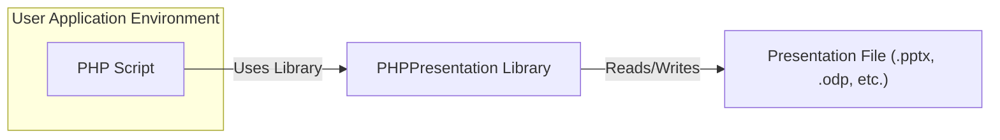
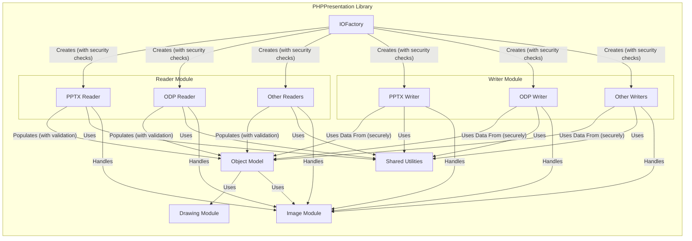
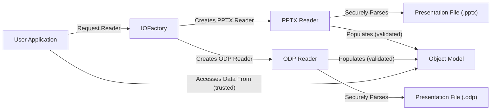
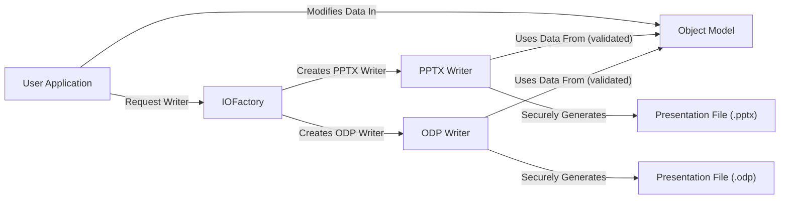

# Project Design Document: PHPPresentation Library

**Version:** 1.1
**Date:** October 26, 2023
**Author:** AI Software Architect

## 1. Introduction

This document provides a detailed design overview of the PHPPresentation library, an open-source PHP library enabling developers to read, write, and manipulate various presentation file formats, including PPTX, ODP, and others. This document is specifically crafted to facilitate threat modeling by providing a comprehensive understanding of the library's architecture, components, and data flow, highlighting potential areas of security concern.

## 2. Goals and Objectives

The primary goal of this document is to provide a clear, detailed, and security-focused architectural description of the PHPPresentation library. The specific objectives are:

*   To precisely outline the major components and their specific responsibilities, with an emphasis on security-relevant functions.
*   To thoroughly describe the data flow within the library during both read and write operations, including data transformations and validation points.
*   To clearly identify key interfaces and interactions between components, focusing on data exchange and potential vulnerabilities.
*   To explicitly highlight potential areas of security concern based on the design, providing concrete examples where applicable.
*   To serve as a definitive reference point for future development, security audits, and threat modeling exercises.

## 3. Scope

This design document covers the core functionality of the PHPPresentation library, with a strong focus on aspects relevant to security. The following aspects are included:

*   Mechanisms for reading and parsing various presentation file formats (e.g., PPTX, ODP), including the handling of potentially malicious content.
*   The internal representation of presentation data (object model) and how it's populated and accessed.
*   Processes for generating and writing presentation files in different formats, including the encoding and sanitization of output data.
*   Handling of embedded resources (images, media, fonts), including their extraction, validation, and potential vulnerabilities.
*   Interaction with external libraries (if any), specifically focusing on the security implications of these dependencies.

This document explicitly excludes:

*   The user interface or applications that consume the PHPPresentation library.
*   Fine-grained implementation details of individual methods or functions, unless directly relevant to security.
*   Performance optimization strategies, except where they directly conflict with security best practices.
*   Deployment and installation procedures of the library itself.

## 4. High-Level Architecture

The PHPPresentation library employs a modular design, clearly separating concerns for reading, writing, and manipulating presentation data. The central element is an object model that represents the structure and content of a presentation in memory.

**Key Components:**

*   **PHP Script (User Application):** The external PHP code that utilizes the PHPPresentation library to perform operations on presentation files. This is the entry point and potential source of insecure usage.
*   **PHPPresentation Library:** The core library providing functionalities for secure reading, writing, and manipulation of presentation data. Its internal design is critical for preventing vulnerabilities.
*   **Presentation File:** The external input or output file in a supported presentation format. These files are untrusted sources of data and potential attack vectors.

## 5. Detailed Design

The PHPPresentation library is composed of several key modules, each with specific responsibilities and security considerations:

*   **Reader Module:** Responsible for securely parsing and interpreting various presentation file formats.
    *   Specific readers exist for each supported format (e.g., `"PPTX Reader"`, `"ODP Reader"`).
    *   Handles the secure extraction of data from the file structure, including careful parsing of XML and other embedded formats.
    *   Implements validation checks to prevent processing of malformed or malicious file structures.
    *   Populates the internal object model with validated and sanitized data.
*   **Writer Module:** Responsible for securely generating and writing presentation files in different formats.
    *   Specific writers exist for each supported format (e.g., `"PPTX Writer"`, `"ODP Writer"`).
    *   Takes validated data from the internal object model and securely serializes it into the target file format.
    *   Implements encoding and escaping mechanisms to prevent injection vulnerabilities in the generated files.
    *   Handles the secure creation of the file structure and packaging of resources.
*   **Object Model:** Represents the internal structure of a presentation in a secure and well-defined object-oriented manner.
    *   Contains classes for various presentation elements (e.g., `"Presentation"`, `"Slide"`, `"Shape"`, `"TextRun"`, `"Image"`).
    *   Provides methods for accessing and manipulating presentation data, with built-in safeguards against invalid operations.
    *   Acts as a trusted intermediary between the Reader and Writer modules, ensuring data integrity.
*   **IOFactory:** A factory class responsible for securely instantiating the appropriate Reader or Writer based on the file extension or provided type.
    *   Provides a controlled entry point for interacting with the reading and writing functionalities.
    *   May implement checks to prevent the instantiation of insecure or unsupported handlers.
*   **Shared Utilities:** Contains common and security-critical functionalities used across different modules.
    *   Includes classes for secure handling of XML (preventing XXE), ZIP archives (preventing path traversal and zip bombs), and other common tasks.
    *   May include helper functions for data validation, sanitization, and secure conversion.
*   **Drawing Module:** Handles the secure representation and manipulation of drawing objects within the presentation.
    *   Includes classes for shapes, lines, fills, and other graphical elements, with validation to prevent malformed or malicious drawing instructions.
*   **Image Module:** Manages the secure handling of embedded images within the presentation.
    *   Responsible for securely reading, writing, and potentially manipulating image data, with checks for image header integrity and known vulnerabilities in image formats.
    *   May interact with external image processing libraries, requiring careful consideration of their security posture.

## 6. Data Flow

The data flow within the PHPPresentation library is critical for understanding potential attack vectors.

### 6.1. Reading a Presentation (Untrusted Data Ingress)

1. The user application calls a method in the `"IOFactory"` to create a Reader for the specific file format.
2. The `"IOFactory"` instantiates the appropriate Reader (e.g., `"PPTX Reader"`) with security configurations.
3. The Reader receives the presentation file (an untrusted data source) as input.
4. The Reader parses the file structure and extracts data, implementing strict validation and sanitization at each step.
    *   For PPTX, this involves securely unzipping the file and parsing XML files with XXE protection.
    *   For ODP, this involves securely unzipping and parsing XML manifests and content, with checks for malicious content.
5. The Reader populates the internal `"Object Model"` with the extracted, validated, and sanitized data, creating instances of classes like `"Presentation"`, `"Slide"`, `"Shape"`, etc.
6. The user application can then access and manipulate the presentation data through the `"Object Model"`, which should represent a safe and consistent view of the data.

### 6.2. Writing a Presentation (Trusted Data Egress)

1. The user application creates or modifies the presentation data using the `"Object Model"`. This data should be treated as potentially influenced by untrusted input.
2. The user application calls a method in the `"IOFactory"` to create a Writer for the desired output format.
3. The `"IOFactory"` instantiates the appropriate Writer (e.g., `"PPTX Writer"`).
4. The Writer receives the `"Object Model"` as input.
5. The Writer traverses the `"Object Model"` and securely serializes the data into the target file format, implementing encoding and escaping to prevent injection vulnerabilities.
    *   For PPTX, this involves generating XML files with proper encoding and packaging them into a ZIP archive, preventing path traversal.
    *   For ODP, this involves generating XML content with proper encoding and packaging it according to the ODF specification.
6. The Writer outputs the generated presentation file.

## 7. Security Considerations

This section details potential security vulnerabilities based on the library's design:

*   **File Parsing Vulnerabilities (Reader Module):**
    *   **XML External Entity (XXE) Injection:** Improperly configured XML parsers in the Reader modules could allow attackers to include external entities, potentially leading to information disclosure or denial of service.
    *   **Buffer Overflows/Heap Corruption:** Vulnerabilities in parsing logic could be exploited by crafted files to overwrite memory, potentially leading to remote code execution.
    *   **Denial of Service (DoS):** Maliciously crafted files with deeply nested structures or excessively large elements could consume excessive resources during parsing, leading to DoS.
    *   **Path Traversal (within archives):** If the Reader doesn't properly sanitize filenames within ZIP archives, attackers could potentially write files to arbitrary locations during extraction.
*   **Zip Archive Extraction Vulnerabilities (Shared Utilities):**
    *   **Zip Bomb (Decompression Bomb):** Processing specially crafted ZIP archives that expand to an enormous size upon extraction can lead to denial of service.
    *   **Path Traversal:**  Vulnerabilities in the ZIP extraction process could allow attackers to write extracted files to arbitrary locations outside the intended directory.
*   **Image Handling Vulnerabilities (Image Module):**
    *   **Image Parsing Vulnerabilities:**  Flaws in image decoding libraries or the Image module's handling of image formats could lead to buffer overflows or other memory corruption issues, potentially resulting in RCE.
    *   **DoS through malformed images:** Processing specially crafted images could consume excessive resources, leading to denial of service.
*   **Object Model Manipulation Vulnerabilities:**
    *   **Inconsistent State:** If the Object Model doesn't enforce data integrity, user applications might be able to create inconsistent or invalid presentation states, potentially leading to unexpected behavior or vulnerabilities during writing.
    *   **Serialization/Deserialization Issues:** If the Object Model is serialized or deserialized, vulnerabilities in these processes could be exploited.
*   **Writer Module Vulnerabilities:**
    *   **Injection Vulnerabilities:** If the Writer modules don't properly encode or escape data when generating output files (e.g., within XML), it could lead to injection vulnerabilities if the output is further processed by other applications.
    *   **Information Disclosure:**  Improper handling of metadata or comments could lead to unintended disclosure of sensitive information in the output file.
*   **Dependency Vulnerabilities:**
    *   The library's reliance on external libraries (e.g., for XML parsing, ZIP handling, image processing) introduces potential vulnerabilities if these dependencies have known security flaws.

## 8. Assumptions and Constraints

The following assumptions and constraints are relevant from a security perspective:

*   The library is expected to be used in a server-side environment where security is a concern.
*   The underlying PHP environment is assumed to have basic security configurations in place, but the library should not solely rely on this.
*   Input presentation files are considered untrusted and potentially malicious.
*   The library aims to support common features of presentation formats while prioritizing security.
*   Developers using the library are expected to follow secure coding practices in their own applications.

## 9. Future Considerations

To further enhance the security of the PHPPresentation library, the following considerations are recommended:

*   **Implement Robust Input Validation:**  Strengthen input validation in the Reader modules to detect and reject malformed or potentially malicious file structures and content.
*   **Enforce Secure XML Parsing:**  Ensure that XML parsers are configured to prevent XXE attacks by disabling external entity resolution by default.
*   **Utilize Safe ZIP Handling Libraries:**  Employ secure ZIP archive handling libraries that mitigate path traversal and zip bomb attacks. Regularly update these libraries.
*   **Sanitize Data in the Object Model:** Implement sanitization mechanisms within the Object Model to prevent the propagation of potentially harmful data.
*   **Secure Image Processing:**  Utilize secure image processing libraries and implement checks for image header integrity and known vulnerabilities. Consider sandboxing image processing operations.
*   **Regular Dependency Audits:**  Conduct regular audits of external dependencies to identify and update vulnerable libraries. Utilize dependency scanning tools.
*   **Security Code Reviews and Penetration Testing:**  Perform regular security code reviews and penetration testing to identify and address potential vulnerabilities in the library's code.
*   **Implement Content Security Policy (CSP) for Generated Output (if applicable):** If the generated presentations are intended for web display, consider mechanisms to include CSP headers or metadata to mitigate client-side vulnerabilities.
*   **Consider a Security Sandbox:** For highly sensitive environments, explore the possibility of running the library within a security sandbox to limit the impact of potential vulnerabilities.

This improved design document provides a more detailed and security-focused overview of the PHPPresentation library, serving as a strong foundation for comprehensive threat modeling activities.
