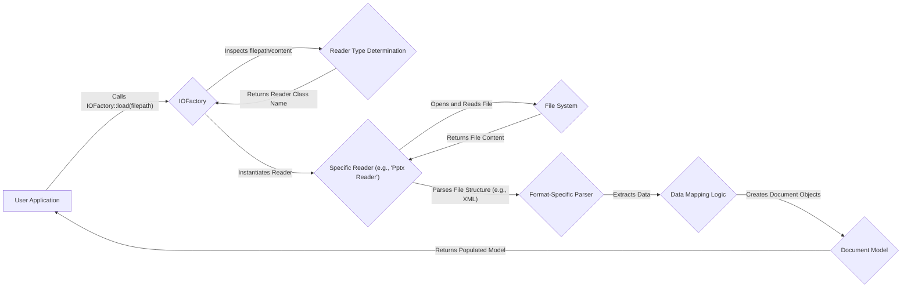
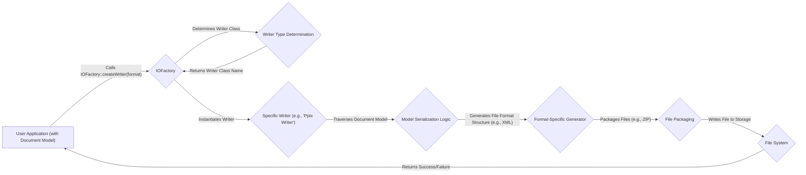
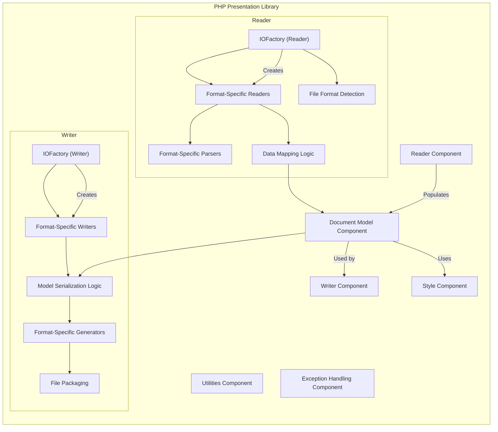
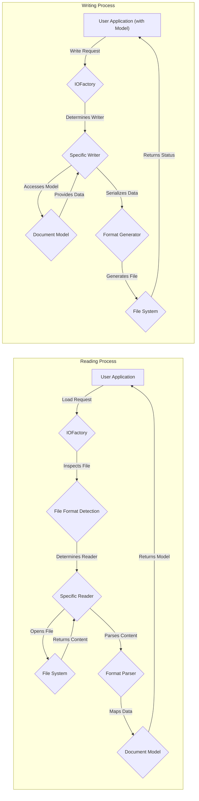

# Project Design Document: PHP Presentation Library (Improved)

**Project Name:** PHP Presentation Library (phpoffice/phppresentation)

**Version:** 1.1

**Date:** October 26, 2023

**Author:** Gemini (AI Language Model)

## 1. Introduction

This document provides an enhanced and more detailed design overview of the PHP Presentation Library, a project hosted on GitHub under the `phpoffice/phppresentation` repository. This improved document aims to provide a deeper understanding of the library's architecture, key components, data flow, and deployment scenarios, specifically tailored for subsequent threat modeling activities. The additional detail aims to provide security analysts with a more comprehensive understanding of the system's inner workings and potential attack surfaces.

## 2. Goals and Objectives

The primary goal of the PHP Presentation Library remains to provide a pure PHP solution for reading, writing, and manipulating presentation files in various formats. The focus is on modern formats like PPTX (Office Open XML) but also includes support for legacy formats like PPT and ODP.

Key objectives include:

*   Providing a robust and well-defined programmatic interface for creating new presentation documents from scratch.
*   Enabling the accurate and reliable reading and parsing of existing presentation files, handling variations and potential inconsistencies within file formats.
*   Allowing comprehensive modification of presentation content, including slides, text elements, images, shapes, charts, and other embedded objects.
*   Supporting a wide range of common presentation file formats to ensure interoperability.
*   Maintaining platform independence, leveraging the inherent cross-platform nature of PHP.
*   Offering a flexible and extensible architecture that allows for the addition of new features and format support.

## 3. System Overview

The PHP Presentation Library employs a layered architecture built upon a collection of PHP classes and interfaces. This design abstracts the complexities of diverse presentation file formats, offering a consistent API for developers. The core principle is to represent presentation elements as objects, facilitating programmatic manipulation.

The library's core functionality is organized into the following key areas:

*   **Abstraction of File Formats:** Providing a unified interface to interact with different presentation file formats without requiring developers to handle format-specific details directly.
*   **Object-Oriented Representation:** Modeling presentation elements (slides, shapes, text runs, etc.) as distinct PHP objects with properties and methods for manipulation.
*   **Separation of Concerns:** Distinguishing between the processes of reading (parsing), writing (generating), and the internal representation (document model) of presentations.

The library is designed as a backend component and does not include any graphical user interface elements. It is intended to be integrated into PHP applications or used within command-line scripts.

## 4. Key Components

The library's functionality is distributed across several interconnected components:

*   **Reader Component:**
    *   **Responsibility:**  Responsible for the entire process of reading and parsing presentation files from various formats into the library's internal object model.
    *   **Sub-components:** Contains format-specific reader classes (e.g., `"Pptx"`, `"Odp"`, `"Ppt"`).
    *   **Workflow:**
        *   Receives the file path as input.
        *   Performs file format detection based on file extension or magic numbers.
        *   Instantiates the appropriate format-specific reader.
        *   Delegates the parsing of the file content to the specific reader.
        *   Handles error conditions during parsing (e.g., invalid file format, corrupted data).
    *   **Example:** The `"Pptx"` reader handles the unpacking of the ZIP archive, parsing of XML files (e.g., `presentation.xml`, `slide#.xml`), and mapping XML elements to the Document Model.
*   **Writer Component:**
    *   **Responsibility:** Responsible for generating presentation files in different formats from the library's internal object model.
    *   **Sub-components:** Contains format-specific writer classes (e.g., `"Pptx"`, `"Odp"`).
    *   **Workflow:**
        *   Receives the Document Model and the desired output file path and format as input.
        *   Instantiates the appropriate format-specific writer.
        *   Traverses the Document Model.
        *   Serializes the object data into the target file format structure (e.g., generating XML, packaging files into a ZIP archive).
        *   Handles file compression and packaging according to the format specification.
    *   **Example:** The `"Pptx"` writer generates the necessary XML files, creates relationships between them, and packages them into a ZIP archive with the correct structure and content types.
*   **Document Model Component:**
    *   **Responsibility:** Represents the in-memory structure of a presentation, independent of the specific file format. This acts as a central data structure for manipulation.
    *   **Structure:** Consists of a hierarchy of PHP objects representing presentation elements:
        *   `"Presentation"`: The root object, containing global presentation settings and references to slides.
        *   `"Slide"`: Represents an individual slide within the presentation, containing collections of shapes and other elements.
        *   `"Shape"`: An abstract class representing graphical elements on a slide (e.g., `"TextBox"`, `"ImageObject"`, `"ChartObject"`).
        *   `"TextRun"`: Represents a contiguous block of text with specific formatting within a text-based shape.
        *   `"Image"`: Represents an embedded image with properties like dimensions and file data.
        *   `"Chart"`: Represents a chart or graph with data and formatting settings.
        *   `"Table"`: Represents a tabular data structure within a slide.
    *   **Functionality:** Provides methods for accessing, modifying, creating, and deleting presentation elements.
*   **Style Component:**
    *   **Responsibility:** Manages styling information applied to presentation elements, ensuring consistency and allowing for theme-based styling.
    *   **Classes:** Includes classes for defining various style attributes:
        *   `"Font"`: Defines font properties (name, size, color, etc.).
        *   `"Fill"`: Defines fill properties (color, gradient, pattern).
        *   `"Border"`: Defines border properties (color, width, style).
        *   `"ParagraphStyle"`: Defines paragraph-level formatting (alignment, indentation).
    *   **Mechanism:** Styles can be applied directly to individual elements or through themes and style sheets.
*   **IOFactory Component:**
    *   **Responsibility:** Acts as a factory for creating Reader and Writer instances, simplifying the instantiation process and abstracting away the selection of the correct format-specific class.
    *   **Methods:** Provides static methods like `"load()"` (for reading) and `"createWriter()"` (for writing).
    *   **Logic:** Determines the appropriate Reader or Writer class based on file extension, MIME type, or inspection of file content.
*   **Utilities Component:**
    *   **Responsibility:** Contains helper classes and functions for common tasks performed by other components.
    *   **Examples:**
        *   Unit conversion functions (e.g., points to pixels).
        *   Color manipulation functions (e.g., RGB to Hex).
        *   XML handling utilities (for parsing and generating XML structures).
        *   String manipulation functions.
*   **Exception Handling Component:**
    *   **Responsibility:** Defines custom exception classes used throughout the library to signal errors and exceptional conditions.
    *   **Benefits:** Provides a structured way to handle errors during reading, writing, and manipulation, allowing for more robust error handling in consuming applications. Examples include exceptions for invalid file formats, parsing errors, and file access issues.

## 5. Data Flow (Detailed)

The data flow within the library can be broken down into more granular steps for both reading and writing operations.

### 5.1. Reading a Presentation File (Detailed)

**Detailed Steps:**

*   The user application initiates the reading process by calling the static `load()` method of the `"IOFactory"` class, providing the file path of the presentation.
*   The `"IOFactory"` inspects the file path (extension) or the file content (magic numbers) to determine the appropriate reader type.
*   The `"IOFactory"` instantiates the specific reader class corresponding to the detected file format (e.g., `"PptxReader"` for a `.pptx` file).
*   The specific reader interacts with the `"File System"` to open and read the contents of the presentation file.
*   The reader employs a format-specific parser (e.g., an XML parser for PPTX) to interpret the file structure.
*   The parser extracts relevant data from the file structure.
*   Data mapping logic within the reader translates the extracted data into corresponding objects within the `"Document Model"`.
*   The `"Document Model"` is populated with objects representing slides, shapes, text, and other elements.
*   The fully populated `"Document Model"` is returned to the user application.

### 5.2. Writing a Presentation File (Detailed)

**Detailed Steps:**

*   The user application, having created or modified the `"Document Model"`, initiates the writing process by calling the static `createWriter()` method of the `"IOFactory"`, specifying the desired output format.
*   The `"IOFactory"` determines the appropriate writer class based on the specified format.
*   The `"IOFactory"` instantiates the specific writer class (e.g., `"PptxWriter"`).
*   The specific writer traverses the `"Document Model"`, accessing the properties and data of the presentation elements.
*   Model serialization logic within the writer translates the in-memory object representation into the specific file format structure (e.g., generating XML elements and attributes for PPTX).
*   A format-specific generator creates the necessary files and arranges them according to the format specification.
*   For formats like PPTX, a file packaging component (e.g., using the ZIP extension) packages the generated files into an archive.
*   The writer interacts with the `"File System"` to write the generated presentation file to the specified storage location.
*   The user application receives confirmation of the success or failure of the write operation.

## 6. Deployment Scenarios (Elaborated)

The PHP Presentation Library is designed for integration within various PHP environments. Common deployment scenarios, with more context, include:

*   **Web Applications (Backend Processing):**
    *   **Dynamic Presentation Generation:** Web applications can use the library to generate personalized presentations on demand, populating templates with data from databases or user input. For example, generating sales reports, personalized marketing materials, or educational content.
    *   **User Upload and Modification:**  Allowing users to upload existing presentation files, modify them using the library's capabilities, and download the updated versions. This could be part of a collaborative document editing platform or a content management system.
    *   **Format Conversion Services:** Implementing web services that enable users to convert presentation files between different formats (e.g., PPTX to PDF, ODP to PPTX).
    *   **Reporting and Dashboards:** Generating visual reports and dashboards in presentation format, suitable for sharing and presentations. This often involves integrating with data visualization libraries.
*   **Command-Line Tools (Automation and Batch Processing):**
    *   **Automated Presentation Creation:**  Scripts can be written to automatically generate presentations based on data sources or predefined templates, eliminating manual creation efforts.
    *   **Batch File Conversion:** Converting multiple presentation files from one format to another in a single operation.
    *   **Content Extraction and Analysis:**  Developing tools to extract specific information from presentation files (e.g., text content, image metadata) for analysis or indexing.
    *   **Integration with Build Pipelines:** Incorporating presentation generation or modification into automated software build and deployment processes (e.g., generating release notes in presentation format).
*   **Desktop Applications (Less Common, Local Utilities):**
    *   While primarily a server-side library, it can be used in conjunction with local web servers (like PHP's built-in server) or desktop PHP runtimes to create local utilities for presentation manipulation. This might be useful for specialized tasks or offline processing.

The library's deployment requires a standard PHP environment with necessary extensions (e.g., `zip` extension for handling PPTX files). No specific server infrastructure beyond a typical PHP setup is inherently required by the library itself.

## 7. Security Considerations (Enhanced)

Building upon the preliminary considerations, here are more detailed security aspects relevant to the PHP Presentation Library:

*   **Input Validation and Sanitization (Crucial for Untrusted Input):**
    *   **Parsing Vulnerabilities:** Format-specific readers are susceptible to vulnerabilities if they don't properly handle malformed or malicious file structures. This could lead to crashes, denial-of-service, or even remote code execution. Thorough testing with fuzzed input is essential.
    *   **XML External Entity (XXE) Injection:** When parsing XML-based formats (like PPTX and ODP), improper configuration of XML parsers can allow attackers to include external entities, potentially leading to information disclosure or server-side request forgery (SSRF). Ensure secure XML parsing configurations that disable external entity resolution.
    *   **Zip Slip Vulnerabilities:** When extracting files from ZIP archives (common in PPTX and ODP), insufficient path validation can allow attackers to write files to arbitrary locations on the server, potentially overwriting critical system files. Implement robust path sanitization during archive extraction.
    *   **File Size Limits:** Implement limits on the size of uploaded presentation files to prevent resource exhaustion attacks.
*   **Output Handling and Encoding:**
    *   **Cross-Site Scripting (XSS) Prevention:** While less direct than in web applications, if user-controlled data is embedded into presentation metadata or content that might later be rendered in a web context, proper encoding is necessary to prevent XSS vulnerabilities.
    *   **Content Security Policy (CSP) Considerations (Indirect):** If generated presentations are served through a web application, consider how the content within the presentation might interact with the CSP of the serving application.
*   **Resource Management:**
    *   **Memory Exhaustion:** Processing very large or complex presentations can consume significant memory. Implement mechanisms to handle large files gracefully, potentially using streaming or other memory-efficient techniques.
    *   **CPU Consumption:** Complex parsing or generation operations can be CPU-intensive. Implement timeouts and resource limits to prevent denial-of-service.
*   **Dependency Security:**
    *   **Vulnerability Scanning:** Regularly scan the library's dependencies for known vulnerabilities and update them promptly. Use tools like Composer's `audit` command.
    *   **Supply Chain Security:** Be mindful of the sources of dependencies and ensure their integrity.
*   **File System Security:**
    *   **Permissions:** Ensure that the PHP process running the library has only the necessary file system permissions to read input files and write output files. Avoid running the process with overly permissive credentials.
    *   **Secure Temporary Directories:** If temporary files are used during processing, ensure they are created in secure directories with appropriate permissions.
*   **Error Handling and Information Disclosure:**
    *   Avoid exposing sensitive information in error messages. Implement generic error handling and logging mechanisms.

## 8. Diagrams

### 8.1. Component Diagram (Detailed)

### 8.2. Data Flow Diagram (Comprehensive)

## 9. Future Considerations

*   **Enhanced Format Support:** Continuously expand support for newer and less common presentation file formats.
*   **Performance Optimizations:** Investigate and implement performance improvements for reading and writing operations, especially for large files. This could involve code profiling and algorithmic optimizations.
*   **Advanced Feature Implementation:** Add support for more complex presentation features such as animations, transitions, embedded video and audio, and advanced chart types.
*   **Security Audits and Penetration Testing:** Conduct regular security audits and penetration testing by security professionals to identify and address potential vulnerabilities proactively.
*   **Community Contributions:** Encourage and facilitate contributions from the open-source community to improve the library's functionality and security.

This improved design document provides a more detailed and comprehensive understanding of the PHP Presentation Library, strengthening its value as a foundation for thorough threat modeling and security analysis. The enhanced descriptions of components, data flow, and security considerations offer a deeper insight into the library's architecture and potential attack surfaces.