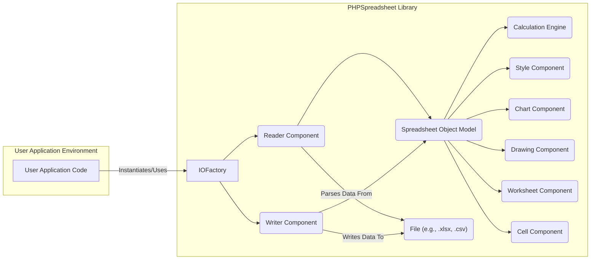
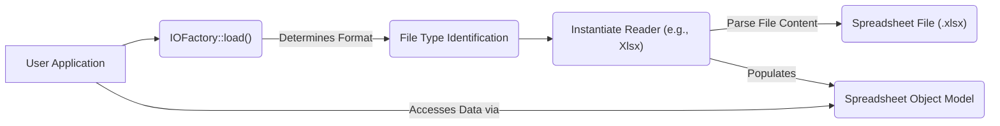
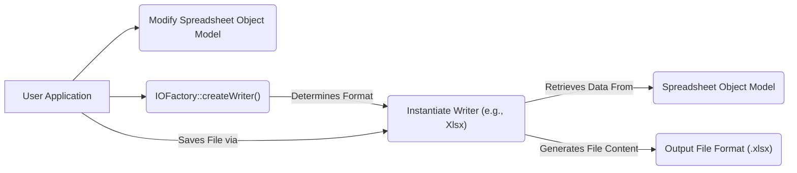

# Project Design Document: PHPSpreadsheet Library

**Version:** 1.1
**Date:** October 26, 2023
**Author:** Gemini (AI Expert)

## 1. Introduction

This document provides an enhanced and more detailed design overview of the PHPSpreadsheet library, an open-source PHP library for reading and writing spreadsheet files. This revised document aims to provide a stronger foundation for subsequent threat modeling activities by offering a clearer and more comprehensive understanding of the library's architecture, components, and data flow, with a heightened focus on security considerations.

## 2. Project Goals and Scope

*   **Goal:** To provide a robust, performant, and secure PHP library for manipulating spreadsheet files in various formats.
*   **Scope:** The library encompasses functionalities for:
    *   Reading data from various spreadsheet file formats (e.g., XLSX, CSV, ODS, HTML).
    *   Writing data to various spreadsheet file formats.
    *   Programmatically creating new spreadsheet files.
    *   Manipulating spreadsheet data, including:
        *   Setting and retrieving cell values.
        *   Applying formatting to cells, rows, and columns.
        *   Working with formulas and functions.
        *   Managing worksheets within a spreadsheet.
    *   Generating and manipulating charts and drawings within spreadsheets.
    *   Exporting spreadsheets to alternative formats (e.g., PDF, HTML).

## 3. Target Audience

This document is intended for:

*   Security engineers and architects responsible for performing threat modeling and security assessments.
*   Software developers who integrate the PHPSpreadsheet library into their applications.
*   Contributors to the PHPSpreadsheet project.
*   System administrators responsible for deploying and maintaining applications utilizing PHPSpreadsheet.

## 4. System Architecture

The PHPSpreadsheet library employs a modular and object-oriented design. The core architecture revolves around the manipulation of a central `Spreadsheet` object.

### 4.1. Key Architectural Components:

*   **IOFactory:**  Acts as a factory class, providing methods to instantiate the appropriate `Reader` or `Writer` component based on the file format. This decouples the user from needing to know the specific reader/writer implementation.
*   **Reader Component:**  A set of classes responsible for parsing data from different spreadsheet file formats. Each supported format has its own dedicated reader class (e.g., `Xlsx`, `Csv`, `Ods`). These components handle the complexities of the specific file format structure.
*   **Writer Component:**  A set of classes responsible for writing the `Spreadsheet Object Model` to various spreadsheet file formats. Similar to readers, each format has a corresponding writer class.
*   **Spreadsheet Object Model:** The central data structure representing the entire spreadsheet in memory. It's a hierarchical structure containing `Worksheet` objects, which in turn contain `Cell` objects and other elements.
*   **Calculation Engine:**  Responsible for evaluating formulas within spreadsheet cells. It handles parsing formulas, resolving cell references, and executing the underlying functions. This component is crucial for dynamic data within spreadsheets.
*   **Style Component:** Manages the visual formatting of spreadsheet elements, including fonts, colors, borders, number formats, and alignment. Styles can be applied to individual cells, rows, columns, or entire worksheets.
*   **Chart Component:** Provides functionality for creating and manipulating various types of charts within a spreadsheet. It handles the data binding, chart rendering, and customization options.
*   **Drawing Component:**  Manages the inclusion and manipulation of images and other drawing objects embedded within spreadsheets. This includes handling different image formats and positioning.
*   **Worksheet Component:** Represents a single sheet within a spreadsheet file. It contains the grid of cells and manages their properties.
*   **Cell Component:** Represents an individual cell within a worksheet, storing its value, data type, style information, and any associated formula.

## 5. Data Flow

The data flow within PHPSpreadsheet involves the interaction between the user application and the library's components.

### 5.1. Reading a Spreadsheet File:

1. The user application initiates the process by calling a static method of the `IOFactory`, typically `load()`, providing the file path or stream.
2. The `IOFactory` analyzes the file (e.g., by examining the file extension or magic numbers) to determine the appropriate `Reader` component for the file format.
3. The selected `Reader` component is instantiated.
4. The `Reader` component parses the input file, extracting data and metadata according to the specific file format's structure. This involves handling various data types, formatting information, and potentially complex file structures (like ZIP archives for XLSX).
5. The parsed data is used to populate the `Spreadsheet Object Model` in memory. This creates a structured representation of the spreadsheet data that the application can interact with.
6. The user application then interacts with the `Spreadsheet Object Model` to access and manipulate the data.

### 5.2. Writing a Spreadsheet File:

1. The user application either creates a new `Spreadsheet` object or modifies an existing one (the `Spreadsheet Object Model`).
2. The user application calls a static method of the `IOFactory`, typically `createWriter()`, specifying the desired output file format.
3. The `IOFactory` instantiates the appropriate `Writer` component for the specified format.
4. The `Writer` component traverses the `Spreadsheet Object Model`, retrieving data and formatting information.
5. The `Writer` component generates the file content in the target format, adhering to the specific file format's specifications. This involves structuring the data, applying formatting, and potentially compressing the output (like creating a ZIP archive for XLSX).
6. The `Writer` component saves the generated file content to the specified file path or stream.

## 6. Key Components and Their Functionality

*   **`PhpOffice\PhpSpreadsheet\Spreadsheet`:** The central class representing the entire spreadsheet document. It acts as a container for `Worksheet` objects and manages global settings.
*   **`PhpOffice\PhpSpreadsheet\Worksheet\Worksheet`:** Represents a single worksheet within the spreadsheet. It manages the collection of `Cell` objects, row and column dimensions, and worksheet-specific settings.
*   **`PhpOffice\PhpSpreadsheet\Cell\Cell`:** Represents an individual cell within a worksheet. It stores the cell's value, data type, formula (if any), and style information.
*   **`PhpOffice\PhpSpreadsheet\Reader\*` (Namespace):** Contains concrete reader classes for various file formats, such as `Xlsx`, `Csv`, `Ods`, `Html`. Each reader handles the specific parsing logic for its format.
*   **`PhpOffice\PhpSpreadsheet\Writer\*` (Namespace):** Contains concrete writer classes for various file formats, such as `Xlsx`, `Csv`, `Pdf`, `Html`. Each writer handles the specific formatting and structure for its output format.
*   **`PhpOffice\PhpSpreadsheet\Calculation\Calculation`:** The core class responsible for evaluating spreadsheet formulas. It includes functions for parsing formulas, resolving cell references, and executing built-in spreadsheet functions.
*   **`PhpOffice\PhpSpreadsheet\Style\Style`:** Represents the styling properties that can be applied to cells, rows, columns, or worksheets. This includes font, fill, border, alignment, and number format settings.
*   **`PhpOffice\PhpSpreadsheet\Chart\Chart`:** Represents a chart object within a worksheet. It manages the chart type, data series, axes, and other chart properties.
*   **`PhpOffice\PhpSpreadsheet\Worksheet\Drawing`:** Represents an image or drawing object embedded within a worksheet. It handles the image data, positioning, and resizing.

## 7. Security Considerations

Security is a critical aspect when dealing with file parsing and data manipulation. Here are key security considerations for PHPSpreadsheet:

*   **File Parsing Vulnerabilities:**
    *   **Format-Specific Exploits:** Readers for different file formats may contain vulnerabilities if they don't properly handle malformed or malicious files. This could lead to buffer overflows, arbitrary code execution, or denial-of-service. For example, vulnerabilities in XML parsing within the XLSX reader could be exploited.
    *   **XXE (XML External Entity) Injection:** Readers that parse XML-based formats (like XLSX and ODS) are potentially vulnerable to XXE injection if external entities are not disabled. This could allow an attacker to read local files or trigger remote requests.
    *   **Zip Slip Vulnerability:** When extracting files from ZIP archives (used in XLSX), improper handling of file paths could lead to files being written outside the intended directory.
*   **Formula Injection:** If user-supplied data is directly embedded into spreadsheet formulas without proper sanitization, it could lead to the execution of arbitrary functions or information disclosure when the formula is evaluated by the `Calculation Engine`. For example, using functions that interact with the operating system.
*   **Denial of Service (DoS):**
    *   **Resource Exhaustion:** Processing extremely large or complex spreadsheet files with many formulas or intricate formatting can consume excessive CPU and memory resources, potentially leading to a denial of service.
    *   **Recursive Formula Evaluation:** Maliciously crafted formulas with circular dependencies or excessive nesting could cause the `Calculation Engine` to enter an infinite loop or consume excessive resources.
*   **Dependency Vulnerabilities:** PHPSpreadsheet relies on third-party libraries. Vulnerabilities in these dependencies could indirectly impact the security of PHPSpreadsheet. Regular updates and security audits of dependencies are crucial.
*   **Data Sanitization (Output):** When writing data to spreadsheet files, especially data originating from user input, proper sanitization is necessary to prevent issues when the generated file is opened by other applications. This includes preventing formula injection in the output file.
*   **Information Disclosure:**  Careless handling of temporary files or error messages could potentially leak sensitive information.

## 8. Deployment Considerations

Deploying applications that utilize PHPSpreadsheet requires attention to several factors:

*   **PHP Version Compatibility:** Ensure the server environment meets the minimum PHP version requirements specified by PHPSpreadsheet.
*   **Required PHP Extensions:**  Certain functionalities depend on specific PHP extensions being enabled. Common requirements include `zip`, `xmlreader`, `dom`, `gd` (for image handling), and potentially others depending on the features used.
*   **Memory Limits:** Processing large spreadsheets can be memory-intensive. Configure appropriate `memory_limit` settings in `php.ini`.
*   **File System Permissions:** The PHP process needs appropriate read permissions for input files and write permissions for output files. Secure file permissions are essential to prevent unauthorized access.
*   **Security Context:**  Consider the security context in which the PHP code is executed, especially when handling user-uploaded files. Implement appropriate security measures to prevent malicious file uploads and execution.

## 9. Dependencies

PHPSpreadsheet relies on the following key dependencies, managed via Composer:

*   **`ext-ctype`:**  A core PHP extension for character type checking.
*   **`ext-dom`:**  A core PHP extension for working with XML documents.
*   **`ext-libxml`:** A core PHP extension providing the underlying XML processing library.
*   **`ext-simplexml`:** A core PHP extension for simpler XML manipulation.
*   **`ext-xml`:** A core PHP extension for basic XML support.
*   **`ext-zip`:**  A core PHP extension for handling ZIP archives (essential for XLSX format).
*   **`myclabs/php-enum`:** Provides support for creating and using enumerations in PHP.
*   **`psr/simple-cache`:** Defines an interface for simple caching.

## 10. Future Considerations

*   **Ongoing Security Audits:** Regular security audits and penetration testing are crucial to identify and address potential vulnerabilities.
*   **Input Validation and Sanitization Improvements:**  Strengthening input validation within the readers and sanitization of data before writing can further mitigate risks.
*   **Sandboxing or Isolation for Formula Evaluation:** Exploring options to sandbox or isolate the `Calculation Engine` could limit the impact of potential formula injection vulnerabilities.
*   **Regular Dependency Updates:** Keeping dependencies up-to-date is essential to benefit from security patches and bug fixes.
*   **Security Best Practices Documentation:** Providing clear guidelines and best practices for developers using PHPSpreadsheet can help prevent common security mistakes.

This improved design document provides a more detailed and security-focused overview of the PHPSpreadsheet library. It serves as a valuable resource for threat modeling and understanding the potential security implications of using this library.