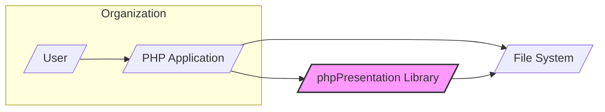
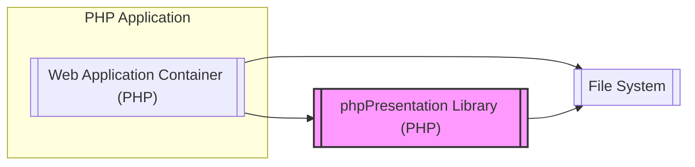
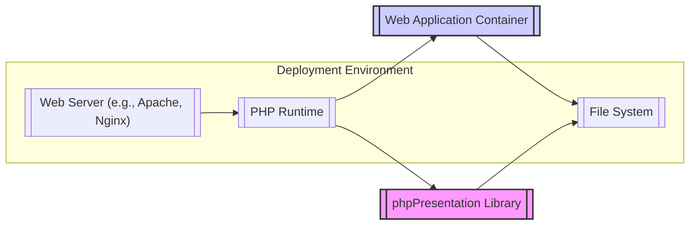
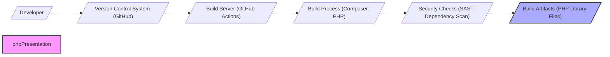

# BUSINESS POSTURE

This project, phpPresentation, provides a PHP library to read, write and create presentation files in formats such as PowerPoint 2007 and later (.pptx), older PowerPoint formats (.ppt), and Open Document Presentation (.odp).

Business priorities for this project are:
- Functionality: Ensuring the library supports a wide range of presentation features and file formats.
- Compatibility: Maintaining compatibility with different PHP versions and environments.
- Ease of Use: Providing a well-documented and easy-to-use API for developers.
- Performance: Optimizing the library for efficient processing of presentation files.
- Community Support: Fostering an active community for contributions, bug fixes, and feature requests.

The most important business risks associated with this project are:
- Security vulnerabilities in the library could lead to exploitation when processing untrusted presentation files, potentially leading to information disclosure, denial of service, or remote code execution in applications using the library.
- Data integrity issues if the library incorrectly reads or writes presentation files, leading to data corruption or loss.
- Compatibility issues with new presentation file formats or updates to existing formats, requiring ongoing maintenance and updates to the library.
- Dependency on community contributions for security patches and updates, which may not be timely or comprehensive.

# SECURITY POSTURE

Existing security controls for this project:
- security control: GitHub repository with standard security features like branch protection and vulnerability scanning. (Implemented by: GitHub)
- security control: Open source project with community review and contributions. (Implemented by: Community)
- security control: Use of PHP, which has its own security features and common security practices. (Implemented by: PHP Language)

Accepted risks for this project:
- accepted risk: Reliance on community for security vulnerability identification and patching.
- accepted risk: Potential for vulnerabilities to exist in the code due to complexity of presentation file formats and parsing logic.
- accepted risk: Users of the library are responsible for securely integrating it into their applications and handling user-provided presentation files safely.

Recommended security controls to implement:
- security control: Implement automated security scanning (SAST and DAST) in the CI/CD pipeline to detect potential vulnerabilities in code changes.
- security control: Conduct regular security audits of the codebase, focusing on file parsing and generation logic.
- security control: Provide security guidelines and best practices for developers using the library, especially regarding input validation and handling of user-uploaded presentation files.
- security control: Implement dependency scanning to ensure that third-party libraries used by phpPresentation are up-to-date and free of known vulnerabilities.

Security requirements for this project:
- Authentication: Not directly applicable to the library itself, as it is a passive component. Authentication is the responsibility of applications using the library.
- Authorization: Not directly applicable to the library itself. Authorization is the responsibility of applications using the library to control access to presentation files and library functionalities.
- Input Validation: Critical. The library must robustly validate all input data, especially when parsing presentation files, to prevent vulnerabilities like buffer overflows, format string bugs, and XML External Entity (XXE) injection. Input validation should be implemented at all levels of file parsing and data processing.
- Cryptography: May be relevant for handling encrypted presentation files or implementing features related to digital signatures within presentations. If cryptography is used, ensure strong algorithms and secure key management practices are followed.

# DESIGN

## C4 CONTEXT

Context Diagram Elements:

- Element:
  - Name: User
  - Type: Person
  - Description: A user interacting with a PHP application that utilizes the phpPresentation library. This could be an end-user uploading or downloading presentation files, or an administrator managing presentations.
  - Responsibilities: Interacting with the PHP application to manage presentation files.
  - Security controls: User authentication and authorization within the PHP application.

- Element:
  - Name: PHP Application
  - Type: Software System
  - Description: A web application or script written in PHP that integrates the phpPresentation library to provide presentation file handling capabilities. This application is responsible for user interaction, business logic, and utilizing the library.
  - Responsibilities: User authentication, authorization, business logic, calling phpPresentation library functions, handling file storage and retrieval.
  - Security controls: Input validation, output encoding, session management, access control, secure configuration, vulnerability scanning.

- Element:
  - Name: phpPresentation Library
  - Type: Software System
  - Description: The PHP library itself, responsible for parsing, creating, and manipulating presentation files in various formats. It is a passive component used by PHP applications.
  - Responsibilities: Reading and writing presentation files, implementing presentation file format logic, providing API for PHP applications.
  - Security controls: Input validation, secure coding practices, dependency management, vulnerability scanning, code audits.

- Element:
  - Name: File System
  - Type: External System
  - Description: The file system where presentation files are stored and accessed by the PHP application and phpPresentation library.
  - Responsibilities: Storing presentation files, providing file access to the PHP application and library.
  - Security controls: Access control lists (ACLs), file system permissions, encryption at rest (optional).

## C4 CONTAINER

Container Diagram Elements:

- Element:
  - Name: Web Application Container (PHP)
  - Type: Container
  - Description: Represents the PHP runtime environment and the web application code that utilizes the phpPresentation library. This container handles user requests, business logic, and interacts with the library.
  - Responsibilities: Handling user requests, implementing application logic, managing sessions, calling phpPresentation library, interacting with the file system.
  - Security controls: Web application firewall (WAF), input validation, output encoding, session management, authentication, authorization, secure configuration, vulnerability scanning.

- Element:
  - Name: phpPresentation Library (PHP)
  - Type: Container
  - Description: The phpPresentation library itself, packaged as a set of PHP files. It is deployed within the PHP application's environment and accessed directly by the application code.
  - Responsibilities: Parsing and generating presentation files, providing API for manipulating presentation objects, handling file format specific logic.
  - Security controls: Input validation within the library, secure coding practices, dependency management, vulnerability scanning during development and build.

- Element:
  - Name: File System
  - Type: Container
  - Description: The file system used for storing and retrieving presentation files. This could be local storage, network storage, or cloud storage.
  - Responsibilities: Persistent storage of presentation files, providing file access to the PHP application and library.
  - Security controls: File system permissions, access control lists (ACLs), encryption at rest (optional), regular backups.

## DEPLOYMENT

Deployment Architecture: Standalone PHP Application Deployment

Deployment Diagram Elements:

- Element:
  - Name: Web Server (e.g., Apache, Nginx)
  - Type: Infrastructure
  - Description: The web server that handles HTTP requests and serves the PHP application.
  - Responsibilities: Handling HTTP requests, routing requests to the PHP runtime, serving static content, providing TLS termination.
  - Security controls: HTTPS configuration, web server hardening, access control, DDoS protection, regular security updates.

- Element:
  - Name: PHP Runtime
  - Type: Infrastructure
  - Description: The PHP interpreter environment that executes the PHP application code and the phpPresentation library.
  - Responsibilities: Executing PHP code, managing PHP processes, providing PHP extensions and libraries.
  - Security controls: PHP runtime hardening, disabling unnecessary extensions, keeping PHP version up-to-date, secure PHP configuration.

- Element:
  - Name: Web Application Container
  - Type: Software
  - Description: The deployed instance of the PHP web application that uses the phpPresentation library.
  - Responsibilities: Running the application logic, handling user requests, interacting with the phpPresentation library and file system.
  - Security controls: Application-level security controls as described in the Container section, secure deployment practices, regular application updates.

- Element:
  - Name: phpPresentation Library
  - Type: Software
  - Description: The deployed instance of the phpPresentation library, included within the PHP application deployment.
  - Responsibilities: Providing presentation file handling functionalities to the application.
  - Security controls: Security controls inherent in the library's code and build process, as described in previous sections.

- Element:
  - Name: File System
  - Type: Infrastructure
  - Description: The file system on the server where presentation files are stored and accessed.
  - Responsibilities: Persistent storage of presentation files.
  - Security controls: File system permissions, access control lists (ACLs), disk encryption, regular backups, secure storage configuration.

## BUILD

Build Process Description:

1. Developer: Developers write code for the phpPresentation library and commit changes to the Version Control System.
2. Version Control System (GitHub): GitHub hosts the source code repository, manages code versions, and triggers build processes.
3. Build Server (GitHub Actions): GitHub Actions is used as the CI/CD platform to automate the build process.
4. Build Process (Composer, PHP): The build process uses Composer to manage PHP dependencies and PHP itself to package the library. This includes steps like installing dependencies, running unit tests, and creating distributable packages.
5. Security Checks (SAST, Dependency Scan): Automated security checks are performed during the build process. This includes Static Application Security Testing (SAST) to identify potential code vulnerabilities and dependency scanning to check for known vulnerabilities in third-party libraries.
6. Build Artifacts (PHP Library Files): The output of the build process is the phpPresentation library files, which can be distributed via package managers like Composer or downloaded directly.

Security controls in the build process:
- security control: Version Control System (GitHub) for code integrity and access control. (Implemented by: GitHub)
- security control: Automated build process using GitHub Actions for consistent and repeatable builds. (Implemented by: GitHub Actions)
- security control: Dependency management using Composer to ensure controlled and reproducible dependencies. (Implemented by: Composer)
- security control: Static Application Security Testing (SAST) to detect potential code vulnerabilities. (Implemented by: SAST tools integrated in CI)
- security control: Dependency scanning to identify vulnerabilities in third-party libraries. (Implemented by: Dependency scanning tools integrated in CI)
- security control: Code signing or checksumming of build artifacts to ensure integrity and prevent tampering during distribution (optional, recommended).

# RISK ASSESSMENT

Critical business process being protected:
- Secure processing of presentation files by applications using the phpPresentation library. This includes generating, reading, and modifying presentation files without introducing security vulnerabilities or data corruption.

Data being protected and their sensitivity:
- Presentation file content: Sensitivity depends on the content of the presentations. Presentations can contain highly sensitive business information, personal data, financial data, or intellectual property. The sensitivity level is determined by the users and applications utilizing the library.
- Library code itself: Protecting the integrity and confidentiality of the library code is important to prevent malicious modifications and ensure the library functions as intended.

# QUESTIONS & ASSUMPTIONS

Questions:
- What are the intended use cases for the phpPresentation library? Is it primarily for server-side generation, client-side manipulation, or both? Understanding the use cases will help prioritize security requirements.
- Are there any specific compliance requirements (e.g., GDPR, HIPAA) for applications using this library that need to be considered?
- What is the expected volume and sensitivity of data processed by applications using this library?
- Are there any existing security policies or guidelines within organizations that will be using this library?
- What is the process for reporting and handling security vulnerabilities in the phpPresentation library?

Assumptions:
- BUSINESS POSTURE: The primary business goal is to provide a functional and reliable PHP library for presentation file handling. Security is a secondary but important consideration. The library is intended for use in a variety of PHP applications, ranging from small scripts to large enterprise systems.
- SECURITY POSTURE: Security is primarily the responsibility of the developers using the library. The phpPresentation project aims to provide a reasonably secure library, but users must implement appropriate security controls in their applications. The project relies on community contributions for security vulnerability identification and patching.
- DESIGN: The library is designed to be a passive component integrated into PHP applications. It interacts with the file system to read and write presentation files. Deployment is typically within standard PHP web application environments. The build process utilizes common PHP development tools and practices.