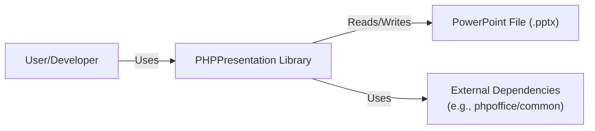
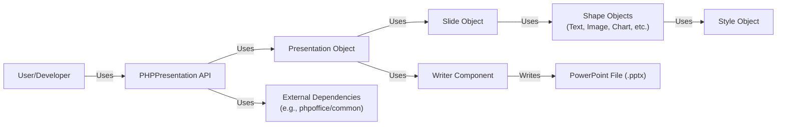
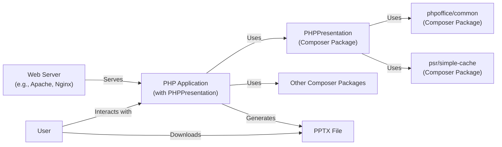
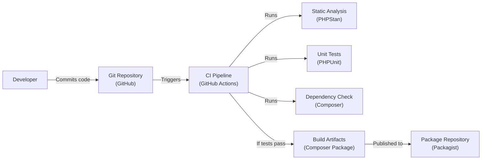

# BUSINESS POSTURE

Business Priorities and Goals:

*   Provide a PHP library that enables developers to programmatically create and manipulate PowerPoint presentations.
*   Offer a free and open-source alternative to commercial solutions.
*   Support various PowerPoint features, including slides, shapes, text, images, and charts.
*   Maintain compatibility with different PowerPoint versions (e.g., PPTX).
*   Facilitate integration with other PHP projects and frameworks.
*   Build a community around the project to encourage contributions and support.

Business Risks:

*   Data corruption: Maliciously crafted input or bugs in the library could lead to the creation of corrupted PowerPoint files, potentially causing data loss or application crashes for users opening those files.
*   Code injection: Vulnerabilities in the library could allow attackers to inject malicious code, potentially leading to remote code execution in applications using the library.
*   Denial of service: Specially crafted input could trigger excessive resource consumption (CPU, memory) within the library, leading to denial of service for applications using it.
*   Reputational damage: Security vulnerabilities or functional defects could damage the reputation of the library and its maintainers.
*   Intellectual property: Ensure license compliance and protect against unauthorized use or distribution of the code.

# SECURITY POSTURE

Existing Security Controls:

*   security control: Input validation: The library likely performs some input validation to ensure data conforms to expected types and formats, although the extent is unclear without deeper code analysis. (Implementation: Scattered throughout the codebase, needs review.)
*   security control: Unit testing: The project includes unit tests, which help to identify bugs and regressions that could lead to security vulnerabilities. (Implementation: `tests/` directory)
*   security control: Static analysis: The project uses static analysis tools (as indicated by `.gitattributes` and `phpstan.neon.dist`), which can help detect potential security issues. (Implementation: CI pipeline, configuration files)
*   security control: Dependency management: The project uses Composer for dependency management, allowing for tracking and updating of external libraries. (Implementation: `composer.json`, `composer.lock`)

Accepted Risks:

*   accepted risk: Limited input sanitization: The library primarily deals with generating XML-based PowerPoint files. While it likely performs some input validation, it may not comprehensively sanitize all user-provided data against potential injection attacks (e.g., XML external entity (XXE) attacks).
*   accepted risk: Reliance on external libraries: The library depends on several external libraries (e.g., `phpoffice/common`, `psr/simple-cache`). Vulnerabilities in these dependencies could impact the security of PHPPresentation.
*   accepted risk: Lack of formal security reviews: There's no indication of regular, formal security reviews or penetration testing being conducted.

Recommended Security Controls:

*   security control: Comprehensive input validation and sanitization: Implement rigorous input validation and sanitization for all user-supplied data, especially text and file paths, to prevent injection attacks (XSS, XXE, path traversal).
*   security control: Content Security Policy (CSP): If the library generates any HTML output (e.g., for previews), implement a CSP to mitigate XSS risks. (Not directly applicable to PPTX generation, but relevant if HTML features are added).
*   security control: Regular security audits: Conduct periodic security audits and penetration testing to identify and address potential vulnerabilities.
*   security control: Dependency vulnerability scanning: Integrate automated dependency vulnerability scanning into the CI/CD pipeline to detect and address known vulnerabilities in dependencies.
*   security control: Fuzz testing: Implement fuzz testing to identify unexpected behavior and potential vulnerabilities when processing malformed or unexpected input.

Security Requirements:

*   Authentication: Not directly applicable, as the library itself doesn't handle authentication.
*   Authorization: Not directly applicable, as the library itself doesn't handle authorization.
*   Input Validation:
    *   All user-provided data (text, file paths, image data, etc.) MUST be validated against expected types, formats, and lengths.
    *   User-provided text MUST be sanitized to prevent injection attacks (e.g., XML injection, script injection if HTML output is generated).
    *   File paths MUST be validated to prevent path traversal vulnerabilities.
    *   Image data MUST be validated to prevent image-based attacks (e.g., image त्रासदी).
*   Cryptography:
    *   If the library supports encryption features (e.g., password-protected presentations), it MUST use strong, industry-standard cryptographic algorithms and libraries.
    *   Cryptographic keys MUST be managed securely.
*   Output Encoding:
    *   If the library generates any output that will be displayed in a web browser (e.g., HTML previews), it MUST properly encode the output to prevent XSS vulnerabilities.

# DESIGN

## C4 CONTEXT

Context Diagram Element Descriptions:

*   Element:
    *   Name: User/Developer
    *   Type: Person
    *   Description: A developer who integrates the PHPPresentation library into their PHP application to create and manipulate PowerPoint presentations.
    *   Responsibilities: Integrates the library, provides input data, handles output, and implements application-level security.
    *   Security controls: Implements application-level security controls (authentication, authorization, input validation, output encoding).

*   Element:
    *   Name: PHPPresentation Library
    *   Type: Software System
    *   Description: The core library that provides the functionality to create, read, and modify PowerPoint files.
    *   Responsibilities: Provides an API for creating and manipulating presentation elements, handles file I/O, manages dependencies.
    *   Security controls: Input validation, unit testing, static analysis, dependency management.

*   Element:
    *   Name: PowerPoint File (.pptx)
    *   Type: File
    *   Description: A PowerPoint file in the .pptx format (Office Open XML).
    *   Responsibilities: Stores presentation data (slides, shapes, text, images, etc.).
    *   Security controls: Relies on the security features of the PowerPoint application used to open the file.

*   Element:
    *   Name: External Dependencies
    *   Type: Software System
    *   Description: Third-party libraries used by PHPPresentation (e.g., phpoffice/common, psr/simple-cache).
    *   Responsibilities: Provide supporting functionality (e.g., caching, common utilities).
    *   Security controls: Relies on the security of the individual dependencies. PHPPresentation should monitor for and update dependencies to address known vulnerabilities.

## C4 CONTAINER

Container Diagram Element Descriptions:

*   Element:
    *   Name: User/Developer
    *   Type: Person
    *   Description: A developer who integrates the PHPPresentation library into their PHP application.
    *   Responsibilities: Integrates the library, provides input data, handles output.
    *   Security controls: Implements application-level security.

*   Element:
    *   Name: PHPPresentation API
    *   Type: API
    *   Description: The public interface of the library that developers interact with.
    *   Responsibilities: Exposes methods for creating and manipulating presentations.
    *   Security controls: Input validation.

*   Element:
    *   Name: Presentation Object
    *   Type: Object
    *   Description: Represents a PowerPoint presentation.
    *   Responsibilities: Manages slides, presentation-level properties.
    *   Security controls: Input validation.

*   Element:
    *   Name: Slide Object
    *   Type: Object
    *   Description: Represents a single slide within a presentation.
    *   Responsibilities: Manages shapes, slide-level properties.
    *   Security controls: Input validation.

*   Element:
    *   Name: Shape Objects (Text, Image, Chart, etc.)
    *   Type: Object
    *   Description: Represents various shapes that can be added to a slide (text boxes, images, charts, etc.).
    *   Responsibilities: Holds data and properties for specific shapes.
    *   Security controls: Input validation, data sanitization (especially for text).

*   Element:
    *   Name: Style Object
    *   Type: Object
    *   Description: Represents styling options for shapes and text.
    *   Responsibilities: Holds formatting information (fonts, colors, sizes, etc.).
    *   Security controls: Input validation.

*   Element:
    *   Name: Writer Component
    *   Type: Component
    *   Description: Responsible for serializing the presentation object into a .pptx file.
    *   Responsibilities: Generates XML, handles file I/O.
    *   Security controls: Input validation, XML sanitization (to prevent XXE).

*   Element:
    *   Name: PowerPoint File (.pptx)
    *   Type: File
    *   Description: A PowerPoint file in the .pptx format.
    *   Responsibilities: Stores presentation data.
    *   Security controls: Relies on the security of the PowerPoint application.

*   Element:
    *   Name: External Dependencies
    *   Type: Software System
    *   Description: Third-party libraries used by PHPPresentation.
    *   Responsibilities: Provide supporting functionality.
    *   Security controls: Relies on the security of the individual dependencies.

## DEPLOYMENT

Possible Deployment Solutions:

1.  Standalone PHP Script: The library is included directly in a PHP script and executed via the command line or a web server.
2.  PHP Web Application: The library is integrated into a web application (e.g., using a framework like Laravel or Symfony) and used to generate presentations dynamically.
3.  Composer Package: The library is installed as a Composer package within a larger PHP project.

Chosen Deployment Solution (Composer Package):

Deployment Diagram Element Descriptions:

*   Element:
    *   Name: Web Server (e.g., Apache, Nginx)
    *   Type: Software System
    *   Description: A web server that hosts the PHP application.
    *   Responsibilities: Handles HTTP requests, serves static files, passes requests to the PHP interpreter.
    *   Security controls: Web server security configuration (e.g., TLS, access controls, WAF).

*   Element:
    *   Name: PHP Application (with PHPPresentation)
    *   Type: Software System
    *   Description: The application that uses PHPPresentation to generate PowerPoint files.
    *   Responsibilities: Handles user requests, interacts with PHPPresentation, generates output.
    *   Security controls: Application-level security (authentication, authorization, input validation, output encoding).

*   Element:
    *   Name: PHPPresentation (Composer Package)
    *   Type: Library
    *   Description: The PHPPresentation library, installed as a Composer package.
    *   Responsibilities: Provides functionality for creating and manipulating PowerPoint files.
    *   Security controls: Input validation, unit testing, static analysis.

*   Element:
    *   Name: Other Composer Packages
    *   Type: Library
    *   Description: Other dependencies of the PHP application, managed by Composer.
    *   Responsibilities: Provide various functionalities to the application.
    *   Security controls: Relies on the security of the individual packages.

*   Element:
    *   Name: PHPOfficeCommon (Composer Package)
    *   Type: Library
    *   Description: A dependency of PHPPresentation, providing common utilities.
    *   Responsibilities: Provides shared functionality.
    *   Security controls: Relies on the security of the package.

*   Element:
    *   Name: PSRSimpleCache (Composer Package)
    *   Type: Library
    *   Description: A dependency of PHPPresentation, providing caching functionality.
    *   Responsibilities: Provides caching capabilities.
    *   Security controls: Relies on the security of the package.

*   Element:
    *   Name: PPTX File
    *   Type: File
    *   Description: The generated PowerPoint file.
    *   Responsibilities: Stores presentation data.
    *   Security controls: Relies on the security of the PowerPoint application used to open it.

*   Element:
    *   Name: User
    *   Type: Person
    *   Description: The end-user who interacts with the PHP application and downloads the generated PPTX file.
    *   Responsibilities: Provides input, downloads output.
    *   Security controls: Browser security, antivirus software.

## BUILD

Build Process Description:

1.  Developer: A developer writes code and commits it to the Git repository (GitHub).
2.  Git Repository: The repository hosts the source code and triggers the CI pipeline upon code changes.
3.  CI Pipeline (GitHub Actions): The CI pipeline automates the build process.
4.  Static Analysis (PHPStan): The pipeline runs static analysis tools (PHPStan) to identify potential code quality and security issues.
5.  Unit Tests (PHPUnit): The pipeline executes unit tests (PHPUnit) to verify the functionality of the code and detect regressions.
6.  Dependency Check (Composer): The pipeline checks for outdated or vulnerable dependencies using Composer.
7.  Build Artifacts (Composer Package): If all tests and checks pass, the pipeline creates the build artifacts, which is a Composer package.
8.  Package Repository (Packagist): The build artifacts (Composer package) are published to a package repository (Packagist), making them available for installation by other projects.

Security Controls in Build Process:

*   security control: Static Analysis (PHPStan): Detects potential code quality and security issues.
*   security control: Unit Tests (PHPUnit): Verifies code functionality and helps prevent regressions.
*   security control: Dependency Check (Composer): Identifies outdated or vulnerable dependencies.
*   security control: CI/CD Pipeline (GitHub Actions): Automates the build process, ensuring consistency and reducing manual errors.
*   security control: Code Review: Although not explicitly shown in the diagram, code reviews are a crucial part of the development process and should be performed before merging code changes.

# RISK ASSESSMENT

Critical Business Processes:

*   Generating valid PowerPoint files: The core function of the library is to create valid and functional PowerPoint files. Failure to do so would render the library useless.
*   Maintaining compatibility: The library should maintain compatibility with different PowerPoint versions and operating systems.
*   Providing a reliable API: The library should provide a stable and well-documented API for developers to use.

Data Sensitivity:

*   User-provided text content: Sensitivity depends on the content entered by the user. Could range from non-sensitive to highly confidential.
*   User-provided images: Sensitivity depends on the image content. Could range from non-sensitive to highly confidential.
*   File paths: Potentially sensitive, as they could reveal information about the user's system or file structure.
*   Presentation metadata: May contain sensitive information, such as author names, company names, or revision history.

# QUESTIONS & ASSUMPTIONS

Questions:

*   What specific PowerPoint versions are targeted for compatibility?
*   Are there any plans to support encryption or password protection for generated presentations?
*   What level of input sanitization is currently implemented?
*   Are there any specific security concerns raised by the community or users?
*   What is the process for handling security vulnerabilities reported by external researchers?
*   Is there a mechanism for users to report bugs or security issues?
*   Are there any plans for fuzz testing or other advanced security testing techniques?

Assumptions:

*   BUSINESS POSTURE: The project prioritizes open-source development and community contributions.
*   BUSINESS POSTURE: The project aims to provide a free and accessible alternative to commercial PowerPoint generation libraries.
*   SECURITY POSTURE: The project relies on community contributions for security improvements and bug fixes.
*   SECURITY POSTURE: The project has limited resources dedicated to proactive security testing and auditing.
*   DESIGN: The library is primarily used in server-side PHP environments.
*   DESIGN: The library is installed as a Composer package in most use cases.
*   DESIGN: Developers using the library are responsible for implementing application-level security controls.